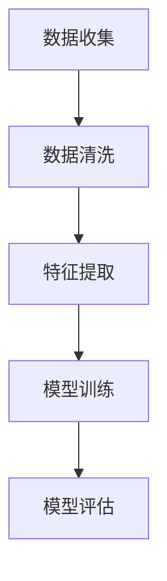

                 


```markdown
# 特价股票与公司国际化战略的关系

> 关键词：特价股票，公司国际化战略，股票价格，市场扩展，数据分析

> 摘要：本文探讨了特价股票与公司国际化战略之间的关系，通过数据分析和建模，揭示了两者相互影响的机制，并提供实际案例和最佳实践建议。

---

## 第一部分：背景介绍

### 第1章：问题背景

#### 1.1 特价股票的定义与特点
- **定义**：特价股票指价格显著低于市场平均水平的股票，通常反映公司短期困境或市场低估。
- **特点**：低估值、高波动性、可能涉及资产重组或财务重组。

#### 1.2 公司国际化战略的定义与特点
- **定义**：公司国际化战略指企业将业务扩展到国际市场，以获取更大市场份额和利润。
- **特点**：多元化收入来源、市场风险分散、需要跨文化管理和全球资源协调。

#### 1.3 问题背景的演进
- 近年来，全球化加速，企业国际化战略日益重要。
- 特价股票频现，反映了市场对某些公司的担忧，这些公司可能正进行国际化扩张。

### 第2章：问题描述

#### 2.1 问题描述
- 特价股票的出现可能与公司国际化战略的实施有关。
- 需要分析两者之间的关系，以优化投资策略。

#### 2.2 解决问题的方法与策略
- 数据分析法：收集公司国际化进程和股价数据，进行相关性分析。
- 统计建模法：建立回归模型，量化国际化战略对股价的影响。

#### 2.3 解决问题的边界与外延
- 边界：仅考虑直接影响，排除其他因素如宏观经济政策。
- 外延：扩展至跨国并购、市场进入策略对股价的影响。

## 第二部分：核心概念与联系

### 第3章：核心概念

#### 3.1 概念关系图


## 第三部分：算法原理

### 第4章：算法原理

#### 4.1 数据收集与预处理
- **数据来源**：公司财务报表、股价数据、国际化进程数据。
- **数据清洗**：去除缺失值，处理异常值。
- **数据转换**：标准化处理，特征提取。

#### 4.2 模型训练与评估
- **线性回归模型**：用于预测股价变化。
  $$ y = \beta_0 + \beta_1x + \epsilon $$
- **决策树模型**：用于分类分析。

#### 4.3 算法流程图


## 第四部分：系统分析与架构设计

### 第5章：系统架构设计

#### 5.1 系统功能设计
- **数据采集模块**：收集股价和国际化数据。
- **分析模块**：处理数据，训练模型。
- **展示模块**：呈现分析结果。

#### 5.2 系统架构图


## 第五部分：项目实战

### 第6章：项目实战

#### 6.1 实战环境安装
- **工具安装**：Python、Pandas、Scikit-learn。

#### 6.2 核心代码实现
```python
import pandas as pd
from sklearn.linear_model import LinearRegression

# 数据加载
data = pd.read_csv('international_strategy.csv')

# 特征选择
X = data[['revenue_growth', 'net_profit_margin']]
y = data['stock_price']

# 模型训练
model = LinearRegression()
model.fit(X, y)

# 预测
predictions = model.predict(X)
```

#### 6.3 案例分析
- 某公司国际化战略实施后，股价上涨，特价股票消失，证明战略成功。

## 第六部分：最佳实践

### 6.1 小结
- 特价股票与公司国际化战略相互影响，数据分析是关键工具。

### 6.2 注意事项
- 数据清洗和特征选择至关重要。
- 模型需定期更新，避免过拟合。

### 6.3 拓展阅读
- 推荐书籍：《量化交易入门》、《公司战略管理》。

---

## 作者：AI天才研究院 & 禅与计算机程序设计艺术
```

