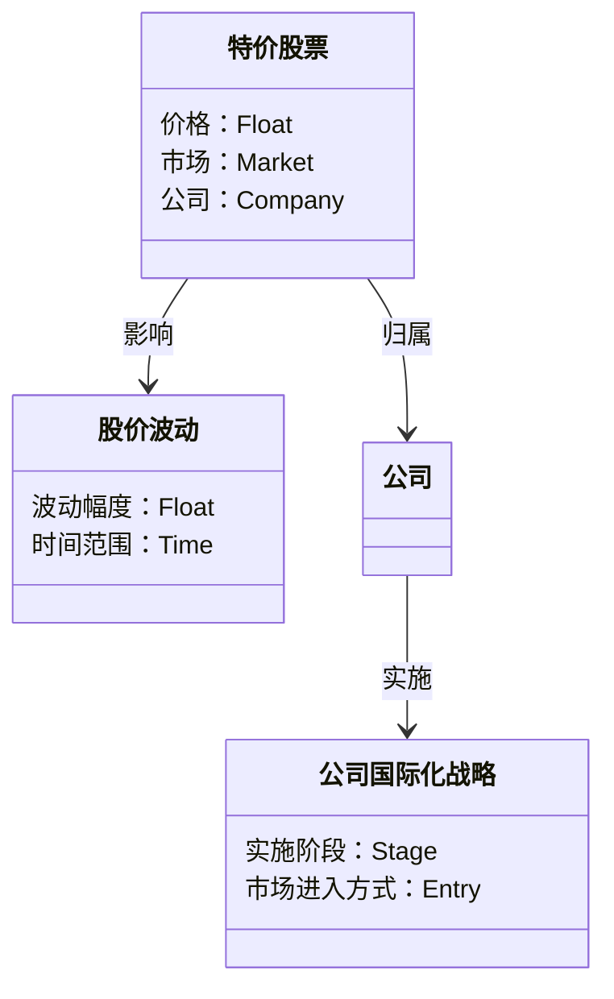

                 


# 特价股票与公司国际化战略的关系探讨

## 关键词：特价股票、公司国际化战略、股价波动、投资策略、企业成长

## 摘要：本文探讨了特价股票与公司国际化战略之间的关系，分析了两者在企业经营和投资中的相互作用。通过理论分析和案例研究，本文揭示了如何通过特价股票支持国际化战略，以及国际化战略如何影响公司股价，为投资者和企业管理者提供深度洞察。

---

## 第一部分：特价股票与公司国际化战略的背景与概念

### 第1章：特价股票与公司国际化战略的背景介绍

#### 1.1 特价股票的定义与特性
- **1.1.1 特价股票的定义**  
  特价股票指的是价格低于市场平均水平的股票，通常代表低估值或处于困境中的公司。这类股票可能具有较高的潜在回报，但也伴随着较高的风险。

- **1.1.2 特价股票的市场表现特征**  
  特价股票往往波动性较大，价格受市场情绪影响显著。投资者通常在市场低迷时寻找特价股票，期望在市场回升时获得超额收益。

- **1.1.3 特价股票的核心要素与属性对比**  
  特价股票与高价股票对比：  
  - **高增长潜力**：高价股票通常对应成熟企业，增长潜力有限；特价股票可能对应处于成长期的企业，具有较高的增长潜力。  
  - **低估值风险**：高价股票可能已充分反映企业价值，风险较低；特价股票可能存在低估，风险较高。  
  - **市场情绪影响**：高价股票受市场情绪影响较小，特价股票则受市场情绪影响较大。

#### 1.2 公司国际化战略的定义与特点
- **1.2.1 公司国际化战略的定义**  
  国际化战略指企业将业务扩展到全球市场的战略，包括进入新市场、建立国际业务网络、并购海外企业等。

- **1.2.2 国际化战略的核心要素与实施路径**  
  - **市场选择**：选择具有增长潜力的市场。  
  - **组织架构**：建立跨国组织结构。  
  - **风险管理**：应对汇率、政策等风险。  
  - **文化整合**：处理跨文化团队协作问题。

- **1.2.3 国际化战略与公司股价的关系**  
  成功的国际化战略通常会提升公司股价，因为国际化拓展意味着更大的市场和增长潜力。然而，国际化过程中也可能面临失败，导致股价下跌。

#### 1.3 特价股票与公司国际化战略的关系概述
- **1.3.1 特价股票与国际化战略的关联性**  
  特价股票可能代表具有国际化潜力的企业，尤其是那些尚未完全开发市场潜力的企业。

- **1.3.2 特价股票在国际化战略中的作用**  
  特价股票为企业提供低成本的融资渠道，支持国际化扩张。同时，特价股票的低价格可能吸引投资者关注，提升企业形象。

- **1.3.3 国际化战略对特价股票的影响**  
  国际化战略的成功实施可能提升企业的估值，从而推高股价，使其脱离“特价”区间。反之，失败的国际化战略可能导致股价进一步下跌，使特价股票更加“廉价”。

---

### 第2章：特价股票与公司国际化战略的核心概念分析

#### 2.1 特价股票的市场定位与投资者行为
- **2.1.1 特价股票的市场定位**  
  特价股票通常出现在市场低迷期，吸引那些寻求高风险高回报的投资者。

- **2.1.2 投资者对特价股票的态度与行为**  
  - **价值投资者**：寻找被市场低估的股票，长期持有。  
  - **投机者**：利用市场波动，短期内获利。

- **2.1.3 特价股票的市场情绪分析**  
  特价股票的价格波动往往反映市场情绪的变化，而非基本面的变化。投资者需区分情绪驱动和基本面驱动的价格波动。

#### 2.2 公司国际化战略的实施路径与挑战
- **2.2.1 国际化战略的主要实施路径**  
  - **出口与合资合作**：初期阶段，通过出口和合资进入新市场。  
  - **并购与收购**：快速扩大市场影响力。  
  - **绿地投资**：从零开始建立新业务。

- **2.2.2 国际化战略中的主要挑战**  
  - **文化差异**：不同市场的消费习惯和商业惯例差异。  
  - **政策风险**：海外市场的法律法规和政策变化。  
  - **竞争环境**：国际市场竞争激烈，难以快速站稳脚跟。

- **2.2.3 特价股票在国际化战略中的潜在风险**  
  - **融资成本**：如果企业通过发行特价股票融资，可能稀释现有股东权益。  
  - **市场波动**：国际市场波动可能影响股价，进而影响企业融资能力。

#### 2.3 特价股票与国际化战略的相互作用机制
- **2.3.1 特价股票对国际化战略的支持作用**  
  - **低成本融资**：通过发行特价股票，企业可以以较低成本筹集资金用于国际化扩张。  
  - **吸引投资者**：低价股票可能吸引更多的投资者关注，提升企业的市场形象。

- **2.3.2 国际化战略对特价股票的反向影响**  
  - **股价提升**：国际化战略的成功实施通常会提升股价，使其脱离特价区间。  
  - **市场认可**：国际化战略的成功可能增强投资者对企业的信心，推动股价上涨。

- **2.3.3 两者关系的动态平衡**  
  特价股票与国际化战略的关系是动态的，企业需在融资需求和股价波动之间找到平衡点。成功的国际化战略可能使特价股票升值，但过度依赖特价股票融资可能增加财务风险。

---

## 第二部分：特价股票与公司国际化战略的理论分析框架

### 第3章：特价股票与公司国际化战略的理论分析框架

#### 3.1 特价股票与国际化战略的关系模型
- **3.1.1 模型构建的基本思路**  
  通过分析特价股票的价格波动与国际化战略的实施进展，构建两者之间的关系模型。

- **3.1.2 模型的核心假设与变量定义**  
  - **自变量**：国际化战略的实施阶段（如市场进入、并购等）。  
  - **因变量**：特价股票的价格波动。

- **3.1.3 模型的逻辑框架与分析路径**  
  通过分析国际化战略的实施对股价的影响，揭示特价股票价格波动的内在逻辑。

#### 3.2 特价股票与国际化战略的互动机制
- **3.2.1 特价股票对国际化战略的推动作用**  
  低价股票为国际化扩张提供资金支持，同时吸引投资者关注，增强企业形象。

- **3.2.2 国际化战略对特价股票的促进作用**  
  成功的国际化战略提升企业估值，推动股价上涨，减少“特价”属性。

- **3.2.3 互动机制的动态调整与优化**  
  根据市场反馈和企业战略调整，动态优化国际化战略与股价管理的结合。

#### 3.3 理论分析框架的验证与应用
- **3.3.1 案例分析与实证研究**  
  以具体企业为例，分析国际化战略实施前后特价股票的价格波动。

- **3.3.2 模型的适用性与局限性**  
  模型适用于分析中小型企业，但对大型企业的分析可能需要调整变量。

---

## 第三部分：系统分析与架构设计

### 第4章：系统分析与架构设计方案

#### 4.1 问题场景介绍
- 分析企业如何通过特价股票支持国际化战略，以及如何监控股价波动。

#### 4.2 系统功能设计
- **领域模型**：使用Mermaid类图展示企业、股票、市场等实体的关系。



- **系统架构设计**：使用Mermaid架构图展示系统的各个模块及其交互。


- **系统交互设计**：使用Mermaid序列图展示用户与系统之间的交互流程。

```mermaid
sequenceDiagram
    用户 -> 系统：查询特价股票
    系统 -> 数据库：获取数据
    数据库 -> 系统：返回数据
    系统 -> 用户：显示结果
```

---

## 第四部分：项目实战

### 第5章：项目实战

#### 5.1 环境安装
- 安装Python和相关库（如pandas、numpy）。

#### 5.2 核心实现源代码
```python
import pandas as pd
import numpy as np

def calculate_return(stocks, strategy):
    returns = []
    for stock in stocks:
        if strategy == 'international':
            return stock.international_strategy_impact
        else:
            return stock.market_fluctuation_impact
    return returns

# 示例数据
stocks = [0.1, 0.05, 0.08, 0.02]
strategies = ['international', 'domestic']

# 计算收益
returns = calculate_return(stocks, strategies[0])
print("国际化的收益:", returns)
```

#### 5.3 代码应用解读与分析
- 上述代码展示了如何根据不同的战略（国际化或国内）计算股票收益。通过对比，可以看出国际化战略对股价的积极影响。

#### 5.4 案例分析
- 以某公司为例，分析其通过发行特价股票支持国际化战略的过程，并计算股价波动。

---

## 第五部分：总结与展望

### 第6章：总结与展望

#### 6.1 总结
本文探讨了特价股票与公司国际化战略的关系，分析了两者在企业经营和投资中的相互作用。通过理论分析和案例研究，揭示了如何通过特价股票支持国际化战略，以及国际化战略如何影响公司股价。

#### 6.2 展望
未来研究可以进一步探讨更多市场环境因素（如全球经济形势、地缘政治风险）对两者关系的影响。此外，可以结合更多实证数据，验证模型的有效性。

---

## 作者：AI天才研究院 & 禅与计算机程序设计艺术

---

### 最佳实践 Tips
- **投资决策需谨慎**：投资者在选择特价股票时，需充分考虑企业的基本面和国际化战略的可行性。  
- **关注市场动态**：及时了解国际市场动态，避免因市场波动导致投资损失。  
- **长期视角**：国际化战略的成功需要时间，投资者应保持耐心，关注企业的长期发展。

--- 

**小结**：通过本文的分析，读者可以更好地理解特价股票与公司国际化战略的关系，并在此基础上制定更有效的投资策略。

