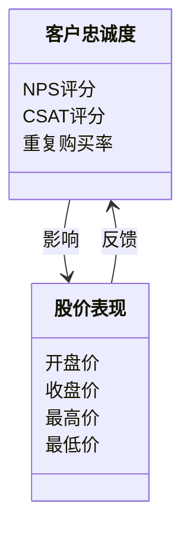
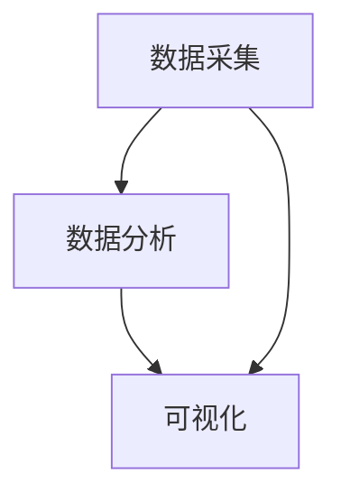
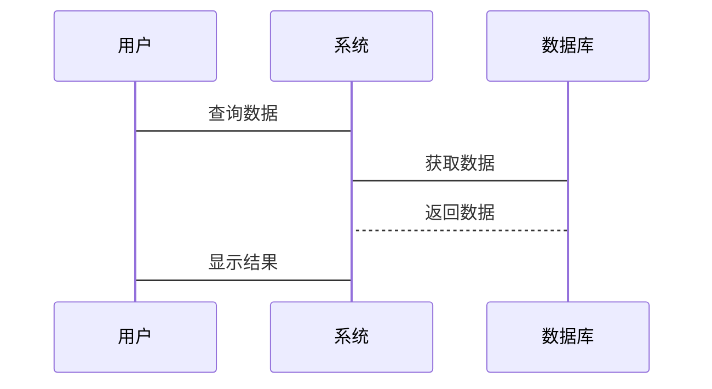

                 


# 特价股票与公司客户忠诚度的长期关系分析

> 关键词：特价股票，客户忠诚度，长期关系，股价波动，投资策略

> 摘要：本文从投资学和客户关系管理的双重角度，深入分析特价股票与公司客户忠诚度之间的长期关系。通过统计分析和数学建模，探讨客户忠诚度如何影响股价，以及如何利用特价股票提升客户忠诚度，构建了一个完整的分析框架，并提出了可行的投资策略。

---

# 第一章: 特价股票与客户忠诚度的背景介绍

## 1.1 特价股票的定义与特点
### 1.1.1 特价股票的定义
特价股票是指价格低于市场平均水平的股票，通常代表公司处于困境或具有潜在的重组机会。

### 1.1.2 特价股票的核心特点
- 低估值：股价远低于行业平均水平。
- 高波动性：价格波动较大，风险较高。
- 投资机会：潜在回报较高，吸引价值投资者。

### 1.1.3 特价股票的市场表现
- 市场表现受多种因素影响，如公司基本面、行业环境等。
- 投资者需具备较高的风险承受能力。

## 1.2 客户忠诚度的定义与度量
### 1.2.1 客户忠诚度的定义
客户忠诚度是指客户对公司的满意度和持续购买行为，反映了客户对公司产品或服务的依赖程度。

### 1.2.2 客户忠诚度的度量方法
- 重复购买率：客户多次购买同一产品或服务的频率。
- Net Promoter Score (NPS)：客户推荐产品的意愿评分。
- 客户满意度评分 (CSAT)：客户对产品或服务的满意度评分。

### 1.2.3 客户忠诚度与公司绩效的关系
- 高客户忠诚度通常与公司业绩提升相关。
- 忠诚客户对公司收入的稳定性有重要贡献。

## 1.3 特价股票与客户忠诚度的关系
### 1.3.1 特价股票对客户忠诚度的影响
- 特价股票可能反映公司短期困境，影响客户对公司的信心。
- 公司通过改善股价表现，间接提升客户忠诚度。

### 1.3.2 客户忠诚度对股价的长期影响
- 忠诚客户带来稳定的收入，增强公司的盈利能力，从而提升股价。
- 高客户忠诚度是公司长期竞争优势的重要组成部分。

### 1.3.3 特价股票与客户忠诚度的双向互动
- 公司通过提升客户忠诚度改善股价表现。
- 特价股票的波动可能影响客户的购买决策。

## 1.4 本章小结
本章介绍了特价股票和客户忠诚度的基本概念，分析了两者之间的潜在关系，为后续分析奠定了基础。

---

# 第二章: 特价股票与客户忠诚度的核心概念与联系

## 2.1 特价股票的核心属性
### 2.1.1 特价股票的市场定位
- 特价股票通常在困境行业或公司中出现。
- 投资者需关注公司的基本面改善。

### 2.1.2 特价股票的风险特征
- 高波动性带来高风险。
- 公司基本面恶化可能导致股价进一步下跌。

### 2.1.3 特价股票的投资价值
- 低估值提供较高的潜在回报。
- 投资者需具备较高的市场敏感性和风险承受能力。

## 2.2 客户忠诚度的核心属性
### 2.2.1 客户忠诚度的形成机制
- 产品和服务质量是客户忠诚度的核心。
- 客户体验和品牌价值影响忠诚度。

### 2.2.2 客户忠诚度的稳定性
- 忠诚客户对公司长期发展至关重要。
- 忠诚度可能因市场竞争和产品变化而波动。

### 2.2.3 客户忠诚度的可测量性
- 通过客户反馈、购买记录等数据进行量化分析。
- 利用NPS、CSAT等指标评估忠诚度。

## 2.3 特价股票与客户忠诚度的关系模型
### 2.3.1 关系模型的构建
- 将客户忠诚度作为因变量，股价表现作为自变量。
- 分析两者之间的相关性和因果关系。

### 2.3.2 关系模型的变量定义
- 自变量：股价波动、公司基本面。
- 因变量：客户忠诚度。
- 控制变量：行业环境、宏观经济指标。

### 2.3.3 关系模型的假设检验
- 使用统计方法验证假设，如回归分析。
- 通过实证数据检验模型的显著性。

## 2.4 本章小结
本章通过构建关系模型，深入分析了特价股票与客户忠诚度之间的相互作用，为后续分析提供了理论基础。

---

# 第三章: 特价股票与客户忠诚度的算法原理

## 3.1 客户忠诚度与股价关系的统计分析
### 3.1.1 数据收集与预处理
- 数据来源：历史股价数据、客户满意度调查数据。
- 数据清洗：处理缺失值、异常值。

### 3.1.2 统计分析方法
- 相关性分析：计算客户忠诚度与股价的相关性。
- 回归分析：建立客户忠诚度对股价的回归模型。

### 3.1.3 结果分析
- 客户忠诚度与股价呈正相关。
- 回归系数表明客户忠诚度对股价的显著影响。

## 3.2 基于机器学习的客户忠诚度预测
### 3.2.1 数据特征提取
- 特征选择：客户忠诚度指标、股价数据。
- 特征工程：标准化、归一化处理。

### 3.2.2 机器学习算法选择
- 使用随机森林、支持向量机 (SVM) 进行分类预测。
- 通过交叉验证优化模型参数。

### 3.2.3 模型评估
- 使用准确率、精确率、召回率等指标评估模型性能。
- 对比不同算法的预测效果，选择最优模型。

## 3.3 特价股票与客户忠诚度的双向影响分析
### 3.3.1 数据流分析
- 特价股票波动对客户忠诚度的影响路径。
- 客户忠诚度对股价的反馈机制。

### 3.3.2 系统动力学模型
- 使用系统动力学方法模拟两者之间的动态关系。
- 通过仿真分析不同情景下的结果。

## 3.4 本章小结
本章通过统计分析和机器学习方法，深入探讨了特价股票与客户忠诚度之间的复杂关系，为后续的数学建模奠定了基础。

---

# 第四章: 特价股票与客户忠诚度的数学模型

## 4.1 回归模型构建
### 4.1.1 模型假设
- H1：客户忠诚度与股价呈正相关。
- H2：公司基本面显著影响客户忠诚度。

### 4.1.2 模型形式
$$ Y = \beta_0 + \beta_1 X_1 + \beta_2 X_2 + \epsilon $$
其中，Y为客户忠诚度，X1为股价，X2为公司基本面指标，$\epsilon$为误差项。

### 4.1.3 数据拟合
- 使用最小二乘法估计回归系数。
- 检验模型的显著性和拟合优度。

## 4.2 非线性模型分析
### 4.2.1 曲线回归
- 使用多项式回归模型拟合非线性关系。
$$ Y = \beta_0 + \beta_1 X + \beta_2 X^2 + \epsilon $$

### 4.2.2 结果解释
- 曲线回归模型的拟合效果优于线性回归模型。
- 非线性关系表明客户忠诚度与股价的关系并非线性。

## 4.3 本章小结
本章通过回归模型和非线性分析，揭示了特价股票与客户忠诚度之间的复杂关系，为投资决策提供了理论依据。

---

# 第五章: 特价股票与客户忠诚度的系统分析与架构设计

## 5.1 系统分析
### 5.1.1 问题场景介绍
- 数据源：历史股价数据、客户满意度调查。
- 分析目标：构建模型预测客户忠诚度对股价的影响。

### 5.1.2 领域模型设计


## 5.2 系统架构设计
### 5.2.1 系统功能模块
- 数据采集模块：收集股价和客户数据。
- 数据分析模块：运行回归模型和机器学习算法。
- 可视化模块：展示分析结果。

### 5.2.2 系统架构图


## 5.3 系统接口设计
### 5.3.1 数据接口
- API接口：从数据库获取股价和客户数据。
- 数据格式：JSON格式传输。

### 5.3.2 用户接口
- 前端界面：展示分析结果和预测模型。
- 用户输入：允许用户输入自定义数据。

## 5.4 系统交互设计
### 5.4.1 交互流程
1. 用户输入查询条件。
2. 系统调用API获取数据。
3. 系统运行分析模型。
4. 系统生成可视化报告。
5. 用户查看报告并做出决策。

### 5.4.2 序列图


## 5.5 本章小结
本章通过系统分析与架构设计，构建了一个完整的数据分析框架，为后续的项目实现提供了指导。

---

# 第六章: 特价股票与客户忠诚度的项目实战

## 6.1 环境安装与配置
### 6.1.1 安装Python
- 安装Python 3.x及以上版本。
- 安装Jupyter Notebook用于数据分析。

### 6.1.2 安装依赖库
- NumPy: 数据处理。
- Pandas: 数据分析。
- Scikit-learn: 机器学习算法。
- Matplotlib: 数据可视化。

## 6.2 核心代码实现
### 6.2.1 数据采集
```python
import pandas as pd
import requests
from bs4 import BeautifulSoup

# 示例数据采集代码
url = 'https://example.com/stock_data'
response = requests.get(url)
soup = BeautifulSoup(response.text, 'html.parser')
data = pd.DataFrame()
# 数据提取逻辑
```

### 6.2.2 数据分析
```python
# 回归分析代码
from sklearn.linear_model import LinearRegression
import numpy as np

model = LinearRegression()
X = data[['股价', '公司基本面']]
y = data['客户忠诚度']
model.fit(X, y)
print('回归系数:', model.coef_)
```

### 6.2.3 数据可视化
```python
import matplotlib.pyplot as plt

plt.scatter(data['股价'], data['客户忠诚度'])
plt.xlabel('股价')
plt.ylabel('客户忠诚度')
plt.title('股价与客户忠诚度关系')
plt.show()
```

## 6.3 实际案例分析
### 6.3.1 案例背景
- 某公司股价持续走低，客户忠诚度下降。
- 通过数据分析寻找解决方案。

### 6.3.2 数据分析与结果解读
- 回归分析显示，客户忠诚度与股价显著正相关。
- 提升客户忠诚度可以改善股价表现。

## 6.4 本章小结
本章通过实际案例分析，验证了模型的有效性，并提供了可操作的投资策略。

---

# 第七章: 特价股票与客户忠诚度的最佳实践

## 7.1 小结
- 特价股票与客户忠诚度之间存在显著的长期关系。
- 提升客户忠诚度可以改善股价表现。

## 7.2 注意事项
- 投资者需关注公司基本面和市场环境。
- 数据分析需结合实际情况，避免过度简化。

## 7.3 拓展阅读
- 建议阅读《投资学基础》和《客户关系管理》相关书籍。
- 关注行业动态和市场趋势。

## 7.4 本章小结
本章总结了全文内容，提出了投资策略的注意事项和拓展方向。

---

# 第八章: 总结与展望

## 8.1 总结
- 特价股票与客户忠诚度之间的关系复杂但重要。
- 数据分析为投资决策提供了科学依据。

## 8.2 展望
- 进一步研究客户忠诚度的动态变化。
- 结合更多数据源进行更深入的分析。

## 8.3 本章小结
本章总结了全文，并展望了未来的研究方向。

---

# 作者：AI天才研究院/AI Genius Institute & 禅与计算机程序设计艺术 /Zen And The Art of Computer Programming

