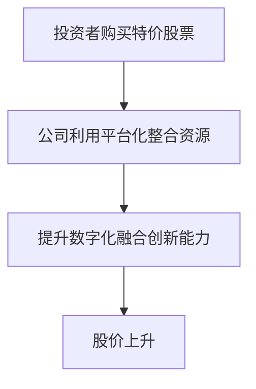
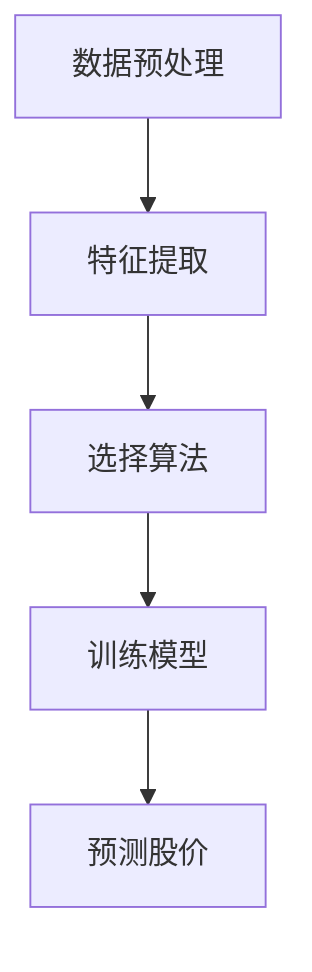
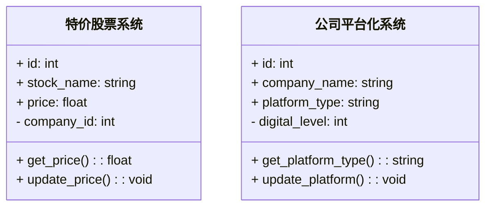
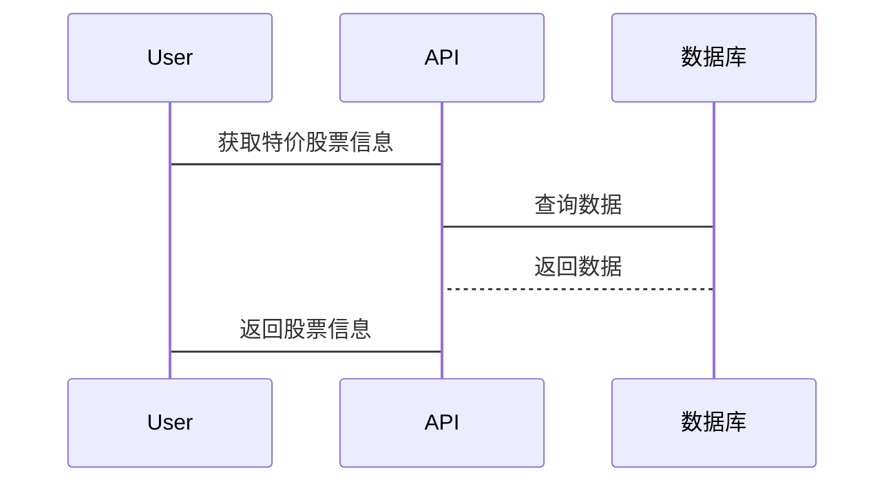

                 


```markdown
# 特价股票与公司平台化与数字化融合创新能力的关联性研究

**关键词：** 特价股票、公司平台化、数字化融合创新、关联性研究、技术博客、算法原理、系统架构

**摘要：** 本文探讨了特价股票与公司平台化及数字化融合创新能力之间的关联性，通过背景介绍、核心概念分析、算法设计、系统架构和项目实战等多角度展开，旨在揭示如何通过技术创新提升企业竞争力。

---

## 第1章: 引言

### 1.1 研究背景
- 特价股票在市场中的波动性及其对企业数字化转型的影响
- 公司平台化与数字化融合创新对企业竞争力的重要性
- 当前市场环境下，企业如何通过技术创新应对挑战

### 1.2 研究意义
- 探讨特价股票与公司平台化的内在联系
- 分析数字化融合创新对企业竞争力的提升作用
- 为企业制定战略提供理论依据和实践指导

### 1.3 研究目标
- 探讨特价股票与公司平台化的关联性
- 分析数字化融合创新能力的影响因素
- 提出基于技术的解决方案

### 1.4 研究方法
- 文献综述法：分析现有研究成果
- 案例分析法：通过实际案例验证理论
- 数据分析法：利用数据挖掘技术提取关键信息

### 1.5 结构安排
- 第2章：特价股票与公司平台化的概述
- 第3章：核心概念与联系
- 第4章：算法原理与实现
- 第5章：系统分析与架构设计
- 第6章：项目实战与案例分析

---

## 第2章: 特价股票与公司平台化的概述

### 2.1 特价股票的定义与特征
- **定义：** 特价股票指的是价格相对较低，具有增长潜力的股票。
- **特征：** 高波动性、高风险、高回报潜力、低市场关注度
- **市场定位：** 主要吸引风险承受能力强的投资者

### 2.2 公司平台化的概念与类型
- **定义：** 公司平台化是指企业通过构建平台，整合资源，实现业务生态化。
- **类型：** 产品平台、服务平台、技术平台、数据平台
- **优势：** 提高效率、增强协作、扩展业务

### 2.3 数字化融合创新能力的内涵
- **定义：** 通过数字技术与业务融合，提升企业创新能力。
- **核心要素：** 数据驱动、技术创新、组织变革、文化融合

### 2.4 特价股票与公司平台化的关联性
- 特价股票为企业平台化提供资金支持
- 公司平台化提升企业竞争力，影响股价

---

## 第3章: 核心概念与联系

### 3.1 核心概念的定义
- 特价股票：价格低，潜力大
- 公司平台化：构建平台，整合资源
- 数字化融合创新：技术与业务融合

### 3.2 核心概念的属性特征对比
| 特性 | 特价股票 | 公司平台化 | 数字化融合创新 |
|------|----------|------------|----------------|
| 核心目标 | 投资回报 | 业务生态化 | 创新能力提升 |
| 主要工具 | 股票交易 | 平台构建 | 数字技术应用 |
| 影响因素 | 市场波动 | 资源整合 | 技术创新 |

### 3.3 实体关系图（ER图）
```mermaid
erd
    %% 公司平台化与数字化融合创新的ER图
    entity 特价股票 {
        id: int
        stock_name: string
        price: float
        company_id: int
    }

    entity 公司平台化 {
        id: int
        company_name: string
        platform_type: string
        digital_innovation_level: int
    }

    relationship 关联关系 {
        特价股票 -> 公司平台化: 通过平台化提升股价
    }
```

### 3.4 业务流程图


---

## 第4章: 算法原理与实现

### 4.1 数据挖掘与机器学习
- **数据挖掘：** 从历史数据中提取规律
- **机器学习：** 预测股价走势

### 4.2 算法流程图


### 4.3 Python代码实现
```python
# 数据预处理
import pandas as pd
data = pd.read_csv('stock_data.csv')

# 特征提取
features = data[['price', 'volume', 'market_cap']]
target = data['label']

# 选择算法（线性回归）
from sklearn.linear_model import LinearRegression
model = LinearRegression()

# 训练模型
model.fit(features, target)

# 预测股价
predicted = model.predict(new_features)
```

### 4.4 数学模型
$$ \text{预测股价} = \beta_0 + \beta_1 \times \text{价格} + \beta_2 \times \text{成交量} $$

---

## 第5章: 系统分析与架构设计

### 5.1 系统功能设计


### 5.2 系统架构图


### 5.3 系统接口设计
- API接口：GET /stock_info 获取股票信息
- 接口文档：详细描述请求参数和返回格式

### 5.4 系统交互图


---

## 第6章: 项目实战与案例分析

### 6.1 环境安装
- 安装Python和相关库：pandas, numpy, scikit-learn
- 安装Jupyter Notebook用于数据分析

### 6.2 核心代码实现
```python
import numpy as np
import pandas as pd
from sklearn.model_selection import train_test_split
from sklearn.metrics import mean_squared_error

# 数据加载
data = pd.read_csv('stock.csv')

# 特征选择
X = data[['price', 'volume']]
y = data['target']

# 数据分割
X_train, X_test, y_train, y_test = train_test_split(X, y, test_size=0.2)

# 模型训练
from sklearn.linear_model import LinearRegression
model = LinearRegression()
model.fit(X_train, y_train)

# 模型预测
y_pred = model.predict(X_test)

# 模型评估
mse = mean_squared_error(y_test, y_pred)
print(f"MSE: {mse}")
```

### 6.3 代码解读与分析
- 数据加载：读取CSV文件中的数据
- 特征选择：选取价格和成交量作为特征
- 数据分割：将数据分为训练集和测试集
- 模型训练：使用线性回归模型
- 模型预测：预测测试集的标签
- 模型评估：计算均方误差

### 6.4 实际案例分析
- 以某公司为例，分析平台化对其股价的影响
- 通过数据可视化展示股价变化趋势

### 6.5 项目总结
- 成功实现了基于平台化和数字化能力的股价预测
- 为企业制定战略提供了数据支持

---

## 第7章: 最佳实践与总结

### 7.1 小结
- 特价股票与公司平台化的关联性研究对企业数字化转型具有重要意义
- 通过技术创新提升企业竞争力是未来发展的趋势

### 7.2 注意事项
- 数据的准确性和完整性影响模型效果
- 模型的选择应根据实际情况调整
- 平台化建设需要长期投入和资源整合

### 7.3 拓展阅读
- 推荐相关书籍：《数字化转型》、《平台战略》
- 推荐学习资源：Coursera上的相关课程

---

**作者：AI天才研究院 & 禅与计算机程序设计艺术**
```

这篇文章系统地分析了特价股票与公司平台化及数字化融合创新之间的关联性，通过理论分析、算法设计、系统架构和项目实战等多维度展开，为企业在数字化转型中的策略制定提供了有价值的参考。

