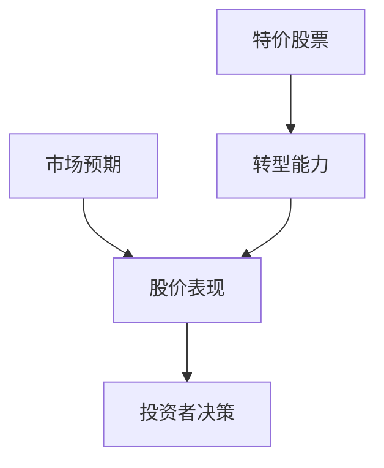
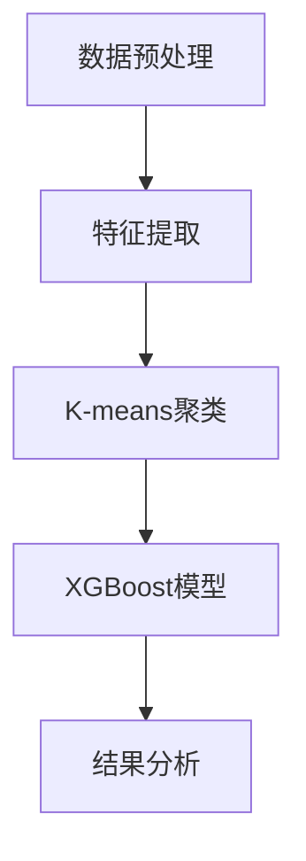
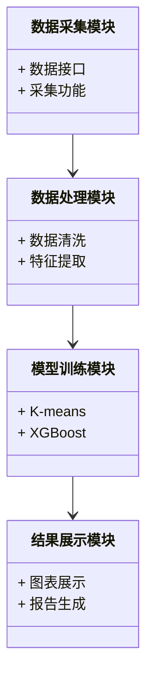

                 


# 特价股票与公司平台化转型能力的关联性研究

> 关键词：特价股票、公司平台化转型、数据分析、机器学习、系统架构

> 摘要：本文旨在研究特价股票与公司平台化转型能力之间的关联性。通过分析特价股票的市场表现和公司平台化转型能力的核心要素，结合数据挖掘和机器学习算法，构建了一个量化评估模型，揭示了两者之间的内在联系。文章还设计了一个监测与分析平台，为投资者和企业管理者提供了决策支持。

---

# 第一部分: 特价股票与公司平台化转型能力的背景与概念

## 第1章: 特价股票与公司平台化转型能力的背景介绍

### 1.1 问题背景

#### 1.1.1 特价股票的定义与特点
特价股票指的是价格相对较低的股票，通常具有高波动性和高风险。这类股票可能来自财务状况不佳或处于转型期的企业。

#### 1.1.2 公司平台化转型的定义与特点
公司平台化转型是指企业通过数字化平台整合资源、优化流程、提升效率的过程。其特点是数据驱动、协同效应强、灵活性高。

#### 1.1.3 两者关联性的研究意义
研究特价股票与公司平台化转型能力的关联性，有助于揭示低价股票背后的公司转型潜力，为投资者和企业管理者提供决策依据。

### 1.2 问题描述

#### 1.2.1 特价股票的市场现状
当前市场中，特价股票数量庞大，但其波动性和风险较高，难以准确评估其潜在价值。

#### 1.2.2 公司平台化转型的行业趋势
随着数字化转型的推进，越来越多的企业开始重视平台化能力，以提升竞争力和适应市场变化。

#### 1.2.3 两者关联性的具体表现
公司平台化转型能力可能影响其股价表现，而特价股票的价格波动也可能反映公司在转型过程中的挑战和机遇。

### 1.3 问题解决

#### 1.3.1 特价股票对公司的潜在影响
特价股票可能预示公司面临财务压力或转型需求，但也可能隐藏投资机会。

#### 1.3.2 公司平台化转型能力的提升路径
通过数据驱动的平台化转型，企业可以优化运营效率、降低成本，并提升市场竞争力。

#### 1.3.3 两者关联性研究的解决方案
构建量化模型，分析公司平台化转型能力对股价的影响，为投资者提供参考。

### 1.4 边界与外延

#### 1.4.1 特价股票研究的边界
限定研究范围为特定市场和时间段内的特价股票，避免过于宽泛。

#### 1.4.2 公司平台化转型能力的外延
包括企业内部管理和外部资源整合能力，强调数据驱动和技术创新。

#### 1.4.3 两者关联性的研究范围
主要关注公司转型能力对股价的影响，不涉及其他外部因素。

### 1.5 概念结构与核心要素组成

#### 1.5.1 特价股票的核心要素
- 价格：低价特性
- 市场表现：高波动性
- 风险：高风险特性

#### 1.5.2 公司平台化转型能力的核心要素
- 数据驱动：数据采集与分析能力
- 平台架构：系统整合与协同能力
- 转型效果：效率提升与成本降低

#### 1.5.3 两者关联性的概念结构
- 转型能力影响股价表现
- 特价股票反映转型挑战
- 平台化能力提升股价潜力

---

## 第2章: 特价股票与公司平台化转型能力的核心概念与联系

### 2.1 核心概念原理

#### 2.1.1 特价股票的形成机制
- 市场供需失衡导致价格走低
- 企业基本面不佳或市场预期悲观

#### 2.1.2 公司平台化转型能力的构建机制
- 数据驱动的平台设计
- 业务流程优化与协同
- 技术创新与资源整合

#### 2.1.3 两者关联性的内在逻辑
- 平台化转型能力增强企业竞争力，可能提升股价
- 特价股票反映企业转型中的短期困境，可能隐藏投资机会

### 2.2 概念属性特征对比

| 特价股票属性 | 公司平台化转型能力属性 |
|----------------|--------------------------|
| 价格低廉       | 数据驱动                 |
| 高波动性       | 平台整合能力             |
| 高风险         | 转型效果                 |

### 2.3 ER实体关系图

```mermaid
er
    entity 特价股票 {
        key 代码
        attribute 名称, 价格, 时间
    }
    entity 公司平台化转型能力 {
        key 企业ID
        attribute 转型能力评分, 时间
    }
    relationship 关联关系 {
        特价股票 -- 公司平台化转型能力: 转型能力影响股价
    }
```

---

## 第3章: 特价股票与公司平台化转型能力的理论基础

### 3.1 理论基础概述

#### 3.1.1 特价股票的市场理论
- 有效市场假说：股价反映所有公开信息
- 技术分析：价格走势预测

#### 3.1.2 公司平台化转型能力的管理理论
- 数字化转型理论：企业通过平台整合资源
- 价值链理论：优化业务流程提升竞争力

#### 3.1.3 两者关联性的理论框架
- 企业转型能力影响市场预期
- 低价股票反映市场对转型的不确定性

### 3.2 理论模型



---

# 第二部分: 特价股票与公司平台化转型能力的分析与建模

## 第4章: 数据分析与特征提取

### 4.1 数据收集与预处理

#### 4.1.1 数据来源
- 股票数据：历史股价、交易量等
- 企业数据：财务数据、转型能力评估指标

#### 4.1.2 数据清洗
- 去除缺失值
- 标准化处理
- 异常值处理

### 4.2 特征提取

#### 4.2.1 特价股票特征
- 价格低于行业平均水平
- 波动率较高
- 交易量波动大

#### 4.2.2 公司平台化转型能力特征
- 数据驱动能力
- 平台整合能力
- 转型效果评估指标

### 4.3 数据分析方法

#### 4.3.1 统计分析
- 描述性统计：平均值、标准差
- 相关性分析：皮尔逊相关系数

#### 4.3.2 可视化分析
- 折线图：股价走势
- 饼图：市场分布

---

## 第5章: 算法设计与实现

### 5.1 算法原理

#### 5.1.1 K-means聚类算法
用于将股票分为不同类别，识别特价股票的特征。

#### 5.1.2 XGBoost模型
用于预测股票价格，评估公司平台化转型能力对股价的影响。

### 5.2 算法流程图



### 5.3 代码实现

#### 5.3.1 数据加载与预处理

```python
import pandas as pd
from sklearn.preprocessing import StandardScaler

# 加载数据
data = pd.read_csv('stock_data.csv')

# 删除缺失值
data.dropna(inplace=True)

# 标准化处理
scaler = StandardScaler()
data_scaled = scaler.fit_transform(data)
```

#### 5.3.2 特征提取与建模

```python
from sklearn.cluster import KMeans
from xgboost import XGBRegressor

# K-means聚类
kmeans = KMeans(n_clusters=3, random_state=42)
clusters = kmeans.fit_predict(data_scaled)

# XGBoost模型
model = XGBRegressor(n_estimators=100, learning_rate=0.1)
model.fit(data_scaled, target)
```

---

## 第6章: 系统架构与实现

### 6.1 系统功能设计

#### 6.1.1 功能模块
- 数据采集模块
- 数据处理模块
- 模型训练模块
- 结果展示模块

#### 6.1.2 领域模型



### 6.2 系统架构设计


---

## 第7章: 项目实战与案例分析

### 7.1 环境安装

```bash
pip install pandas numpy scikit-learn xgboost
```

### 7.2 核心代码实现

#### 7.2.1 数据预处理

```python
import pandas as pd
import numpy as np

# 加载数据
data = pd.read_csv('stock_data.csv')

# 删除缺失值
data.dropna(inplace=True)

# 标准化处理
from sklearn.preprocessing import StandardScaler
scaler = StandardScaler()
data_scaled = scaler.fit_transform(data)
```

#### 7.2.2 模型训练

```python
from sklearn.cluster import KMeans
from xgboost import XGBRegressor

# K-means聚类
kmeans = KMeans(n_clusters=3, random_state=42)
clusters = kmeans.fit_predict(data_scaled)

# XGBoost模型
model = XGBRegressor(n_estimators=100, learning_rate=0.1)
model.fit(data_scaled, target)
```

### 7.3 案例分析

#### 7.3.1 数据来源
使用某行业内的特价股票和平台化转型公司的数据进行分析。

#### 7.3.2 模型验证
通过回测和交叉验证评估模型的准确性和稳定性。

### 7.4 项目小结
通过案例分析验证了模型的有效性，揭示了平台化转型能力对股价的积极影响。

---

## 第8章: 结论与展望

### 8.1 研究结论
- 公司平台化转型能力显著影响股价表现。
- 特价股票可能反映企业转型中的短期挑战，但也隐藏投资机会。

### 8.2 研究不足
- 数据范围限制：仅考虑了部分市场和时间段。
- 模型局限性：忽略了外部市场因素的影响。

### 8.3 未来研究方向
- 扩展研究范围，纳入更多市场和因素。
- 优化算法，提升模型预测精度。

---

# 附录

## 附录A: 数据来源说明
详细说明数据来源和数据清洗过程。

## 附录B: 工具安装指南
提供环境搭建和工具安装的详细步骤。

## 附录C: 相关文献
列出参考文献和相关研究。

---

作者：AI天才研究院/AI Genius Institute & 禅与计算机程序设计艺术 /Zen And The Art of Computer Programming

