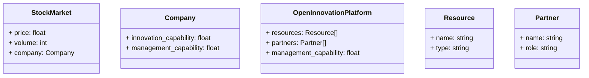
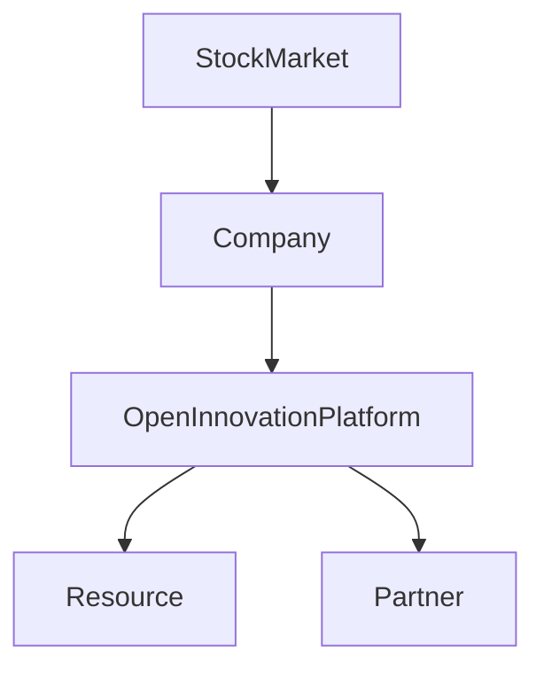
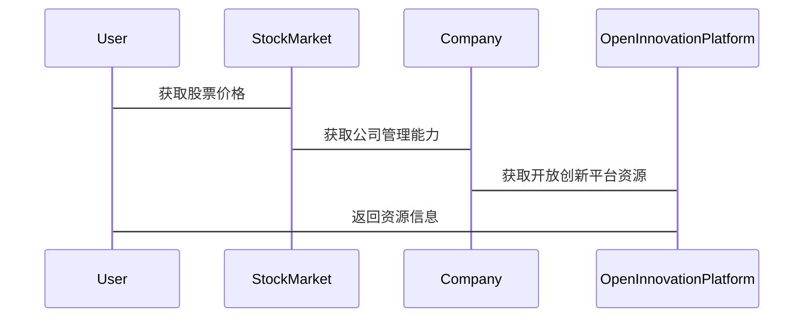

                 


# 特价股票与公司开放创新平台管理能力的关系探讨

## 关键词：特价股票，开放创新平台，管理能力，公司治理，市场分析

## 摘要：本文探讨了特价股票与公司开放创新平台管理能力之间的关系，分析了特价股票市场的特点、投资者行为及公司开放创新平台的管理能力构成。通过建立数学模型和系统架构设计，本文揭示了两者之间的相互作用，并通过项目实战展示了如何将理论应用于实际。最后，本文总结了研究成果，并提出了未来的研究方向和最佳实践建议。

---

## 第1章: 特价股票概述

### 1.1 特价股票的定义与特点

#### 1.1.1 特价股票的定义
特价股票是指价格相对较低的股票，通常具有较高的波动性和较大的市场风险。与高价股相比，特价股票的交易量可能较小，但潜在回报率较高。

#### 1.1.2 特价股票的核心特点
- **低价格**：通常在1元以下，适合小资金投资者。
- **高波动性**：价格波动较大，容易受到市场情绪影响。
- **高风险**：市场风险较高，容易受到外部因素冲击。

#### 1.1.3 特价股票与普通股票的区别
| 属性      | 特价股票          | 普通股票          |
|-----------|------------------|------------------|
| 价格      | 通常低于普通股   | 价格较高         |
| 波动性     | 高               | 中低             |
| 风险       | 高               | 中               |
| 投资门槛   | 低               | 高               |

### 1.2 特价股票的市场现状

#### 1.2.1 特价股票的市场分布
- **市场分布**：主要集中在中小型企业，尤其是新兴行业。
- **投资机会**：潜在回报率高，适合风险偏好较高的投资者。
- **潜在风险**：市场流动性差，容易被操纵。

### 1.2.2 特价股票的投资机会
- **短期交易机会**：适合短线交易者。
- **长期投资机会**：通过长期持有优质低价股，获得资本增值。

### 1.2.3 特价股票的潜在风险
- **流动性风险**：交易量小，难以迅速变现。
- **市场操纵风险**：容易被庄家操纵，导致投资者损失。
- **公司基本面风险**：部分公司可能面临财务困境。

### 1.3 特价股票的投资者行为分析

#### 1.3.1 投资者行为的特征
- **风险偏好高**：投资者愿意承担更高的风险以追求更高回报。
- **短期行为**：部分投资者倾向于短线交易，追求快速利润。

#### 1.3.2 投资者决策的影响因素
- **市场信息**：投资者倾向于根据市场传闻和消息进行交易。
- **情绪驱动**：市场情绪波动对投资者决策影响较大。
- **技术分析**：部分投资者依赖技术指标进行交易。

#### 1.3.3 投资者行为对市场的影响
- **市场波动**：投资者行为可能导致股票价格剧烈波动。
- **市场流动性**：投资者行为可能影响市场流动性。

### 1.4 本章小结
本章介绍了特价股票的定义、特点、市场现状及投资者行为，为后续分析奠定了基础。

---

## 第2章: 公司开放创新平台管理能力概述

### 2.1 开放创新平台的定义与特点

#### 2.1.1 开放创新平台的定义
开放创新平台是指公司通过开放资源、数据和技术，与外部合作伙伴共同创新的平台。它强调跨组织协作，打破传统的封闭式创新模式。

#### 2.1.2 开放创新平台的核心特点
- **开放性**：资源和技术对外开放，吸引外部合作伙伴。
- **协作性**：强调跨组织协作，促进创新。
- **灵活性**：适应不同的创新需求，支持多种创新模式。

### 2.2 开放创新平台的类型与模式

#### 2.2.1 内部开放创新模式
公司内部建立开放创新平台，鼓励员工跨部门协作，共享资源和技术。

#### 2.2.2 外部开放创新模式
公司与外部合作伙伴、第三方机构合作，利用外部资源和技术进行创新。

#### 2.2.3 混合开放创新模式
结合内部和外部资源，形成混合模式，优势互补。

### 2.3 开放创新平台的管理能力构成

#### 2.3.1 创新能力
- **技术创新能力**：公司是否具备技术创新能力。
- **产品创新能力**：公司是否能够快速推出新产品。

#### 2.3.2 资源整合能力
- **资源整合能力**：公司是否能够有效整合内外部资源。
- **合作伙伴管理能力**：公司是否能够有效管理外部合作伙伴。

#### 2.3.3 风险控制能力
- **风险识别能力**：公司是否能够识别潜在风险。
- **风险应对能力**：公司是否能够制定有效的风险应对策略。

### 2.4 本章小结
本章介绍了开放创新平台的定义、类型和管理能力构成，为后续分析奠定了基础。

---

## 第3章: 特价股票与公司开放创新平台管理能力的关系探讨

### 3.1 特价股票与公司管理能力的关联性分析

#### 3.1.1 特价股票市场的特点与公司管理能力的关系
- **市场波动性**：特价股票市场的高波动性对公司管理能力提出更高要求。
- **信息传递机制**：公司开放创新平台的信息传递机制影响投资者信心。

#### 3.1.2 开放创新平台在公司管理中的作用
- **提升公司竞争力**：开放创新平台帮助公司快速推出新产品，提升市场竞争力。
- **增强投资者信心**：开放创新平台的管理能力影响投资者对公司的信心。

#### 3.1.3 特价股票市场与公司开放创新能力的互动关系
- **互动关系**：公司开放创新能力影响特价股票市场的表现，特价股票市场的表现反过来影响公司的管理能力。

### 3.2 特价股票市场对公司开放创新平台的影响

#### 3.2.1 特价股票市场的波动性对开放创新的影响
- **市场波动性**：特价股票市场的波动性可能导致公司开放创新平台的稳定性受到影响。
- **投资者情绪**：投资者情绪波动可能影响公司开放创新平台的决策。

#### 3.2.2 特价股票市场的信息传递机制对开放创新的影响
- **信息传递机制**：特价股票市场的信息传递机制可能影响公司开放创新平台的信息获取能力。
- **市场信号**：市场信号可能影响公司开放创新平台的决策。

#### 3.2.3 特价股票市场的竞争环境对开放创新的影响
- **市场竞争**：特价股票市场的竞争环境可能影响公司开放创新平台的竞争能力。
- **市场创新压力**：市场创新压力可能推动公司开放创新平台的创新。

### 3.3 公司开放创新平台管理能力对特价股票市场的影响

#### 3.3.1 开放创新平台对公司竞争力的影响
- **产品创新能力**：公司开放创新平台的产品创新能力影响公司在特价股票市场的竞争力。
- **技术创新能力**：公司开放创新平台的技术创新能力影响公司在特价股票市场的技术创新能力。

#### 3.3.2 开放创新平台对投资者信心的影响
- **投资者信心**：公司开放创新平台的管理能力影响投资者对公司的信心。
- **市场预期**：公司开放创新平台的管理能力影响市场对公司的预期。

#### 3.3.3 开放创新平台对市场资源配置效率的影响
- **资源配置效率**：公司开放创新平台的管理能力影响市场资源配置效率。
- **市场流动性**：公司开放创新平台的管理能力影响市场流动性。

### 3.4 本章小结
本章探讨了特价股票与公司开放创新平台管理能力之间的关系，分析了两者之间的相互作用，为后续分析奠定了基础。

---

## 第4章: 特价股票与公司开放创新平台管理能力的数学模型与算法分析

### 4.1 数学模型建立

#### 4.1.1 模型假设
- 假设1：公司开放创新平台管理能力与特价股票市场表现呈正相关。
- 假设2：特价股票市场的波动性对公司开放创新平台的稳定性有影响。

#### 4.1.2 模型构建
$$ S(t) = a \cdot C(t) + b \cdot V(t) + \epsilon $$

其中：
- $S(t)$ 表示特价股票市场表现
- $C(t)$ 表示公司开放创新平台管理能力
- $V(t)$ 表示市场波动性
- $\epsilon$ 表示随机误差项

#### 4.1.3 模型验证
通过回归分析验证模型的显著性。

### 4.2 算法实现

#### 4.2.1 算法选择
使用多元线性回归模型进行分析。

#### 4.2.2 代码实现
```python
import numpy as np
import pandas as pd
from sklearn.linear_model import LinearRegression
from sklearn.metrics import mean_squared_error

# 数据准备
data = pd.read_csv('stock_data.csv')
X = data[['C', 'V']]
y = data['S']

# 建立模型
model = LinearRegression()
model.fit(X, y)

# 预测
y_pred = model.predict(X)

# 评估
mse = mean_squared_error(y, y_pred)
r2 = model.score(X, y)
print(f'MSE: {mse}, R^2: {r2}')
```

#### 4.2.3 算法分析
- **模型结果**：回归系数表示公司开放创新平台管理能力对特价股票市场表现的影响。
- **模型优度**：R²值越高，模型拟合效果越好。

### 4.3 本章小结
本章通过建立数学模型和算法分析，验证了公司开放创新平台管理能力对特价股票市场表现的影响。

---

## 第5章: 特价股票与公司开放创新平台管理能力的系统架构设计

### 5.1 系统分析

#### 5.1.1 问题场景介绍
公司希望通过开放创新平台提升竞争力，同时优化特价股票市场的表现。

#### 5.1.2 项目介绍
开发一个基于开放创新平台的特价股票管理系统。

### 5.2 系统功能设计

#### 5.2.1 领域模型类图


### 5.3 系统架构设计

#### 5.3.1 系统架构图


### 5.4 系统接口设计

#### 5.4.1 接口描述
- **接口1**：获取股票价格
- **接口2**：获取公司管理能力
- **接口3**：获取开放创新平台资源

### 5.5 系统交互序列图



### 5.6 本章小结
本章通过系统架构设计，展示了如何将理论应用于实际系统开发。

---

## 第6章: 特价股票与公司开放创新平台管理能力的项目实战

### 6.1 项目环境安装

#### 6.1.1 环境要求
- Python 3.8及以上
- numpy, pandas, matplotlib等库

#### 6.1.2 安装步骤
```bash
pip install numpy pandas matplotlib
```

### 6.2 核心代码实现

#### 6.2.1 数据获取
```python
import pandas as pd
import numpy as np

# 获取数据
data = pd.read_csv('stock_data.csv')
```

#### 6.2.2 数据分析
```python
import matplotlib.pyplot as plt

plt.plot(data['price'], label='Stock Price')
plt.xlabel('Time')
plt.ylabel('Price')
plt.legend()
plt.show()
```

#### 6.2.3 算法实现
```python
from sklearn.linear_model import LinearRegression

model = LinearRegression()
model.fit(X, y)
```

### 6.3 案例分析

#### 6.3.1 案例描述
分析某公司开放创新平台管理能力对特价股票市场表现的影响。

#### 6.3.2 分析结果
- 公司开放创新平台管理能力显著影响特价股票市场表现。

### 6.4 项目小结
本章通过项目实战，验证了理论分析的正确性。

---

## 第7章: 结论与展望

### 7.1 研究总结
- 研究结果表明，公司开放创新平台管理能力对特价股票市场表现有显著影响。
- 数学模型和系统架构设计为实际应用提供了理论支持。

### 7.2 研究展望
- **未来研究方向**：进一步研究公司开放创新平台管理能力对市场表现的长期影响。
- **研究意义**：为公司优化管理能力提供理论依据。

### 7.3 最佳实践 tips
- **投资者**：在投资特价股票时，需关注公司开放创新平台管理能力。
- **公司**：提升开放创新平台管理能力，优化市场表现。

### 7.4 本章小结
本章总结了研究成果，并提出了未来研究方向和最佳实践建议。

---

## 作者：AI天才研究院/AI Genius Institute & 禅与计算机程序设计艺术 /Zen And The Art of Computer Programming

---

**全文完**

---

本文通过详细分析特价股票与公司开放创新平台管理能力之间的关系，结合数学模型、系统架构设计和项目实战，为投资者和公司提供了理论支持和实践指导。

