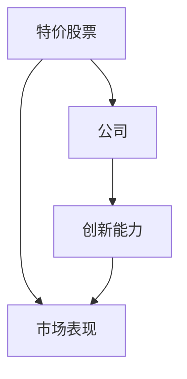
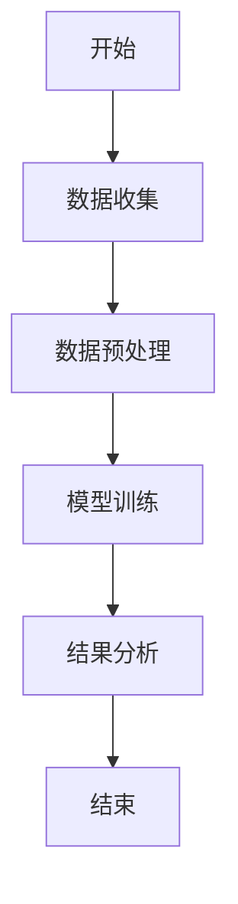
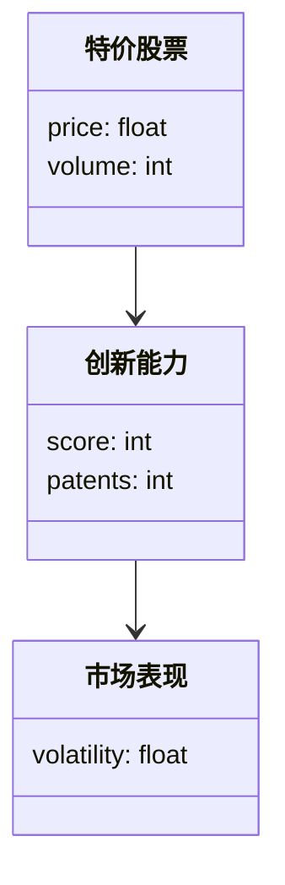
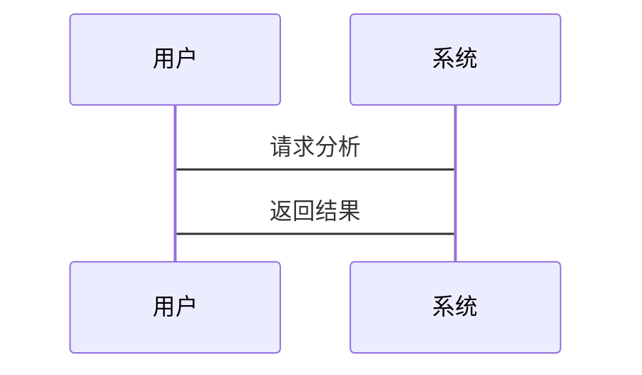

                 


# 特价股票与公司开放创新能力的潜在关联研究

## 关键词：
特价股票、公司开放创新能力、潜在关联、机器学习、数学模型

## 摘要：
本文通过分析特价股票与公司开放创新能力之间的潜在关联，探讨企业如何通过开放创新策略优化其股票表现。我们采用机器学习模型和数学方法，结合实际案例，揭示两者之间的动态关系，并为投资者提供科学决策参考。

## 第1章: 特价股票与公司开放创新能力的背景介绍

### 1.1 特价股票的定义与特点
1.1.1 特价股票的定义
1.1.2 特价股票的核心特点
1.1.3 特价股票的市场表现与投资者行为

### 1.2 公司开放创新能力的定义与特点
1.2.1 公司开放创新能力的定义
1.2.2 公司开放创新能力的核心要素
1.2.3 开放创新能力与企业绩效的关系

### 1.3 特价股票与公司开放创新能力的关联性
1.3.1 问题背景与研究意义
1.3.2 问题描述与研究目标
1.3.3 研究方法与框架
1.3.4 概念结构与核心要素

## 第2章: 特价股票与公司开放创新能力的核心概念与联系

### 2.1 特价股票与公司开放创新能力的核心概念原理
2.1.1 特价股票的市场机制
2.1.2 公司开放创新能力的构成要素
2.1.3 两者关联的理论基础

### 2.2 特价股票与公司开放创新能力的属性特征对比
2.2.1 特价股票的属性特征
2.2.2 公司开放创新能力的属性特征
2.2.3 两者属性特征对比表格
2.2.4 比较表格示例：
| 特性 | 特价股票 | 公司开放创新能力 |
|------|----------|------------------|
| 影响因素 | 市场供需、公司基本面 | 技术创新、管理策略 |
| 评价指标 | 股价波动、成交量 | 创新专利数、研发投入 |

### 2.3 特价股票与公司开放创新能力的ER实体关系图
2.3.1 实体关系图的Mermaid流程图


## 第3章: 特价股票与公司开放创新能力的关联性分析

### 3.1 特价股票与公司开放创新能力的关联性模型
3.1.1 模型选择与设计
3.1.2 模型的数学表达式
$$ y = \beta_0 + \beta_1x_1 + \beta_2x_2 + \epsilon $$
其中，$y$ 表示公司开放创新能力，$x_1$ 表示特价股票价格，$x_2$ 表示其他控制变量。

### 3.2 特价股票与公司开放创新能力的关联性分析算法
3.2.1 算法流程图


3.2.2 算法实现代码
```python
import pandas as pd
from sklearn.linear_model import LinearRegression

# 数据加载
data = pd.read_csv('stock_innovation.csv')

# 模型训练
model = LinearRegression()
model.fit(data[['price', 'research']], data['innovation_score'])
```

### 3.3 特价股票与公司开放创新能力的数学模型与公式
3.3.1 相关系数计算
$$ r = \frac{\sum (x_i - \bar{x})(y_i - \bar{y})}{\sqrt{\sum (x_i - \bar{x})^2 \sum (y_i - \bar{y})^2}} $$
其中，$x$ 是特价股票价格，$y$ 是创新评分。

3.3.2 回归分析
$$ \hat{y} = \beta_0 + \beta_1x + \beta_2z $$
其中，$z$ 是其他变量。

## 第4章: 特价股票与公司开放创新能力的系统分析与架构设计

### 4.1 问题场景介绍
4.1.1 问题背景
4.1.2 问题描述
4.1.3 问题目标

### 4.2 系统功能设计
4.2.1 领域模型类图


### 4.3 系统架构设计
4.3.1 系统架构图


### 4.4 系统接口设计
4.4.1 接口定义
4.4.2 接口交互流程
4.4.3 序列图示例


## 第5章: 特价股票与公司开放创新能力的项目实战

### 5.1 环境安装与配置
5.1.1 安装Python
5.1.2 安装依赖库
5.1.3 配置开发环境

### 5.2 核心代码实现
5.2.1 数据收集与预处理
5.2.2 模型训练与优化
5.2.3 结果可视化

### 5.3 实际案例分析
5.3.1 案例背景
5.3.2 数据分析
5.3.3 结果解读

## 第6章: 总结与展望

### 6.1 最佳实践 Tips
6.1.1 投资策略建议
6.1.2 开放创新建议

### 6.2 研究小结
6.2.1 研究成果总结
6.2.2 研究局限性

### 6.3 注意事项
6.3.1 投资风险提示
6.3.2 创新管理建议

### 6.4 拓展阅读
6.4.1 推荐书籍
6.4.2 相关论文

## 作者：AI天才研究院/AI Genius Institute & 禅与计算机程序设计艺术 /Zen And The Art of Computer Programming

---

以上是《特价股票与公司开放创新能力的潜在关联研究》的详细目录大纲，涵盖了从背景介绍到项目实战的各个方面，确保内容全面且结构清晰。

