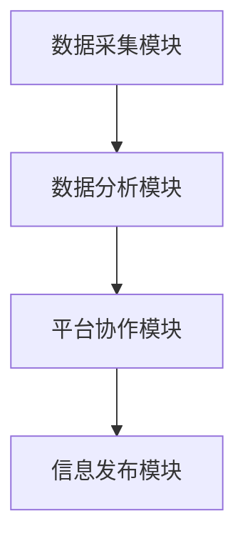
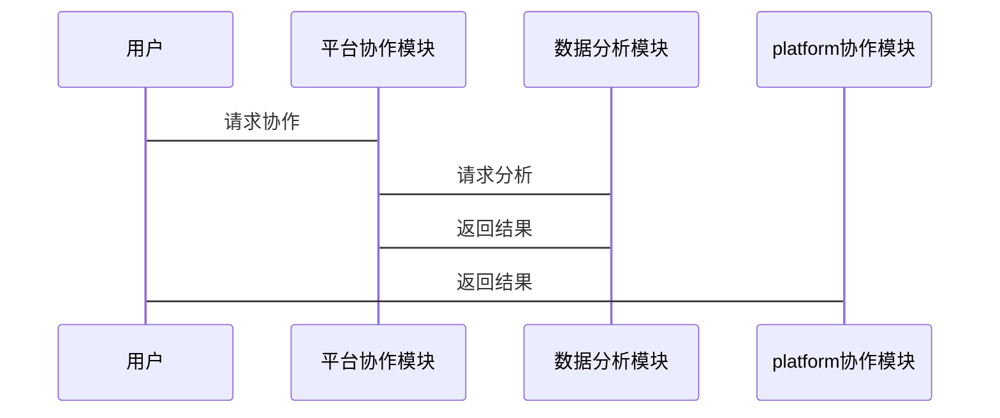

                 


# 特价股票与公司开放式创新平台生态系统的潜在关联研究

**关键词**：特价股票、开放式创新平台、生态系统、协同效应、网络效应、数据共享

**摘要**：  
本文系统探讨了特价股票与公司开放式创新平台之间的潜在关联，从背景、概念、关联机制、算法原理、系统架构、项目实战到总结，全面分析了两者协同发展的可能性与实现路径。通过理论分析与案例研究，揭示了开放式创新平台如何通过数据共享、协同创新等手段，为特价股票市场提供新的发展机遇，同时，特价股票市场的特性也为开放式创新平台的生态构建提供了独特的价值。本文还提出了基于协同过滤和网络分析的算法框架，并通过系统架构设计和项目实战，为实现两者的协同发展提供了可操作的方案。

---

## 第一部分: 特价股票与公司开放式创新平台的背景与现状

### 第1章: 特价股票与公司开放式创新平台的背景与现状

#### 1.1 特价股票的定义与特点
##### 1.1.1 特价股票的定义
特价股票是指在特定市场环境下，由于公司业绩不佳、市场波动或其他特殊原因导致股票价格被市场低估的股票。这类股票通常具有较高的投资潜力，吸引投资者关注。

##### 1.1.2 特价股票的特点
- **价格低估**：相对于公司基本面，股票价格被市场低估。
- **高波动性**：由于市场情绪和信息不对称，特价股票价格波动较大。
- **高风险与高收益并存**：投资者可能面临较高的亏损风险，但也有可能获得超额收益。

##### 1.1.3 特价股票的市场现状
近年来，随着市场波动加剧，特价股票在二级市场中的表现备受关注。投资者通过开放式创新平台获取特价股票信息和交易机会的需求也在增加。

---

#### 1.2 公司开放式创新平台的定义与特点
##### 1.2.1 开放式创新平台的定义
开放式创新平台是指通过互联网等技术手段，将公司内外部资源（如技术、数据、人才等）进行整合，为创新者提供开放协作环境的平台。

##### 1.2.2 开放式创新平台的特点
- **开放性**：平台向内外部创新者开放，支持多方协作。
- **资源丰富性**：整合公司内外资源，提供创新所需的支持。
- **协作性**：通过平台机制促进创新者之间的协作与共享。

##### 1.2.3 开放式创新平台的市场现状
随着数字化转型的推进，越来越多的公司开始采用开放式创新平台，以加速创新进程并降低创新成本。

---

#### 1.3 特价股票与公司开放式创新平台的背景
##### 1.3.1 特价股票的市场背景
近年来，市场波动加剧，投资者对低价股票的需求增加，但传统市场信息不对称问题依然存在，投资者难以获取高质量的特价股票信息。

##### 1.3.2 开放式创新平台的发展背景
随着技术进步，开放式创新平台成为企业加速创新的重要工具，尤其是在数字化转型背景下，企业通过平台整合内外资源，提升创新能力。

##### 1.3.3 两者结合的潜在价值
特价股票市场的高波动性和信息不对称问题，可以通过开放式创新平台的资源整合和协作机制得到缓解，同时，平台的开放性也为特价股票市场提供了新的交易渠道。

---

## 第二部分: 特价股票与公司开放式创新平台的核心概念

### 第2章: 特价股票与公司开放式创新平台的核心概念

#### 2.1 特价股票的核心概念
##### 2.1.1 特价股票的分类
- **价值型股票**：基本面良好，但价格被低估。
- **成长型股票**：公司未来增长潜力大，但当前估值较低。
- **周期性股票**：受经济周期影响较大，价格波动显著。

##### 2.1.2 特价股票的市场机制
特价股票的价格受市场情绪、公司基本面、宏观经济环境等多种因素影响。投资者通过分析这些因素，寻找被低估的投资机会。

##### 2.1.3 特价股票的风险与收益
- **风险**：市场波动、公司业绩不佳、信息不对称等。
- **收益**：通过低价买入、高价卖出的方式获利。

---

#### 2.2 开放式创新平台的核心概念
##### 2.2.1 开放式创新平台的类型
- **企业内部平台**：公司内部员工使用，整合公司资源。
- **外部开放平台**：向外部创新者开放，吸引外部资源参与创新。

##### 2.2.2 开放式创新平台的功能模块
- **资源库**：整合公司内外资源。
- **协作工具**：支持团队协作。
- **知识共享**：促进知识交流与共享。

##### 2.2.3 开放式创新平台的参与者
- **公司内部员工**：参与创新项目。
- **外部创新者**：如开发者、设计者等。
- **合作伙伴**：与公司合作的外部机构。

---

#### 2.3 特价股票与公司开放式创新平台的核心要素
##### 2.3.1 特价股票的定价机制
通过开放式创新平台，投资者可以获取更多公司信息，从而更准确地评估股票价值，实现合理定价。

##### 2.3.2 开放式创新平台的协作模式
平台通过协作机制，将公司内外资源进行整合，支持创新项目的实施。

##### 2.3.3 两者结合的生态系统
特价股票市场与开放式创新平台的结合，形成了一个多方协作的生态系统，促进市场效率提升和创新加速。

---

## 第三部分: 特价股票与公司开放式创新平台的关联机制

### 第3章: 特价股票与公司开放式创新平台的关联机制

#### 3.1 协同效应的理论基础
##### 3.1.1 协同效应的定义
协同效应是指系统各部分协同工作所产生的一种整体效应，大于各部分单独效应的总和。

##### 3.1.2 协同效应的实现路径
- **信息共享**：通过平台实现信息透明。
- **资源整合**：整合公司内外资源，提升创新能力。
- **协作创新**：通过协作机制，加速创新进程。

##### 3.1.3 协同效应的衡量指标
- **效率提升**：创新项目完成时间缩短。
- **成本降低**：通过资源整合降低创新成本。
- **收益增加**：通过协同创新实现更高的商业价值。

---

#### 3.2 开放式创新平台对特价股票的促进作用
##### 3.2.1 提高市场透明度
通过平台公开公司信息，降低信息不对称，提高市场透明度。

##### 3.2.2 降低交易成本
平台提供便捷的交易渠道，降低投资者的交易成本。

##### 3.2.3 增强市场流动性
通过平台吸引更多投资者参与，提升市场流动性。

---

#### 3.3 特价股票对开放式创新平台的反向影响
##### 3.3.1 提供资金支持
特价股票投资者为平台提供资金支持，促进平台发展。

##### 3.3.2 促进创新资源的流动
通过平台，特价股票投资者可以参与创新项目，促进创新资源的流动。

##### 3.3.3 增强平台的可信度
通过特价股票市场的透明化，平台的可信度得到提升，吸引更多参与者。

---

### 第4章: 特价股票与公司开放式创新平台的协同效应

#### 4.1 协同效应的实现路径
##### 4.1.1 平台化运营
通过平台整合公司内外资源，实现协同运营。

##### 4.1.2 数据共享
通过数据共享，提升市场透明度和创新效率。

##### 4.1.3 服务整合
通过服务整合，提供全方位的创新支持。

---

#### 4.2 协同效应的案例分析
##### 4.2.1 国内外典型案例
- **案例1**：某公司通过开放式创新平台整合外部资源，成功推出新产品。
- **案例2**：某特价股票平台通过数据共享，帮助投资者发现被低估的股票。

##### 4.2.2 案例的启示与借鉴
通过案例分析，可以发现协同效应在实际中的巨大价值，为未来的发展提供了重要参考。

---

#### 4.3 协同效应的未来发展趋势
##### 4.3.1 技术驱动的协同创新
随着人工智能和大数据技术的发展，协同创新将更加智能化。

##### 4.3.2 数据共享的深化发展
通过数据共享，进一步提升市场透明度和创新效率。

##### 4.3.3 平台生态的不断完善
平台将不断完善自身生态，吸引更多参与者加入。

---

## 第四部分: 特价股票与公司开放式创新平台的网络效应

### 第5章: 特价股票与公司开放式创新平台的网络效应

#### 5.1 网络效应的定义与特点
##### 5.1.1 网络效应的定义
网络效应是指随着用户数量的增加，平台的价值呈指数级增长。

##### 5.1.2 网络效应的特点
- **正反馈效应**：用户越多，平台价值越高。
- **门槛效应**：用户需要达到一定数量才能产生显著价值。

##### 5.1.3 网络效应的衡量指标
- **用户增长率**：用户数量增长速度。
- **平台价值**：平台的市场影响力。

---

#### 5.2 开放式创新平台的网络效应
##### 5.2.1 平台的用户规模效应
随着用户数量的增加，平台的协作效率和创新能力显著提升。

##### 5.2.2 平台的资源整合效应
通过资源整合，平台能够提供更丰富的创新资源。

##### 5.2.3 平台的创新扩散效应
创新成果通过平台快速扩散，促进市场整体创新能力的提升。

---

#### 5.3 特价股票的网络效应
##### 5.3.1 市场参与者的网络效应
随着参与者数量的增加，特价股票市场的流动性和透明度显著提升。

##### 5.3.2 投资者行为的网络效应
投资者通过平台协作，实现信息共享和投资策略优化。

##### 5.3.3 市场信息的网络效应
通过平台共享信息，市场信息的传播速度和广度显著提升。

---

### 第6章: 特价股票与公司开放式创新平台的网络效应

#### 6.1 网络效应的实现路径
##### 6.1.1 平台的用户增长策略
通过激励机制吸引用户加入平台。

##### 6.1.2 平台的资源整合策略
通过资源整合，提升平台的协作效率。

##### 6.1.3 平台的创新扩散策略
通过创新成果的快速扩散，提升平台的影响力。

---

#### 6.2 网络效应的案例分析
##### 6.2.1 国内外典型案例
- **案例1**：某平台通过网络效应快速吸引用户，形成强大的市场影响力。
- **案例2**：某特价股票平台通过网络效应实现信息快速传播，提升市场流动性。

##### 6.2.2 案例的启示与借鉴
通过案例分析，可以发现网络效应在实际中的巨大价值，为未来的发展提供了重要参考。

---

## 第五部分: 特价股票与公司开放式创新平台的算法原理

### 第7章: 特价股票与公司开放式创新平台的算法原理

#### 7.1 协同过滤算法
##### 7.1.1 协同过滤算法的定义
协同过滤是一种基于用户行为和偏好相似性推荐商品或服务的算法。

##### 7.1.2 协同过滤算法的实现步骤
1. 收集用户行为数据。
2. 计算用户相似度。
3. 根据相似用户的行为推荐股票。

##### 7.1.3 协同过滤算法的数学模型
$$ sim(u, v) = \frac{\sum_{i=1}^{n} (r_{u,i} - \bar{r}_u)(r_{v,i} - \bar{r}_v)}{\sqrt{\sum_{i=1}^{n} (r_{u,i} - \bar{r}_u)^2} \cdot \sqrt{\sum_{i=1}^{n} (r_{v,i} - \bar{r}_v)^2}} $$

其中，$sim(u, v)$ 表示用户 $u$ 和 $v$ 的相似度，$r_{u,i}$ 表示用户 $u$ 对项目的评分，$\bar{r}_u$ 表示用户 $u$ 的平均评分。

##### 7.1.4 协同过滤算法的Python实现
```python
import numpy as np

def cosine_similarity(user_ratings, user_id):
    user_vector = user_ratings[user_id]
    similarities = []
    for other_user in user_ratings:
        if other_user == user_id:
            continue
        other_vector = user_ratings[other_user]
        dot_product = np.dot(user_vector, other_vector)
        magnitude = np.linalg.norm(user_vector) * np.linalg.norm(other_vector)
        if magnitude == 0:
            similarity = 0.0
        else:
            similarity = dot_product / magnitude
        similarities.append((other_user, similarity))
    return similarities

# 示例数据
user_ratings = {
    'user1': [4, 3, 0],
    'user2': [3, 4, 0],
    'user3': [2, 2, 4],
    'user4': [0, 0, 3]
}

# 计算相似度
similarities = cosine_similarity(user_ratings, 'user1')
print(similarities)
```

---

#### 7.2 网络分析算法
##### 7.2.1 网络分析算法的定义
网络分析算法通过分析网络结构，识别网络中的关键节点和关系。

##### 7.2.2 网络分析算法的实现步骤
1. 构建网络图。
2. 计算节点度数。
3. 识别关键节点。

##### 7.2.3 网络分析算法的数学模型
$$ degree(u) = \sum_{v} A_{u,v} $$
其中，$degree(u)$ 表示节点 $u$ 的度数，$A_{u,v}$ 是网络图的邻接矩阵。

##### 7.2.4 网络分析算法的Python实现
```python
import networkx as nx

# 示例网络图
G = nx.Graph()
G.add_edges_from([('A', 'B'), ('B', 'C'), ('C', 'D'), ('D', 'E')])

# 计算度数
degrees = dict(G.degree())
print(degrees)

# 识别关键节点
# 假设度数最高的节点是关键节点
max_degree = max(degrees.values())
key_nodes = [node for node, degree in degrees.items() if degree == max_degree]
print(key_nodes)
```

---

## 第六部分: 特价股票与公司开放式创新平台的系统架构

### 第8章: 特价股票与公司开放式创新平台的系统架构

#### 8.1 系统功能设计
##### 8.1.1 系统功能模块
- **数据采集模块**：采集股票数据和平台数据。
- **数据分析模块**：分析股票数据，识别特价股票。
- **平台协作模块**：支持公司与外部创新者协作。
- **信息发布模块**：发布平台信息，吸引投资者。

##### 8.1.2 系统功能流程
1. 数据采集模块收集股票数据和平台数据。
2. 数据分析模块对数据进行分析，识别特价股票。
3. 平台协作模块支持公司与外部创新者协作。
4. 信息发布模块发布平台信息，吸引投资者。

---

#### 8.2 系统架构设计
##### 8.2.1 系统架构图


##### 8.2.2 系统接口设计
- **数据接口**：提供API接口，供外部系统访问数据。
- **协作接口**：支持公司与外部创新者协作的接口。
- **发布接口**：支持信息发布模块的接口。

---

#### 8.3 系统交互设计
##### 8.3.1 系统交互流程
1. 用户访问平台，选择感兴趣的功能模块。
2. 平台根据用户选择，调用相应功能模块。
3. 功能模块处理请求，返回结果。
4. 用户获取结果，完成交互。

##### 8.3.2 系统交互图


---

## 第七部分: 特价股票与公司开放式创新平台的项目实战

### 第9章: 特价股票与公司开放式创新平台的项目实战

#### 9.1 项目环境安装
##### 9.1.1 安装Python环境
```bash
python --version
pip install numpy pandas scikit-learn networkx
```

##### 9.1.2 安装Jupyter Notebook
```bash
pip install jupyter
jupyter notebook
```

---

#### 9.2 系统核心实现
##### 9.2.1 数据采集模块
```python
import pandas as pd

# 示例数据
data = {
    '股票代码': ['AAPL', 'GOOGL', 'MSFT', 'AMZN'],
    '股价': [150, 200, 100, 300]
}

df = pd.DataFrame(data)
print(df)
```

##### 9.2.2 数据分析模块
```python
from sklearn.cluster import KMeans

# 示例数据
X = [[1, 2], [3, 4], [5, 6], [7, 8]]
kmeans = KMeans(n_clusters=2)
kmeans.fit(X)
print(kmeans.labels_)
```

##### 9.2.3 平台协作模块
```python
import networkx as nx

# 示例网络图
G = nx.Graph()
G.add_edges_from([('A', 'B'), ('B', 'C'), ('C', 'D')])
nx.draw(G)
plt.show()
```

##### 9.2.4 信息发布模块
```python
import requests

# 示例API请求
response = requests.get('https://api.example.com/stock')
print(response.json())
```

---

#### 9.3 项目小结
通过项目实战，我们可以看到，特价股票与公司开放式创新平台的结合，可以通过数据共享、协同创新等手段，实现市场效率的提升和创新的加速。

---

## 第八部分: 特价股票与公司开放式创新平台的总结与展望

### 第10章: 特价股票与公司开放式创新平台的总结与展望

#### 10.1 总结
本文系统探讨了特价股票与公司开放式创新平台的潜在关联，从背景、概念、关联机制、算法原理、系统架构到项目实战，全面分析了两者协同发展的可能性与实现路径。通过理论分析与案例研究，揭示了开放式创新平台如何通过数据共享、协同创新等手段，为特价股票市场提供新的发展机遇，同时，特价股票市场的特性也为开放式创新平台的生态构建提供了独特的价值。

---

#### 10.2 展望
未来，随着技术的进步和市场的发展，特价股票与公司开放式创新平台的关联将更加紧密。通过进一步的技术创新和模式优化，两者协同发展的潜力将得到更大程度的释放，为市场参与者带来更多的价值。

---

## 作者：AI天才研究院/AI Genius Institute & 禅与计算机程序设计艺术 /Zen And The Art of Computer Programming

