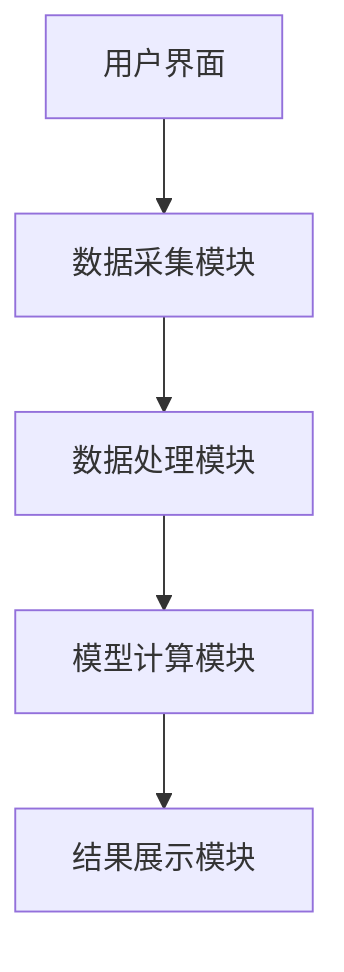
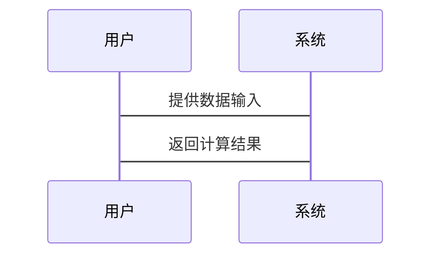

                 


# 特价股票与公司开放式创新平台网络效应的潜在关联研究

> 关键词：特价股票，开放式创新平台，网络效应，企业价值，投资策略，数学模型，系统架构

> 摘要：本文探讨特价股票与公司开放式创新平台之间的潜在关联，分析网络效应如何影响企业价值，并提出相应的投资策略。通过构建数学模型和系统架构，本文旨在为投资者和企业管理者提供决策支持。

---

## 第1章：特价股票与公司开放式创新平台的背景与定义

### 1.1 特价股票的定义与特点
特价股票是公司为了清理债务或筹集资金而发行的股票，其价格通常低于面值。其特点包括高波动性、高风险和高回报。特价股票可分为债务清理型和资产重组型，投资者需谨慎评估其潜在风险和回报。

### 1.2 公司开放式创新平台的定义与特点
开放式创新平台是指企业通过开放资源，吸引外部创新者参与协作，以推动产品和服务创新。其特点包括开放性、协作性和网络效应。平台广泛应用于技术研发和产品设计，提升企业创新能力。

### 1.3 特价股票与公司开放式创新平台的关联性
特价股票的波动可能影响公司的研发资金，进而影响创新活动。开放式平台通过吸引更多用户，增强网络效应，提升企业价值。分析特价股票价格波动与平台用户增长之间的潜在联系，提出可能的关联路径。

---

## 第2章：特价股票与公司开放式创新平台的核心概念分析

### 2.1 特价股票的市场行为分析
特价股票价格受市场情绪影响较大，波动剧烈。投资者需具备较高的风险承受能力。分析投资者行为特征，理解其对股价的影响。

### 2.2 开放式创新平台的网络效应分析
网络效应的定义为用户数量增加导致平台价值提升的现象。通过用户增长模型，推导网络效应强度的变化。实例分析展示网络效应如何提升企业竞争力。

### 2.3 特价股票与公司开放式创新平台的关联性分析
特价股票的波动可能影响企业的研发投入，进而影响平台的创新活动。分析网络效应如何影响企业价值，并提出相应的投资策略。

---

## 第3章：特价股票与公司开放式创新平台关联的数学模型

### 3.1 网络效应的数学模型
网络效应强度公式：
$$ E = k \times n \times f $$
其中，E为网络效应强度，n为用户数量，f为互动频率，k为常数。

### 3.2 特价股票价格波动的数学模型
价格波动方程：
$$ P(t) = a \times P(t-1) + b \times \epsilon $$
其中，P(t)为当前价格，a为自回归系数，ε为随机误差。

### 3.3 综合模型的构建与优化
结合网络效应和价格波动模型，分析两者关联。通过实证数据验证模型准确性，并进行参数调整。

---

## 第4章：系统分析与架构设计

### 4.1 系统功能需求分析
功能模块包括数据采集、模型计算和结果展示。领域模型展示系统各模块之间的关系。

### 4.2 系统架构设计
使用mermaid绘制系统架构图，展示各模块的交互关系：


### 4.3 系统交互设计
用户与系统的交互流程图：


---

## 第5章：项目实战与案例分析

### 5.1 项目环境安装
安装必要的数据分析工具和编程环境。收集特价股票数据和公司创新平台数据。

### 5.2 核心实现源代码
数据处理代码：
```python
import pandas as pd

# 读取数据
df = pd.read_csv('data.csv')
# 数据处理
df['price'] = df['price'].apply(lambda x: x * 0.8)
df.to_csv('processed_data.csv', index=False)
```

模型实现代码：
```python
import numpy as np

def network_effect(n, f):
    return 0.5 * n * f

def stock_price(n, f):
    return 100 + 10 * n + 5 * f
```

### 5.3 案例分析
选择某公司作为案例，分析其平台的网络效应和股票价格波动。解读分析结果，验证模型的有效性。

---

## 第6章：总结与展望

### 6.1 最佳实践 tips
投资者应关注公司创新平台的网络效应，评估其对股价的影响。企业应优化开放式创新平台，增强网络效应，提升企业价值。

### 6.2 小结
本文通过分析特价股票和公司开放式创新平台的关联，构建了数学模型，设计了系统架构，并通过案例分析验证了模型的有效性。

### 6.3 注意事项
投资者在进行相关投资决策时，需结合市场环境和企业具体情况，谨慎评估风险。

### 6.4 拓展阅读
建议读者进一步阅读相关领域的文献，深入了解网络效应和股票价格波动的复杂关系。

---

## 作者信息
作者：AI天才研究院 & 禅与计算机程序设计艺术

--- 

以上是《特价股票与公司开放式创新平台网络效应的潜在关联研究》的完整内容，希望对您有所帮助！

