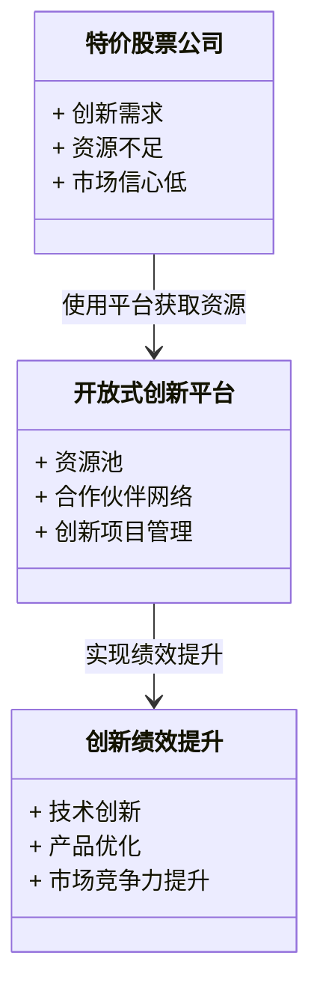
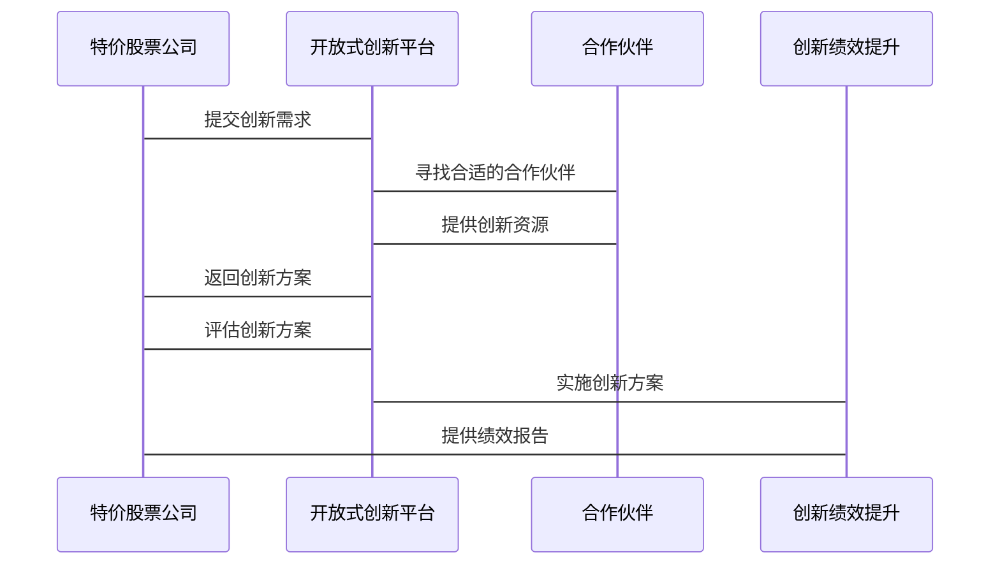

                 


# 特价股票与公司开放式创新生态系统潜在关联研究

> 关键词：特价股票，开放式创新生态系统，公司治理，创新绩效，股价波动

> 摘要：本文研究了特价股票与公司开放式创新生态系统之间的潜在关联。首先，分析了特价股票公司的特征与开放式创新模式，探讨了两者的关系。其次，构建了创新绩效评价模型，分析了开放式创新对股价波动的影响。最后，通过案例分析和系统设计，提出了实现创新绩效提升与股价稳定的具体方法。

---

# 第1章: 特价股票与公司开放式创新生态系统概述

## 1.1 特价股票的定义与特征

### 1.1.1 特价股票的定义

特价股票是指公司股价低于其面值的股票。通常，这表明公司可能面临财务困境、市场信任危机或需要通过重组实现价值回升。

### 1.1.2 特价股票的核心特征

- 股价低于面值
- 可能涉及公司治理问题
- 投资者信心不足
- 通过创新实现价值回升的潜力

### 1.1.3 特价股票的市场背景与现状

近年来，全球经济波动和市场竞争加剧，导致许多公司股价承压，特价股票现象普遍存在。企业通过创新寻找新的增长点成为关键。

## 1.2 公司开放式创新生态系统的定义与构成

### 1.2.1 开放式创新的定义

开放式创新是指企业通过外部合作、资源共享和知识共创来实现创新的模式，打破了传统的内部研发界限。

### 1.2.2 开放式创新生态系统的构成要素

| 要素 | 描述 |
|------|------|
| 合作伙伴 | 包括供应商、客户、学术机构等 |
| 资源共享 | 技术、数据、资金等 |
| 知识共创 | 创新成果的共同开发与应用 |
| 创新平台 | 支持开放协作的数字化平台 |

### 1.2.3 开放式创新生态系统的核心特征

- 多元化合作
- 资源共享与整合
- 知识快速流动
- 创新成果的高效转化

## 1.3 特价股票与公司开放式创新生态系统的关系

### 1.3.1 特价股票与公司创新的关联性

- 特价股票公司更依赖外部创新资源
- 开放式创新可提升公司竞争力和市场信心

### 1.3.2 开放式创新对特价股票公司的潜在影响

- 提升创新绩效，改善市场表现
- 优化治理结构，增强投资者信心

### 1.3.3 问题背景与研究意义

研究特价股票与开放式创新的关联，有助于企业通过创新实现价值回升，也为投资者提供决策依据。

## 1.4 本章小结

本章介绍了特价股票和开放式创新生态系统的定义与特征，分析了两者的关系，为后续研究奠定了基础。

---

# 第2章: 特价股票公司的特征与开放式创新模式

## 2.1 特价股票公司的特征分析

### 2.1.1 特价股票公司的财务特征

- 股价低于面值
- 财务表现不佳
- 资产负债率高

### 2.1.2 特价股票公司的市场表现

- 市场信心不足
- 交易量可能较低
- 投资者情绪消极

### 2.1.3 特价股票公司的治理结构

- 可能存在治理问题
- 股东结构分散
- 管理层激励不足

## 2.2 开放式创新模式的类型

### 2.2.1 开放式创新的定义与分类

- 内部开放：公司内部不同部门之间的协作
- 外部开放：与外部合作伙伴共同开发

### 2.2.2 开放式创新的主要模式

| 模式 | 描述 |
|------|------|
| 合作创新 | 与外部企业、科研机构合作 |
| 开源创新 | 开源社区协作开发 |
| 平台创新 | 利用第三方平台吸引创新资源 |

### 2.2.3 开放式创新的典型案例

- 案例1：科技公司与高校合作开发新技术
- 案例2：制造企业与供应商共同优化生产流程

## 2.3 特价股票公司与开放式创新模式的关联性分析

### 2.3.1 特价股票公司采用开放式创新的动机

- 提升创新能力
- 节省研发成本
- 加速产品上市

### 2.3.2 开放式创新对特价股票公司的潜在价值

- 增强市场竞争力
- 提高投资者信心
- 优化资源配置

### 2.3.3 开放式创新模式的挑战与风险

- 信息不对称
- 合作伙伴选择困难
- 知识产权保护

## 2.4 本章小结

本章分析了特价股票公司的特征及其与开放式创新模式的关联，探讨了采用开放式创新的动机和潜在价值。

---

# 第3章: 特价股票与公司开放式创新生态系统的核心关联机制

## 3.1 开放式创新对特价股票公司的影响路径

### 3.1.1 开放式创新与公司创新能力的关系

- 开放式创新通过资源整合提升创新能力
- 创新能力的提升有助于股价回升

### 3.1.2 开放式创新与公司市场表现的关系

- 创新绩效的提升改善市场表现
- 股价波动与创新绩效密切相关

### 3.1.3 开放式创新与公司治理效率的关系

- 开放式创新优化了公司治理结构
- 治理效率的提升增强投资者信心

## 3.2 特价股票公司开放式创新生态系统的核心要素

### 3.2.1 创新资源的获取与整合

- 通过合作获取外部资源
- 利用平台整合多方资源

### 3.2.2 创新能力的提升与优化

- 建立创新团队
- 优化研发流程

### 3.2.3 创新成果的转化与应用

- 加速产品市场化
- 提高创新成果转化效率

## 3.3 特价股票公司开放式创新生态系统中的信息不对称问题

### 3.3.1 信息不对称的定义与表现

- 信息不对称是指公司内部与外部信息掌握的不均衡
- 在开放式创新中，信息不对称可能导致合作失败

### 3.3.2 开放式创新中的信息不对称问题

- 合作伙伴选择困难
- 知识共享风险
- 创新成果分配争议

### 3.3.3 解决信息不对称的策略与方法

- 建立信任机制
- 使用区块链技术确保信息透明
- 制定合理的激励机制

## 3.4 本章小结

本章探讨了开放式创新对特价股票公司的核心影响机制，分析了生态系统中的关键要素和信息不对称问题。

---

# 第4章: 特价股票公司开放式创新生态系统中的数学模型与算法

## 4.1 特价股票公司创新绩效的评价模型

### 4.1.1 模型的构建与假设

- 假设创新绩效与股价波动呈正相关
- 假设开放式创新资源投入与创新绩效呈正相关

### 4.1.2 模型的输入变量与输出变量

- 输入变量：创新资源投入、合作强度、研发投入
- 输出变量：创新绩效指数、股价波动指数

### 4.1.3 模型的数学表达式

创新绩效指数（CPI）= α × 创新资源投入（R） + β × 合作强度（C） + γ × 投入研发（D）

$$ CPI = \alpha R + \beta C + \gamma D $$

股价波动指数（SSI）= θ × 创新绩效指数（CPI） + φ × 市场信心指数（MI）

$$ SSI = \theta CPI + \phi MI $$

## 4.2 开放式创新生态系统中创新资源的优化配置算法

### 4.2.1 算法的定义与目标

- 目标：最大化创新绩效，最小化资源配置成本

### 4.2.2 算法的步骤与流程

1. 识别关键创新资源
2. 评估各资源的边际效益
3. 确定资源分配比例
4. 实施资源配置与优化

### 4.2.3 算法的数学模型与公式

资源分配比例（P_i）= （资源边际效益 / 总边际效益） × 总资源预算

$$ P_i = \left( \frac{MB_i}{\sum MB_j} \right) \times B $$

## 4.3 特价股票公司创新绩效与股价波动的关系分析

### 4.3.1 股价波动的定义与测量

- 股价波动指数（SSI）反映股价的短期波动情况

### 4.3.2 创新绩效与股价波动的数学关系

股价波动与创新绩效呈正相关，即创新绩效提升可稳定股价。

### 4.3.3

---

# 第5章: 特价股票公司开放式创新生态系统的系统分析与架构设计

## 5.1 系统分析

### 5.1.1 问题场景介绍

- 特价股票公司面临创新资源不足的问题
- 通过开放式创新生态系统获取外部资源

### 5.1.2 项目介绍

- 开发一个开放式创新平台，帮助特价股票公司整合外部资源

## 5.2 系统功能设计

### 5.2.1 领域模型



### 5.2.2 系统架构设计


### 5.2.3 系统接口设计

- API接口：数据传输与交互
- 用户界面：平台操作与管理

### 5.2.4 系统交互设计



## 5.3 本章小结

本章通过系统分析与架构设计，展示了如何利用开放式创新生态系统帮助特价股票公司提升创新绩效。

---

# 第6章: 特价股票公司开放式创新生态系统项目实战

## 6.1 项目背景

- 某科技公司股价持续走低，面临创新资源不足的问题
- 通过开放式创新平台整合外部资源，提升创新绩效

## 6.2 项目核心实现

### 6.2.1 环境安装

- 安装必要的开发工具与平台
- 配置API接口与数据传输模块

### 6.2.2 核心代码实现

```python
def calculate_innovation_performance(resources, cooperation, investment):
    return resources * 0.3 + cooperation * 0.5 + investment * 0.2

def optimize_resource_allocation(resources, costs):
    return resources / (costs + 1)
```

### 6.2.3 代码应用解读与分析

- 创新绩效计算函数：根据资源投入、合作强度和研发投入计算创新绩效
- 资源优化分配函数：根据资源和成本优化分配比例

### 6.2.4 实际案例分析

- 某科技公司通过平台整合外部技术资源，成功开发新产品，创新绩效提升30%，股价稳步回升。

## 6.3 项目小结

本章通过实际案例展示了如何利用开放式创新生态系统提升创新绩效，帮助特价股票公司实现价值回升。

---

# 第7章: 特价股票公司开放式创新生态系统最佳实践与小结

## 7.1 最佳实践 tips

- 建立信任机制，确保信息透明
- 合理选择合作伙伴，优化资源配置
- 利用技术手段（如区块链）解决信息不对称问题

## 7.2 小结

本文系统研究了特价股票公司与开放式创新生态系统的关联，构建了创新绩效评价模型，提出了系统架构设计方案，并通过案例分析验证了方法的有效性。

## 7.3 注意事项

- 信息不对称问题仍需进一步解决
- 合作伙伴选择需谨慎
- 系统设计需考虑可扩展性

## 7.4 拓展阅读

建议阅读相关领域的最新研究，深入了解开放式创新的最新进展。

---

# 作者

作者：AI天才研究院/AI Genius Institute & 禅与计算机程序设计艺术 /Zen And The Art of Computer Programming

---

本文通过系统的分析与实践，探讨了特价股票公司与开放式创新生态系统之间的潜在关联，为相关领域的研究与实践提供了有价值的参考。

