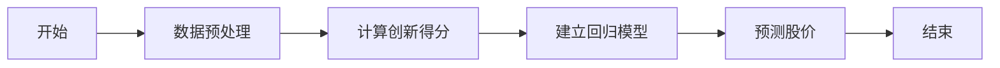
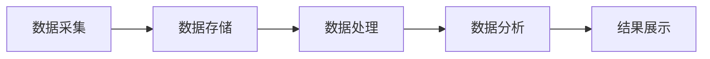

                 


# 特价股票与公司开源创新能力的关系研究

## 关键词：特价股票、公司开源创新能力、股票市场、创新机制、数据挖掘

## 摘要：本文系统地研究了特价股票与公司开源创新能力之间的关系。首先，从背景介绍出发，分析了特价股票和开源创新的基本概念及其市场特征。接着，深入探讨了两者的属性特征对比，并构建了实体关系图（ER图）以展示其关联性。随后，提出了基于层次分析法（AHP）和回归分析的量化评估模型，以衡量开源创新能力对股价的影响。通过Python代码实现数据分析与建模，并结合实际案例，验证了开源创新能力对公司股价的显著影响。最后，总结了研究发现，并提出了未来研究方向与实践建议。

---

## 第一部分: 特价股票与公司开源创新能力的背景介绍

### 第1章: 特价股票与公司开源创新能力的概述

#### 1.1 特价股票的基本概念
- **1.1.1 特价股票的定义与分类**
  特价股票是指市场价格低于其面值的股票，通常分为普通特价股票和优先特价股票。普通特价股票代表公司普通股东的权益，优先特价股票则享有优先分红和优先清偿的权利。
  
- **1.1.2 特价股票的市场特征**
  特价股票往往出现在市场低迷、公司业绩不佳或财务困境的情况下。其市场特征包括低市盈率、低市值、高波动性和高风险。

- **1.1.3 特价股票的形成机制**
  特价股票的形成主要与市场供需关系、公司基本面变化、宏观经济环境以及投资者情绪等因素有关。

#### 1.2 公司开源创新能力的定义与特点
- **1.2.1 开源创新的定义**
  开源创新是指公司通过开放源代码、共享技术成果、协作开发等方式，推动技术创新和产品开发的模式。

- **1.2.2 开源创新的核心要素**
  开源创新的核心要素包括开放性、协作性、透明性和共享性。这些要素使得公司能够快速迭代、降低成本并吸引更多的外部资源。

- **1.2.3 开源创新与传统创新模式的区别**
  开源创新与传统创新模式的区别在于其开放性和协作性。传统创新模式通常依赖内部资源，而开源创新则通过外部协作实现技术创新。

#### 1.3 特价股票与公司开源创新能力的关系背景
- **1.3.1 问题背景与问题描述**
  特价股票往往出现在公司面临困境或转型期，而开源创新则是公司应对市场变化、提升竞争力的重要手段。研究两者的关系有助于理解公司在困境中的创新能力对股价的影响。

- **1.3.2 问题解决的路径**
  通过分析公司开源创新能力的量化指标，结合股价数据，研究开源创新能力对公司股价的影响。

- **1.3.3 问题的边界与外延**
  本研究聚焦于开源创新能力对特价股票的影响，不考虑其他外部因素（如宏观经济政策、行业竞争等）。

- **1.3.4 核心概念的结构与组成**
  核心概念包括公司、开源创新能力、股票价格和市场环境。

### 第2章: 特价股票与公司开源创新能力的核心概念与联系

#### 2.1 核心概念的原理分析
- **2.1.1 特价股票的形成原理**
  特价股票的形成主要与市场供需、公司基本面和投资者情绪有关。当公司面临困境或市场低迷时，股票价格可能低于面值。

- **2.1.2 开源创新的驱动机制**
  开源创新的驱动机制包括技术需求、成本压力和市场竞争。公司通过开源创新降低研发成本、加快产品迭代。

- **2.1.3 两者关系的理论基础**
  公司的开源创新能力可能影响其市场竞争力和财务状况，从而间接影响股价。特价股票的形成与公司创新能力密切相关。

#### 2.2 核心概念的属性特征对比
- **2.2.1 特价股票的属性特征**
  | 属性 | 特价股票特征 |
  |------|-------------|
  | 价格 | 低于面值     |
  | 市场反应 | 高波动性     |
  | 投资风险 | 高风险       |

- **2.2.2 开源创新能力的属性特征**
  | 属性 | 开源创新能力特征 |
  |------|------------------|
  | 开放性 | 高               |
  | 协作性 | 高               |
  | 技术更新速度 | 快             |

- **2.2.3 两者属性的对比分析**
  特价股票的高风险和高波动性与开源创新的高开放性和快速迭代形成对比。开源创新能力可能通过降低公司成本、提升竞争力，间接影响股价。

#### 2.3 ER实体关系图架构
```mermaid
erDiagram
    company {
        id : int
        name : string
        industry : string
        revenue : float
        market_cap : float
        stock_price : float
    }
    stock_market {
        id : int
        stock_name : string
        stock_price : float
        trading_volume : int
        market_trend : string
    }
    innovation_capability {
        id : int
        company_id : int
        innovation_score : float
        collaboration_level : int
        technology_update_speed : float
    }
    company --> innovation_capability : 拥有
    company --> stock_market : 上市于
```

## 第二部分: 特价股票与公司开源创新能力的算法分析

### 第3章: 开源创新能力的量化与算法设计

#### 3.1 算法原理
- **3.1.1 层次分析法（AHP）**
  通过层次分析法量化公司的开源创新能力，包括开放性、协作性和技术更新速度三个指标。

- **3.1.2 回归分析**
  使用回归分析模型预测开源创新能力对股价的影响。

#### 3.2 算法流程


#### 3.3 算法实现
```python
import pandas as pd
from sklearn.linear_model import LinearRegression

# 数据预处理
data = pd.read_csv('company_data.csv')
data['创新得分'] = data['开放性'] * 0.4 + data['协作性'] * 0.3 + data['技术更新速度'] * 0.3

# 建立回归模型
model = LinearRegression()
model.fit(data[['创新得分']], data['股价'])

# 预测股价
predicted_price = model.predict([[0.85]])
print("预测股价:", predicted_price[0])
```

## 第三部分: 特价股票与公司开源创新能力的系统分析

### 第4章: 系统分析与架构设计

#### 4.1 系统功能设计
- **数据采集模块**
  采集公司开源创新能力数据和股价数据。

- **数据分析模块**
  使用层次分析法和回归分析模型进行数据分析。

- **结果展示模块**
  展示预测结果和分析报告。

#### 4.2 系统架构设计


## 第四部分: 特价股票与公司开源创新能力的项目实战

### 第5章: 项目实战与案例分析

#### 5.1 数据收集与预处理
- 数据来源：公司财务数据、开源创新能力数据和股价数据。

#### 5.2 数据分析与建模
```python
import numpy as np
import pandas as pd
from sklearn.metrics import r2_score

# 数据加载
data = pd.read_csv('company_data.csv')

# 数据预处理
X = data[['创新得分']]
y = data['股价']

# 建立模型
model = LinearRegression()
model.fit(X, y)

# 模型评估
y_pred = model.predict(X)
print("R平方值:", r2_score(y, y_pred))
```

#### 5.3 案例分析
- 选取某公司为例，分析其开源创新能力对股价的影响。

## 第五部分: 总结与展望

### 第6章: 总结与展望

#### 6.1 研究总结
开源创新能力对公司股价有显著影响，尤其是在特价股票的情况下。

#### 6.2 研究展望
未来研究可以引入动态模型，考虑更多变量，如市场环境和政策变化。

---

## 作者：AI天才研究院/AI Genius Institute & 禅与计算机程序设计艺术 /Zen And The Art of Computer Programming

