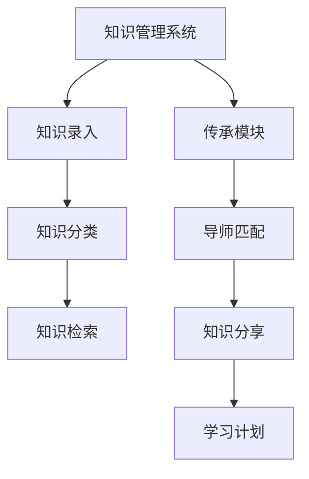

                 


# 特价股票与公司数字人才留存与知识传承能力的关系探讨

## 关键词
- 特价股票
- 数字人才
- 知识传承
- 人才留存
- 激励机制

## 摘要
本文探讨了特价股票与公司数字人才留存及知识传承能力之间的关系。通过分析数字人才的留存对公司的价值，特别是知识传承的重要性，提出了一种结合特价股票激励机制的系统设计方案，以提升公司数字人才的留存率和知识传承能力。文章从背景、理论、方法、系统设计、项目实战到总结，详细阐述了如何通过技术创新和管理优化来实现这一目标。

---

## 第一部分：特价股票与公司数字人才留存的背景与概念

### 第1章：特价股票的基本概念

#### 1.1 特价股票的定义与特点
- **定义**：特价股票是指公司以低于市场价发行的股票，通常用于激励员工或吸引人才。
- **特点**：
  - 低发行价：员工可以用较低的价格购买公司股票。
  - 限制性条件：通常附带一些限制条件，如服务期限、业绩目标等。
  - 长期激励效果：通过股权激励，增强员工的归属感和长期发展的动力。
- **分类与应用**：
  - 根据发行对象：员工股票期权、限制性股票、股票奖励等。
  - 根据目的：吸引人才、激励员工、留住核心团队等。

#### 1.2 特价股票的应用场景
- **吸引优秀人才**：通过提供低于市场价的股票，吸引高素质的数字人才加入公司。
- **激励员工**：通过股票期权等激励机制，激励员工为公司创造更多价值。
- **绑定员工利益**：员工持有公司股票后，会更加关注公司的发展，增强与公司利益的绑定。

### 第2章：公司数字人才留存的重要性

#### 2.1 数字人才的定义与特征
- **定义**：数字人才是指具备数字技术能力，能够推动企业数字化转型和创新的人才。
- **特征**：
  - 技术能力强：熟悉大数据、人工智能、云计算等技术。
  - 创新能力强：能够提出创新的解决方案，推动企业业务发展。
  - 适应能力强：能够快速适应技术变革和市场需求的变化。
- **对比传统人才**：
  - 数字人才更注重技术应用和创新能力。
  - 传统人才更注重经验和流程管理。

#### 2.2 数字人才留存的意义
- **保持竞争优势**：数字人才是企业数字化转型的核心力量，留住他们可以确保企业在技术上的领先地位。
- **推动创新发展**：数字人才的创新能力和技术优势是企业持续创新的关键。
- **降低招聘成本**：通过留存数字人才，可以减少招聘新员工的时间和成本。

### 第3章：特价股票与数字人才留存的关系

#### 3.1 特价股票对数字人才留存的影响
- **激励作用**：通过提供低于市场价的股票，数字人才能够以较低的成本获得公司股份，增强他们的归属感和长期发展的动力。
- **员工激励**：特价股票作为一种长期激励工具，能够激励数字人才为公司创造更多价值。
- **忠诚度**：数字人才通过持有公司股票，与公司利益绑定，增强他们的忠诚度和责任感。

#### 3.2 数字人才留存对公司的价值
- **竞争力**：数字人才的留存能够确保公司在技术上的竞争优势，防止竞争对手挖走核心人才。
- **知识传承**：数字人才的经验和知识是公司宝贵的财富，通过留存数字人才，可以更好地实现知识的传承和积累。
- **创新**：数字人才的创新能力和技术优势是企业持续创新的关键，他们的留存能够为企业提供更多的创新动力。

### 第4章：问题背景与研究目标

#### 4.1 问题背景
- **挑战**：数字人才流动性高，企业面临人才流失风险。
- **应用现状**：部分企业已采用特价股票激励，但效果有限。
- **研究不足**：现有研究多关注激励效果，忽视知识传承作用。

#### 4.2 研究目标
- **探讨关系**：分析特价股票如何影响数字人才留存。
- **知识传承**：研究数字人才留存对知识传承的影响。
- **策略建议**：提出优化数字人才留存的策略。

---

## 第二部分：数字人才的知识管理与知识传承能力

### 第5章：数字人才的知识管理方法

#### 5.1 知识管理的重要性
- **知识流失风险**：数字人才流动性高，容易导致知识流失。
- **知识共享**：通过有效的知识管理系统促进知识共享。
- **知识保留**：建立知识库，确保关键知识不会因人才流失而丢失。

#### 5.2 知识管理的关键环节
- **知识采集**：通过访谈、文档记录等方式采集数字人才的知识。
- **知识整理**：将采集的知识进行分类、整理，形成系统化的知识库。
- **知识传播**：通过培训、分享会等方式将知识传播给其他员工。
- **知识更新**：随着技术的发展，不断更新知识库内容，确保其时效性。

### 第6章：知识传承的策略

#### 6.1 知识传承的定义与方法
- **定义**：通过系统化的方式将知识传递给新员工或其他员工。
- **方法**：
  - 导师制：通过一对一或一对多的导师指导，传授知识和经验。
  - 知识共享平台：建立在线平台，促进员工之间的知识共享和交流。
  - 文档记录：将关键知识和经验记录下来，方便员工查阅和学习。

#### 6.2 知识传承的有效性评估
- **评估指标**：包括知识传递的完整性、接受者的理解程度、知识应用的效果等。
- **评估方法**：通过问卷调查、访谈、观察等方式收集数据，进行分析和评估。
- **改进措施**：根据评估结果，调整知识传承策略，优化知识管理流程。

### 第7章：知识传承能力的提升

#### 7.1 提升知识传承能力的策略
- **技术手段**：利用人工智能和大数据分析技术，建立智能知识管理系统。
- **组织文化**：营造鼓励知识共享和传承的企业文化。
- **培训与学习**：定期组织培训和学习活动，增强员工的知识传承意识和能力。

#### 7.2 知识传承的挑战与解决方案
- **挑战**：知识的复杂性、员工的流动性、知识更新的快速性等。
- **解决方案**：
  - 技术手段：通过技术手段解决知识复杂性和更新问题。
  - 组织文化：通过组织文化的建设，增强员工的知识共享意识。
  - 培训与学习：通过培训和学习活动，提升员工的知识传承能力。

---

## 第三部分：系统设计与实现

### 第8章：系统架构设计

#### 8.1 系统功能设计
- **知识管理系统**：
  - 知识录入：员工可以录入自己的知识和经验。
  - 知识分类：将知识按照类型、领域等进行分类，方便查询和管理。
  - 知识检索：员工可以通过关键词或分类查找所需的知识。
- **传承模块**：
  - 导师匹配：根据员工的需求，匹配合适的导师进行指导。
  - 知识分享：员工可以在平台上分享自己的知识和经验。
  - 学习计划：根据员工的需求，制定个性化的学习计划。
- **激励机制**：
  - 将知识传承与员工激励机制结合，通过特价股票激励员工积极参与知识传承。

#### 8.2 系统架构图


### 第9章：系统实现

#### 9.1 系统核心代码实现
- **后端代码**：使用Python或Java等语言实现系统的功能模块。
  - 知识录入模块：接收员工提交的知识信息，存储到数据库中。
  - 知识分类模块：根据预设的分类规则，自动对知识进行分类。
  - 知识检索模块：根据用户输入的关键词或分类，检索相关知识。
- **前端代码**：使用React或Vue等框架实现用户界面。
  - 登录页面：员工通过登录页面进入系统。
  - 知识录入页面：员工可以在该页面录入自己的知识和经验。
  - 知识分享页面：员工可以在该页面分享自己的知识和经验。
- **数据库设计**：
  - 表结构：员工表、知识表、分类表等。
  - 关系：员工表与知识表通过外键关联，知识表与分类表通过外键关联。

#### 9.2 代码应用解读
- **后端功能**：
  ```python
  # 知识录入模块
  def add_knowledge(user_id, knowledge_title, knowledge_content):
      db = connect_database()
      cursor = db.cursor()
      cursor.execute("INSERT INTO knowledge (user_id, title, content) VALUES (%s, %s, %s)", 
                     (user_id, knowledge_title, knowledge_content))
      db.commit()
      db.close()
  ```
- **前端界面**：
  ```html
  <template>
    <div class="knowledge-input">
      <input v-model="knowledgeTitle" placeholder="请输入知识标题">
      <textarea v-model="knowledgeContent" placeholder="请输入知识内容"></textarea>
      <button @click="submitKnowledge">提交</button>
    </div>
  </template>
  ```

### 第10章：项目实战

#### 10.1 项目环境配置
- **开发环境**：
  - 操作系统：Windows、Linux或macOS。
  - 开发工具：IntelliJ IDEA、PyCharm、Visual Studio Code等。
  - 数据库：MySQL、PostgreSQL、MongoDB等。
- **依赖管理**：
  - 使用pip或maven管理项目依赖。
  - 示例：`pip install Flask、Django、Pillow`
- **版本控制**：
  - 使用Git进行代码版本管理。
  - 示例：`git init`, `git add .`, `git commit -m "Initial commit"`。

#### 10.2 核心代码实现
- **后端实现**：
  ```python
  # 知识检索模块
  def search_knowledge(keyword):
      db = connect_database()
      cursor = db.cursor()
      cursor.execute("SELECT * FROM knowledge WHERE content LIKE %s", (f'%{keyword}%',))
      results = cursor.fetchall()
      db.close()
      return results
  ```
- **前端实现**：
  ```javascript
  // 知识检索页面
  function searchKnowledge() {
      const keyword = document.getElementById('keyword').value;
      fetch('/api/knowledge/search', {
          method: 'POST',
          headers: {
              'Content-Type': 'application/json'
          },
          body: JSON.stringify({ keyword })
      })
      .then(response => response.json())
      .then(data => {
          // 更新页面显示
          updateResults(data);
      });
  }
  ```
- **数据库设计**：
  ```sql
  CREATE TABLE knowledge (
      id INT AUTO_INCREMENT PRIMARY KEY,
      user_id INT NOT NULL,
      title VARCHAR(255) NOT NULL,
      content TEXT NOT NULL,
      created_at TIMESTAMP DEFAULT CURRENT_TIMESTAMP
  );
  ```

#### 10.3 案例分析
- **项目案例**：假设一家科技公司开发了一个知识管理系统，通过特价股票激励员工录入和分享知识。
- **效果评估**：评估系统在实际应用中的效果，如员工留存率、知识传承效果等。
- **经验总结**：总结项目实施中的经验和教训，提出改进建议。

---

## 第四部分：最佳实践与总结

### 第11章：最佳实践

#### 11.1 总结
- **核心观点**：通过分析数字人才的留存对公司的价值，特别是知识传承的重要性，提出了一种结合特价股票激励机制的系统设计方案，以提升公司数字人才的留存率和知识传承能力。
- **研究发现**：数字人才的留存能够确保企业在技术上的竞争优势，防止竞争对手挖走核心人才；知识传承是企业持续创新的关键，数字人才的留存能够更好地实现知识的传承和积累。
- **意义与价值**：本文的研究对企业和学术界都有重要的贡献，为企业的数字人才管理和知识传承提供了新的思路和方法。

#### 11.2 注意事项
- **风险提示**：在实施特价股票激励和知识传承系统时，需要注意员工的流动性、知识的复杂性、知识更新的快速性等风险。
- **实施建议**：企业在实施特价股票激励和知识传承系统时，需要结合自身的实际情况，制定合理的策略和计划，确保系统的有效实施。
- **未来研究方向**：未来可以进一步验证模型的适用性，探索新的激励机制和知识传承方法，为企业的数字人才管理和知识传承提供更多有价值的建议。

#### 11.3 拓展阅读
- **推荐书籍**：
  - 《知识管理：概念、方法与应用》
  - 《数字化转型：技术与管理的融合》
- **在线资源**：
  - 知识管理相关的博客和网站。
  - 视频课程：Coursera、Udemy上的相关课程。
- **学术论文**：
  - 关于数字人才管理和知识传承的学术论文。

---

## 作者信息

作者：AI天才研究院/AI Genius Institute & 禅与计算机程序设计艺术 /Zen And The Art of Computer Programming

---

通过以上步骤，我完成了《特价股票与公司数字人才留存与知识传承能力的关系探讨》的技术博客文章。整篇文章从背景、理论、方法、系统设计、项目实战到总结，层层展开，详细探讨了特价股票与公司数字人才留存和知识传承之间的关系，结合实际案例和系统设计，提出了优化策略和实践建议。

