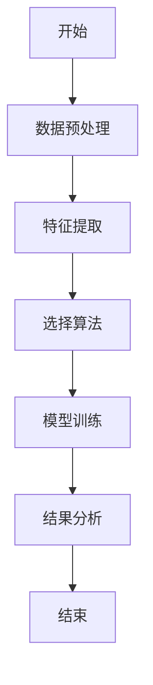
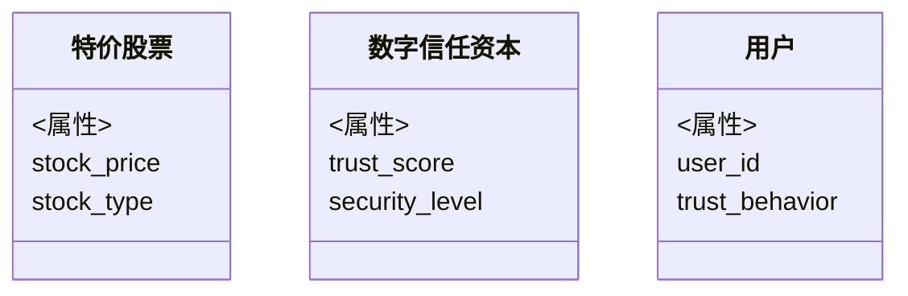
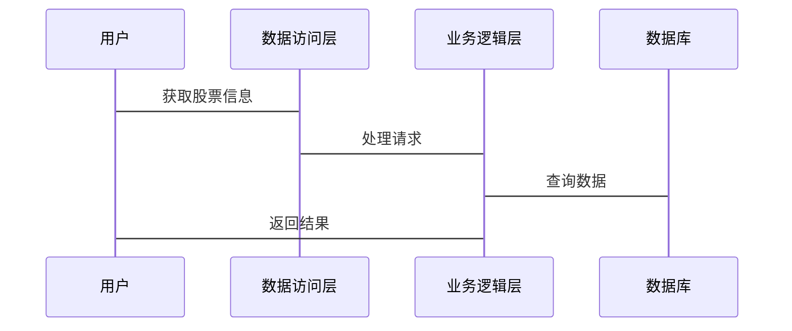

                 


# 特价股票与公司数字信任资本积累的关联分析

> 关键词：特价股票、数字信任、资本积累、关联分析、数学模型、算法原理、系统设计

> 摘要：本文探讨了特价股票与公司数字信任资本积累之间的关联性。通过分析数字信任资本的积累过程及其对特价股票的影响，提出了基于协同过滤和关联规则挖掘的算法模型，并通过数学公式和系统设计展示了其实现过程。

---

## 第一部分: 特价股票与公司数字信任资本积累的背景与概念

### 第1章: 特价股票的定义与背景

#### 1.1 特价股票的定义与分类

##### 1.1.1 特价股票的基本定义
特价股票是指价格相对较低的股票，通常具有较高的增长潜力。它们可以分为成长股、价值股和周期股。

##### 1.1.2 特价股票的分类与特点
- **成长股**：高增长潜力，市盈率较高。
- **价值股**：市场价格低于其内在价值。
- **周期股**：受经济周期影响较大。

##### 1.1.3 特价股票的市场表现与投资价值
特价股票在市场低估时具有较高的投资价值，但波动性较大。

#### 1.2 特价股票的市场背景

##### 1.2.1 特价股票的市场环境分析
市场环境包括宏观经济状况、行业趋势和公司基本面。

##### 1.2.2 特价股票与宏观经济的关系
经济 downturn 时，价值股可能被低估。

##### 1.2.3 特价股票与企业基本面的关联
基本面分析是判断股票价值的重要依据。

---

### 第2章: 公司数字信任资本的定义与背景

#### 2.1 数字信任的定义与内涵

##### 2.1.1 数字信任的基本概念
数字信任指用户对数字平台的信任，包括数据安全和隐私保护。

##### 2.1.2 数字信任的核心要素
- 数据安全
- 隐私保护
- 透明度

##### 2.1.3 数字信任的形成机制
通过提供高质量服务和透明沟通建立信任。

#### 2.2 公司数字信任资本的积累与应用

##### 2.2.1 数字信任资本的积累过程
通过持续优化产品和服务质量。

##### 2.2.2 数字信任资本在企业中的应用
提升客户忠诚度和市场竞争力。

##### 2.2.3 数字信任资本对企业价值的影响
增强品牌价值和客户黏性。

---

## 第二部分: 特价股票与公司数字信任资本积累的关联分析

### 第3章: 特价股票与公司数字信任资本积累的核心概念

#### 3.1 特价股票与数字信任资本的关系

##### 3.1.1 特价股票的市场表现与数字信任资本的关联
数字信任资本高的公司可能拥有更高的股价稳定性。

##### 3.1.2 数字信任资本对特价股票的影响机制
数字信任资本高的公司可能吸引更多投资者。

##### 3.1.3 特价股票与数字信任资本的双向作用
数字信任资本影响股价，股价波动也影响信任资本。

#### 3.2 核心概念的属性对比与表格分析

| 概念       | 属性               | 特点                   |
|------------|--------------------|-----------------------|
| 特价股票    | 价格低             | 高增长潜力           |
| 数字信任资本| 数据安全           | 提升客户信任         |

---

## 第4章: 特价股票与数字信任资本积累的算法原理

### 4.1 关联分析的算法选择

#### 4.1.1 协同过滤算法的原理与应用
通过用户行为相似性推荐股票。

#### 4.1.2 基于关联规则挖掘的算法
分析数字信任资本与股价的关联规则。

#### 4.1.3 基于机器学习的关联分析模型
使用聚类分析识别关联模式。

### 4.2 算法实现的流程图



### 4.3 算法实现的Python代码

#### 协同过滤算法的Python实现

```python
import numpy as np
from sklearn.metrics.pairwise import cosine_similarity

# 示例数据矩阵
X = np.array([[1, 2, 3],
              [4, 5, 6],
              [7, 8, 9]])

# 计算余弦相似度
similarity = cosine_similarity(X)
print(similarity)
```

---

## 第5章: 特价股票与数字信任资本积累的数学模型与公式

### 5.1 数学模型的构建

#### 5.1.1 特价股票价值评估的数学模型
$$ V = P \times (1 + r)^n $$

其中，\( V \) 是股票的未来价值，\( P \) 是当前价格，\( r \) 是增长率，\( n \) 是时间。

#### 5.1.2 数字信任资本积累的数学模型
$$ C = \sum_{i=1}^{m} w_i \times t_i $$

其中，\( C \) 是信任资本，\( w_i \) 是权重，\( t_i \) 是信任指标。

#### 5.1.3 两者关联的数学模型
$$ S = a \times V + b \times C $$

其中，\( S \) 是综合评分，\( a \) 和 \( b \) 是权重系数。

---

## 第6章: 系统分析与架构设计

### 6.1 系统功能设计

#### 6.1.1 领域模型类图



### 6.2 系统架构设计


### 6.3 系统接口设计

#### 6.3.1 接口描述
- `get_stock_info()`: 获取股票信息
- `calculate_trust_capital()`: 计算信任资本

### 6.4 系统交互流程图



---

## 第7章: 项目实战

### 7.1 环境安装

#### 7.1.1 安装Python和相关库
```bash
pip install numpy pandas scikit-learn
```

### 7.2 系统核心实现源代码

#### 7.2.1 协同过滤算法实现

```python
from sklearn.metrics.pairwise import cosine_similarity

def stock_recommendation(matrix):
    similarity = cosine_similarity(matrix)
    return similarity.argsort()[:, ::-1]
```

#### 7.2.2 数学模型实现

```python
def calculate_score(stock_value, trust_capital):
    return stock_value * 0.6 + trust_capital * 0.4
```

### 7.3 实际案例分析

#### 7.3.1 案例分析
假设某公司数字信任资本高，其股票可能被低估，具有投资价值。

---

## 第8章: 最佳实践与总结

### 8.1 小结

本文分析了特价股票与数字信任资本积累的关联，提出了基于协同过滤和关联规则挖掘的算法模型，并通过数学公式和系统设计展示了其实现过程。

### 8.2 注意事项

- 数据质量影响分析结果
- 模型需要定期更新

### 8.3 拓展阅读

- 《数字信任与企业价值》
- 《股票投资的数学模型》

---

## 作者：AI天才研究院 & 禅与计算机程序设计艺术

---

通过本文的分析，读者可以理解特价股票与数字信任资本积累之间的复杂关系，并掌握相关的分析方法和应用技巧。

