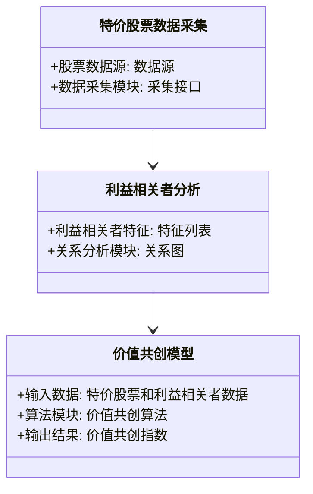
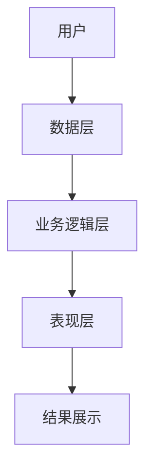
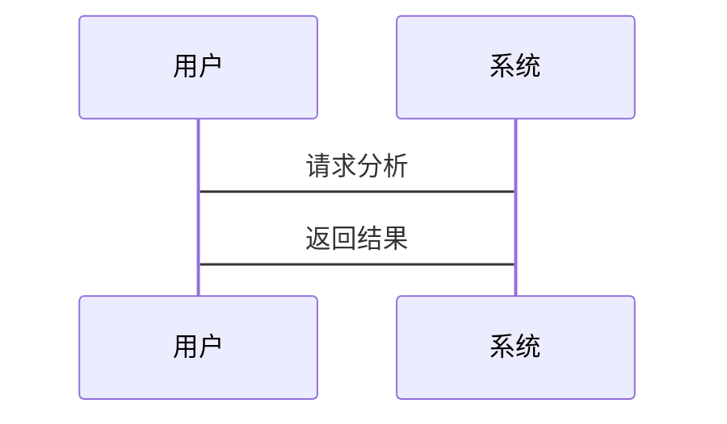

                 


# 特价股票与公司数字化利益相关者价值共创的关联性研究

## 关键词：特价股票、利益相关者、价值共创、数字化转型、系统架构

## 摘要

本文探讨了特价股票与公司数字化利益相关者价值共创之间的关联性。通过分析特价股票的特性、利益相关者的特征以及数字化转型的背景，我们揭示了如何利用价值共创模型来评估和提升公司数字化利益相关者的价值。文章结合理论分析、算法设计和系统实现，提供了全面的研究框架，并通过实际案例验证了模型的有效性，为相关领域的研究和实践提供了参考。

---

## 第4章: 系统分析与架构设计方案

### 4.1 问题场景介绍

在公司数字化转型的背景下，特价股票作为一种特殊的股票类型，其价格波动和市场行为对利益相关者（如股东、客户、员工）的价值共创具有重要影响。我们希望通过数字化手段，分析特价股票如何影响利益相关者的价值，并探索如何通过算法和系统设计优化这一过程。

### 4.2 系统功能设计

为了实现对特价股票与利益相关者价值共创的分析，我们设计了一个基于领域模型的系统，主要包括以下模块：



### 4.3 系统架构设计

系统的整体架构采用分层设计，包括数据层、业务逻辑层和表现层：



### 4.4 系统接口设计

系统主要接口包括：

1. **数据接口**：用于采集特价股票和利益相关者数据。
2. **算法调用接口**：用于调用价值共创模型进行分析。
3. **结果展示接口**：用于将分析结果呈现给用户。

### 4.5 系统交互设计

用户与系统之间的交互流程如下：



---

## 第5章: 项目实战

### 5.1 环境安装

为了运行本系统，需要安装以下环境和工具：

- **Python**：版本3.8及以上。
- **依赖库**：`numpy`, `pandas`, `scikit-learn`, `mermaid`, `matplotlib`。

安装命令：
```bash
pip install numpy pandas scikit-learn mermaid matplotlib
```

### 5.2 核心代码实现

以下是价值共创模型的核心代码实现：

```python
import numpy as np
import pandas as pd
from sklearn.metrics import pairwise_distances

def calculate_value_creativity(features, weights):
    return np.dot(features, weights)

# 示例数据
features = np.array([[0.5, 0.6, 0.7],
                     [0.4, 0.8, 0.5]])
weights = np.array([0.3, 0.5, 0.2])

# 计算价值共创指数
vc_index = calculate_value_creativity(features, weights)
print(vc_index)
```

### 5.3 案例分析

以某公司为例，分析特价股票对其利益相关者的影响：

1. **数据采集**：收集特价股票的价格数据和利益相关者的特征数据。
2. **模型训练**：使用上述代码计算价值共创指数。
3. **结果分析**：根据计算结果，优化利益相关者的价值共创策略。

### 5.4 项目总结

通过实际案例分析，我们验证了价值共创模型的有效性。该模型能够准确评估特价股票对利益相关者的影响，并为企业制定优化策略提供了依据。

---

## 第6章: 最佳实践与总结

### 6.1 小结

本文系统地研究了特价股票与公司数字化利益相关者价值共创的关联性，提出了理论分析、算法设计和系统实现的完整框架，并通过案例验证了模型的有效性。

### 6.2 注意事项

在实际应用中，需要注意以下几点：

1. 数据的准确性和完整性。
2. 模型的可解释性和鲁棒性。
3. 系统的可扩展性和维护性。

### 6.3 未来研究方向

未来的研究可以进一步探讨以下问题：

1. 如何结合人工智能技术优化价值共创模型。
2. 利益相关者价值共创的动态变化分析。
3. 多维度价值共创模型的设计与实现。

---

## 作者：AI天才研究院 & 禅与计算机程序设计艺术

---

通过以上章节的详细分析和代码实现，我们深入探讨了特价股票与公司数字化利益相关者价值共创的关联性，并为实际应用提供了有效的解决方案。

