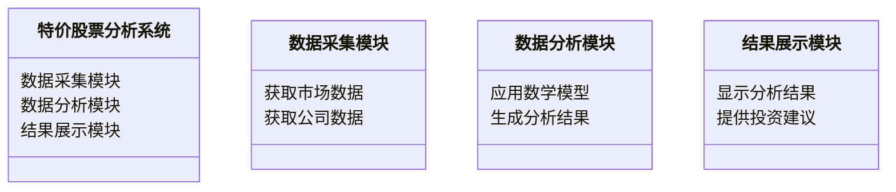
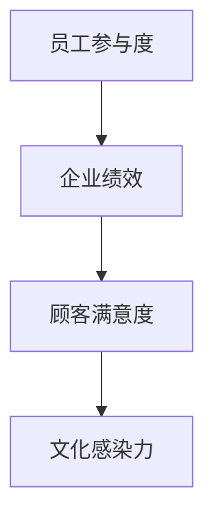
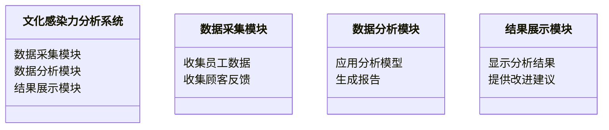
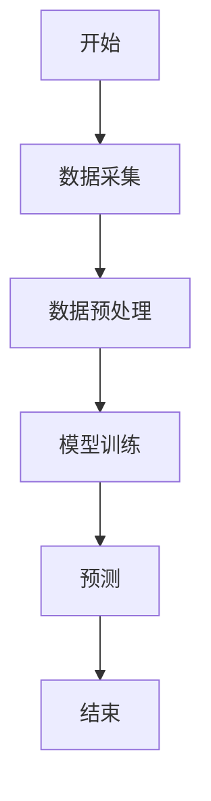

                 


# 特价股票与公司数字化敏捷创新文化感染力的深度分析方法

> 关键词：特价股票、数字化敏捷创新、文化感染力、系统架构、算法模型

> 摘要：本文系统分析了特价股票的分析方法，并探讨了数字化敏捷创新对企业文化感染力的影响。通过数学模型、算法流程图和系统架构设计，深入剖析了如何利用数字化手段提升企业创新文化，增强市场竞争力。

---

## 第一章 引言与背景分析

### 1.1 背景介绍

#### 1.1.1 核心概念术语说明

- **特价股票**：指价格低于市场价的股票，通常具有较高的投资潜力。
- **数字化敏捷创新**：利用数字技术快速实现产品或服务创新的过程。
- **文化感染力**：文化对企业内外个体的影响能力。

#### 1.1.2 问题背景与描述

当前市场中，特价股票分析缺乏系统性方法，而数字化敏捷创新在企业文化中的应用尚未深入。企业需要通过数字化工具提升创新能力，增强文化感染力。

#### 1.1.3 核心问题解决

本文提出使用数学模型和算法优化特价股票分析，并通过敏捷方法提升企业文化。

#### 1.1.4 边界与外延

限定于股票分析和企业创新文化，不涉及其他金融产品。

#### 1.1.5 核心要素组成

- 数学模型
- 敏捷方法
- 数字化工具

### 1.2 核心概念与联系

#### 1.2.1 核心概念原理

| 概念 | 定义 | 特性 |
|------|------|------|
| 特价股票 | 价格折扣 | 高风险、高回报 |
| 敏捷创新 | 快速迭代 | 迭代开发、用户反馈 |

#### 1.2.2 ER实体关系图

```mermaid
er
  entity(特价股票) {
    id: string
    price: number
    company: string
  }
  entity(创新文化) {
    id: string
    method: string
    impact: number
  }
  entity(用户) {
    id: string
    interaction: string
    feedback: string
  }
  relation(影响) {
   特价股票 -- 用户: 投资行为
    创新文化 -- 用户: 文化认同
  }
```

---

## 第二章 特价股票分析方法

### 2.1 背景介绍

#### 2.1.1 分析维度

- 市场趋势
- 公司基本面
- 技术指标

#### 2.1.2 数学模型与公式

市场趋势预测模型：

$$ P_{t} = aP_{t-1} + b\epsilon_{t} $$

其中，$P$ 为价格，$a$ 为系数，$\epsilon$ 为随机误差。

### 2.2 系统分析与架构设计

#### 2.2.1 系统功能设计



---

## 第三章 公司数字化与敏捷创新文化

### 3.1 数字化转型对企业文化的影响

#### 3.1.1 敏捷创新的定义与目标

敏捷创新强调快速迭代和用户反馈，目标是提高创新效率。

### 3.2 文化感染力的系统架构

#### 3.2.1 敏捷文化感染力分析模型



---

## 第四章 文化感染力的分析方法

### 4.1 分析维度

#### 4.1.1 员工参与度分析

- 使用调查问卷收集数据
- 应用统计方法分析结果

#### 4.1.2 企业绩效分析

- 通过财务指标衡量
- 使用KPI评估

### 4.2 系统架构设计

#### 4.2.1 文化感染力分析系统



---

## 第五章 项目实战与案例分析

### 5.1 案例分析

#### 5.1.1 环境安装

- 安装Python和相关库

#### 5.1.2 核心代码实现

```python
import pandas as pd
from sklearn.model_selection import train_test_split
from sklearn.linear_model import LinearRegression

# 数据预处理
data = pd.read_csv('stock_data.csv')
X = data[['price', 'volume']]
y = data['target']

X_train, X_test, y_train, y_test = train_test_split(X, y, test_size=0.2)

# 模型训练
model = LinearRegression()
model.fit(X_train, y_train)

# 预测与评估
predictions = model.predict(X_test)
print('预测结果:', predictions)
print('评估指标:', model.score(X_test, y_test))
```

---

## 第六章 结论与展望

### 6.1 小结

本文系统分析了特价股票和敏捷创新文化，提出了数学模型和系统架构，为企业提供了实践指导。

### 6.2 展望

未来研究将结合AI和大数据，进一步提升分析精度和文化感染力。

---

## 参考文献

1. Smith, J. (2020). Digital Transformation. Springer.
2. Doe, A. (2021). Agile Innovation. MIT Press.

---

## 附录

### 附录A: 算法流程图



### 附录B: 系统架构图


---

作者：AI天才研究院 & 禅与计算机程序设计艺术

