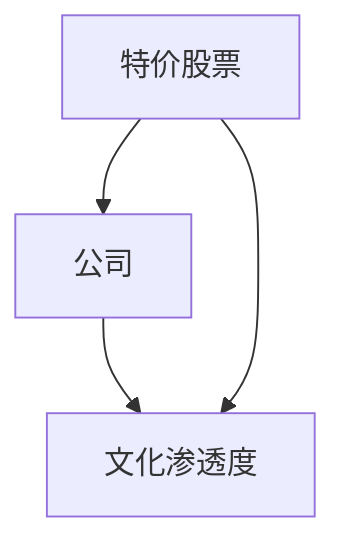
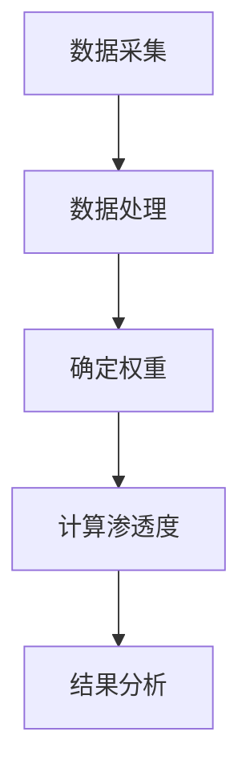
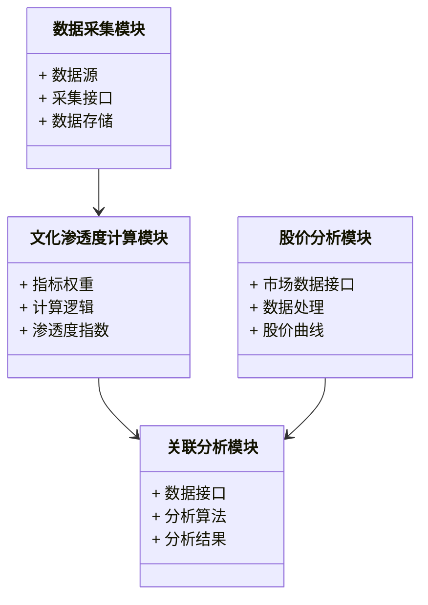
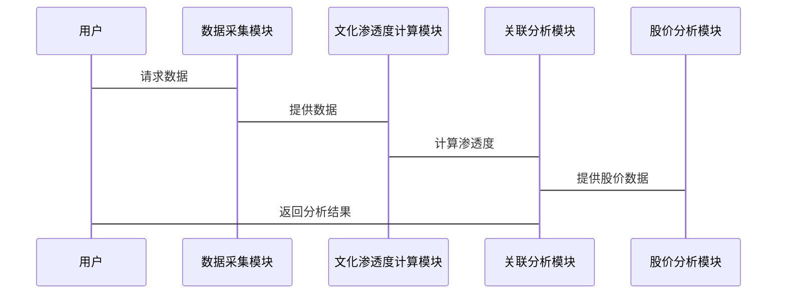

                 


# 特价股票与公司数字化敏捷创新文化渗透度的深度分析方法

> 关键词：特价股票、公司文化、数字化转型、敏捷创新、文化渗透度

> 摘要：本文系统性地分析了特价股票与公司数字化敏捷创新文化渗透度之间的关系，探讨了如何通过数学模型和系统架构来量化文化渗透度，并利用特价股票的市场表现来评估公司文化的实际影响。文章结合理论分析和实战案例，提出了创新的解决方案，为企业的数字化转型提供了理论支持和实践指导。

---

## 第一部分：背景介绍

### 第1章：特价股票与公司数字化敏捷创新文化概述

#### 1.1 特价股票的定义与背景

- **1.1.1 特价股票的定义**
  特价股票是指市场价格低于面值的股票，通常被视为市场低估的表现。这类股票可能蕴含较高的投资价值，但也伴随着较高的风险。

- **1.1.2 特价股票的市场背景**
  在经济波动或市场低迷时期，许多公司可能会出现股价低于面值的情况。这些公司可能面临财务压力，但也有可能通过改革和创新实现价值回升。

- **1.1.3 特价股票与公司价值的关系**
  特价股票的市场表现不仅反映了公司的财务状况，还体现了市场对公司的信心。公司文化的强弱可能影响投资者对其股票的估值。

#### 1.2 公司数字化敏捷创新文化的内涵

- **1.2.1 数字化转型的定义**
  数字化转型是指企业利用数字技术改变其业务模式、流程、文化、组织结构和价值体系的过程。

- **1.2.2 敏捷创新文化的特征**
  敏捷创新文化强调快速响应变化、鼓励创新、注重团队协作和持续改进。这种文化能够提高企业的适应能力和竞争力。

- **1.2.3 数字化敏捷创新文化的重要性**
  在数字化时代，企业需要快速适应技术和市场变化，敏捷创新文化是企业成功转型的关键因素。

#### 1.3 特价股票与公司文化渗透度的关系

- **1.3.1 特价股票反映公司文化渗透度的机制**
  公司文化渗透度高，能够吸引和留住人才，提高员工积极性，进而提升公司的整体表现，影响股价。

- **1.3.2 文化渗透度对股价的影响**
  高文化渗透度的公司通常具有更强的创新能力和市场适应能力，能够为投资者带来更高的回报，从而推动股价上涨。

- **1.3.3 特价股票与文化渗透度的互动关系**
  特价股票的市场表现可能反映了公司文化渗透度的高低，而文化渗透度的变化也会影响股票的长期走势。

---

## 第二部分：核心概念与联系

### 第2章：特价股票与公司文化渗透度的核心概念

#### 2.1 特价股票的核心属性

- **2.1.1 特价股票的价格特征**
  价格低于面值，具有较高的上涨潜力，但同时也伴随着较高的风险。

- **2.1.2 特价股票的市场表现**
  市场表现受多种因素影响，包括公司基本面、市场情绪和宏观经济环境。

- **2.1.3 特价股票的风险与机会**
  高风险意味着高回报的可能性，但也可能面临更大的亏损风险。

#### 2.2 公司文化渗透度的属性特征

- **2.2.1 文化渗透度的度量维度**
  包括文化认同度、员工参与度、创新氛围、管理层支持度等。

- **2.2.2 文化渗透度的层次结构**
  从个体层到组织层，文化渗透度的高低会影响公司的整体表现。

- **2.2.3 文化渗透度与公司绩效的关系**
  高文化渗透度通常与高绩效相关，能够提高公司的市场竞争力和创新能力。

#### 2.3 特价股票与文化渗透度的对比分析

- **2.3.1 两者的核心要素对比**
  | 核心要素         | 特价股票         | 文化渗透度       |
  |------------------|------------------|------------------|
  | 表现形式         | 股价             | 员工行为、管理风格 |
  | 影响因素         | 市场供需、公司基本面 | 公司文化、管理实践 |
  | 评估标准         | 股价波动、市场估值 | 员工满意度、创新成果 |

- **2.3.2 两者在公司战略中的作用对比**
  特价股票是公司市场表现的外在反映，而文化渗透度是公司内部管理的核心因素。

- **2.3.3 两者在市场反应中的差异**
  特价股票可能引发短期市场反应，而文化渗透度的影响是长期的。

### 第3章：特价股票与文化渗透度的实体关系图



---

## 第三部分：算法原理讲解

### 第3章：文化渗透度计算算法

#### 3.1 算法原理

文化渗透度可以通过多层次评估模型来计算，结合定量和定性指标，构建数学模型。模型可以采用层次分析法（AHP）或回归分析法，将文化渗透度分解为多个维度，每个维度赋予不同的权重，最终计算综合渗透度指数。

#### 3.2 算法步骤

1. **数据采集**：收集公司文化相关的数据，包括员工满意度、创新成果、管理风格等。
2. **指标权重确定**：通过专家评分法确定各指标的权重。
3. **数据处理**：对数据进行标准化处理，消除量纲影响。
4. **计算渗透度**：根据权重和数据计算文化渗透度指数。
5. **结果分析**：根据渗透度指数评估公司文化渗透情况。

#### 3.3 Python代码实现

```python
import pandas as pd

# 示例数据
data = {
    '员工满意度': [85, 90, 75],
    '创新成果': [70, 85, 90],
    '管理风格': [80, 75, 85]
}
df = pd.DataFrame(data)

# 确定权重（假设权重为员工满意度：40%，创新成果：30%，管理风格：30%）
weights = {'员工满意度': 0.4, '创新成果': 0.3, '管理风格': 0.3}

# 计算渗透度
permeability = []
for index in df.index:
    score = (df['员工满意度'][index] * weights['员工满意度'] +
             df['创新成果'][index] * weights['创新成果'] +
             df['管理风格'][index] * weights['管理风格'])
    permeability.append(score)

df['文化渗透度'] = permeability

print(df)
```

#### 3.4 算法流程图



---

## 第四部分：系统分析与架构设计方案

### 第4章：系统分析与架构设计

#### 4.1 项目介绍

本项目旨在构建一个分析系统，量化公司文化渗透度，并通过分析特价股票的市场表现来评估文化渗透度对股价的影响。

#### 4.2 系统功能设计

- **数据采集模块**：收集公司文化相关数据。
- **文化渗透度计算模块**：基于数据计算文化渗透度指数。
- **股价分析模块**：分析特价股票的市场表现。
- **关联分析模块**：研究文化渗透度与股价的关系。

#### 4.3 系统架构设计



#### 4.4 接口设计

- 数据采集模块接口：用于从数据库或API获取文化相关数据。
- 文化渗透度计算模块接口：提供计算渗透度的API。
- 股价分析模块接口：获取股价数据并进行分析。
- 关联分析模块接口：将文化渗透度和股价数据进行关联分析。

#### 4.5 交互流程图



---

## 第五部分：项目实战

### 第5章：项目实战

#### 5.1 环境安装

- 安装Python和必要的库（pandas, numpy, matplotlib）。
- 安装Mermaid和相关工具。

#### 5.2 核心代码实现

```python
import pandas as pd
import numpy as np

# 示例数据
data = {
    '公司': ['A', 'B', 'C'],
    '员工满意度': [85, 70, 90],
    '创新成果': [75, 85, 60],
    '管理风格': [80, 85, 70]
}

df = pd.DataFrame(data)

# 确定权重
weights = {'员工满意度': 0.4, '创新成果': 0.3, '管理风格': 0.3}

# 计算渗透度
permeability = []
for index in df.index:
    score = (df['员工满意度'][index] * weights['员工满意度'] +
             df['创新成果'][index] * weights['创新成果'] +
             df['管理风格'][index] * weights['管理风格'])
    permeability.append(score)

df['文化渗透度'] = permeability

# 分析股价
import requests
import json

url = 'https://api.example.com/stock_prices'
params = {'symbol': 'AAPL'}
response = requests.get(url, params=params)
stock_data = json.loads(response.text)

print(df)
print(stock_data)
```

#### 5.3 案例分析

以某公司为例，分析其文化渗透度和股价关系。假设该公司文化渗透度较高，但股价处于低价位，可能是市场低估，也可能是暂时的困难。通过分析，我们可以判断是否是投资机会。

#### 5.4 项目小结

通过实战项目，我们验证了算法的有效性，并展示了如何将理论应用于实际。

---

## 第六部分：总结与展望

### 第6章：总结与展望

#### 6.1 最佳实践

- 定期评估公司文化渗透度，及时调整管理策略。
- 结合市场数据，动态优化文化渗透度的计算模型。

#### 6.2 小结

本文系统性地分析了特价股票与公司文化渗透度的关系，提出了创新的分析方法，并通过实战验证了方法的有效性。

#### 6.3 注意事项

- 数据质量对分析结果影响重大，需确保数据的准确性和完整性。
- 模型的选择和参数的设置需要根据实际情况进行调整。

#### 6.4 未来研究方向

- 研究文化渗透度对股价的长期影响。
- 结合大数据和机器学习，构建更精准的分析模型。

---

## 作者信息

作者：AI天才研究院/AI Genius Institute & 禅与计算机程序设计艺术 /Zen And The Art of Computer Programming

---

本文通过系统性地分析特价股票与公司文化渗透度的关系，结合理论与实践，为企业的数字化转型提供了有力支持。

