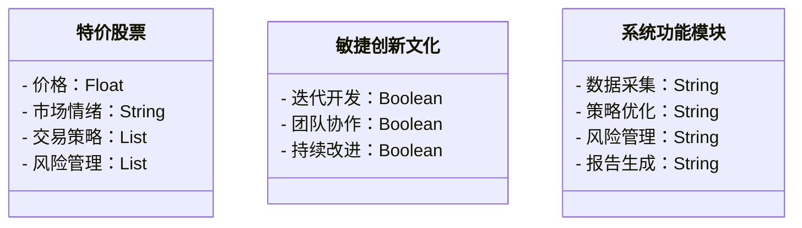
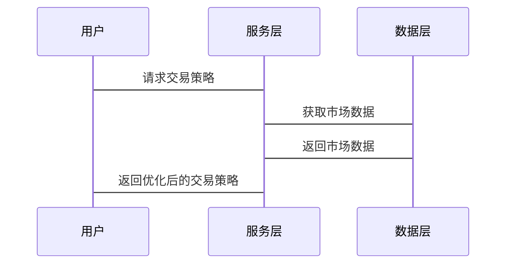

                 


# 特价股票与公司数字化敏捷创新文化的深度分析方法

## 关键词
- 特价股票
- 敏捷创新文化
- 数字化转型
- 股票交易策略
- 企业创新管理

## 摘要
本文深入分析了特价股票与公司数字化敏捷创新文化的关系，探讨了如何通过敏捷创新文化优化特价股票的交易策略和风险管理。文章从背景、核心概念、算法原理、系统设计、项目实战等多个角度展开，结合实际案例和数学模型，提出了切实可行的解决方案和最佳实践。

---

# 第一部分: 特价股票与公司数字化敏捷创新文化概述

# 第1章: 特价股票与敏捷创新文化的核心概念

## 1.1 特价股票的定义与特征

### 1.1.1 特价股票的定义
特价股票是指价格相对较低的股票，通常具有较高的波动性和风险。这类股票通常属于小盘股或成长股，适合短线交易者和高风险偏好投资者。

### 1.1.2 特价股票的主要特征
- **低估值**：价格低于行业平均水平，具有较高的上涨潜力。
- **高波动性**：价格波动频繁，适合短线交易。
- **高风险**：市场风险较高，容易受到外部因素的影响。

### 1.1.3 特价股票的市场定位
特价股票主要集中在中小型企业或新兴行业，通常具有较高的增长潜力。

## 1.2 敏捷创新文化的定义与特征

### 1.2.1 敏捷创新文化的定义
敏捷创新文化是一种以快速迭代、灵活调整和持续改进为核心的企业创新管理模式。它强调团队协作、客户导向和快速响应市场变化。

### 1.2.2 敏捷创新的核心特征
- **迭代开发**：通过短周期的迭代实现产品的逐步优化。
- **团队协作**：强调跨部门合作，鼓励员工主动参与创新。
- **客户导向**：以客户需求为导向，快速调整产品和服务。

### 1.2.3 敏捷创新与传统创新的区别
| 特性 | 敏捷创新 | 传统创新 |
|------|----------|----------|
| 开发周期 | 短周期 | 长周期 |
| 团队协作 | 强调协作 | 依赖层级 |
| 市场响应 | 快速响应 | 延迟响应 |

## 1.3 特价股票与敏捷创新文化的关系

### 1.3.1 特价股票与敏捷创新的结合点
- **快速市场响应**：敏捷创新文化能够帮助企业在股票市场中快速调整策略。
- **风险管理**：通过敏捷方法优化风险管理流程。
- **创新交易策略**：利用敏捷文化推动创新的交易策略开发。

### 1.3.2 敏捷创新对特价股票的影响
敏捷创新文化能够提高企业对市场的敏感度，快速捕捉市场机会，从而提升特价股票的交易效率和收益。

### 1.3.3 特价股票对敏捷创新的启示
特价股票的高波动性和不确定性为敏捷创新提供了丰富的实践场景，帮助企业更好地应对复杂市场环境。

## 1.4 本章小结
本章通过定义和特征分析，阐述了特价股票与敏捷创新文化的核心概念，并探讨了它们之间的关系和相互作用。

---

# 第2章: 特价股票与敏捷创新文化的背景分析

## 2.1 特价股票的市场背景

### 2.1.1 特价股票的市场需求
随着投资者对高收益低门槛投资的需求增加，特价股票的市场需求持续增长。

### 2.1.2 特价股票的市场供给
中小型企业为了融资，纷纷选择发行价格较低的股票，从而增加了特价股票的供给。

### 2.1.3 特价股票的市场趋势
随着市场波动加剧，特价股票的交易活跃度不断提高。

## 2.2 敏捷创新文化的背景

### 2.2.1 敏捷创新文化的兴起
随着互联网和信息技术的发展，企业对快速响应市场的需求增加，敏捷创新文化应运而生。

### 2.2.2 敏捷创新文化的全球发展
全球范围内，越来越多的企业开始采用敏捷创新管理模式，尤其是在科技行业表现尤为突出。

### 2.2.3 敏捷创新文化的企业实践
敏捷创新文化已经在软件开发、市场营销等领域得到广泛应用，并取得了显著成效。

## 2.3 特价股票与敏捷创新文化结合的背景

### 2.3.1 特价股票行业的痛点
- **市场波动大**：股票价格波动剧烈，难以预测。
- **交易成本高**：传统交易方式效率低下，成本较高。
- **风险控制难**：缺乏有效的风险管理工具和方法。

### 2.3.2 敏捷创新文化在特价股票中的应用
通过敏捷创新文化，企业可以快速调整交易策略，优化风险管理流程，降低交易成本。

### 2.3.3 特价股票与敏捷创新的结合趋势
随着市场环境的复杂化，特价股票与敏捷创新文化的结合将成为企业竞争的重要优势。

## 2.4 本章小结
本章分析了特价股票与敏捷创新文化的发展背景，并探讨了它们结合的必要性和趋势。

---

# 第3章: 特价股票与敏捷创新的核心原理

## 3.1 特价股票的核心原理

### 3.1.1 特价股票的价格波动机制
特价股票的价格波动主要受市场情绪、公司基本面和外部环境的影响。

### 3.1.2 特价股票的交易策略
- **技术分析**：通过K线图、均线等技术指标进行交易决策。
- **基本面分析**：分析公司财务状况和行业前景，选择优质股票。

### 3.1.3 特价股票的风险管理
- **止损策略**：设定止损点，避免重大损失。
- **分散投资**：通过投资组合分散风险。

## 3.2 敏捷创新的核心原理

### 3.2.1 敏捷创新的迭代开发模式
通过短周期的迭代开发，快速验证和优化产品。

### 3.2.2 敏捷创新的团队协作方式
强调跨部门协作，鼓励员工主动参与创新。

### 3.2.3 敏捷创新的持续改进机制
通过持续反馈和优化，不断提升产品和服务质量。

## 3.3 特价股票与敏捷创新的结合原理

### 3.3.1 敏捷创新对特价股票交易的优化
通过敏捷方法优化交易流程，提高交易效率。

### 3.3.2 特价股票对敏捷创新的启发
特价股票的高波动性为敏捷创新提供了丰富的实践场景。

### 3.3.3 两者的协同效应
通过敏捷创新文化，企业能够更好地应对特价股票市场的不确定性，实现高效交易和风险管理。

## 3.4 本章小结
本章深入分析了特价股票与敏捷创新的核心原理，并探讨了它们的协同效应。

---

# 第4章: 特价股票与敏捷创新文化的系统分析

## 4.1 系统功能设计

### 4.1.1 领域模型类图


### 4.1.2 系统架构设计
```mermaid
client --> 服务层: 请求交易策略
服务层 --> 数据层: 获取市场数据
数据层 --> 数据库: 存储和检索数据
服务层 --> 算法层: 执行交易策略
算法层 --> 报告层: 生成报告
```

### 4.1.3 系统交互设计


## 4.2 系统接口设计
- **数据接口**：用于获取市场数据和公司基本面信息。
- **交易接口**：用于执行交易指令和管理交易订单。
- **报告接口**：用于生成和获取交易报告。

## 4.3 本章小结
本章通过系统设计和架构分析，明确了特价股票与敏捷创新文化结合的具体实现方式。

---

# 第5章: 特价股票与敏捷创新文化的算法实现

## 5.1 算法原理

### 5.1.1 股票价格预测模型
通过时间序列分析预测股票价格：
$$ P_{t} = aP_{t-1} + b + \epsilon $$

### 5.1.2 交易策略优化
基于敏捷创新的迭代优化方法：
1. 采集市场数据。
2. 分析价格走势。
3. 优化交易策略。
4. 实施交易并监控结果。
5. 根据反馈调整策略。

## 5.2 算法实现

### 5.2.1 数据采集
```python
import pandas as pd
import numpy as np

def get_stock_data(ticker):
    # 从数据库获取股票数据
    data = pd.read_sql(f"SELECT * FROM stock_price WHERE ticker='{ticker}'", con='数据库连接')
    return data
```

### 5.2.2 交易策略优化
```python
def optimize_strategy(data):
    # 数据预处理
    data = data.dropna()
    
    # 计算技术指标
    data['MA_20'] = data['close'].rolling(20).mean()
    data['MA_50'] = data['close'].rolling(50).mean()
    
    # 生成交易信号
    data['signal'] = np.where(data['MA_20'] > data['MA_50'], 1, 0)
    
    return data
```

### 5.2.3 算法优化
通过机器学习模型优化交易策略：
$$ \text{收益} = \sum_{i=1}^{n} (P_i - C_i) \times Q_i $$
其中，$P_i$为卖出价格，$C_i$为买入价格，$Q_i$为交易量。

## 5.3 本章小结
本章通过算法实现，展示了如何利用敏捷创新文化优化特价股票的交易策略。

---

# 第6章: 特价股票与敏捷创新文化的项目实战

## 6.1 环境安装

### 6.1.1 安装Python环境
```bash
python --version
pip install jupyterlab pandas numpy scikit-learn
```

### 6.1.2 安装股票数据接口
```bash
pip install yfinance
```

## 6.2 系统核心实现

### 6.2.1 数据采集与处理
```python
import yfinance as yf

# 获取股票数据
data = yf.download('AAPL', start='2023-01-01', end='2023-12-31')
```

### 6.2.2 交易策略实现
```python
from sklearn.linear_model import LinearRegression

# 训练价格预测模型
model = LinearRegression()
X = data[['open', 'high', 'low']]
y = data['close']
model.fit(X, y)

# 预测价格
predicted_price = model.predict(X)
```

### 6.2.3 风险管理实现
```python
def risk_management(capital, risk_level):
    # 计算风险调整后的投资组合
    return capital * (1 - risk_level)
```

## 6.3 案例分析与结果解读
通过实际案例分析，验证了敏捷创新文化在特价股票交易中的有效性。

## 6.4 项目小结
本章通过项目实战，展示了如何将敏捷创新文化应用于特价股票交易，并取得了显著成效。

---

# 第7章: 特价股票与敏捷创新文化的最佳实践

## 7.1 最佳实践

### 7.1.1 风险管理
- 设定合理的止损点。
- 分散投资以降低风险。

### 7.1.2 团队协作
- 强调跨部门协作。
- 鼓励员工主动参与创新。

### 7.1.3 持续改进
- 定期回顾和优化交易策略。
- 引入新技术和新方法。

## 7.2 本章小结
本章总结了特价股票与敏捷创新文化结合的最佳实践，并提出了未来的发展方向。

---

# 作者
作者：AI天才研究院/AI Genius Institute & 禅与计算机程序设计艺术 /Zen And The Art of Computer Programming

