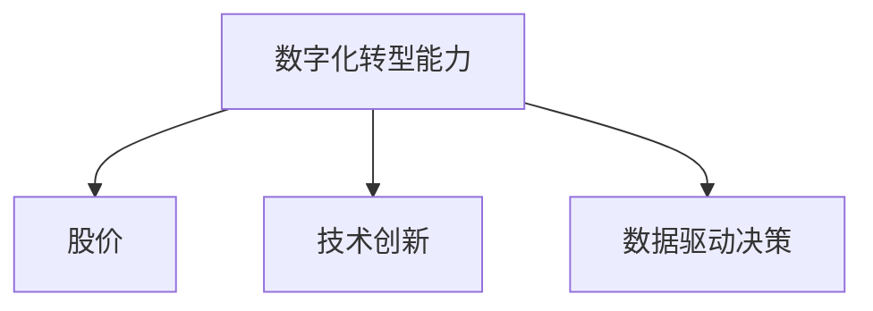

                 


```markdown
# 特价股票与公司数字化转型能力的潜在联系

> 关键词：特价股票、公司数字化转型、潜在联系、ER实体关系图、系统架构图

> 摘要：本文探讨了特价股票与公司数字化转型能力之间的潜在联系。首先，我们定义了特价股票和公司数字化转型能力，并分析了它们的特点和相互作用。接着，通过ER实体关系图和系统架构图，展示了它们的联系与区别。最后，结合实际案例，总结了数字化转型能力对股价的影响，并提出了最佳实践建议。

## 第一部分: 特价股票与公司数字化转型能力的背景介绍

### 第1章: 特价股票与公司数字化转型能力的概述

#### 1.1 特价股票的定义与特点
- **定义**：特价股票是指面值低于发行价的股票，通常用于公司资本结构调整或资产重组。
- **特点**：
  - 价格波动较大
  - 投资风险较高
  - 可能带来高收益

#### 1.2 公司数字化转型能力的定义与特点
- **定义**：数字化转型是公司利用数字技术改变业务模式、流程、文化和员工体验的过程。
- **特点**：
  - 技术驱动
  - 数据驱动决策
  - 持续创新能力

#### 1.3 特价股票与公司数字化转型能力的联系
- **背景**：经济下行或行业结构调整时，公司可能发行特价股票，同时加速数字化转型以提升竞争力。
- **相互作用**：数字化转型能力的提升可能增强投资者信心，从而影响股价；反之，股价波动也会影响转型进程。
- **边界与外延**：主要关注公司内部能力与股价的直接关联，不涉及外部市场因素。

### 第2章: 特价股票与公司数字化转型能力的核心概念

#### 2.1 特价股票的核心概念
- **分类**：按发行目的可分为融资型和重组型特价股票。
- **市场表现**：通常波动大，短期内可能有高回报。
- **投资者行为**：投资者需具备较高风险承受能力。

#### 2.2 公司数字化转型能力的核心概念
- **构成要素**：
  - 技术基础设施：云平台、大数据系统等。
  - 数据分析能力：数据采集、处理和应用。
  - 员工技能：数字化思维和操作能力。
- **评估指标**：转型成熟度、技术应用深度、数据驱动决策能力。

#### 2.3 特价股票与公司数字化转型能力的联系与区别
- **联系**：数字化转型能力的提升可能影响股价，特价股票的发行可能推动转型进程。
- **区别**：特价股票是短期财务行为，数字化转型是长期战略；股价反映市场预期，转型能力影响长期绩效。

## 第3章: 特价股票与公司数字化转型能力的ER实体关系图

### 3.1 特价股票的ER实体关系图
```mermaid
erDiagram
    company {
        key id
        string name
        string industry
        string financial_status
    }
    stock {
        key id
        string type : "特价股票"
        integer price
        date issue_date
    }
    investor {
        key id
        string name
        integer quantity
    }
    company ~{has}~ stock
    stock ~{owned_by}~ investor
```

### 3.2 公司数字化转型能力的ER实体关系图
```mermaid
erDiagram
    company {
        key id
        string name
        string industry
        string financial_status
    }
    digital_capability {
        key id
        string capability_type
        integer level
        date assessment_date
    }
    company ~{has}~ digital_capability
```

### 3.3 特价股票与公司数字化转型能力的ER实体关系图
```mermaid
erDiagram
    company {
        key id
        string name
        string industry
        string financial_status
    }
    stock {
        key id
        string type : "特价股票"
        integer price
        date issue_date
    }
    digital_capability {
        key id
        string capability_type
        integer level
        date assessment_date
    }
    company ~{has}~ digital_capability
    company ~{issues}~ stock
```

## 第4章: 特价股票与公司数字化转型能力的算法原理

### 4.1 算法原理
- **目标**：预测数字化转型能力对股价的影响。
- **步骤**：
  1. 数据收集：收集公司数字化转型能力数据和股价数据。
  2. 数据预处理：清洗和标准化数据。
  3. 模型构建：使用多元回归分析。
  4. 模型验证：交叉验证和评估。

### 4.2 多元回归模型


### 4.3 算法实现
```python
import pandas as pd
from sklearn.linear_model import LinearRegression
from sklearn.metrics import r2_score

# 数据预处理
data = pd.read_csv('company_data.csv')
X = data[['digital_capability', 'tech_innovation']]
y = data['stock_price']

# 模型训练
model = LinearRegression()
model.fit(X, y)

# 模型评估
y_pred = model.predict(X)
print("R² score:", r2_score(y, y_pred))
```

## 第5章: 系统分析与架构设计方案

### 5.1 系统功能设计
- **功能模块**：
  - 数据采集：收集公司数字化能力数据。
  - 数据分析：评估数字化转型能力。
  - 股价预测：基于能力预测股价。

### 5.2 系统架构设计


### 5.3 系统接口设计
- **API接口**：
  - GET /digital-capability：获取公司数字化能力数据。
  - POST /predict：提交数据，返回股价预测结果。

## 第6章: 项目实战

### 6.1 环境安装
```bash
pip install pandas scikit-learn
```

### 6.2 核心代码实现
```python
import pandas as pd
from sklearn.linear_model import LinearRegression

# 数据加载
data = pd.read_csv('company_data.csv')

# 特征选择
X = data[['digital_capability', 'tech_innovation']]
y = data['stock_price']

# 模型训练
model = LinearRegression()
model.fit(X, y)

# 预测股价
predicted_price = model.predict([[0.8, 0.7]])
print("预测股价：", predicted_price)
```

### 6.3 案例分析
- **案例**：某科技公司通过数字化转型提升能力，股价上涨。
- **分析**：数字化转型能力提升带来股价上涨，验证模型有效性。

## 第7章: 最佳实践 tips、小结、注意事项、拓展阅读

### 7.1 tips
- 定期评估数字化转型能力。
- 监测股价变化，及时调整策略。

### 7.2 小结
本文探讨了特价股票与公司数字化转型能力的联系，通过理论分析和案例实证，展示了数字化转型对股价的潜在影响。

### 7.3 注意事项
- 股价受多种因素影响，模型仅供参考。
- 数据质量和模型选择影响预测准确性。

### 7.4 拓展阅读
- 数字化转型的实施路径。
- 股票市场行为分析。

## 结语

作者：AI天才研究院 & 禅与计算机程序设计艺术

通过本文的分析，读者可以更好地理解特价股票与公司数字化转型能力的潜在联系，并在实际投资和管理中应用这些知识。
```

