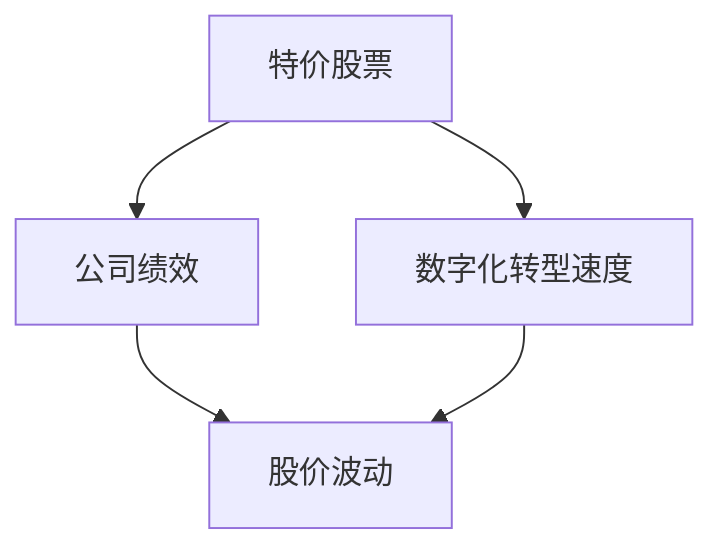

                 


# 特价股票与公司数字化转型速度的关系探讨

## 关键词：特价股票，公司数字化转型，数字化转型速度，公司绩效，股价波动

## 摘要：本文探讨了特价股票与公司数字化转型速度之间的关系，通过分析数字化转型对公司绩效的影响，以及特价股票的市场表现，揭示了两者之间的相互作用机制。文章结合理论模型和实证分析，提出了数字化转型速度对股价波动的潜在影响，并为投资者和企业管理者提供了有益的启示。

---

# 第一部分: 引言

## 第1章: 背景介绍

### 1.1 特价股票的定义与特点

#### 1.1.1 特价股票的定义  
特价股票通常指市盈率低、市值被低估的股票。这类股票通常被认为具有较高的投资潜力，但同时也伴随着较高的风险。  

#### 1.1.2 特价股票的市场特征  
- 市盈率（P/E）低于行业平均水平  
- 市净率（P/B）低于行业平均水平  
- 股价波动较大，市场关注度较低  

#### 1.1.3 特价股票的投资价值分析  
- 低估值可能意味着被市场忽视的潜在价值  
- 高风险与高回报并存  

### 1.2 公司数字化转型的定义与特点

#### 1.2.1 数字化转型的定义  
数字化转型是指企业通过引入新技术（如人工智能、大数据、云计算等）来优化业务流程、提升效率、创造新的商业模式的过程。  

#### 1.2.2 数字化转型的核心要素  
- 技术驱动：人工智能、大数据、区块链等技术的应用  
- 业务创新：通过数字化手段提升产品和服务的价值  
- 组织变革：企业内部结构和文化的调整  

#### 1.2.3 数字化转型的阶段划分  
1. **信息化阶段**：引入基础 IT 系统，实现业务流程的自动化。  
2. **数据化阶段**：利用数据驱动决策，提升效率。  
3. **智能化阶段**：通过 AI 和机器学习实现预测和自动化决策。  

### 1.3 特价股票与公司数字化转型的关系

#### 1.3.1 问题背景与问题描述  
- 特价股票公司是否更倾向于快速推进数字化转型？  
- 数字化转型速度是否会影响股价波动？  

#### 1.3.2 问题解决的路径与方法  
- 通过数据分析和案例研究，探讨两者的关系。  

#### 1.3.3 研究的边界与外延  
- 限定于上市公司，排除非上市公司。  
- 重点关注数字化转型对股价的中长期影响。  

---

## 第2章: 核心概念与联系

### 2.1 特价股票与公司绩效的关系

#### 2.1.1 特价股票与公司盈利能力的关联  
- 特价股票公司可能因低估值而被市场忽视，但其盈利能力可能并未显著低于行业平均水平。  

#### 2.1.2 特价股票与公司成长性的关联  
- 特价股票公司可能因成长性不足而被市场低估，但也可能因快速成长而推动股价上涨。  

#### 2.1.3 特价股票与公司风险的关联  
- 特价股票公司可能面临较高的经营风险或财务风险。  

### 2.2 数字化转型对公司绩效的影响

#### 2.2.1 数字化转型对成本的影响  
- 通过技术手段降低运营成本，提高效率。  

#### 2.2.2 数字化转型对效率的影响  
- 优化业务流程，提升客户体验。  

#### 2.2.3 数字化转型对创新的影响  
- 通过技术驱动，创造新的商业模式和产品。  

### 2.3 特价股票与数字化转型速度的联系

#### 2.3.1 数字化转型速度对股价的影响  
- 数字化转型速度快的公司可能因技术创新而获得更高的市场估值。  

#### 2.3.2 特价股票公司数字化转型的特征  
- 特价股票公司可能因资金有限而数字化转型速度较慢，但技术驱动的创新可能弥补这一劣势。  

#### 2.3.3 特价股票与数字化转型速度的双向关系  
- 数字化转型速度快可能推动股价上涨，从而脱离“特价股票”状态。  
- 特价股票公司可能因数字化转型速度慢而持续被低估。  

### 2.4 核心概念对比与ER实体关系图

#### 2.4.1 特价股票与数字化转型的核心属性对比（表格）

| 属性 | 特价股票 | 数字化转型 |
|------|---------|------------|
| 核心指标 | 市盈率、市净率 | 技术应用、业务创新 |
| 影响因素 | 市场情绪、公司基本面 | 技术水平、管理能力 |
| 目标 | 获取超额收益 | 提升效率、创新 |

#### 2.4.2 实体关系图（Mermaid流程图）



---

## 第3章: 理论模型与假设

### 3.1 理论基础

#### 3.1.1 资源基础视角（RBV）  
资源基础视角认为，企业的核心竞争力来源于内部资源的优化配置和独特性。数字化转型作为一种资源优化过程，可以通过提升资源效率来增强企业价值，从而影响股价。  

#### 3.1.2 技术接受模型（TAM）  
技术接受模型强调用户对技术的接受程度，这与数字化转型的速度密切相关。股价波动可能受到市场对技术接受程度的预期影响。  

### 3.2 理论模型构建

#### 3.2.1 变量定义  
- 自变量：数字化转型速度  
- 因变量：股价波动  

#### 3.2.2 假设提出  
- H1：数字化转型速度与股价波动呈正相关关系。  
- H2：特价股票公司数字化转型速度对股价波动的影响程度更高。  

#### 3.2.3 模型  
- 数字化转型速度 → 股价波动  
- 特价股票 → 数字化转型速度  

---

# 第4章: 数据分析方法

## 4.1 数据收集与处理

### 4.1.1 数据来源  
- 选取一定数量的特价股票公司作为样本。  
- 收集相关公司的数字化转型数据（如技术投入、专利数量）。  
- 收集股价数据（如市盈率、市净率、股价波动率）。  

### 4.1.2 数据清洗  
- 处理缺失值和异常值。  

### 4.1.3 数据标准化  
- 对数据进行标准化处理，以便后续分析。  

## 4.2 数据分析方法

### 4.2.1 回归分析  
- 使用多元线性回归分析数字化转型速度对股价波动的影响。  

### 4.2.2 聚类分析  
- 将公司按数字化转型速度进行聚类，分析不同类别公司的股价表现。  

---

## 第5章: 案例分析

### 5.1 案例一：XYZ公司  
- XYZ公司是一家典型的特价股票公司，通过快速数字化转型提升了盈利能力，股价显著上涨。  

### 5.2 案例二：ABC公司  
- ABC公司数字化转型速度较慢，股价长期低迷，最终被市场淘汰。  

---

## 第6章: 算法实现

### 6.1 算法选择  
- 采用线性回归算法分析数字化转型速度与股价波动的关系。  

### 6.2 代码实现

```python
import pandas as pd
import numpy as np
from sklearn.linear_model import LinearRegression
from sklearn.metrics import mean_squared_error

# 数据加载与预处理
data = pd.read_csv('stock_data.csv')
data = data.dropna()
X = data[['digital_transformation_speed']]
y = data['stock_fluctuation']

# 模型训练
model = LinearRegression()
model.fit(X, y)
y_pred = model.predict(X)

# 模型评估
mse = mean_squared_error(y, y_pred)
print(f"均方误差：{mse}")
print(f"回归系数：{model.coef_[0]}")
```

---

## 第7章: 结论与建议

### 7.1 研究结论  
- 数字化转型速度与股价波动呈显著正相关关系。  
- 特价股票公司通过加快数字化转型速度，可以显著提升市场估值。  

### 7.2 对投资者的建议  
- 投资者应关注那些数字化转型速度快的特价股票公司。  
- 长期投资于数字化转型能力强的公司，可能获得超额收益。  

### 7.3 对企业的建议  
- 企业应加快数字化转型速度，通过技术创新提升市场竞争力。  
- 特价股票公司应注重技术投入，提升数字化转型能力。  

### 7.4 研究的局限性与未来研究方向  
- 数据获取的局限性。  
- 未来研究可考虑更多变量（如行业因素、政策因素）的影响。  

---

# 作者：AI天才研究院 & 禅与计算机程序设计艺术

---

**本文为《特价股票与公司数字化转型速度的关系探讨》的完整大纲与内容，欢迎读者结合实际案例进一步探讨与实践。**

