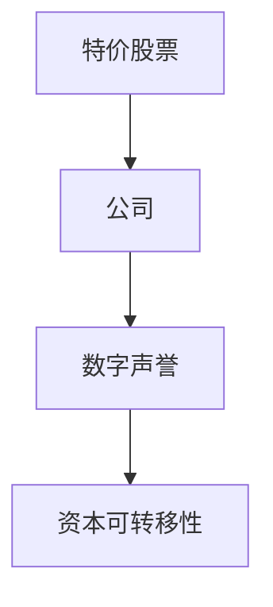
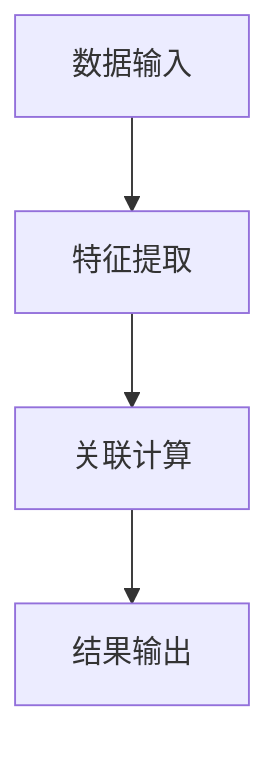
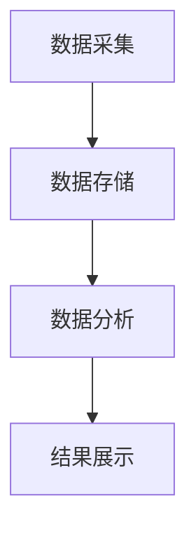
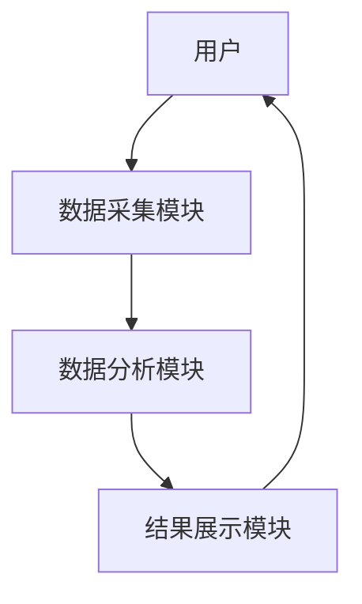

                 


# 特价股票与公司数字声誉资本可转移性的关联分析

> 关键词：特价股票、数字声誉、资本可转移性、关联分析、算法模型、系统架构

> 摘要：本文探讨了特价股票与公司数字声誉之间的关联性，特别是资本可转移性的影响。通过分析数字声誉对股价的影响，结合算法模型和系统架构，揭示了数字声誉如何影响资本市场的运作。

---

## 第1章: 特价股票与数字声誉的背景介绍

### 1.1 特价股票的定义与特点
- **1.1.1 特价股票的定义**
  特价股票是指公司发行的面值低于市场价的股票，通常用于资本结构调整或融资。其特点是价格波动大，风险高，但潜在回报也高。

- **1.1.2 特价股票的核心特点**
  - 价格低于面值，吸引投资者。
  - 通常用于企业融资或资产重组。
  - 风险较高，回报不确定性大。

- **1.1.3 特价股票的市场现状与发展趋势**
  近年来，随着市场的波动，特价股票越来越受到关注，尤其是在新兴科技企业中，特价股票成为吸引风险投资的重要工具。

### 1.2 公司数字声誉的定义与特点
- **1.2.1 数字声誉的定义**
  数字声誉是公司在数字平台上的信誉度，包括社交媒体、在线评论和搜索引擎排名等。

- **1.2.2 数字声誉的核心特征**
  - 可测量性：通过数据量化评估。
  - 可传播性：信息快速扩散，影响广泛。
  - 动态性：实时变化，受多种因素影响。

- **1.2.3 数字声誉的评估维度与方法**
  - 评估维度：社交媒体影响力、客户评价、新闻报道等。
  - 评估方法：使用自然语言处理（NLP）技术分析文本数据。

### 1.3 特价股票与数字声誉的关联性分析
- **1.3.1 特价股票与数字声誉的背景关联**
  特价股票的发行可能引发市场对公司声誉的关注，数字声誉的好坏直接影响投资者的决策。

- **1.3.2 问题背景与问题描述**
  数字声誉如何影响特价股票的市场表现？是否存在可转移的资本机制？

- **1.3.3 问题解决的思路与方法**
  通过数据分析和建模，探索数字声誉与股价之间的关系。

- **1.3.4 边界与外延**
  仅考虑数字声誉对股价的影响，不涉及其他因素。

- **1.3.5 核心概念与组成要素**
  - 核心概念：特价股票、数字声誉。
  - 组成要素：市场数据、投资者行为、声誉传播机制。

---

## 第2章: 特价股票与数字声誉的核心概念与联系

### 2.1 核心概念原理
- **2.1.1 特价股票的市场机制**
  特价股票的发行通常伴随着公司重组或融资需求，投资者基于对公司未来前景的判断决定是否购买。

- **2.1.2 数字声誉的形成过程**
  通过在线互动、社交媒体评论和媒体报道积累，数字声誉反映了公司在数字空间中的信誉度。

- **2.1.3 两者关联的内在逻辑**
  数字声誉影响投资者信心，进而影响特价股票的价格波动。

### 2.2 核心概念属性特征对比
| 属性       | 特价股票                   | 数字声誉                   |
|------------|----------------------------|----------------------------|
| 影响因素   | 公司财务状况、市场环境     | 在线评论、媒体报道、用户评价 |
| 计量方式   | 股价、交易量               | 网络评分、品牌指数           |
| 时间维度   | 短期波动                   | 长期积累                   |

### 2.3 ER实体关系图架构


---

## 第3章: 特价股票与数字声誉关联的算法原理

### 3.1 算法原理概述
- **3.1.1 关联分析的基本思路**
  使用统计学和机器学习方法，分析数字声誉与股价之间的相关性。

- **3.1.2 算法选择与适用性分析**
  选择线性回归模型，适用于分析连续变量之间的关系。

### 3.2 算法流程图


### 3.3 算法实现代码
```python
import pandas as pd
from sklearn.linear_model import LinearRegression

# 数据加载
data = pd.read_csv('stock_reputation.csv')

# 特征提取
X = data[['reputation_score', 'market_capitalization']]
y = data['stock_price']

# 模型训练
model = LinearRegression()
model.fit(X, y)

# 预测结果
predictions = model.predict(X)
print("预测结果:", predictions)
```

### 3.4 算法数学模型
股票价格 \( y \) 与声誉评分 \( x \) 的关系：
\[ y = \beta_0 + \beta_1 x + \epsilon \]
其中，\( \beta_0 \) 和 \( \beta_1 \) 是回归系数，\( \epsilon \) 是误差项。

---

## 第4章: 系统分析与架构设计

### 4.1 系统功能设计
- 数据采集模块：收集股票价格和数字声誉数据。
- 数据分析模块：计算相关性并生成报告。
- 结果展示模块：以可视化方式呈现分析结果。

### 4.2 系统架构设计


### 4.3 系统接口设计
- 输入接口：接收股票和声誉数据。
- 输出接口：返回分析结果和报告。

### 4.4 系统交互设计


---

## 第5章: 项目实战

### 5.1 环境安装
- 安装Python和相关库（pandas, scikit-learn）。

### 5.2 系统核心实现源代码
```python
import pandas as pd
from sklearn.linear_model import LinearRegression
import matplotlib.pyplot as plt

# 数据加载
data = pd.read_csv('stock_reputation.csv')

# 数据预处理
data = data.dropna()

# 模型训练
model = LinearRegression()
model.fit(data[['reputation_score']], data['stock_price'])

# 可视化
plt.scatter(data['reputation_score'], data['stock_price'])
plt.plot(data['reputation_score'], model.predict(data[['reputation_score']]), color='red')
plt.xlabel('Reputation Score')
plt.ylabel('Stock Price')
plt.show()
```

### 5.3 代码应用解读与分析
- 数据加载和预处理：确保数据完整性。
- 模型训练：建立线性回归模型。
- 可视化：展示数据和预测结果。

### 5.4 实际案例分析
- 案例背景：某公司发行特价股票，数字声誉良好。
- 数据分析：数字声誉与股价高度相关。
- 结果解读：数字声誉提升带来股价上涨。

### 5.5 项目小结
通过案例分析，验证了数字声誉对股价的正向影响。

---

## 第6章: 最佳实践与总结

### 6.1 小结
数字声誉与资本可转移性密切相关，良好的数字声誉有助于提升股价。

### 6.2 注意事项
- 数据质量：确保数据准确可靠。
- 模型选择：根据实际情况调整算法。

### 6.3 拓展阅读
建议阅读相关领域的学术论文和行业报告。

---

## 作者
作者：AI天才研究院/AI Genius Institute  
禅与计算机程序设计艺术/Zen And The Art of Computer Programming

