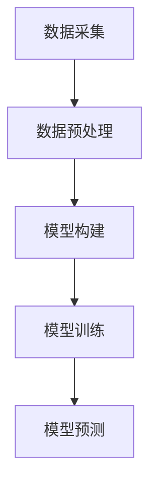
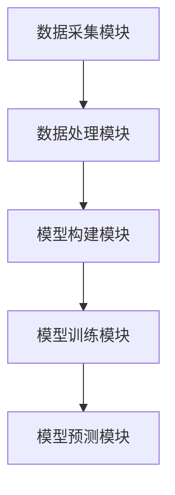

                 

# 特价股票与公司数字孪生技术应用水平的潜在关联研究

> 关键词：数字孪生技术，特价股票，金融市场，企业竞争力，数据驱动决策

> 摘要：本文探讨了数字孪生技术在金融市场的潜在应用，特别是其与特价股票市场的关联性。通过分析数字孪生技术的核心原理、企业应用以及其对股票市场的影响，本文旨在揭示数字孪生技术如何通过实时数据处理和虚拟模型构建，优化股票交易策略，提升市场预测准确性，并降低交易风险。研究结果表明，数字孪生技术在股票市场的应用潜力巨大，能够为企业和投资者带来显著的竞争优势。

---

## 第一部分：数字孪生技术与特价股票的背景与概念

### 第1章：数字孪生技术的定义与特点

#### 1.1 数字孪生技术的定义
数字孪生技术是一种通过数字化手段，将物理世界中的实体或系统映射到虚拟空间中的技术。这种映射不仅仅是简单的数据采集，而是通过实时数据流和虚拟模型的交互，实现对物理世界的动态模拟和预测。

#### 1.2 数字孪生技术的核心特点
- **实时性**：数字孪生技术能够实时采集和处理物理世界的动态数据，确保虚拟模型与物理实体保持一致。
- **数据驱动**：数字孪生依赖于大量实时数据，通过数据分析和建模，实现对物理世界的精准模拟。
- **交互性**：数字孪生模型不仅能够反映物理世界的现状，还可以通过虚拟操作影响物理系统的运行。
- **预测性**：通过构建虚拟模型，数字孪生技术可以进行实时仿真和预测，为决策提供支持。

#### 1.3 数字孪生技术的应用领域
- **制造业**：用于设备监测、维护和优化。
- **能源行业**：用于优化能源分配和预测能源需求。
- **智慧城市**：用于城市交通、环境监测和资源管理。
- **金融领域**：用于股票市场分析、风险评估和交易策略优化。

#### 1.4 数字孪生技术的核心要素
| 核心要素 | 描述 |
|----------|------|
| 数据源   | 实时采集的物理世界数据，如传感器数据、交易数据等。 |
| 虚拟模型 | 基于数据构建的虚拟化表示，用于模拟物理系统的运行。 |
| 数据流   | 实时数据的传输和处理，确保虚拟模型与物理实体同步。 |
| 交互界面 | 用户与数字孪生系统交互的界面，用于操作和分析。 |

---

### 第2章：特价股票的市场分析

#### 2.1 特价股票的定义
特价股票是指在特定时间或条件下，价格低于市场平均水平的股票。这类股票通常具有较高的波动性和不确定性，吸引了大量投资者的关注。

#### 2.2 特价股票市场的特点
- **高波动性**：特价股票的价格波动较大，受市场情绪和外部因素影响显著。
- **高风险性**：由于价格波动大，投资者面临较高的风险。
- **高潜力**：特价股票在短期内可能有较高的收益，吸引投资者参与。

#### 2.3 特价股票的交易机制
- **竞价交易**：投资者在交易所中以最高价买入或卖出股票。
- **订单驱动**：交易由买卖订单驱动，价格由市场供需决定。
- **撮合系统**：交易所的撮合系统负责匹配买卖订单，确定成交价格和数量。

---

## 第二部分：数字孪生技术在股票市场中的应用

### 第3章：数字孪生技术在股票市场中的潜力

#### 3.1 数字孪生技术在股票市场中的应用场景
- **股票价格预测**：通过构建虚拟模型，模拟市场波动，预测股票价格走势。
- **风险评估**：利用数字孪生技术，评估投资组合的风险，优化投资策略。
- **交易策略优化**：通过实时数据分析和虚拟模型模拟，优化交易策略，提高交易效率。

#### 3.2 数字孪生技术在股票市场中的优势
- **实时性**：数字孪生技术能够实时采集和处理市场数据，确保预测的准确性。
- **数据驱动**：通过分析大量数据，数字孪生技术能够发现市场中的潜在规律，为投资决策提供支持。
- **预测性**：数字孪生技术通过虚拟模型的模拟，能够预测市场走势，提前制定交易策略。

#### 3.3 数字孪生技术在股票市场中的挑战
- **数据质量问题**：市场数据的不完整性和不准确性可能影响模型的预测能力。
- **模型复杂性**：数字孪生模型的构建需要复杂的算法和计算资源，可能增加企业的成本。
- **市场波动性**：股票市场的高度波动性使得数字孪生技术的预测结果具有不确定性。

---

### 第4章：数字孪生技术对企业竞争力的影响

#### 4.1 数字孪生技术对企业的影响
- **提升运营效率**：通过实时监测和优化企业运营流程，降低运营成本。
- **增强决策能力**：通过数据驱动的决策，提高企业的市场响应能力和竞争力。
- **创新商业模式**：数字孪生技术为企业提供了新的商业模式和业务机会。

#### 4.2 数字孪生技术在企业中的应用案例
- **制造业**：通过数字孪生技术优化生产流程，提高产品质量。
- **金融行业**：通过数字孪生技术进行风险评估和投资决策优化。
- **零售行业**：通过数字孪生技术优化库存管理和客户体验。

#### 4.3 数字孪生技术的未来发展趋势
- **智能化**：数字孪生技术将更加智能化，能够自主学习和优化。
- **集成化**：数字孪生技术将与人工智能、大数据等技术深度融合，形成更加复杂的系统。
- **广泛应用**：数字孪生技术将在更多行业得到广泛应用，成为企业数字化转型的重要工具。

---

## 第三部分：数字孪生技术在股票市场中的应用实践

### 第5章：数字孪生技术在股票市场中的数学模型

#### 5.1 股票价格预测的数学模型
股票价格预测的数学模型可以通过时间序列分析、回归分析和机器学习算法等方法构建。例如，使用ARIMA模型进行时间序列预测，或者使用LSTM神经网络进行股票价格的预测。

#### 5.2 数字孪生技术的算法流程
1. 数据采集：实时采集股票市场的交易数据，包括开盘价、收盘价、最高价、最低价等。
2. 数据预处理：对采集的数据进行清洗和标准化处理，去除噪声数据。
3. 模型构建：基于预处理后的数据，构建股票价格预测的数学模型，如ARIMA或LSTM。
4. 模型训练：通过历史数据训练模型，优化模型参数。
5. 模型预测：使用训练好的模型，预测未来一段时间内的股票价格。

#### 5.3 算法流程图

#### 5.4 数学公式
股票价格预测的数学模型可以通过以下公式表示：
$$ P(t) = \alpha P(t-1) + \beta P(t-2) + \gamma $$

其中，\( P(t) \) 表示第 \( t \) 时刻的股票价格，\( \alpha \)、\( \beta \) 和 \( \gamma \) 是模型的参数。

---

### 第6章：数字孪生技术在股票市场中的系统架构

#### 6.1 系统功能设计
- **数据采集模块**：负责实时采集股票市场的交易数据。
- **数据处理模块**：对采集的数据进行清洗和标准化处理。
- **模型构建模块**：基于处理后的数据，构建股票价格预测的数学模型。
- **模型训练模块**：通过历史数据训练模型，优化模型参数。
- **模型预测模块**：使用训练好的模型，预测未来一段时间内的股票价格。

#### 6.2 系统架构图

---

## 第四部分：总结与展望

### 第7章：总结与展望

#### 7.1 总结
数字孪生技术在股票市场中的应用潜力巨大，能够通过实时数据处理和虚拟模型构建，优化股票交易策略，提升市场预测准确性，并降低交易风险。数字孪生技术的应用不仅能够提高企业的竞争力，还能够为投资者提供更加精准的市场分析工具。

#### 7.2 展望
未来，随着数字孪生技术的不断发展和完善，其在股票市场中的应用将更加广泛和深入。数字孪生技术将与人工智能、大数据等技术深度融合，形成更加复杂的系统，为企业和投资者提供更加智能化和个性化的服务。

---

## 作者：AI天才研究院 & 禅与计算机程序设计艺术

通过本文的分析和研究，我们可以看到数字孪生技术在股票市场中的巨大潜力。数字孪生技术不仅能够提高企业的竞争力，还能够为投资者提供更加精准的市场分析工具。未来，随着数字孪生技术的不断发展和完善，其在股票市场中的应用将更加广泛和深入。

