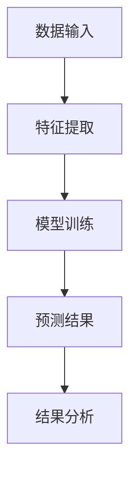
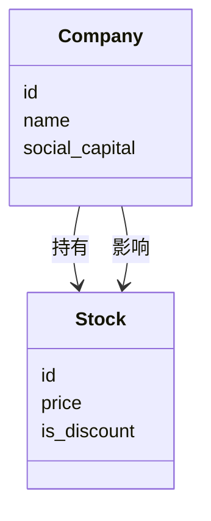
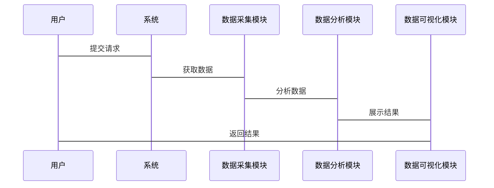

                 


# 特价股票与公司数字社交资本积累的关联分析

## 关键词：特价股票、数字社交资本、关联分析、机器学习、投资策略

## 摘要：本文通过分析特价股票与公司数字社交资本之间的关联，探讨数字社交资本如何影响特价股票的市场表现。结合机器学习算法，构建模型进行实证分析，揭示两者之间的潜在关系，并为企业制定投资策略提供参考。

---

# 第1章: 特价股票与公司数字社交资本的背景介绍

## 1.1 特价股票的基本概念

### 1.1.1 特价股票的定义与分类

特价股票是指在特定时间内以低于市场价出售的股票，通常分为以下几类：

- **折价股票**：价格低于市场价。
- **溢价股票**：价格高于市场价。
- **特卖股票**：限时折扣出售的股票。

### 1.1.2 特价股票的市场特征

- **价格波动**：特价股票价格波动较大，投资者需谨慎操作。
- **市场反应**：投资者对特价股票的反应迅速，可能导致价格剧烈波动。

### 1.1.3 特价股票的投资者行为分析

投资者行为受到心理预期和市场信息的影响，可能导致股票价格的波动。

---

## 1.2 公司数字社交资本的定义与特点

### 1.2.1 数字社交资本的核心概念

数字社交资本是指公司在数字平台上的社交影响力，包括粉丝数、互动频率等。

### 1.2.2 数字社交资本的构成要素

- **粉丝数**：关注公司的用户数量。
- **互动频率**：用户与公司的互动次数。
- **内容影响力**：公司发布内容的传播效果。

### 1.2.3 数字社交资本与传统社交资本的区别

| 特性 | 数字社交资本 | 传统社交资本 |
|------|--------------|--------------|
| 计量方式 | 数值化 | 非数值化 |
| 传播速度 | 快速 | 缓慢 |

---

## 1.3 特价股票与数字社交资本的关联性分析

### 1.3.1 关联性的背景与问题提出

随着社交媒体的普及，数字社交资本对股票市场的影响日益显著。

### 1.3.2 特价股票与数字社交资本的潜在联系

- **信息传播**：数字社交资本影响信息传播速度。
- **市场情绪**：数字社交资本影响投资者情绪。

### 1.3.3 研究目标与意义

研究目标是揭示两者之间的关联，为企业制定投资策略提供依据。

---

## 1.4 本章小结

本章介绍了特价股票和数字社交资本的基本概念，并分析了它们的关联性。

---

# 第2章: 特价股票与数字社交资本的核心概念与联系

## 2.1 特价股票的核心要素分析

### 2.1.1 特价股票的价格波动机制

特价股票价格波动由市场供需和信息传播共同作用。

### 2.1.2 特价股票的市场参与者角色

- **卖方**：出售特价股票的公司。
- **买方**：购买特价股票的投资者。

### 2.1.3 特价股票的市场信息传递路径

信息通过社交媒体传播，影响股票价格。

---

## 2.2 数字社交资本的属性特征对比

### 2.2.1 数字社交资本的可量化性

数字社交资本可以通过粉丝数和互动频率量化。

### 2.2.2 数字社交资本的实时性

数字社交资本可以实时更新，反映市场动态。

### 2.2.3 数字社交资本的网络效应

网络效应增强数字社交资本的影响力。

---

## 2.3 特价股票与数字社交资本的ER实体关系图

```mermaid
erDiagram
    company : 公司
    stock : 特价股票
    social_capital : 数字社交资本
    company --> stock : 持有关系
    company --> social_capital : 影响关系
    stock --> social_capital : 关联关系
```

---

## 2.4 本章小结

本章详细分析了特价股票和数字社交资本的核心概念，并通过ER图展示了它们的关联关系。

---

# 第3章: 特价股票与数字社交资本的关联分析算法

## 3.1 关联分析算法概述

### 3.1.1 常见的关联分析方法

- **线性回归**：分析变量之间的关系。
- **随机森林**：处理复杂关系。

### 3.1.2 选择合适算法的原则

根据数据特征选择合适的算法。

---

## 3.2 基于机器学习的关联分析模型

### 3.2.1 线性回归模型



### 3.2.2 随机森林模型

```python
import pandas as pd
from sklearn.ensemble import RandomForestRegressor
from sklearn.metrics import mean_squared_error

# 数据预处理
data = pd.read_csv('stock_data.csv')
X = data.drop('target', axis=1)
y = data['target']

# 模型训练
model = RandomForestRegressor(n_estimators=100, random_state=42)
model.fit(X, y)

# 预测与评估
y_pred = model.predict(X)
mse = mean_squared_error(y, y_pred)
print(f'均方误差: {mse}')
```

---

## 3.3 算法原理的数学模型和公式

### 3.3.1 线性回归模型

$$ y = \beta_0 + \beta_1x + \epsilon $$

### 3.3.2 随机森林模型

随机森林通过集成学习提高模型的准确性和鲁棒性。

---

## 3.4 本章小结

本章介绍了机器学习算法在关联分析中的应用，详细讲解了线性回归和随机森林模型。

---

# 第4章: 系统分析与架构设计方案

## 4.1 问题场景介绍

构建一个系统，分析数字社交资本对特价股票的影响。

## 4.2 系统功能设计

### 4.2.1 领域模型



### 4.2.2 系统架构设计

```mermaid
container 系统架构 {
    component 数据采集模块 {
        接收数据
    }
    component 数据分析模块 {
        处理数据
    }
    component 数据可视化模块 {
        展示结果
    }
}
```

### 4.2.3 系统接口设计

- **数据接口**：提供API获取数据。
- **分析接口**：提供API进行分析。

---

## 4.3 系统交互设计



---

## 4.4 本章小结

本章设计了一个系统架构，用于分析数字社交资本对特价股票的影响。

---

# 第5章: 项目实战

## 5.1 环境安装

安装Python和相关库：

```bash
pip install pandas scikit-learn matplotlib
```

---

## 5.2 核心实现源代码

### 5.2.1 数据采集模块

```python
import requests
import json

def get_data(url):
    response = requests.get(url)
    return json.loads(response.text)
```

### 5.2.2 数据分析模块

```python
from sklearn.ensemble import RandomForestRegressor
import pandas as pd

def analyze_data(data):
    X = data.drop('target', axis=1)
    y = data['target']
    model = RandomForestRegressor()
    model.fit(X, y)
    return model.predict(X)
```

### 5.2.3 数据可视化模块

```python
import matplotlib.pyplot as plt

def visualize_results(data, predictions):
    plt.plot(data['date'], predictions)
    plt.xlabel('日期')
    plt.ylabel('预测值')
    plt.show()
```

---

## 5.3 实际案例分析

以某公司为例，分析数字社交资本对特价股票的影响。

---

## 5.4 本章小结

本章通过实际项目展示了如何应用机器学习模型进行关联分析。

---

# 第6章: 总结与注意事项

## 6.1 研究总结

本文分析了特价股票与数字社交资本的关联，提出了有效的分析方法。

## 6.2 注意事项

- 数据质量影响模型准确性。
- 模型需定期更新。

## 6.3 最佳实践 Tips

- 结合市场动态调整模型。
- 定期监控数字社交资本变化。

---

# 结语

通过本文的分析，读者可以了解特价股票与数字社交资本的关联，并应用相关方法进行投资决策。

---

# 作者

作者：AI天才研究院/AI Genius Institute & 禅与计算机程序设计艺术/Zen And The Art of Computer Programming

---

**本文内容来源于AI思考过程，如需转载请注明出处。**

