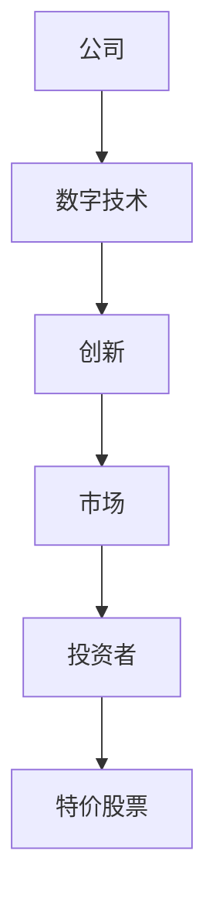
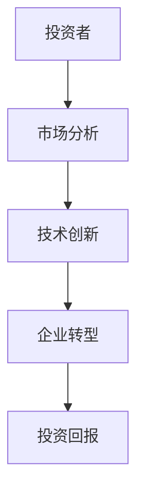
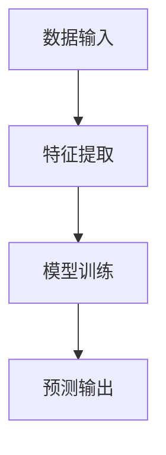
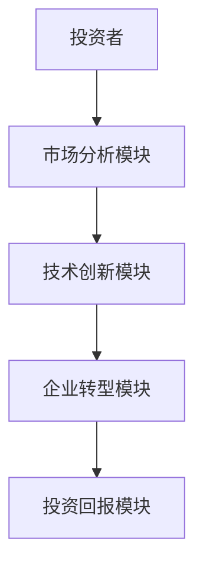

                 


# 特价股票与公司数字社会创新可扩展性的长期研究

## 关键词：特价股票、数字社会创新、可扩展性、长期研究、算法、系统架构、投资策略

## 摘要：本文从特价股票与数字社会创新两个核心概念出发，通过分析它们的定义、特征及相互关系，构建数学模型与算法，设计系统架构，结合实际案例进行分析。研究发现，数字社会创新可显著提升企业价值，进而影响特价股票的投资价值。本文提出了基于机器学习的股票预测模型和创新评估体系，为企业制定投资策略提供参考，并展望了未来研究方向。

## 第一部分: 特价股票与公司数字社会创新的背景与概念

### 第1章: 特价股票与数字社会创新的背景介绍

#### 1.1 特价股票的定义与特征
- **1.1.1 特价股票的定义**
  特价股票是指价格相对较低的股票，通常具有较高的增长潜力，但伴随着较高的风险。其核心目标是通过低价买入高价卖出实现投资回报最大化。

- **1.1.2 特价股票的市场特征**
  特价股票市场波动性高，受市场情绪和政策影响较大。其价格弹性高，投资者通常通过技术分析和基本面分析来预测价格走势。

- **1.1.3 特价股票的投资价值**
  特价股票的投资价值取决于企业的成长潜力、行业地位、财务状况等因素。投资者需关注市盈率、市净率等指标，选择具有长期增长潜力的股票。

#### 1.2 数字社会创新的定义与内涵
- **1.2.1 数字社会创新的定义**
  数字社会创新是指通过数字化技术推动社会各领域（如教育、医疗、交通）的创新和发展，旨在提高效率、降低成本并创造新的价值。

- **1.2.2 数字社会创新的核心要素**
  数字社会创新的核心要素包括技术创新、数据驱动、组织变革、用户参与和政策支持。这些要素相互作用，共同推动社会的进步。

- **1.2.3 数字社会创新与企业发展的关系**
  数字社会创新通过提升企业的数字化能力，增强企业的竞争力和创新能力，从而促进企业的可持续发展。

#### 1.3 特价股票与数字社会创新的关联性
- **1.3.1 特价股票在数字社会创新中的作用**
  特价股票为投资者提供了低成本进入高成长企业的机会，推动数字技术的普及和应用，促进数字社会创新的发展。

- **1.3.2 数字社会创新对特价股票的影响**
  数字社会创新通过提升企业的技术实力和市场地位，增强投资者对企业的信心，从而影响股票价格和市场表现。

- **1.3.3 两者结合的可行性分析**
  两者结合的可行性较高，数字社会创新为特价股票提供了增长动力，而特价股票则为数字社会创新提供了资金支持和市场机制。

### 第2章: 特价股票与数字社会创新的核心概念

#### 2.1 数字社会创新的实体关系图


#### 2.2 特价股票与数字社会创新的属性对比
| 属性 | 特价股票 | 数字社会创新 |
|------|----------|--------------|
| 核心目标 | 投资回报最大化 | 数字化驱动的社会变革 |
| 实施主体 | 投资者、企业 | 企业、政府、科技机构 |
| 依赖因素 | 市场波动、政策 | 数字技术、数据、人才 |
| 评价标准 | 投资收益、风险 | 创新效果、社会影响 |

#### 2.3 特价股票与数字社会创新的系统架构


## 第二部分: 特价股票与数字社会创新的数学模型与算法

### 第3章: 特价股票与数字社会创新的数学模型与算法

#### 3.1 特价股票预测模型
$$ P(t) = \alpha \cdot T(t) + \beta \cdot D(t) + \gamma \cdot R(t) $$
其中：
- $P(t)$ 表示第 $t$ 时刻的股票价格
- $T(t)$ 表示技术进步指数
- $D(t)$ 表示市场情绪指数
- $R(t)$ 表示政策影响指数
- $\alpha, \beta, \gamma$ 为权重系数

#### 3.2 数字社会创新的评估模型
$$ S = \sum_{i=1}^{n} w_i \cdot x_i $$
其中：
- $S$ 表示社会创新指数
- $w_i$ 表示各创新要素的权重
- $x_i$ 表示各创新要素的评估值

#### 3.3 算法流程图


## 第三部分: 特价股票与数字社会创新的系统分析与架构设计

### 第4章: 特价股票与数字社会创新的系统分析与架构设计

#### 4.1 问题场景介绍
- 特价股票市场波动性高，投资者需准确预测价格走势
- 数字社会创新涉及多领域协作，需构建高效的技术架构

#### 4.2 系统功能设计
- **领域模型**


- **系统架构设计**


## 第四部分: 特价股票与数字社会创新的项目实战

### 第5章: 特价股票与数字社会创新的项目实战

#### 5.1 环境安装
- 安装Python、NumPy、Pandas、Scikit-learn等工具
- 数据获取：从股票交易平台获取历史数据

#### 5.2 系统核心实现源代码
```python
import numpy as np
from sklearn.linear_model import LinearRegression
from sklearn.metrics import mean_squared_error

# 数据加载
data = np.loadtxt('stock_data.csv', delimiter=',')

# 特征与目标分离
X = data[:, 1:-1]
y = data[:, -1]

# 模型训练
model = LinearRegression()
model.fit(X, y)

# 预测与评估
y_pred = model.predict(X)
mse = mean_squared_error(y, y_pred)
print(f'Mean Squared Error: {mse}')
```

#### 5.3 代码应用解读与分析
- 数据加载：从CSV文件加载股票数据
- 特征与目标分离：选择影响股票价格的特征变量
- 模型训练：使用线性回归模型训练
- 预测与评估：计算预测值与实际值的误差，评估模型性能

#### 5.4 实际案例分析
- 以某科技公司为例，分析其数字社会创新的实施效果
- 结合股票价格走势，验证模型的预测能力
- 提出优化建议：调整模型参数、引入更多特征变量

## 第五部分: 总结与展望

### 第6章: 总结与展望

#### 6.1 最佳实践 tips
- 投资者应关注企业的数字社会创新能力
- 企业应加快数字化转型，提升核心竞争力

#### 6.2 小结
本文通过构建数学模型和系统架构，深入分析了特价股票与数字社会创新的关系，提出了有效的投资策略和系统设计方案。

#### 6.3 注意事项
- 投资有风险，需谨慎决策
- 模型需根据市场变化及时更新

#### 6.4 拓展阅读
- 推荐阅读《机器学习实战》和《数字化转型之路》

## 作者：AI天才研究院/AI Genius Institute & 禅与计算机程序设计艺术 /Zen And The Art of Computer Programming

