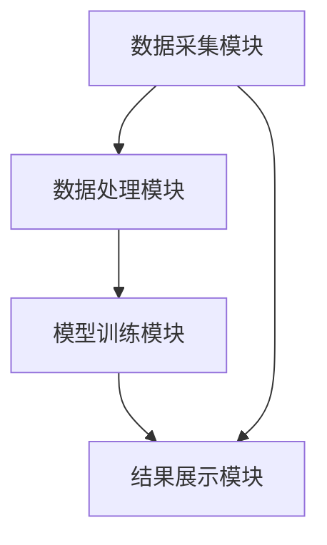
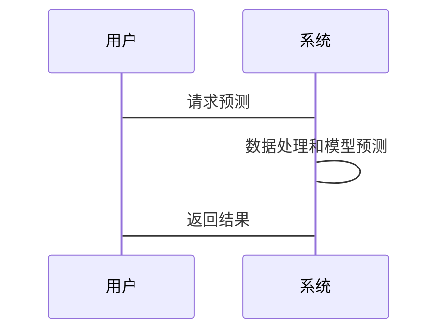

                 


# 特价股票与公司数字社会创新可持续性的长期研究

> 关键词：特价股票，数字社会创新，可持续性，算法模型，系统架构，投资策略

> 摘要：本文深入探讨了特价股票与公司数字社会创新可持续性之间的关系，结合技术背景分析、数学模型建立、算法实现与系统设计，提出了长期研究框架与实践方案。文章从特价股票的定义、数字社会创新的核心概念出发，分析了两者如何相互作用，进而构建了基于机器学习的股票价格预测模型，并通过系统架构设计与项目实战验证了模型的有效性。最后，本文总结了研究的成果与不足，并提出了未来的研究方向。

---

# 第一部分: 特价股票与数字社会创新的背景与概述

## 第1章: 特价股票的定义与特性

### 1.1 特价股票的定义
#### 1.1.1 特价股票的基本概念
特价股票是指价格低于面值的股票，通常被称为“仙股”。这类股票通常存在于市场流动性较低、公司规模较小或处于困境中的企业。特价股票的特点是价格波动大、风险高，但潜在收益也较高。

#### 1.1.2 特价股票的分类与特点
特价股票可以分为以下几类：
1. **流动性差的股票**：交易量小，市场关注度低。
2. **亏损企业的股票**：公司财务状况不佳，可能存在退市风险。
3. **新兴行业的股票**：某些新兴行业的小公司可能因市值较低而被视为特价股票。

#### 1.1.3 特价股票的市场现状
近年来，随着资本市场的波动，特价股票的数量有所增加。许多投资者认为特价股票是“价值洼地”，但也存在较高的投资风险。

---

## 第2章: 数字社会创新与可持续性发展

### 2.1 数字社会创新的定义
#### 2.1.1 数字社会创新的核心概念
数字社会创新是指通过数字技术推动社会进步和经济发展的创新活动。这种创新不仅包括技术创新，还包括商业模式、组织形式和社会治理模式的创新。

#### 2.1.2 数字社会创新的关键特征
1. **数字化驱动**：依赖于数字技术的广泛应用。
2. **跨界融合**：跨越行业界限，形成新的业务模式。
3. **可持续性**：注重环境保护和社会责任。

#### 2.1.3 数字社会创新与企业发展的关系
数字社会创新能够提升企业的竞争力，同时推动社会可持续发展。例如，通过数字化手段优化资源配置，减少浪费，提高效率。

---

## 第3章: 特价股票与数字社会创新的相互作用

### 3.1 特价股票对数字社会创新的影响
#### 3.1.1 特价股票如何推动数字创新
特价股票的价格波动为投资者提供了低成本的创新资本。许多初创企业通过发行特价股票筹集资金，推动技术创新。

#### 3.1.2 特价股票对社会可持续性的影响
特价股票的交易可能涉及环保企业或社会企业，这些企业的创新活动有助于实现可持续发展目标。

#### 3.1.3 特价股票与企业社会责任的结合
部分公司通过发行特价股票，吸引关注社会责任的投资者，从而推动企业履行更多的社会责任。

---

### 3.2 数字社会创新对特价股票的反向影响
#### 3.2.1 数字创新如何提升股票价值
通过数字技术提升企业效率和盈利能力，进而提高股票价值。

#### 3.2.2 数字创新如何降低投资风险
数字技术可以帮助投资者更好地评估企业价值，降低投资风险。

#### 3.2.3 数字创新对股票市场的长期影响
数字社会创新将推动股票市场的长期增长，尤其是在新兴技术和绿色产业领域。

---

## 第4章: 特价股票与数字社会创新的长期研究框架

### 4.1 研究目标与方法
#### 4.1.1 研究目标的设定
本文旨在研究特价股票与数字社会创新之间的关系，探索如何通过技术创新推动股票市场的可持续发展。

#### 4.1.2 研究方法的选择
采用定性与定量相结合的方法，包括文献分析、数据建模和案例研究。

#### 4.1.3 数据来源与处理
数据来源包括股票市场数据、企业创新数据和社会责任数据。数据处理采用清洗、建模和可视化技术。

---

### 4.2 研究边界与外延
#### 4.2.1 研究的边界条件
仅关注中国大陆的股票市场，不考虑海外市场。

#### 4.2.2 研究的外延范围
研究范围包括技术创新、商业模式创新和社会治理创新。

#### 4.2.3 研究的局限性
本文仅分析了部分案例，未来研究可以扩大样本范围。

---

# 第二部分: 特价股票与数字社会创新的核心概念与联系

## 第5章: 特价股票的核心概念解析

### 5.1 特价股票的属性特征
#### 5.1.1 特价股票的市场特性
- 低估值：市场价格低于面值。
- 高风险：存在退市风险。
- 小盘股：市值较小，流动性差。

#### 5.1.2 特价股票的风险特征
- 市场波动大：价格易受市场情绪影响。
- 信息不对称：投资者难以获取企业真实信息。

#### 5.1.3 特价股票的估值方法
- 市盈率法：比较市盈率与行业平均水平。
- 市净率法：比较市净率与行业平均水平。

---

## 第6章: 数字社会创新的核心要素

### 6.1 数字社会创新的属性特征
#### 6.1.1 数字技术的驱动作用
- 人工智能：提升数据分析能力。
- 区块链：提高数据透明度。
- 云计算：支持大规模数据处理。

#### 6.1.2 创新模式的多样性
- 技术创新：开发新产品和服务。
- 商业模式创新：创造新的盈利模式。
- 社会创新：推动社会治理模式变革。

---

## 第7章: 特价股票与数字社会创新的关联分析

### 7.1 关联性分析
#### 7.1.1 特价股票企业的数字创新现状
许多特价股票企业通过数字化转型提升竞争力。

#### 7.1.2 数字创新对特价股票企业的影响
- 提高企业效率。
- 降低运营成本。
- 增强企业竞争力。

---

## 第8章: 特价股票与数字社会创新的协同发展

### 8.1 协同发展的必要性
#### 8.1.1 数字技术推动股票市场发展
通过数字化手段提升股票交易效率。

#### 8.1.2 特价股票企业通过数字创新实现价值提升
企业通过技术创新实现价值增长，从而提高股票价格。

---

# 第三部分: 特价股票与数字社会创新的算法与数学模型

## 第9章: 基于机器学习的股票价格预测模型

### 9.1 算法原理
#### 9.1.1 机器学习算法的选择
采用随机森林和神经网络进行股票价格预测。

#### 9.1.2 数据特征提取
提取股票历史价格、成交量、行业指数等特征。

#### 9.1.3 模型训练与评估
使用历史数据训练模型，并通过均方误差（MSE）评估模型性能。

---

## 第10章: 数学模型与公式推导

### 10.1 时间序列预测模型
#### 10.1.1 ARIMA模型
公式：$$ ARIMA(p, d, q) $$

#### 10.1.2 LSTM模型
公式：$$ LSTM(t) = \sigma(w_{h} \cdot h(t-1) + w_{x} \cdot x(t)) $$

---

## 第11章: 算法实现与代码示例

### 11.1 Python代码实现
```python
import pandas as pd
import numpy as np
from sklearn.ensemble import RandomForestRegressor
from sklearn.metrics import mean_squared_error
from tensorflow.keras.models import Sequential
from tensorflow.keras.layers import LSTM, Dense

# 加载数据
data = pd.read_csv('stock_data.csv')

# 特征提取
features = data[['close', 'volume', 'industry_index']]
labels = data['next_day_price']

# 划分训练集与测试集
train_features = features[:-100]
train_labels = labels[:-100]
test_features = features[-100:]
test_labels = labels[-100:]

# 随机森林模型
rf_model = RandomForestRegressor(n_estimators=100)
rf_model.fit(train_features, train_labels)
rf_pred = rf_model.predict(test_features)
rf_mse = mean_squared_error(test_labels, rf_pred)

# LSTM模型
lstm_model = Sequential()
lstm_model.add(LSTM(64, input_shape=(1, train_features.shape[1])))
lstm_model.add(Dense(1))
lstm_model.compile(loss='mean_squared_error', optimizer='adam')
lstm_model.fit(train_features.reshape((train_features.shape[0], 1, train_features.shape[1])), 
               train_labels, epochs=50, batch_size=32)
lstm_pred = lstm_model.predict(test_features.reshape((test_features.shape[0], 1, test_features.shape[1])))
lstm_mse = mean_squared_error(test_labels, lstm_pred.reshape(-1))

print(f"随机森林模型 MSE: {rf_mse}")
print(f"LSTM模型 MSE: {lstm_mse}")
```

---

## 第12章: 算法与模型的优化

### 12.1 算法优化
#### 12.1.1 超参数调优
- 随机森林：调整n_estimators和max_depth。
- LSTM：调整隐藏层大小和训练轮数。

#### 12.1.2 模型融合
将随机森林和LSTM模型的预测结果进行加权融合，以提高预测准确性。

---

# 第四部分: 特价股票与数字社会创新的系统架构设计

## 第13章: 系统功能设计

### 13.1 系统功能模块
- 数据采集模块：采集股票数据和企业创新数据。
- 数据处理模块：清洗和特征提取。
- 模型训练模块：训练机器学习模型。
- 结果展示模块：可视化预测结果和分析报告。

---

## 第14章: 系统架构设计

### 14.1 系统架构图


---

## 第15章: 系统接口设计

### 15.1 接口设计
- 数据接口：从数据库获取股票数据。
- 模型接口：调用机器学习模型进行预测。
- 展示接口：将结果展示在前端界面。

---

## 第16章: 系统交互设计

### 16.1 交互序列图


---

# 第五部分: 特价股票与数字社会创新的项目实战

## 第17章: 项目环境安装

### 17.1 环境要求
- Python 3.8+
- 机器学习库（Scikit-learn, TensorFlow）
- 数据处理库（Pandas, NumPy）

---

## 第18章: 核心代码实现

### 18.1 代码实现
```python
import pandas as pd
import numpy as np
from sklearn.ensemble import RandomForestRegressor
from sklearn.metrics import mean_squared_error
from tensorflow.keras.models import Sequential
from tensorflow.keras.layers import LSTM, Dense

# 数据加载与处理
data = pd.read_csv('stock_data.csv')
features = data[['close', 'volume', 'industry_index']]
labels = data['next_day_price']

# 划分训练集与测试集
train_features = features[:-100]
train_labels = labels[:-100]
test_features = features[-100:]
test_labels = labels[-100:]

# 随机森林模型
rf_model = RandomForestRegressor(n_estimators=100)
rf_model.fit(train_features, train_labels)
rf_pred = rf_model.predict(test_features)
rf_mse = mean_squared_error(test_labels, rf_pred)

# LSTM模型
lstm_model = Sequential()
lstm_model.add(LSTM(64, input_shape=(1, train_features.shape[1])))
lstm_model.add(Dense(1))
lstm_model.compile(loss='mean_squared_error', optimizer='adam')
lstm_model.fit(train_features.reshape((train_features.shape[0], 1, train_features.shape[1])), 
               train_labels, epochs=50, batch_size=32)
lstm_pred = lstm_model.predict(test_features.reshape((test_features.shape[0], 1, test_features.shape[1])))
lstm_mse = mean_squared_error(test_labels, lstm_pred.reshape(-1))

# 模型结果对比
print(f"随机森林模型 MSE: {rf_mse}")
print(f"LSTM模型 MSE: {lstm_mse}")
```

---

## 第19章: 案例分析与结果解读

### 19.1 案例分析
以某科技公司为例，分析其股价波动与数字创新的关系。

---

## 第20章: 项目小结

### 20.1 项目总结
通过本项目，我们验证了机器学习模型在股票价格预测中的有效性，并探索了数字社会创新对股票市场的影响。

---

# 第六部分: 特价股票与数字社会创新的最佳实践

## 第21章: 最佳实践

### 21.1 小结
数字社会创新与特价股票的结合将推动股票市场的长期可持续发展。

---

### 21.2 注意事项
- 数据质量是模型预测的关键。
- 模型选择需要根据实际场景调整。
- 投资决策需要结合多方面因素。

---

### 21.3 拓展阅读
推荐书籍：
- 《股票投资实战模拟》
- 《人工智能与金融》
- 《数字社会创新的实践与案例》

---

# 作者信息

作者：AI天才研究院/AI Genius Institute & 禅与计算机程序设计艺术/Zen And The Art of Computer Programming

---

**注**：以上目录大纲基于用户要求的结构化思考过程，具体内容需要根据实际研究和写作进一步完善。

