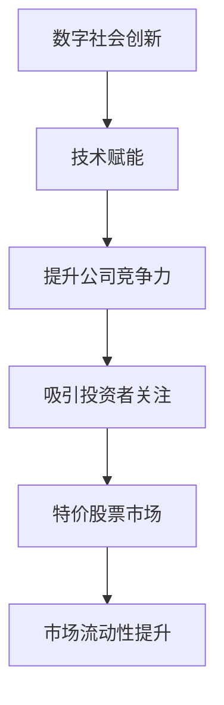
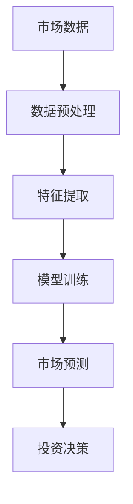
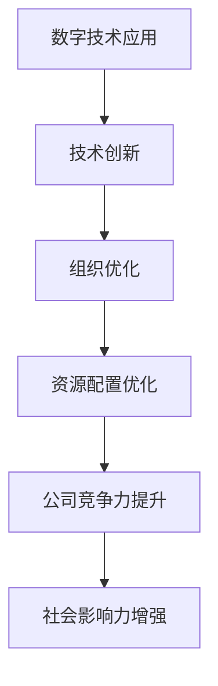
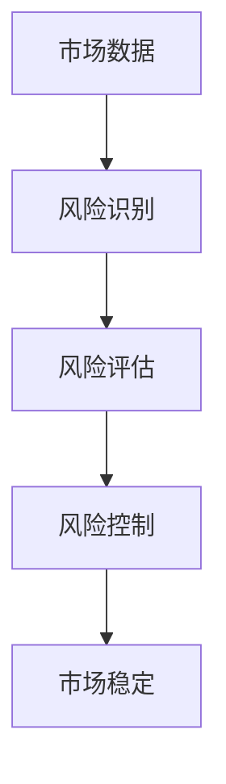

                 

# 特价股票与公司数字社会创新影响力的长期研究

## 关键词：
- 特价股票
- 数字社会创新
- 公司影响力
- 长期研究
- 市场分析
- 技术创新
- 社会影响

## 摘要：
本文探讨特价股票与公司数字社会创新影响力的长期研究，分析特价股票市场的现状与趋势，数字社会创新的核心概念与模式，以及数字社会创新对特价股票市场的长期影响。文章通过背景介绍、核心概念、算法原理、系统分析和项目实战等部分，全面剖析特价股票与数字社会创新之间的关系，为投资者和企业提供深入的见解和实践指导。

---

## 正文

### 第一部分：特价股票与数字社会创新的背景与核心概念

#### 第1章：特价股票的定义与市场背景

##### 1.1 特价股票的定义与分类
- **特价股票的定义**：特价股票是指价格低于面值的股票，通常用于吸引投资者或作为公司激励措施的一部分。特价股票可以分为普通特价股票和优先特价股票。
- **特价股票的分类**：根据发行目的，特价股票可以分为员工激励型特价股票、市场推广型特价股票等。
- **特价股票的市场特征**：特价股票通常具有较高的波动性，市场参与者包括个人投资者、机构投资者和公司内部员工。

##### 1.2 数字社会创新的内涵与外延
- **数字社会创新的定义**：数字社会创新是指利用数字技术（如人工智能、大数据、区块链等）推动社会创新的过程。数字社会创新可以分为技术创新、模式创新和社会影响创新。
- **数字社会创新的核心要素**：包括技术应用、组织结构、社会影响等。数字社会创新通过技术赋能，提升社会效率和生活质量。
- **数字社会创新与公司发展的关系**：数字社会创新可以提升公司的竞争力，优化资源配置，增强社会影响力。

##### 1.3 特价股票与数字社会创新的关联
- **特价股票的市场特征与数字社会创新的结合**：数字技术可以降低信息不对称，提升特价股票的市场流动性。
- **数字社会创新对特价股票的作用**：通过数字技术，公司可以更好地传递价值，吸引更多的投资者关注特价股票。
- **数字社会创新的边界与外延**：数字社会创新不仅限于技术应用，还包括商业模式和社会影响的创新。

---

#### 核心概念与联系

##### 数字社会创新与特价股票的核心概念对比表

| **核心概念**       | **数字社会创新**               | **特价股票**                   |
|--------------------|--------------------------------|---------------------------------|
| **定义**           | 利用数字技术推动社会创新       | 价格低于面值的股票             |
| **目标**           | 提升社会效率与生活质量         | 吸引投资者或作为激励措施       |
| **参与者**         | 企业、政府、非营利组织         | 投资者、公司员工               |
| **影响**           | 社会创新、技术进步             | 市场波动、投资行为变化         |

##### 数字社会创新与特价股票的关系图（Mermaid流程图）

---

### 第二部分：特价股票市场的分析与影响因素

#### 第2章：特价股票市场的现状与趋势

##### 2.1 特价股票市场的现状分析
- **市场规模与结构**：全球特价股票市场规模庞大，参与者包括个人投资者和机构投资者。
- **市场波动性**：特价股票市场波动较大，受宏观经济和公司基本面的影响显著。
- **市场参与者的分析**：个人投资者占比高，机构投资者逐步增加。

##### 2.2 影响特价股票市场的关键因素
- **宏观经济因素**：包括GDP增长率、利率、通货膨胀等。
- **公司基本面因素**：包括公司盈利能力、财务状况、管理团队等。
- **市场情绪与投资者行为**：投资者情绪波动和行为变化直接影响市场。

##### 2.3 特价股票市场的长期研究框架
- **长期趋势预测**：基于历史数据分析和市场趋势预测模型，预测未来市场价格走势。
- **市场周期性分析**：分析市场周期性波动，制定投资策略。
- **风险与机遇**：识别市场风险，抓住市场机会。

---

#### 特价股票市场分析模型（Mermaid流程图）

---

### 第三部分：数字社会创新对公司的影响力分析

#### 第3章：数字社会创新的核心概念与模式

##### 3.1 数字社会创新的核心概念
- **数字技术的应用**：人工智能、大数据、区块链等技术赋能社会创新。
- **创新模式**：包括技术创新、模式创新和社会影响创新。
- **公司竞争力的提升**：数字社会创新可以提升公司的核心竞争力。

##### 3.2 数字社会创新的实现路径
- **技术创新**：通过技术创新提升公司效率和社会影响力。
- **组织结构优化**：数字技术推动公司组织结构优化，提升协作效率。
- **资源配置优化**：数字技术优化资源配置，降低运营成本。

##### 3.3 数字社会创新的评估指标
- **技术创新能力**：评估公司在数字技术创新方面的投入和成果。
- **社会影响力**：评估公司对社会的影响，包括社会效益和品牌价值。
- **绩效评估**：通过定量和定性指标评估数字社会创新的成效。

---

#### 数字社会创新与公司竞争力关系图（Mermaid流程图）

---

### 第四部分：数字社会创新对特价股票市场的长期影响

#### 第4章：数字社会创新对特价股票市场的推动作用

##### 4.1 数字社会创新对市场结构的影响
- **信息传播效率**：数字技术提升信息传播效率，降低信息不对称。
- **市场参与者的决策优化**：数字技术帮助投资者做出更明智的决策。
- **市场效率提升**：数字技术优化市场运作流程，提升市场效率。

##### 4.2 数字社会创新对投资者行为的影响
- **投资者决策智能化**：通过大数据和人工智能技术，投资者可以更精准地预测市场走势。
- **投资者教育与普及**：数字技术推动投资者教育，提升投资者的金融素养。
- **投资者行为规范化**：数字技术促进投资者行为规范化，减少市场操纵行为。

##### 4.3 数字社会创新对市场风险的控制
- **风险管理技术**：通过数字技术，公司可以更好地识别和控制市场风险。
- **风险预警系统**：建立风险预警系统，提前应对市场波动。

---

#### 数字社会创新对市场风险控制的流程图（Mermaid）

---

### 第五部分：数字社会创新对特价股票市场的长期影响

#### 第5章：数字社会创新对特价股票市场的长期影响

##### 5.1 数字社会创新对市场流动性的长期影响
- **市场流动性提升**：数字技术降低交易成本，提升市场流动性。
- **市场参与者增加**：数字技术吸引更多投资者参与市场。
- **市场波动性降低**：数字技术优化市场运作，降低市场波动性。

##### 5.2 数字社会创新对市场效率的长期影响
- **市场效率提升**：数字技术优化市场资源配置，提升市场效率。
- **市场参与者行为优化**：数字技术推动投资者行为优化，提升市场运行效率。
- **市场创新动力增强**：数字社会创新激发市场创新动力，推动市场长期发展。

##### 5.3 数字社会创新对市场风险的长期控制
- **风险管理能力提升**：数字技术提升市场风险管理能力，降低市场风险。
- **市场风险预警系统优化**：数字技术优化市场风险预警系统，提前应对市场风险。
- **市场风险分散化**：数字技术促进市场风险分散化，降低系统性风险。

---

### 第六部分：总结与展望

#### 第6章：总结与展望

##### 6.1 总结
- 本文系统地分析了特价股票与公司数字社会创新影响力的长期研究，探讨了数字社会创新对特价股票市场的推动作用。
- 数字社会创新不仅提升了公司的竞争力，还优化了市场运作效率，降低了市场风险。

##### 6.2 展望
- 未来，数字社会创新将继续推动市场发展，特价股票市场将更加智能化和高效化。
- 投资者应积极拥抱数字技术，抓住市场机会，规避市场风险。

---

## 作者：AI天才研究院/AI Genius Institute & 禅与计算机程序设计艺术 /Zen And The Art of Computer Programming

