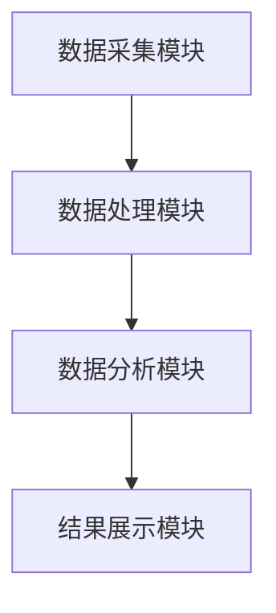

                 


# 特价股票与公司数据主权价值的评估

> 关键词：特价股票，公司数据主权，价值评估，数据主权评分系统，股票定价模型，数据资产

> 摘要：本文系统地探讨了特价股票与公司数据主权价值评估的关联性。通过分析数据主权的核心要素及其对股票价值的影响，本文提出了基于数据主权的股票定价模型，并结合实际案例展示了如何通过系统架构和算法实现数据主权价值的量化评估。最终，本文为投资者和数据管理者提供了实用的评估方法和最佳实践。

---

## 第1章: 特价股票与公司数据主权价值评估的背景介绍

### 1.1 特价股票的定义与特征

#### 1.1.1 什么是特价股票
特价股票是指价格低于面值的股票，通常由于市场波动、公司业绩不佳或特殊事件导致投资者抛售。其特征包括低价格、高波动性和潜在的投资机会。

#### 1.1.2 特价股票的分类与特点
- 按发行公司分类：普通股、优先股。
- 按市场表现分类：低价股、超跌股。
- 特点：高风险、高收益潜力。

#### 1.1.3 特价股票的市场表现与投资机会
特价股票在市场低迷时表现不佳，但在市场回暖时可能反弹。投资者需关注公司基本面和市场情绪。

### 1.2 公司数据主权的定义与内涵

#### 1.2.1 数据主权的基本概念
数据主权是指公司对其数据的控制权和使用权，涉及数据的所有权、管理权和使用权。

#### 1.2.2 数据主权的核心要素
- 数据所有权：公司对数据的合法拥有权。
- 数据管理权：公司对数据的存储、处理和保护能力。
- 数据使用权：公司对数据的分析和应用能力。

#### 1.2.3 数据主权的法律与伦理框架
涉及数据隐私、合规性、安全性和道德责任。

### 1.3 特价股票与公司数据主权价值评估的关联性

#### 1.3.1 特价股票与公司数据资产的关系
数据资产是公司价值的重要组成部分，影响股票价格。

#### 1.3.2 数据主权对股票价值的影响机制
数据主权强的公司更受投资者信任，提升股票价值。

#### 1.3.3 特价股票与数据主权评估的双向互动
数据主权评估影响特价股票定价，而特价股票市场表现又反哺数据主权价值。

---

## 第2章: 特价股票与公司数据主权价值评估的核心概念与联系

### 2.1 数据主权价值评估的理论框架

#### 2.1.1 数据主权价值评估的维度
- 数据质量：准确性、完整性。
- 数据安全性：保护措施。
- 数据应用能力：技术能力。

#### 2.1.2 数据主权价值评估的模型
- 数据主权评分系统：通过多维度指标对数据主权进行评分。
- 数据资产价值计算公式：量化数据资产对股票价值的影响。

#### 2.1.3 数据主权价值评估的关键指标
- 数据资产规模。
- 数据安全性等级。
- 数据应用能力。

### 2.2 特价股票的定价模型

#### 2.2.1 特价股票定价的基本原理
基于公司基本面和市场情绪进行定价。

#### 2.2.2 数据主权对股票定价的影响
数据主权强的公司股票更受市场欢迎。

#### 2.2.3 特价股票与数据主权价值的量化关系
数据主权评分与股票价格呈正相关。

### 2.3 数据主权与股票价值的协同关系

#### 2.3.1 数据主权对股票价值的正向影响
提升市场信任度和投资价值。

#### 2.3.2 数据主权对股票风险的缓解作用
降低数据泄露等风险。

#### 2.3.3 数据主权与股票流动性之间的关系
数据主权强的公司股票流动性更好。

---

## 第3章: 特价股票与公司数据主权价值评估的算法原理

### 3.1 数据主权价值评估的算法模型

#### 3.1.1 数据主权评分系统
- 评分维度：数据质量、安全性和应用能力。
- 评分公式：$$\text{数据主权评分} = \alpha \cdot \text{数据质量} + \beta \cdot \text{数据安全性} + \gamma \cdot \text{数据应用能力}$$

#### 3.1.2 数据资产价值计算公式
$$\text{数据资产价值} = \lambda \cdot \text{数据主权评分}$$

#### 3.1.3 数据主权风险评估模型
$$\text{风险评分} = \mu \cdot \text{数据主权评分} + \nu \cdot \text{市场风险}$$

### 3.2 特价股票定价的算法模型

#### 3.2.1 基于数据主权的股票定价方法
$$\text{股票定价} = \text{基础价格} + \delta \cdot \text{数据主权评分}$$

#### 3.2.2 数据主权对股票估值的影响
数据主权评分高的公司估值更高。

#### 3.2.3 数据主权与股票市场波动的关系
数据主权评分影响股票价格波动。

---

## 第4章: 特价股票与公司数据主权价值评估的系统架构设计

### 4.1 系统功能设计

#### 4.1.1 数据采集模块
- 采集公司数据资产信息。
- 采集市场数据。

#### 4.1.2 数据处理模块
- 数据清洗和预处理。
- 数据主权评分计算。

#### 4.1.3 数据分析模块
- 数据主权价值评估。
- 特价股票定价。

#### 4.1.4 结果展示模块
- 可视化展示数据主权评分。
- 展示股票定价结果。

### 4.2 系统架构设计

#### 4.2.1 系统架构图


#### 4.2.2 模块交互流程


#### 4.2.3 系统接口设计
- 数据接口：数据采集模块与外部数据源交互。
- 结果接口：分析模块向展示模块输出结果。

---

## 第5章: 特价股票与公司数据主权价值评估的项目实战

### 5.1 项目环境安装与配置

#### 5.1.1 数据采集工具安装
- 使用Python库：pandas、requests。

#### 5.1.2 数据处理模块实现
```python
import pandas as pd

def process_data(data):
    # 数据清洗和预处理
    data['数据主权评分'] = data.apply(lambda x: calculate Sovereignty(x), axis=1)
    return data
```

#### 5.1.3 数据分析模块实现
```python
def calculate_sovereignty(row):
    quality = row['数据质量']
    security = row['数据安全性']
    application = row['数据应用能力']
    return alpha * quality + beta * security + gamma * application
```

#### 5.1.4 结果展示模块实现
```python
import matplotlib.pyplot as plt

def plot_results(data):
    plt.bar(data['公司名称'], data['数据主权评分'])
    plt.title('公司数据主权评分')
    plt.show()
```

---

## 第6章: 特价股票与公司数据主权价值评估的最佳实践与小结

### 6.1 最佳实践

- 定期评估数据主权评分。
- 结合市场动态调整评估模型。

### 6.2 小结

本文详细探讨了特价股票与公司数据主权价值评估的关联性，提出了基于数据主权的股票定价模型，并通过系统架构和算法实现了数据主权价值的量化评估。

### 6.3 注意事项

- 数据主权评分需结合公司实际情况调整权重。
- 定价模型需根据市场变化及时更新。

### 6.4 拓展阅读

- 数据主权与企业风险管理。
- 特价股票的市场行为分析。

---

## 第7章: 总结与展望

### 7.1 总结

本文系统地分析了特价股票与公司数据主权价值评估的关系，提出了实用的算法和系统架构。

### 7.2 展望

未来，随着数据主权的重要性日益凸显，相关研究将更加深入，推动股票市场的健康发展。

---

作者：AI天才研究院/AI Genius Institute & 禅与计算机程序设计艺术/Zen And The Art of Computer Programming

