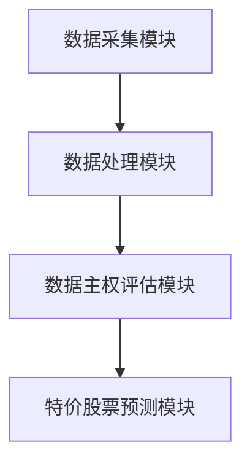

                 


# 特价股票与公司数据主权价值网络的评估

## 关键词：特价股票、数据主权、价值网络、评估模型、数据资产

## 摘要：
本文探讨了特价股票与公司数据主权之间的关系，分析了如何构建数据主权价值网络，并提出了一套基于数据主权的特价股票评估模型。通过数学建模和算法设计，展示了如何利用数据主权网络评估公司价值，为投资者和企业管理者提供了新的视角和工具。

---

# 第一部分: 特价股票与公司数据主权价值网络的背景与基础

## 第1章: 特价股票与公司数据主权概述

### 1.1 特价股票的基本概念

#### 1.1.1 特价股票的定义与分类
特价股票是指面值低于发行价的股票，通常分为优先股和普通股。优先股具有优先分红权，而普通股则具有表决权。

#### 1.1.2 特价股票的市场特征
特价股票市场波动性大，风险较高，但潜在收益也更大。投资者通常基于公司基本面和技术分析进行决策。

#### 1.1.3 特价股票与普通股票的区别
区别主要体现在价格、风险和收益上。普通股票价格稳定，风险较低，而特价股票价格波动大，风险较高。

### 1.2 公司数据主权的定义与内涵

#### 1.2.1 数据主权的基本概念
数据主权指公司对其数据的完全控制权，包括数据的存储、处理和使用。它是公司资产的重要组成部分。

#### 1.2.2 公司数据主权的核心要素
数据主权的核心要素包括数据所有权、数据隐私、数据安全和数据可用性。

#### 1.2.3 数据主权与公司价值的关系
数据主权是公司核心竞争力的体现，良好的数据管理能力能够提升公司价值，反之则可能引发风险。

### 1.3 特价股票与公司数据主权的关联

#### 1.3.1 特价股票市场的数据驱动特征
数据驱动的分析在特价股票投资中至关重要，通过对数据的分析可以发现市场趋势和投资机会。

#### 1.3.2 数据主权对股票价值的影响
数据主权强的公司更受投资者青睐，数据主权弱的公司可能面临股价下跌的风险。

#### 1.3.3 特价股票与公司数据主权网络的形成
公司数据主权网络通过数据共享和协作，形成一个相互依存的价值网络，影响特价股票的定价。

## 1.4 本章小结
本章介绍了特价股票和数据主权的基本概念，分析了它们的关联性，为后续的模型构建奠定了基础。

---

## 第2章: 特价股票与公司数据主权的理论基础

### 2.1 数据主权的经济学分析

#### 2.1.1 数据作为资产的经济学视角
数据被视为生产要素，其价值通过市场交易体现。数据主权强的公司具有更高的市场竞争力。

#### 2.1.2 数据主权的市场价值评估
通过数据资产的量化，评估公司数据主权的价值，进而影响股价。

#### 2.1.3 数据主权与企业竞争力的关系
数据主权是企业核心竞争力的重要组成部分，数据主权强的企业更具竞争优势。

### 2.2 特价股票市场的价值评估模型

#### 2.2.1 传统股票价值评估方法的局限性
传统方法忽视了数据主权对股价的影响，导致评估结果不够准确。

#### 2.2.2 基于数据主权的特价股票评估模型
构建一个综合考虑数据主权和市场因素的评估模型，公式如下：
$$ V = \alpha \cdot D + \beta \cdot S $$
其中，\( V \) 是股票价值，\( D \) 是数据主权指数，\( S \) 是市场因素。

#### 2.2.3 模型的数学表达与公式推导
通过回归分析确定参数 \( \alpha \) 和 \( \beta \)，并验证模型的有效性。

### 2.3 数据主权网络的构建原理

#### 2.3.1 数据主权网络的定义与特征
数据主权网络是一个由多个公司构成的网络，通过数据共享实现价值最大化。

#### 2.3.2 数据主权网络的构建方法
通过数据共享协议和合作机制，构建数据主权网络，提升整体数据处理能力。

#### 2.3.3 数据主权网络的稳定性与可扩展性
网络稳定性依赖于数据安全和隐私保护，可扩展性则需要灵活的架构设计。

## 2.4 本章小结
本章从经济学角度分析了数据主权的价值，并提出了基于数据主权的股票评估模型，为后续的算法设计提供了理论基础。

---

## 第3章: 特价股票与公司数据主权的数学模型与算法

### 3.1 数据主权评估的数学模型

#### 3.1.1 数据主权的量化指标
数据主权的量化指标包括数据完整性、机密性、可用性和隐私性。

#### 3.1.2 数据主权评估的公式推导
通过加权平均法，构建数据主权评估模型：
$$ DS = w_1 \cdot DC + w_2 \cdot DA + w_3 \cdot DP $$
其中，\( DS \) 是数据主权指数，\( DC \) 是数据完整性，\( DA \) 是数据可用性，\( DP \) 是数据隐私，\( w \) 是权重系数。

#### 3.1.3 数据主权评估模型的验证与优化
通过实际数据验证模型的有效性，并调整权重系数以优化评估结果。

### 3.2 特价股票预测的算法实现

#### 3.2.1 基于数据主权的特价股票预测方法
采用线性回归模型，将数据主权指数和市场因素作为自变量，预测股票价格。

#### 3.2.2 算法的数学推导与实现
通过最小二乘法拟合回归模型，公式如下：
$$ P = \beta_0 + \beta_1 \cdot DS + \epsilon $$
其中，\( P \) 是股票价格，\( DS \) 是数据主权指数，\( \epsilon \) 是误差项。

#### 3.2.3 算法的优缺点分析
优点是简单易懂，缺点是预测精度可能不高，需要结合其他方法提升准确性。

### 3.3 数据主权网络的算法优化

#### 3.3.1 数据主权网络的算法设计
使用图论方法，构建数据主权网络的节点和边，分析网络的结构特征。

#### 3.3.2 算法的优化策略
通过节点度和中心性分析，识别网络中的关键节点，优化数据共享和协作机制。

#### 3.3.3 算法的性能评估与对比
比较不同算法的性能，选择最优算法进行实际应用。

## 3.4 本章小结
本章通过数学建模和算法设计，提出了数据主权评估和股票预测的具体实现方法，为后续的系统设计奠定了基础。

---

## 第4章: 特价股票与公司数据主权的系统架构设计

### 4.1 系统功能设计

#### 4.1.1 数据采集模块
负责采集公司数据和市场数据，确保数据的准确性和完整性。

#### 4.1.2 数据处理模块
对数据进行清洗、转换和集成，为后续分析提供高质量的数据支持。

#### 4.1.3 数据主权评估模块
基于数学模型，评估公司的数据主权指数，量化数据资产的价值。

#### 4.1.4 特价股票预测模块
利用算法模型，预测特价股票的价格走势，为投资者提供决策支持。

### 4.2 系统架构设计

#### 4.2.1 模块化设计思路
采用分层架构，将系统划分为数据采集、处理、评估和预测四个模块，各模块之间通过接口通信。

#### 4.2.2 系统架构的mermaid图


### 4.3 系统接口设计

#### 4.3.1 数据接口规范
定义统一的数据接口标准，确保各模块之间的数据兼容性。

#### 4.3.2 接口的调用流程
详细描述接口的调用顺序和参数传递方式，确保系统运行的稳定性。

### 4.4 系统交互设计

#### 4.4.1 系统交互的mermaid序列图
```mermaid
sequenceDiagram
参与者：投资者
参与者 --> 数据采集模块：提交查询请求
数据采集模块 --> 数据处理模块：发送数据处理请求
数据处理模块 --> 数据主权评估模块：发送评估请求
数据主权评估模块 --> 特价股票预测模块：发送预测请求
特价股票预测模块 --> 投资者：返回预测结果
```

## 4.5 本章小结
本章设计了一个模块化的系统架构，详细描述了各模块的功能和交互流程，为系统的实际实现提供了指导。

---

## 第5章: 项目实战与最佳实践

### 5.1 项目实战

#### 5.1.1 环境配置
安装必要的软件和工具，如Python、Pandas、NumPy等，搭建开发环境。

#### 5.1.2 数据处理代码
编写数据清洗和转换的Python代码，确保数据质量。

#### 5.1.3 数据主权评估模型的实现
基于数学模型，编写评估数据主权指数的代码，并进行测试。

#### 5.1.4 特价股票预测模型的实现
实现股票价格预测算法，验证模型的准确性和稳定性。

#### 5.1.5 实际案例分析
通过具体案例分析，展示模型的应用效果和实际价值。

### 5.2 最佳实践

#### 5.2.1 小结
总结项目的主要成果和经验教训，提出改进建议。

#### 5.2.2 注意事项
强调数据隐私保护的重要性，避免数据泄露风险。

#### 5.2.3 拓展阅读
推荐相关领域的书籍和论文，供读者进一步学习。

## 5.3 本章小结
本章通过项目实战，验证了模型的有效性，并提出了实际应用中的注意事项和改进建议。

---

## 作者：AI天才研究院/AI Genius Institute & 禅与计算机程序设计艺术 /Zen And The Art of Computer Programming

---

通过以上结构，文章详细探讨了特价股票与公司数据主权的关系，提出了基于数据主权的评估模型和算法，为投资者和企业管理者提供了理论支持和实践指导。

