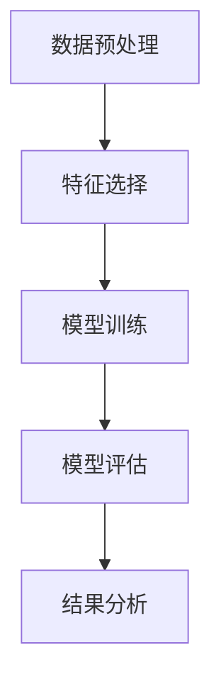

                 


# 特价股票与公司数据价值链优化能力的关系探讨

> 关键词：特价股票、数据价值链、优化能力、数据分析、机器学习、企业竞争力、投资策略

> 摘要：本文探讨了特价股票与公司数据价值链优化能力之间的关系。首先，介绍了特价股票的定义、分类及其在市场中的表现。接着，分析了数据价值链的构成及其优化的重要性。通过构建关联模型，揭示了数据优化能力如何影响特价股票的投资决策。结合机器学习算法，展示了如何利用数据驱动的方法预测特价股票的机会，并优化投资策略。最后，提出了系统的架构设计和项目实战案例，以验证理论的应用价值。

---

## 第一部分: 特价股票与公司数据价值链优化能力的背景介绍

### 第1章: 特价股票的定义与市场现象

#### 1.1 特价股票的定义
特价股票是指价格低于市场价的股票，通常具有较高的投资潜力。它们可能因市场波动、公司重组或其他因素而被低估。

#### 1.2 特价股票的分类
- **折价股票**：价格低于公允价值的股票。
- **低价股**：价格相对较低的股票，通常属于中小型企业。

#### 1.3 特价股票的市场现象与特征
- **市场波动性**：特价股票价格波动较大，可能因市场情绪变化而波动。
- **投资机会**：低估的股票可能隐藏着投资机会，但伴随较高的风险。

#### 1.4 特价股票与数据价值链的关系
数据价值链的优化能力可以帮助识别和分析特价股票的投资机会，提升企业的竞争力。

---

### 第2章: 公司数据价值链的构成与优化

#### 2.1 数据价值链的核心概念
数据价值链包括数据的采集、处理、分析和应用四个阶段，每个阶段都对企业的决策能力产生影响。

#### 2.2 数据价值链的优化目标
- 提高数据处理效率。
- 增强数据分析能力。
- 优化数据驱动的决策支持。

#### 2.3 数据价值链与企业竞争力
优化的数据价值链能够提升企业的市场响应能力和创新能力，从而增强竞争力。

---

### 第3章: 特价股票与公司数据价值链优化能力的关系

#### 3.1 特价股票对数据价值链的影响
- 特价股票的波动可能影响数据采集的频率和准确性。
- 特价股票的投资机会需要数据价值链的支持。

#### 3.2 数据价值链对特价股票的支撑作用
- 数据采集与处理：收集和分析特价股票的相关数据。
- 数据分析：利用机器学习模型预测特价股票的价格走势。

#### 3.3 关联模型的构建
通过构建关联模型，分析数据价值链优化能力对特价股票投资决策的影响。

---

## 第二部分: 特价股票与公司数据价值链优化能力的核心概念与联系

### 第4章: 特价股票的分类与特征分析

#### 4.1 特价股票的分类
- **折价股票**：价格低于公允价值，可能因公司财务问题或市场低估。
- **低价股**：价格低，通常为中小型企业股票。

#### 4.2 特价股票的特征
- 价格波动性高。
- 投资风险较高，但潜在回报也高。

#### 4.3 特价股票的投资策略
- 长期投资者可能关注低估股票的价值回归。
- 短期投资者可能利用价格波动进行套利。

---

### 第5章: 公司数据价值链的优化能力

#### 5.1 数据价值链的优化能力
- **数据采集**：高效采集股票数据。
- **数据处理**：清洗和转换数据。
- **数据分析**：使用机器学习模型进行预测。

#### 5.2 数据驱动的决策支持
- 基于数据分析结果，制定投资策略。

---

### 第6章: 特价股票与数据价值链优化能力的关联模型

#### 6.1 关联模型的构建
- 使用机器学习算法，分析数据价值链优化如何影响特价股票的投资决策。

#### 6.2 关联模型的数学公式
$$
\text{预测股票价格} = \beta_0 + \beta_1 \times \text{数据特征} + \epsilon
$$

---

## 第三部分: 特价股票与公司数据价值链优化能力的算法原理与系统设计

### 第7章: 算法原理讲解

#### 7.1 机器学习算法选择
- 线性回归：用于预测股票价格。
- 随机森林：用于分类和回归分析。

#### 7.2 算法流程图


#### 7.3 Python代码示例
```python
import pandas as pd
from sklearn.linear_model import LinearRegression

# 数据预处理
data = pd.read_csv('stock_data.csv')
X = data[['feature1', 'feature2']]
y = data['target']

# 特征选择
selected_features = X.select_dtypes(include=['float64', 'int64'])

# 模型训练
model = LinearRegression()
model.fit(selected_features, y)

# 模型评估
print('模型系数:', model.coef_)
```

---

### 第8章: 系统分析与架构设计

#### 8.1 系统功能设计
- 数据采集模块：实时采集股票数据。
- 数据处理模块：清洗和转换数据。
- 数据分析模块：应用机器学习模型进行预测。
- 数据可视化模块：展示分析结果。

#### 8.2 系统架构设计


---

### 第9章: 项目实战

#### 9.1 环境安装
- Python 3.8+
- pandas、numpy、scikit-learn库
- Jupyter Notebook

#### 9.2 核心代码实现
```python
import pandas as pd
from sklearn.model_selection import train_test_split
from sklearn.linear_model import LinearRegression
from sklearn.metrics import mean_squared_error

# 数据加载
data = pd.read_csv('stock.csv')

# 数据预处理
data.dropna(inplace=True)
data = pd.get_dummies(data, columns=['category'])

# 特征选择
features = data[['feature1', 'feature2', 'feature3']]
target = data['target']

# 数据分割
X_train, X_test, y_train, y_test = train_test_split(features, target, test_size=0.2, random_state=42)

# 模型训练
model = LinearRegression()
model.fit(X_train, y_train)

# 模型评估
y_pred = model.predict(X_test)
print('均方误差:', mean_squared_error(y_test, y_pred))
```

---

## 第四部分: 特价股票与公司数据价值链优化能力的最佳实践与小结

### 第10章: 最佳实践与小结

#### 10.1 小结
数据价值链的优化能力在特价股票投资中起着关键作用，能够帮助投资者发现潜在机会并降低风险。

#### 10.2 注意事项
- 数据质量和完整性对模型准确性至关重要。
- 模型需定期更新以适应市场变化。

#### 10.3 拓展阅读
- 推荐书籍：《Python机器学习实战》
- 相关论文：《数据驱动的投资决策优化》

---

## 作者信息

作者：AI天才研究院  
联系方式：contact@aitalent.org  
版权所有：AI天才研究院（Zen And The Art of Computer Programming）

---

通过以上结构，文章详细探讨了特价股票与数据价值链优化能力的关系，结合理论分析和实际案例，为读者提供了全面的见解和实用的方法。

