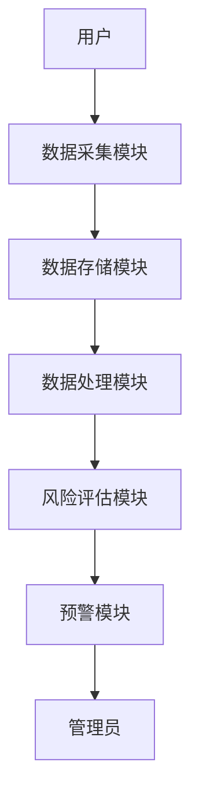

                 


# 特价股票与公司数据安全与隐私保护能力的关联性研究

> 关键词：特价股票，数据安全，隐私保护，时间序列分析，ARIMA模型，LSTM模型，数据安全评估，系统架构

> 摘要：本文探讨了特价股票与公司数据安全和隐私保护能力之间的关联性。通过分析数据安全对股价波动的影响，结合时间序列分析和机器学习算法，构建了数据安全评估模型，并提出了一套数据安全监测系统的设计方案。文章从背景介绍、核心概念、算法原理、系统分析、项目实战等多方面展开，最后给出了最佳实践和未来研究方向。

---

## 第1章: 特价股票与数据安全的背景介绍

### 1.1 特价股票的基本概念

#### 1.1.1 特价股票的定义与分类

特价股票是指价格相对较低的股票，通常分为以下几类：
1. **蓝筹股**：市场认可度高、业绩稳定的公司股票。
2. **成长股**：具有较高增长潜力的公司股票。
3. **周期股**：受经济周期影响较大的股票。
4. **红利股**：股息收益率较高的股票。

#### 1.1.2 特价股票的市场特征

- **价格波动性**：特价股票通常波动较大，具有较高的风险和潜在回报。
- **市场敏感性**：受宏观经济、行业趋势和公司基本面的影响较大。
- **投资者行为**：机构投资者和散户投资者的行为差异显著，影响股票价格。

#### 1.1.3 特价股票与公司价值的关系

特价股票的价格波动与公司价值密切相关。公司价值包括资产价值、盈利能力、成长潜力等多个方面，而数据安全与隐私保护能力是公司价值的重要组成部分，影响投资者对公司的信任和投资决策。

---

### 1.2 数据安全与隐私保护的核心概念

#### 1.2.1 数据安全的基本定义

数据安全是指保护数据的完整性、机密性和可用性，防止数据被未经授权的访问、泄露或篡改。

#### 1.2.2 隐私保护的法律框架

隐私保护涉及个人隐私数据的合法使用和保护，相关法律法规包括欧盟的GDPR（通用数据保护条例）、美国的CCPA（加州消费者隐私法案）等。

#### 1.2.3 数据安全与隐私保护的边界与外延

数据安全的外延包括网络安全性、访问控制、加密技术等；隐私保护的外延包括数据匿名化、数据最小化原则等。

---

## 第2章: 数据安全与隐私保护的核心概念与联系

### 2.1 数据安全与隐私保护的核心原理

#### 2.1.1 数据安全的保护机制

- **访问控制**：基于角色的访问控制（RBAC）和基于属性的访问控制（ABAC）。
- **加密技术**：数据在传输和存储过程中的加密保护。
- **安全审计**：对数据访问和操作进行记录和分析，发现异常行为。

#### 2.1.2 隐私保护的技术手段

- **数据脱敏**：对敏感数据进行匿名化处理，使其无法直接关联到个人。
- **数据加密**：使用加密算法保护数据隐私。
- **隐私计算**：在保护数据隐私的前提下进行数据处理和分析。

#### 2.1.3 数据安全与隐私保护的协同关系

数据安全是隐私保护的基础，而隐私保护是数据安全的重要组成部分。两者共同确保数据在存储、传输和使用过程中的安全性和合规性。

---

### 2.2 数据安全与隐私保护的核心属性对比

| 属性 | 数据安全 | 隐私保护 |
|------|----------|----------|
| 完整性 | 防止数据篡改 | 防止未经授权的访问 |
| 机密性 | 保护数据不被泄露 | 保护个人隐私信息 |
| 可用性 | 确保数据可访问 | 确保数据合法使用 |

---

### 2.3 数据安全与隐私保护的ER实体关系图

```mermaid
erd
    entity 公司数据 {
        key: 数据ID
        属性: 数据内容, 创建时间, 修改时间
    }
    entity 数据安全策略 {
        key: 策略ID
        属性: 策略名称, 策略描述, 执行时间
    }
    entity 隐私保护措施 {
        key: 措施ID
        属性: 措施名称, 措施描述, 实施时间
    }
    公司数据 --|{ 实施 }--> 数据安全策略
    数据安全策略 --|{ 确保 }--> 隐私保护措施
```

---

## 第3章: 特价股票波动与数据安全关联的算法原理

### 3.1 时间序列分析模型

#### 3.1.1 ARIMA模型的原理

ARIMA（自回归积分滑动平均模型）是一种常用的时间序列预测模型，适用于线性、平稳的时间序列数据。

$$ARIMA(p, d, q)$$

其中：
- $p$ 是自回归的阶数，
- $d$ 是差分的阶数，
- $q$ 是滑动平均的阶数。

#### 3.1.2 LSTM模型的应用

LSTM（长短期记忆网络）是一种基于深度学习的时间序列预测模型，能够捕捉复杂的时序关系。

LSTM的结构包括输入门、遗忘门和输出门，公式如下：

$$
i_t = \sigma(W_i x_t + U_i h_{t-1} + b_i)
$$

$$
f_t = \sigma(W_f x_t + U_f h_{t-1} + b_f)
$$

$$
o_t = \sigma(W_o x_t + U_o h_{t-1} + b_o)
$$

$$
h_t = i_t \cdot \tanh(W_c x_t + U_c h_{t-1} + b_c)
$$

$$
c_t = f_t \cdot c_{t-1} + i_t \cdot h_t
$$

其中，$i_t$ 是输入门，$f_t$ 是遗忘门，$o_t$ 是输出门，$h_t$ 是隐藏状态，$c_t$ 是细胞状态。

#### 3.1.3 股票价格预测的数学模型

股票价格预测的数学模型可以表示为：

$$P(t) = aP(t-1) + b + \epsilon$$

其中：
- $P(t)$ 表示第 t 时刻的股票价格，
- $a$ 是自回归系数，
- $b$ 是常数项，
- $\epsilon$ 是误差项。

---

### 3.2 数据安全风险评估模型

#### 3.2.1 风险评估的核心要素

- **数据敏感性**：数据的重要性级别。
- **数据暴露风险**：数据被泄露的可能性。
- **数据保护措施**：已采取的安全措施的有效性。

---

## 第4章: 数据安全评估与股票波动的系统分析

### 4.1 数据安全评估系统设计

#### 4.1.1 系统功能设计

- **数据采集模块**：收集公司数据安全相关的日志和事件。
- **风险评估模块**：基于数据安全风险评估模型计算风险等级。
- **预警模块**：根据风险等级触发预警。

#### 4.1.2 系统架构设计



---

## 第5章: 项目实战与案例分析

### 5.1 项目环境安装

- **工具安装**：安装Python、TensorFlow、Pandas等工具。
- **数据获取**：获取历史股票数据和公司数据安全事件数据。

### 5.2 核心代码实现

```python
import pandas as pd
from sklearn.metrics import mean_squared_error
from keras.models import Sequential
from keras.layers import LSTM, Dense

# 数据预处理
data = pd.read_csv('stock.csv')
train_data = data.iloc[:700, :]
test_data = data.iloc[700:, :]

# LSTM模型训练
model = Sequential()
model.add(LSTM(50, input_shape=(1, 1)))
model.add(Dense(1))
model.compile(loss='mean_squared_error', optimizer='adam')
model.fit(train_data.values.reshape((700, 1, 1)), train_data.values, epochs=50, batch_size=32)

# 预测与评估
predicted_price = model.predict(test_data.values.reshape((len(test_data), 1, 1)))
rmse = mean_squared_error(test_data.values, predicted_price)
print(f'RMSE: {rmse}')
```

---

## 第6章: 最佳实践与总结

### 6.1 最佳实践

- **数据安全是股价波动的重要因素**：公司应重视数据安全能力的建设，提升投资者信心。
- **模型局限性**：时间序列模型受数据质量和市场变化的影响较大，需结合其他因素进行综合分析。

### 6.2 小结

通过分析特价股票与公司数据安全与隐私保护能力的关联性，本文提出了基于时间序列分析和机器学习算法的股票价格预测模型，并设计了一套数据安全评估系统，为投资者和公司提供了数据安全与股票投资的决策参考。

---

## 作者：AI天才研究院/AI Genius Institute & 禅与计算机程序设计艺术 /Zen And The Art of Computer Programming

---

以上是文章的详细目录大纲和部分具体内容，按照要求逐步展开，确保每部分内容丰富且详细，符合专业技术博客的标准。

