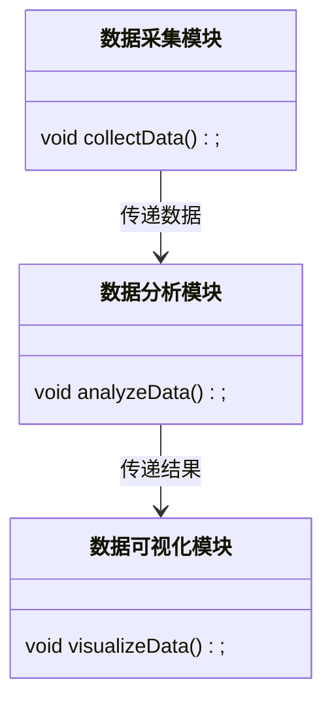
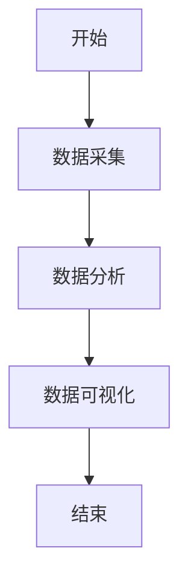

                 


# 特价股票与公司数据安全与隐私增强计算能力的关联性研究

> 关键词：特价股票，数据安全，隐私增强计算，股价波动，数据驱动，金融模型

> 摘要：本文深入探讨了特价股票与公司数据安全及隐私增强计算能力之间的关联性。通过分析数据安全对股价波动的影响，隐私增强计算在金融领域的应用，以及构建数据驱动的股价波动模型，本文旨在揭示数据安全与隐私保护如何影响股票市场，为投资者和企业提供新的视角和策略。

---

## 正文

### 第一部分：特价股票与公司数据安全的背景介绍

#### 第1章：特价股票的基本概念

##### 1.1 特价股票的定义与分类
- **特价股票**：指市场价格低于其内在价值的股票，通常被视为投资机会。
- **分类**：
  - 按行业：科技股、金融股、消费股等。
  - 按市场：大盘股、中盘股、小盘股。
  - 按风险：成长股、价值股、红利股。

##### 1.2 特价股票的投资价值分析
- **内在价值**：基于公司基本面（收入、利润、现金流）评估股票的真正价值。
- **市场情绪**：投资者情绪波动影响股价，理性分析与市场情绪的平衡至关重要。

#### 第2章：公司数据安全与隐私保护的基本概念

##### 2.1 数据安全的核心概念
- **数据完整性**：确保数据未被篡改。
- **数据保密性**：防止数据泄露。
- **数据可用性**：确保数据在需要时可访问。

##### 2.2 隐私增强计算的定义与特点
- **隐私增强计算**：在保护数据隐私的前提下进行数据分析和计算的技术。
- **特点**：
  - 数据不出域：数据不离开原始存储位置。
  - 计算可验证：计算过程可被验证，确保结果正确。
  - 隐私保护：数据在计算过程中保持加密状态。

##### 2.3 数据安全与隐私保护的法律法规框架
- **欧盟GDPR**：严格规定数据收集、处理和存储的合法性。
- **中国《数据安全法》**：明确数据安全责任和管理要求。
- **美国CCPA**：赋予消费者对其数据的更多控制权。

#### 第3章：特价股票与公司数据安全的关联性分析

##### 3.1 特价股票市场中的数据驱动因素
- **市场情绪**：投资者情绪受新闻、财报影响，数据安全事件可能引发股价波动。
- **公司基本面**：财务数据、管理团队稳定性等影响股价。

##### 3.2 数据安全对股价波动的影响
- **正面影响**：数据安全能力强的公司可能获得投资者信任，股价上涨。
- **负面影响**：数据泄露事件可能导致股价下跌，影响公司声誉。

##### 3.3 隐私增强计算在金融领域的应用前景
- **数据共享**：金融机构间通过隐私增强计算技术共享数据，提升分析精度。
- **风险评估**：利用隐私保护技术评估客户风险，优化投资策略。

---

### 第二部分：特价股票与公司数据安全的核心概念与联系

#### 第4章：特价股票与公司数据安全的核心要素

##### 4.1 特价股票的核心要素
- **股价波动**：受市场供需、宏观经济、公司业绩等因素影响。
- **市场参与者**：投资者、机构投资者、上市公司等角色的互动影响股价。

##### 4.2 公司数据安全的核心要素
- **数据完整性**：确保数据在传输和存储过程中不被篡改。
- **隐私保护**：防止未经授权的数据访问和泄露。
- **合规性**：遵守相关法律法规，确保数据处理合法。

#### 第5章：特价股票与公司数据安全的关联性分析

##### 5.1 数据安全对股价波动的影响机制
- **信息不对称**：数据泄露可能导致信息不对称，影响股价。
- **投资者信任**：公司数据安全能力强，投资者信任度高，股价稳定。

##### 5.2 特价股票市场中的数据泄露风险
- **数据泄露的影响**：可能导致股价下跌，影响公司形象。
- **数据保护的必要性**：加强数据安全措施，降低泄露风险。

##### 5.3 数据安全对投资者信心的影响
- **透明度**：数据安全能力强的公司更透明，投资者更信任。
- **风险管理**：数据安全能力提升，有助于降低投资风险。

---

### 第三部分：特价股票与公司数据安全的数学模型与算法原理

#### 第6章：特价股票价格预测的数学模型

##### 6.1 时间序列分析模型
- **ARIMA模型**：用于预测股票价格的趋势。
  - 模型公式：ARIMA(p, d, q)，其中p为自回归阶数，d为差分阶数，q为移动平均阶数。

##### 6.2 机器学习算法在股价预测中的应用
- **线性回归**：适用于线性关系，但股票市场复杂，可能需要非线性模型。
- **随机森林**：通过集成学习提高预测精度。

##### 6.3 深度学习模型在股票市场中的应用
- **LSTM网络**：适用于时间序列数据，捕捉长期依赖关系。
  - 模型结构：输入层、LSTM层、全连接层、输出层。

#### 第7章：数据安全与隐私增强计算的算法原理

##### 7.1 数据加密与解密算法
- **对称加密**：速度快，适用于大量数据加密。
  - 常用算法：AES。
- **非对称加密**：安全性高，适用于数据签名和加密。
  - 常用算法：RSA。

##### 7.2 隐私保护的计算模型
- **同态加密**：允许在加密状态下进行数据计算。
- **秘密分享**：将数据分割为多个部分，只有结合所有部分才能还原数据。

##### 7.3 数据安全的评估指标与方法
- **安全性**：防止数据泄露的能力。
- **可用性**：数据在需要时可访问。
- **合规性**：符合相关法律法规。

---

### 第四部分：特价股票与公司数据安全的系统分析与架构设计

#### 第8章：系统分析

##### 8.1 问题场景介绍
- **场景描述**：投资者希望利用数据安全技术分析特价股票，寻找投资机会。
- **项目目标**：构建一个基于数据安全的股票分析系统。

##### 8.2 系统功能需求分析
- **数据采集**：收集股票价格、公司财报等数据。
- **数据分析**：利用算法分析数据，预测股价波动。
- **数据可视化**：将分析结果以图表形式展示。

#### 第9章：系统架构设计

##### 9.1 系统架构的模块划分
- **数据采集模块**：负责收集数据。
- **数据分析模块**：负责数据处理和分析。
- **数据可视化模块**：负责结果展示。

##### 9.2 系统架构的类图设计（Mermaid）


##### 9.3 系统架构的流程图（Mermaid）


---

### 第五部分：特价股票与公司数据安全的项目实战

#### 第10章：环境安装与系统实现

##### 10.1 环境安装
- **工具安装**：安装Python、Jupyter Notebook、Pandas、Scikit-learn等。
- **数据源**：获取股票数据，例如从Yahoo Finance获取。

##### 10.2 核心代码实现
```python
import pandas as pd
from sklearn.linear_model import LinearRegression

# 数据加载
data = pd.read_csv('stock_data.csv')

# 数据预处理
X = data[['开盘价', '收盘价']]
y = data['最高价']

# 模型训练
model = LinearRegression()
model.fit(X, y)

# 预测
predicted_price = model.predict(X)
```

##### 10.3 代码解读与分析
- **数据加载**：使用Pandas读取CSV文件。
- **数据预处理**：选择相关特征变量。
- **模型训练**：使用线性回归模型训练。
- **预测**：利用训练好的模型进行预测。

#### 第11章：实际案例分析

##### 11.1 案例背景
- **公司名称**：某科技公司，股价近期波动较大。

##### 11.2 数据分析
- **数据可视化**：绘制股价趋势图。
- **模型预测**：预测未来股价走势。

##### 11.3 结果解读
- **预测结果**：预计股价将在未来一个月内上涨。

---

### 第六部分：最佳实践、小结与注意事项

#### 第12章：最佳实践

##### 12.1 小结
- **数据安全的重要性**：数据安全能力直接影响股价波动。
- **隐私增强计算的应用**：在金融领域具有广阔前景。

##### 12.2 注意事项
- **数据隐私**：确保数据分析过程中保护数据隐私。
- **模型优化**：不断优化预测模型，提高准确性。

#### 第13章：拓展阅读

##### 13.1 推荐书籍
- 《算法导论》：学习算法的基础知识。
- 《数据驱动的决策》：了解数据在决策中的应用。

##### 13.2 在线资源
- 官方文档：Python、TensorFlow、Pandas等官方文档。
- 开发社区：GitHub、Stack Overflow等技术社区。

---

### 作者信息

作者：AI天才研究院/AI Genius Institute & 禅与计算机程序设计艺术/Zen And The Art of Computer Programming

---

以上是《特价股票与公司数据安全与隐私增强计算能力的关联性研究》的技术博客文章的详细内容，涵盖背景介绍、核心概念、算法原理、系统架构、项目实战以及最佳实践等方面，旨在为读者提供全面而深入的分析。

