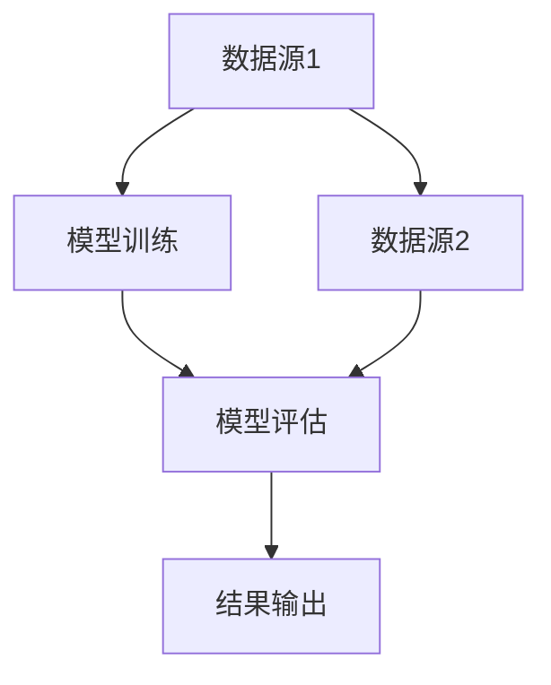
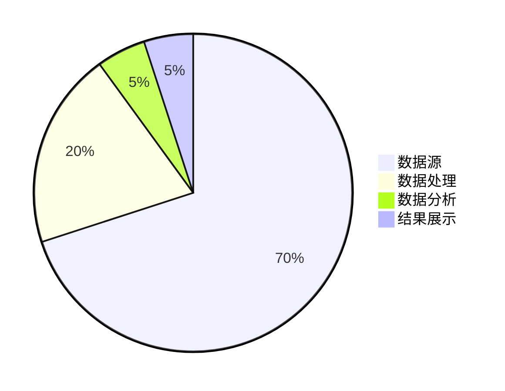
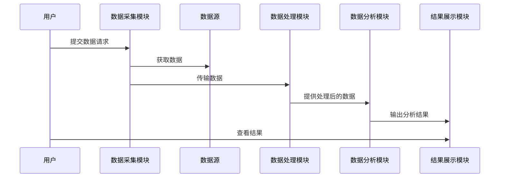

                 


# 特价股票与公司数据安全与隐私计算商业化能力的关联性研究

> 关键词：特价股票、数据安全、隐私计算、商业化能力、关联性分析

> 摘要：本文研究了特价股票与公司数据安全及隐私计算商业化能力之间的关联性。通过分析特价股票的市场特征和数据安全的重要性，探讨了隐私计算在股票数据分析中的应用。结合算法原理和系统架构设计，本文提出了利用隐私计算技术进行数据关联性分析的方法，并通过实际案例展示了如何将数据安全与隐私保护应用于投资决策中，为数据驱动的投资策略提供了新的思路。

---

## 第1章: 特价股票与公司数据安全概述

### 1.1 特价股票的定义与特征

#### 1.1.1 特价股票的定义  
特价股票是指价格低于面值的股票，通常由于市场波动、公司业绩不佳或其他负面因素导致其价格被低估。这类股票往往具有较高的投资潜力，吸引投资者关注。

#### 1.1.2 特价股票的市场特征  
- **价格波动性**：特价股票的价格波动较大，容易受到市场情绪和外部因素的影响。
- **低估值**：这类股票通常被市场低估，具有较高的潜在回报。
- **高风险**：由于公司基本面可能存在问题，投资风险较高。

#### 1.1.3 特价股票的投资价值  
投资者可以通过分析公司财务状况、行业趋势和市场情绪，挖掘特价股票的投资机会。然而，这也需要投资者具备较高的风险承受能力和市场敏感性。

### 1.2 公司数据安全与隐私计算的背景

#### 1.2.1 数据安全的重要性  
数据是企业的核心资产，保护数据安全是企业运营的基础。数据泄露可能导致企业声誉受损、财务损失，甚至面临法律风险。

#### 1.2.2 隐私计算的核心概念  
隐私计算是一种在保护数据隐私的前提下，对数据进行分析和计算的技术。它通过加密、脱敏和零知识证明等方法，确保数据在计算过程中不被泄露。

#### 1.2.3 数据安全与隐私计算的市场趋势  
随着数据驱动的业务模式越来越普遍，数据安全和隐私计算的需求也在不断增加。企业越来越重视数据隐私保护，推动了相关技术的发展和商业化。

### 1.3 特价股票与公司数据安全的关联性

#### 1.3.1 特价股票数据的敏感性  
特价股票的分析通常涉及大量敏感数据，如公司财务数据、交易记录等。这些数据的泄露可能影响公司的股价和市场地位。

#### 1.3.2 数据安全对投资决策的影响  
数据安全直接影响投资者对公司的信任和投资决策。通过确保数据安全，企业可以增强投资者信心，提升市场形象。

#### 1.3.3 隐私计算在股票数据分析中的应用  
隐私计算技术可以用于保护投资者和公司的数据隐私，同时支持对特价股票的分析。通过隐私计算，可以在不泄露原始数据的情况下，进行联合分析和模型训练。

---

## 第2章: 特价股票与公司数据安全的核心概念

### 2.1 特价股票分析的核心要素

#### 2.1.1 市场情绪分析  
市场情绪是影响股票价格的重要因素。通过分析社交媒体、新闻报道等信息，可以评估市场情绪对特价股票的影响。

#### 2.1.2 财务指标评估  
公司财务指标如市盈率、ROE等，是评估股票价值的重要依据。通过分析这些指标，可以判断特价股票的投资价值。

#### 2.1.3 行业趋势分析  
行业趋势对股票价格有直接影响。通过分析行业动态，可以预测特价股票的未来走势。

### 2.2 数据安全与隐私计算的核心原理

#### 2.2.1 数据加密技术  
数据加密是保护数据安全的基础技术。通过加密算法，可以确保数据在传输和存储过程中的安全性。

#### 2.2.2 数据脱敏处理  
数据脱敏是将敏感数据进行匿名化处理，使其在分析和计算过程中无法还原出原始数据。

#### 2.2.3 零知识证明在隐私计算中的应用  
零知识证明允许一方在不泄露任何信息的情况下，证明自己拥有某种信息。这在隐私计算中用于验证数据的正确性，同时保护数据隐私。

### 2.3 特价股票与公司数据安全的关联模型

#### 2.3.1 数据关联性分析  
通过分析特价股票与公司数据之间的关联性，可以识别影响股票价格的关键因素。

#### 2.3.2 数据安全风险评估  
评估公司在数据安全方面存在的风险，制定相应的防护措施，确保数据的安全性和隐私性。

#### 2.3.3 隐私计算在关联性研究中的应用  
利用隐私计算技术，可以在保护数据隐私的前提下，进行跨机构的数据关联性分析，支持投资决策。

---

## 第3章: 特价股票与公司数据安全的关联性分析

### 3.1 数据关联性分析方法

#### 3.1.1 统计分析方法  
统计分析方法通过分析数据的分布、相关性等，识别数据之间的关联性。例如，使用相关系数分析股票价格与财务指标之间的关系。

#### 3.1.2 机器学习模型  
机器学习模型可以通过训练数据，识别数据中的模式和关联性。例如，使用随机森林或神经网络模型，预测股票价格的变化趋势。

#### 3.1.3 图论分析  
图论分析可以通过构建图结构，识别数据之间的关系和网络。例如，使用图论分析股票之间的关联性，识别市场中的领头羊和跟随者。

### 3.2 数据关联性分析的实现

#### 3.2.1 数据预处理  
数据预处理包括数据清洗、标准化和特征提取。通过预处理，可以提高分析的准确性和效率。

#### 3.2.2 数据关联性分析的代码实现  
以下是使用Python进行数据关联性分析的代码示例：

```python
import pandas as pd
import numpy as np

# 加载数据
data = pd.read_csv('stock_data.csv')

# 计算相关系数矩阵
correlation_matrix = data.corr()

# 绘制热力图
import seaborn as sns
sns.heatmap(correlation_matrix, annot=True, cmap='coolwarm')
plt.show()
```

#### 3.2.3 数据关联性分析的数学模型  
相关系数分析的数学公式如下：

$$
\text{相关系数} = \frac{\sum (x_i - \bar{x})(y_i - \bar{y})}{\sqrt{\sum (x_i - \bar{x})^2 \sum (y_i - \bar{y})^2}}
$$

其中，$$x_i$$ 和 $$y_i$$ 是变量 $$x$$ 和 $$y$$ 的观测值，$$\bar{x}$$ 和 $$\bar{y}$$ 是它们的平均值。

### 3.3 隐私计算在数据关联性分析中的应用

#### 3.3.1 隐私计算的实现方法  
隐私计算可以通过联邦学习、安全多方计算等技术实现。以下是联邦学习的流程图：



#### 3.3.2 隐私计算在投资决策中的应用  
通过隐私计算技术，可以在保护数据隐私的前提下，进行跨机构的数据分析，支持投资决策。

---

## 第4章: 系统分析与架构设计方案

### 4.1 系统分析

#### 4.1.1 项目背景与需求  
本项目旨在利用隐私计算技术，分析特价股票的数据，支持投资决策。

#### 4.1.2 系统功能设计  
系统功能包括数据采集、数据处理、数据分析和结果展示。

#### 4.1.3 系统架构设计  
以下是系统架构图：



#### 4.1.4 系统接口设计  
系统接口包括数据采集接口、数据分析接口和结果展示接口。

#### 4.1.5 系统交互序列图  
以下是系统交互序列图：



---

## 第5章: 项目实战

### 5.1 环境安装

#### 5.1.1 安装Python环境  
安装Python 3.8及以上版本，并安装必要的库，如pandas、numpy、seaborn等。

#### 5.1.2 安装隐私计算框架  
安装隐私计算框架，如TensorFlow Federated或PyTorch Federated。

### 5.2 系统核心实现

#### 5.2.1 数据采集模块  
以下是数据采集模块的代码示例：

```python
import pandas as pd

def load_data(file_path):
    data = pd.read_csv(file_path)
    return data
```

#### 5.2.2 数据处理模块  
以下是数据处理模块的代码示例：

```python
def preprocess_data(data):
    # 数据清洗
    data = data.dropna()
    # 特征提取
    features = data[['feature1', 'feature2']]
    return features
```

#### 5.2.3 数据分析模块  
以下是数据分析模块的代码示例：

```python
from sklearn.model import LinearRegression

def analyze_data(features, target):
    model = LinearRegression()
    model.fit(features, target)
    return model.predict(features)
```

#### 5.2.4 结果展示模块  
以下是结果展示模块的代码示例：

```python
import matplotlib.pyplot as plt

def display_results(predicted, actual):
    plt.scatter(predicted, actual)
    plt.xlabel('Predicted')
    plt.ylabel('Actual')
    plt.show()
```

### 5.3 实际案例分析

#### 5.3.1 数据采集与处理  
从数据源获取特价股票数据，进行清洗和特征提取。

#### 5.3.2 数据分析  
使用机器学习模型进行数据分析，预测股票价格的变化趋势。

#### 5.3.3 结果展示  
将分析结果可视化，展示模型的预测结果和实际数据的对比。

### 5.4 项目总结  
通过本项目，我们展示了如何利用隐私计算技术进行特价股票的数据分析，支持投资决策。

---

## 第6章: 最佳实践与注意事项

### 6.1 最佳实践 tips  
- 数据安全是投资决策的重要保障。
- 隐私计算技术可以有效保护数据隐私。
- 数据分析模型需要不断优化和更新。

### 6.2 小结  
本文研究了特价股票与公司数据安全及隐私计算商业化能力的关联性，提出了利用隐私计算技术进行数据分析的方法。

### 6.3 注意事项  
- 数据分析需要遵守相关法律法规。
- 数据隐私保护是企业的重要责任。
- 投资决策需要结合多方面因素进行综合判断。

### 6.4 拓展阅读  
- 推荐阅读《隐私计算：数据安全的新范式》。
- 推荐阅读《数据驱动的投资决策》。

---

## 作者：AI天才研究院 & 禅与计算机程序设计艺术

---

通过以上章节的详细分析和实际案例的展示，我们深入探讨了特价股票与公司数据安全及隐私计算商业化能力的关联性，为数据驱动的投资策略提供了新的思路。

