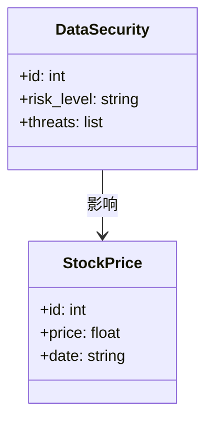
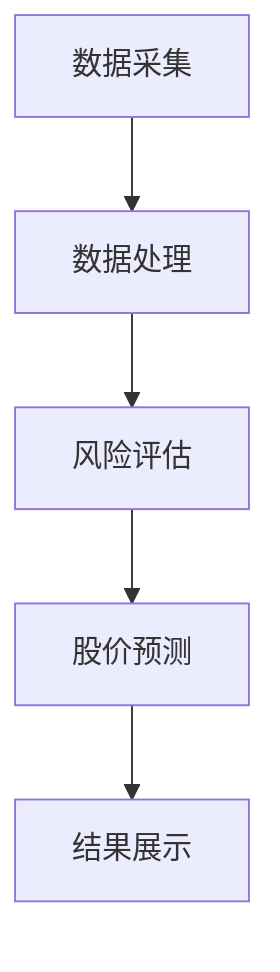

                 


# 特价股票与公司数据安全能力的关联性研究

---

## 关键词

- 特价股票
- 数据安全能力
- 数据安全风险评估
- 股价波动
- 数据安全算法
- 数据分类与分级

---

## 摘要

本文旨在探讨特价股票与公司数据安全能力之间的关联性，从数据安全对企业价值的影响、特价股票市场的波动性与数据安全的关系等角度进行深入分析。文章首先介绍了特价股票和数据安全能力的基本概念，然后构建了数据安全风险评估模型，并通过算法原理和系统架构设计，进一步验证了数据安全能力对股价波动的具体影响。最后，结合实际案例，提出了数据安全能力提升的建议，为投资者和企业管理者提供了重要的参考。

---

# 第1章: 特价股票与数据安全的背景介绍

## 1.1 特价股票的定义与特征

### 1.1.1 特价股票的定义

特价股票是指价格相对较低的股票，通常被投资者视为具有较高增长潜力的股票。这类股票可能来自中小型企业或新兴行业，其价格波动较大，但潜在回报较高。

### 1.1.2 特价股票的特征

| 特征 | 描述 |
|------|------|
| 低价 | 通常价格低于市场平均水平 |
| 高波动 | 波动性较大，风险与收益并存 |
| 中小盘股 | 多数为中小盘股票，流动性相对较低 |

### 1.1.3 特价股票的市场定位

特价股票主要集中在成长型企业，这些企业可能处于扩张阶段，具有较高的增长潜力，但同时也伴随着较高的风险。

## 1.2 公司数据安全能力的定义与重要性

### 1.2.1 数据安全能力的定义

数据安全能力是指企业在保护数据完整性、保密性和可用性方面的能力，包括技术、策略和管理等多个方面。

### 1.2.2 数据安全能力的构成要素

| 要素 | 描述 |
|------|------|
| 技术 | 数据加密、防火墙、入侵检测系统等 |
| 策略 | 数据分类、访问控制策略等 |
| 管理 | 安全培训、风险评估、应急响应等 |

### 1.2.3 数据安全能力的重要性

数据是企业的核心资产，数据安全能力直接影响企业的声誉、法律责任和财务稳定性。

## 1.3 特价股票与数据安全能力的关联性背景

### 1.3.1 数据安全对企业价值的影响

数据泄露等安全事件可能导致企业股价下跌，影响投资者信心。

### 1.3.2 特价股票市场的波动性与数据安全的关系

特价股票市场波动较大，数据安全事件可能加剧这种波动。

### 1.3.3 研究背景与意义

随着数字化转型的推进，数据安全问题日益重要，研究其对股价的影响具有现实意义。

---

# 第2章: 特价股票与数据安全能力的核心概念

## 2.1 特价股票的核心要素

### 2.1.1 市场供需关系

市场供需关系直接影响股票价格，供不应求时，价格上升。

### 2.1.2 股价波动机制

股价波动由市场情绪、公司业绩、宏观经济等多种因素引起。

### 2.1.3 投资者行为分析

投资者行为受心理、市场信息等多种因素影响，可能导致股价波动。

## 2.2 数据安全能力的核心要素

### 2.2.1 数据分类与分级

数据分类与分级是数据安全管理的基础，确保重要数据得到优先保护。

### 2.2.2 安全策略与措施

制定合理的安全策略，如访问控制、加密技术等，是数据安全的关键。

### 2.2.3 安全技术与工具

使用先进的安全技术与工具，如防火墙、入侵检测系统，是保障数据安全的重要手段。

## 2.3 特价股票与数据安全能力的关联性分析

### 2.3.1 数据安全对企业股价的影响

数据安全事件可能导致股价下跌，影响企业市值。

### 2.3.2 特价股票市场的数据安全风险

特价股票市场波动较大，数据安全风险可能加剧市场波动。

### 2.3.3 关联性分析的理论框架

通过数据分析和建模，研究数据安全能力与股价波动之间的关系。

---

# 第3章: 数据安全风险评估模型

## 3.1 数据安全风险评估的定义与方法

### 3.1.1 风险评估的基本概念

风险评估是通过分析可能的安全威胁和漏洞，评估其对企业的影响。

### 3.1.2 常用风险评估方法

- 定性评估：基于经验和专家意见。
- 定量评估：基于数据和模型。

### 3.1.3 数据安全风险评估的独特性

数据安全风险评估需要结合企业的业务特点和数据重要性。

## 3.2 数据安全风险评估模型的构建

### 3.2.1 模型构建的基本思路

从数据分类、威胁分析、漏洞评估等方面入手，构建综合风险评估模型。

### 3.2.2 模型的输入变量

- 数据重要性
- 威胁概率
- 漏洞影响

### 3.2.3 模型的输出结果

- 风险等级
- 需优先处理的威胁

## 3.3 数据安全风险评估模型的数学表达

### 3.3.1 模型的数学公式

$$ R = \sum_{i=1}^{n} (T_i \times V_i) $$

其中，$R$ 表示风险值，$T_i$ 表示第 $i$ 个威胁的概率，$V_i$ 表示第 $i$ 个威胁的影响。

---

# 第4章: 数据安全对股价影响的算法原理

## 4.1 数据安全风险评估的算法选择

### 4.1.1 线性回归模型

线性回归模型用于分析数据安全风险与股价之间的线性关系。

### 4.1.2 神经网络模型

神经网络模型能够捕捉非线性关系，适合复杂的数据安全风险评估。

### 4.1.3 支持向量机模型

支持向量机模型适用于高维数据的分类和回归分析。

## 4.2 数据安全风险评估的算法实现

### 4.2.1 算法实现的步骤

1. 数据收集：收集历史股价数据和公司数据安全事件数据。
2. 数据预处理：清洗和特征提取。
3. 模型训练：选择合适的算法进行训练。
4. 模型验证：通过回测验证模型的有效性。

### 4.2.2 算法实现的代码示例

```python
import pandas as pd
from sklearn.linear_model import LinearRegression

# 数据加载
data = pd.read_csv('stock_data.csv')

# 特征与目标分离
X = data[['security_risk']]
y = data['price']

# 模型训练
model = LinearRegression()
model.fit(X, y)

# 模型预测
predicted_price = model.predict(X)
```

---

# 第5章: 数据安全对股价影响的系统分析

## 5.1 系统功能设计

### 5.1.1 领域模型



### 5.1.2 系统架构设计



---

# 第6章: 项目实战

## 6.1 环境安装

安装必要的Python库，如Pandas、Scikit-learn等。

## 6.2 系统核心实现源代码

```python
import pandas as pd
from sklearn.ensemble import RandomForestRegressor
from sklearn.model_selection import train_test_split

# 数据加载
data = pd.read_csv('stock_data.csv')

# 特征与目标分离
X = data[['security_risk', 'market_sentiment']]
y = data['price']

# 数据分割
X_train, X_test, y_train, y_test = train_test_split(X, y, test_size=0.2)

# 模型训练
model = RandomForestRegressor(n_estimators=100)
model.fit(X_train, y_train)

# 模型预测
predicted_price = model.predict(X_test)

# 模型评估
score = model.score(X_test, y_test)
print(f'模型得分: {score}')
```

---

# 第7章: 总结与展望

## 7.1 总结

本文通过构建数据安全风险评估模型，分析了数据安全能力对股价波动的具体影响，并提出了相应的提升建议。

## 7.2 小结

数据安全能力是影响股价波动的重要因素，企业应加强数据安全管理，提升数据安全能力。

## 7.3 注意事项

投资者在选择特价股票时，应充分考虑数据安全风险。

## 7.4 拓展阅读

建议进一步研究数据安全对不同类型股票的影响。

---

# 作者

作者：AI天才研究院/AI Genius Institute & 禅与计算机程序设计艺术 /Zen And The Art of Computer Programming

