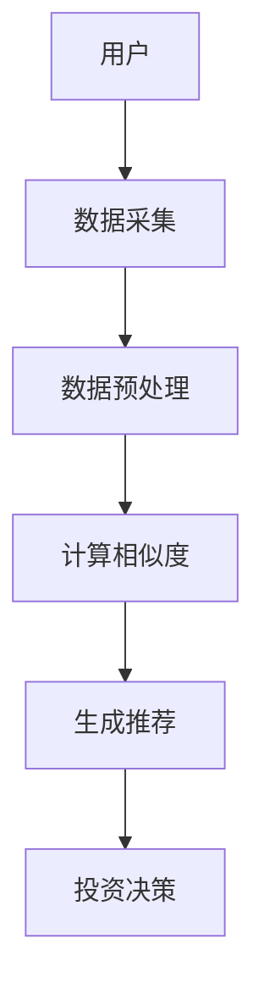
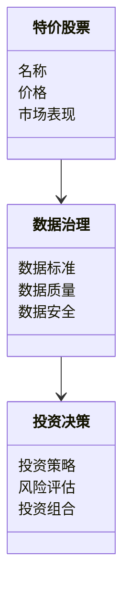

                 


```markdown
# 特价股票与公司数据治理与数字化转型协同性的关系分析

> 关键词：特价股票、公司数据治理、数字化转型、协同性、数据驱动决策

> 摘要：本文探讨了特价股票与公司数据治理及数字化转型之间的协同关系。通过分析协同机制、算法实现和系统架构，展示了数据治理如何优化特价股票投资，推动企业数字化转型。

---

# 第一部分: 背景介绍

## 第1章: 特价股票的定义与特点

### 1.1 特价股票的定义
- **定义**：特价股票指低于市场价的股票，通常具有较高的投资回报潜力。
- **特点**：
  - 价格低廉，适合小额投资者。
  - 风险较高，需谨慎选择。
  - 可能隐藏在非热门行业或暂时被市场忽视的公司。

### 1.2 公司数据治理的背景与意义
- **定义**：数据治理指制定和实施数据管理政策，确保数据准确性、完整性和安全性。
- **意义**：
  - 提高数据质量，支持决策。
  - 符合监管要求，降低风险。
  - 优化资源利用，提升效率。

### 1.3 数字化转型的定义与目标
- **定义**：数字化转型指利用数字技术改造业务模式、流程、文化，创造新价值。
- **目标**：
  - 提升效率。
  - 改善客户体验。
  - 开创新业务模式。

### 1.4 特价股票与公司数据治理的协同性
- **协同关系**：
  - 数据治理为特价股票投资提供可靠数据支持。
  - 特价股票投资推动企业透明化，促进数据治理。

---

# 第二部分: 核心概念与联系

## 第2章: 特价股票与公司数据治理的核心概念

### 2.1 特价股票的核心概念
- **市场定位**：低价股票通常出现在中小型企业或新兴行业。
- **投资策略**：长期持有，价值回归；或短线交易，挖掘短期机会。

### 2.2 公司数据治理的核心概念
- **框架与原则**：
  - 数据分类、分级管理。
  - 明确数据所有权和责任。
  - 数据安全与隐私保护。
- **关键要素**：
  - 数据标准：统一数据定义。
  - 数据质量：确保数据准确完整。
  - 数据访问：控制权限，防止滥用。

### 2.3 特价股票与公司数据治理的联系
- **协同关系**：
  - 数据治理为特价股票投资提供可靠数据，帮助投资者识别低估股票。
  - 特价股票投资推动企业透明化，提升数据质量，促进数据治理。

---

# 第三部分: 特价股票与公司数据治理的协同机制

## 第3章: 特价股票与公司数据治理的协同机制

### 3.1 协同机制的定义与分类
- **定义**：协同机制指两个或多个系统或过程之间相互作用的方式。
- **分类**：
  - 信息共享机制。
  - 业务流程协同机制。
  - 技术平台协同机制。

### 3.2 特价股票与公司数据治理的协同过程
- **协同步骤**：
  1. 数据采集：收集公司财务数据、市场表现等。
  2. 数据分析：使用数据挖掘技术识别潜在投资机会。
  3. 投资决策：基于数据驱动的分析做出投资决策。
  4. 反馈优化：根据投资结果优化数据治理策略。

### 3.3 协同机制的数学模型与公式
- **相似度计算**：
  使用余弦相似度：
  $$\text{sim}(A, B) = \frac{\sum A_i \cdot B_i}{\sqrt{\sum A_i^2} \cdot \sqrt{\sum B_i^2}}$$
- **预测模型**：
  使用线性回归：
  $$y = \beta_0 + \beta_1 x + \epsilon$$
  其中，y为股票价格，x为相关数据特征，β为回归系数。

---

## 第4章: 基于协同过滤的算法实现

### 4.1 算法原理
- 协同过滤算法基于用户行为或数据特征，推荐相似股票。
- 使用用户-物品矩阵，计算用户相似度或物品相似度。

### 4.2 算法实现
```python
import numpy as np

def cosine_similarity(matrix):
    normalized = matrix / np.linalg.norm(matrix, axis=1).reshape(-1, 1)
    return np.dot(normalized, normalized.T)

def collaborative_filtering(user_item_matrix, user_idx, item_idx):
    sim_matrix = cosine_similarity(user_item_matrix)
    user_predictions = np.dot(sim_matrix[user_idx], user_item_matrix[item_idx])
    return user_predictions
```

### 4.3 算法流程图


---

## 第5章: 数学模型与公式

### 5.1 特价股票预测模型
$$P(t) = a \cdot P(t-1) + b \cdot D(t) + c \cdot V(t)$$
其中，P为股票价格，D为市场情绪，V为投资者信心。

### 5.2 数据治理优化模型
$$Q = \sum_{i=1}^{n} w_i x_i$$
其中，Q为数据质量评分，w为权重，x为特征。

---

# 第四部分: 系统分析与架构设计方案

## 第6章: 问题场景介绍
- 问题场景：某公司希望通过数据治理优化特价股票投资。
- 解决方案：构建数据驱动的投资决策系统。

## 第7章: 系统功能设计

### 7.1 领域模型


### 7.2 系统架构设计


---

## 第8章: 项目实战

### 8.1 环境安装
- 安装Python和相关库（pandas、numpy、scikit-learn）。

### 8.2 核心代码实现
```python
import pandas as pd
from sklearn.metrics.pairwise import cosine_similarity

# 数据处理
data = pd.DataFrame({
    '股票名称': ['A', 'B', 'C'],
    '股价': [10, 15, 20],
    '市场表现': [0.2, 0.3, 0.1]
})

# 计算相似度
similarity = cosine_similarity(data[['股价', '市场表现']])
```

### 8.3 代码解读与分析
- 数据处理：清洗和转换数据，提取特征。
- 相似度计算：使用余弦相似度识别相关股票。

### 8.4 实际案例分析
- 案例：某公司通过数据治理优化数据，识别低估股票，提升投资回报。

---

## 第9章: 最佳实践

### 9.1 小结
- 数据治理为特价股票投资提供可靠支持。
- 数字化转型推动企业数据驱动决策。

### 9.2 注意事项
- 数据治理需持续优化。
- 投资需结合市场变化，谨慎决策。

### 9.3 拓展阅读
- 推荐阅读《数据治理实战》和《数字化转型方法论》。

---

# 作者：AI天才研究院/AI Genius Institute & 禅与计算机程序设计艺术 /Zen And The Art of Computer Programming
```

