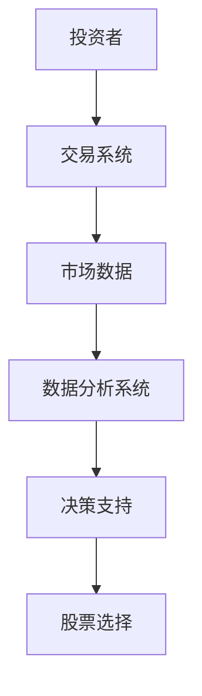
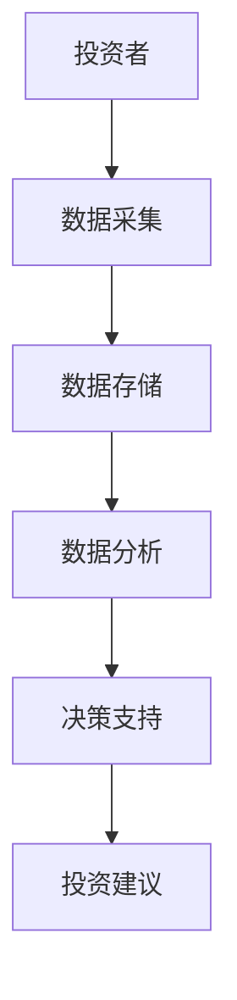

                 


# 特价股票与公司数据治理与数字化转型成熟度的关系分析

> 关键词：特价股票、数据治理、数字化转型、企业成熟度、数据分析、系统架构

> 摘要：本文探讨了特价股票与公司数据治理及数字化转型成熟度之间的关系，分析了数据治理在数字化转型中的作用，以及如何利用数据分析技术评估和优化企业的数字化成熟度，以发现市场中的特价股票机会。

---

## 第一部分：背景介绍

### 第1章：特价股票概述

#### 1.1 特价股票的定义与分类
- **1.1.1 特价股票的定义**  
  特价股票是指市场价格低于其内在价值的股票，通常被视为被市场低估的投资机会。识别这类股票需要对市场数据进行深入分析，包括财务指标、行业趋势和市场情绪等因素。

- **1.1.2 特价股票的分类**  
  根据市场环境和企业状况，特价股票可分为周期性股票、价值型股票和成长型股票。每种类型在市场中的表现和风险特征有所不同。

- **1.1.3 特价股票的市场特征**  
  特价股票通常出现在市场低迷时期，或企业因短期问题导致股价被低估的情况。识别这些股票需要结合定量分析和定性判断。

#### 1.2 公司数据治理
- **1.2.1 数据治理的核心概念**  
  数据治理是指通过政策、流程和技术来确保数据的准确性、完整性和合规性。有效的数据治理是企业做出明智决策的基础。

- **1.2.2 数据治理的关键原则**  
  包括数据所有权、访问控制、数据分类和数据生命周期管理。这些原则确保数据在企业内的安全和高效利用。

- **1.2.3 数据治理与企业绩效的关系**  
  数据治理能力直接影响企业的决策质量，进而影响企业绩效。良好的数据治理能够提高企业的竞争力和市场响应能力。

#### 1.3 数字化转型成熟度
- **1.3.1 数字化转型的定义**  
  数字化转型是指企业利用数字技术改造或创新业务模式、流程、文化，以实现业务价值的提升。

- **1.3.2 成熟度模型概述**  
  数字化转型成熟度模型通常包括初始阶段、规划阶段、执行阶段和优化阶段。企业需要根据自身特点选择合适的转型路径。

- **1.3.3 数字化转型的关键阶段**  
  包括基础设施建设、数据驱动决策、业务模式创新和组织文化转型。每个阶段都需要企业进行相应的调整和投入。

#### 1.4 三者关系分析
- **1.4.1 数据治理对特价股票分析的影响**  
  有效的数据治理确保了市场数据的准确性和完整性，为识别特价股票提供了可靠的基础。

- **1.4.2 数字化转型对数据治理的促进作用**  
  数字化转型推动企业采用先进的技术工具和方法，如大数据分析和人工智能，提升数据治理的效率和效果。

- **1.4.3 特价股票与企业成熟度的关系**  
  企业数字化成熟度越高，其识别和利用特价股票的能力越强。这是因为成熟的数字化能力能够更快地捕捉市场机会，优化投资决策。

---

## 第二部分：核心概念与联系

### 第2章：核心概念原理

#### 2.1 数据治理的核心原理
- 数据治理的目标是确保数据的可用性、一致性和安全性。通过制定明确的数据政策和流程，企业可以更好地管理数据资产。

#### 2.2 数字化转型的驱动因素
- 技术进步、市场需求和竞争压力是推动企业进行数字化转型的主要因素。数字化转型帮助企业实现业务创新和效率提升。

#### 2.3 特价股票分析的框架
- 基于数据治理和数字化转型的框架，特价股票分析可以分为数据采集、数据清洗、数据分析和决策支持四个阶段。

### 第2章：对比分析

#### 2.2.1 数据治理策略对比
| 战略 | 特点 | 适用场景 |
|------|------|-----------|
| 集中式治理 | 高度集中，控制严格 | 适合大型企业 |
| 分散式治理 | 灵活性高，响应快 | 适合中小型企业 |

#### 2.2.2 数字化成熟度评估
| 阶段 | 核心特征 | 关键指标 |
|------|----------|-----------|
| 初始阶段 | 基础数字化 | 系统集成度 |
| 规划阶段 | 数据驱动 | 数据分析能力 |
| 执行阶段 | 业务创新 | 数字化业务占比 |

### 第2章：系统架构

#### 2.3.1 ER图与数据模型
```mermaid
erDiagram
  customer[投资者]
  stock[股票]
  market[市场数据]
  transaction[交易记录]
  
  customer --|> transaction: 进行交易
  stock --|> market: 影响市场数据
  transaction --|> stock: 影响股票价格
```

#### 2.3.2 数据流与流程


---

## 第三部分：算法原理

### 第3章：算法选择与实现

#### 3.1 线性回归模型
- **数学模型**  
  $$ y = \beta_0 + \beta_1 x + \epsilon $$
  其中，$y$ 是目标变量（股票价格），$x$ 是自变量（市场指数）。

- **实现步骤**  
  1. 数据预处理：清洗和标准化。
  2. 模型训练：使用最小二乘法估计参数。
  3. 模型评估：计算R²值和残差分析。

#### 3.2 算法实现代码
```python
import numpy as np
import pandas as pd

# 数据加载与预处理
data = pd.read_csv('stock_data.csv')
X = data[['market_index']]
y = data['stock_price']

# 模型训练
X = X.values
y = y.values

# 最小二乘法求解系数
beta = np.linalg.inv(X.T @ X) @ (X.T @ y)

# 模型预测
y_pred = beta[0] + beta[1] * X
```

---

## 第四部分：系统分析与架构设计

### 第4章：系统架构

#### 4.1 系统功能模块
- 数据采集模块：收集市场数据和交易记录。
- 数据分析模块：应用机器学习算法进行股票评估。
- 决策支持模块：生成投资建议和风险评估。

#### 4.2 系统架构图


---

## 第五部分：项目实战

### 第5章：环境安装与代码实现

#### 5.1 环境配置
- 安装Python和必要的库（pandas、numpy、scikit-learn）。
- 数据集获取：从金融数据提供商获取历史股价和市场指标。

#### 5.2 核心代码
```python
from sklearn.linear_model import LinearRegression
from sklearn.metrics import mean_squared_error

# 数据加载
data = pd.read_csv('stock_data.csv')

# 特征与目标分离
X = data[['market_index', 'pe_ratio']]
y = data['stock_price']

# 模型训练
model = LinearRegression()
model.fit(X, y)

# 模型评估
y_pred = model.predict(X)
mse = mean_squared_error(y, y_pred)
print(f'MSE: {mse}')
```

---

## 第六部分：最佳实践

### 第6章：经验总结

#### 6.1 小结
- 数据治理和数字化转型是识别特价股票的关键因素。
- 通过机器学习算法可以有效提升数据分析的效率和准确性。

#### 6.2 注意事项
- 数据治理需要持续投入和优化。
- 数字化转型是一个长期过程，需要企业内外部的协同努力。

#### 6.3 拓展阅读
- 推荐阅读《企业数据治理实战》和《数字化转型：方法与实践》。

---

作者：AI天才研究院/AI Genius Institute & 禅与计算机程序设计艺术 /Zen And The Art of Computer Programming

