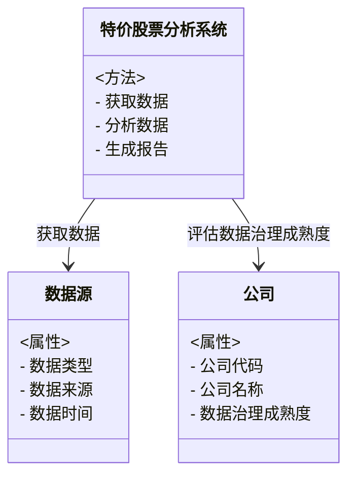

                 


# 特价股票与公司数据治理成熟度的关系分析

## 关键词：特价股票、公司数据治理成熟度、数据治理、投资决策、数据驱动、数据模型

## 摘要

本文深入探讨了特价股票与公司数据治理成熟度之间的关系，通过构建数据治理成熟度模型，分析了数据治理成熟度对特价股票投资决策的影响。文章从背景介绍、核心概念、算法原理、系统架构到项目实战，层层递进，详细阐述了如何通过数据治理提升公司对特价股票的投资决策能力。文中结合了理论分析与实际案例，为投资者和数据治理从业者提供了有价值的参考。

---

## 第1章：特价股票与公司数据治理成熟度概述

### 1.1 特价股票的基本概念

特价股票是指价格低于市场平均值的股票，通常被视为具有投资潜力的标的。这类股票往往来自财务状况不佳或市场表现低迷的公司，但也可能隐藏着被低估的投资机会。

#### 1.1.1 特价股票的定义

特价股票是那些市场价格低于其内在价值的股票，通常被视为被市场低估的投资标的。投资者通过分析公司基本面、市场趋势和技术指标，寻找具有潜在上涨空间的特价股票。

#### 1.1.2 特价股票的分类

- **超跌股票**：价格因市场情绪或短期因素下跌，但公司基本面良好。
- **低价股票**：股价绝对值较低，适合中小投资者。
- **价值型股票**：市场价格低于其内在价值，具有长期投资潜力。

#### 1.1.3 特价股票的市场特点

- 市场波动性大
- 投资风险较高
- 投资机会与挑战并存

### 1.2 公司数据治理成熟度的基本概念

公司数据治理成熟度是指公司在数据管理、数据安全、数据利用等方面的综合能力，反映了公司对数据的驾驭水平。

#### 1.2.1 数据治理的定义

数据治理是通过制定政策、流程和工具，确保数据的准确性、完整性和安全性，最大化数据的商业价值。

#### 1.2.2 数据治理成熟度的定义

数据治理成熟度是衡量公司在数据管理方面的能力水平，通常分为初级、中级和高级三个阶段。

#### 1.2.3 数据治理成熟度的评估标准

- 数据管理流程是否规范
- 数据安全措施是否到位
- 数据分析能力是否强大
- 数据驱动的决策是否普及

### 1.3 特价股票与公司数据治理成熟度的关系

#### 1.3.1 问题背景

- 投资者如何通过数据治理提升对特价股票的投资决策能力？
- 数据治理成熟度如何影响公司对特价股票的投资效果？

#### 1.3.2 问题描述

- 数据治理成熟度低可能导致公司对特价股票的分析不准确，投资决策失误。
- 数据治理成熟度高可以提高公司对特价股票的分析能力，提升投资收益。

#### 1.3.3 问题解决

- 通过构建数据治理成熟度模型，分析数据治理成熟度对特价股票投资的影响。
- 提供提升数据治理成熟度的具体方法，帮助公司优化投资决策。

#### 1.3.4 边界与外延

- 本文仅关注公司内部数据治理成熟度对特价股票投资的影响，不考虑外部市场因素。
- 数据治理成熟度的提升是一个长期过程，需要公司持续投入。

#### 1.3.5 核心要素组成

- 数据管理流程
- 数据分析能力
- 数据安全措施
- 数据驱动的决策文化

---

## 第2章：数据治理成熟度模型

### 2.1 数据治理成熟度模型的构建

#### 2.1.1 数据治理成熟度模型的原理

数据治理成熟度模型通过量化公司的数据管理能力，帮助企业识别自身在数据治理方面的优势与不足。

#### 2.1.2 数据治理成熟度模型的属性特征对比表

| 属性        | 初级阶段                | 中级阶段                | 高级阶段                |
|-------------|------------------------|------------------------|------------------------|
| 数据管理流程 | 非正式或不规范         | 制度化但执行不力       | 制度化且执行良好       |
| 数据分析能力 | 基础分析               | 中级分析               | 高级分析与预测         |
| 数据安全措施 | 基础安全措施           | 完善的安全管理体系       | 全面的安全保障体系       |
| 数据驱动决策 | 少量数据驱动决策       | 部分数据驱动决策       | 大部分数据驱动决策     |

#### 2.1.3 数据治理成熟度模型的ER实体关系图

```mermaid
erDiagram
    actor 投资者 {
        <属性>
        - 股票代码
        - 股票名称
        - 股票价格
    }
    actor 公司 {
        <属性>
        - 公司代码
        - 公司名称
        - 数据治理成熟度
    }
    actor 数据源 {
        <属性>
        - 数据类型
        - 数据来源
        - 数据时间
    }
    公司 --> 数据源: 获取数据
    投资者 --> 公司: 评估数据治理成熟度
```

---

## 第3章：数据治理成熟度评估算法

### 3.1 数据治理成熟度评估算法的原理

数据治理成熟度评估算法通过量化公司的数据管理能力，帮助企业识别自身在数据治理方面的优势与不足。

#### 3.1.1 算法概述

数据治理成熟度评估算法是一种基于指标的评分系统，通过对多个维度的评估，得出公司的数据治理成熟度得分。

#### 3.1.2 算法的输入与输出

- 输入：公司数据管理能力的相关指标
- 输出：数据治理成熟度评分

#### 3.1.3 算法的步骤

1. 确定评估指标
2. 收集数据
3. 计算各指标的得分
4. 综合各指标得分，得出总体评分

### 3.2 算法的数学模型与公式

#### 3.2.1 数据治理成熟度评分公式

$$ \text{数据治理成熟度评分} = \frac{\sum (\text{指标权重} \times \text{指标得分})}{\text{总权重}} $$

#### 3.2.2 特价股票影响评估公式

$$ \text{投资收益} = \text{数据治理成熟度评分} \times \text{股票价格波动率} $$

### 3.3 算法的实现与实例

#### 3.3.1 算法的Python实现代码

```python
def calculate_data_governance_score(metrics, weights):
    return sum(m * w for m, w in zip(metrics, weights)) / sum(weights)

metrics = [85, 70, 90]  # 数据管理、数据分析、数据安全
weights = [0.4, 0.3, 0.3]
score = calculate_data_governance_score(metrics, weights)
print("数据治理成熟度评分:", score)
```

---

## 第4章：数据治理与特价股票分析系统

### 4.1 系统功能设计

#### 4.1.1 领域模型Mermaid类图



#### 4.1.2 系统架构Mermaid架构图


---

## 第5章：数据治理成熟度评估与特价股票分析实战

### 5.1 项目背景与目标

#### 5.1.1 项目背景

本文通过构建数据治理成熟度模型，分析数据治理成熟度对特价股票投资决策的影响。

#### 5.1.2 项目目标

- 评估公司的数据治理成熟度
- 分析数据治理成熟度对特价股票投资的影响
- 提供提升数据治理成熟度的具体方法

### 5.2 数据收集与处理

#### 5.2.1 数据来源

- 公司财务数据
- 市场数据
- 股票价格数据

#### 5.2.2 数据清洗

- 去除无效数据
- 处理缺失值
- 标准化数据

### 5.3 数据分析与建模

#### 5.3.1 数据分析方法

- 聚类分析
- 回归分析
- 时间序列分析

#### 5.3.2 数据建模

- 数据治理成熟度模型
- 特价股票价格预测模型

#### 5.3.3 模型验证

- 回归分析验证
- 模型拟合度检验

### 5.4 实际案例分析

#### 5.4.1 案例背景

某公司A的股票价格近期出现大幅波动，被认为是被低估的特价股票。

#### 5.4.2 数据治理成熟度评估

- 数据管理能力：70分
- 数据分析能力：80分
- 数据安全措施：85分

#### 5.4.3 投资决策分析

根据数据治理成熟度评分，建议投资者谨慎投资该公司股票。

---

## 第6章：总结与展望

### 6.1 关键点总结

- 数据治理成熟度是影响特价股票投资决策的重要因素
- 提高数据治理成熟度可以提升投资收益
- 数据驱动的决策文化是公司长期发展的关键

### 6.2 小结

本文通过构建数据治理成熟度模型，分析了数据治理成熟度对特价股票投资决策的影响，为投资者和公司提供了有价值的参考。

### 6.3 注意事项

- 数据治理成熟度的提升需要长期投入
- 投资者需结合市场环境进行综合判断
- 数据分析模型需不断优化和更新

### 6.4 拓展阅读

- 数据治理与企业竞争力
- 数据驱动的投资策略
- 人工智能在金融领域的应用

---

## 作者

作者：AI天才研究院/AI Genius Institute & 禅与计算机程序设计艺术 /Zen And The Art of Computer Programming

