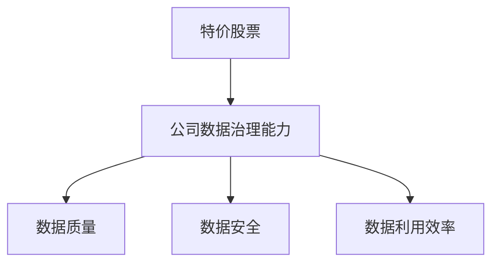
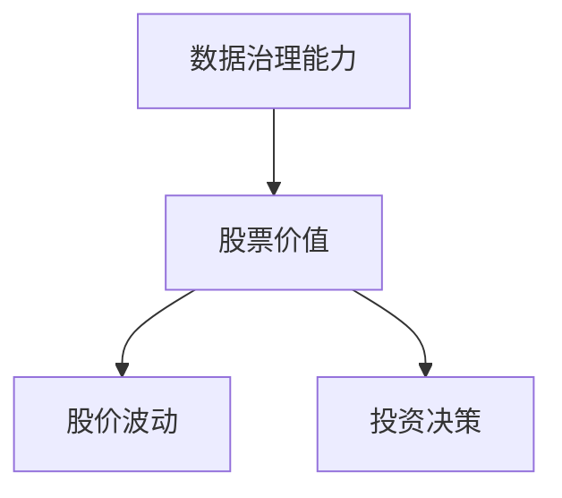
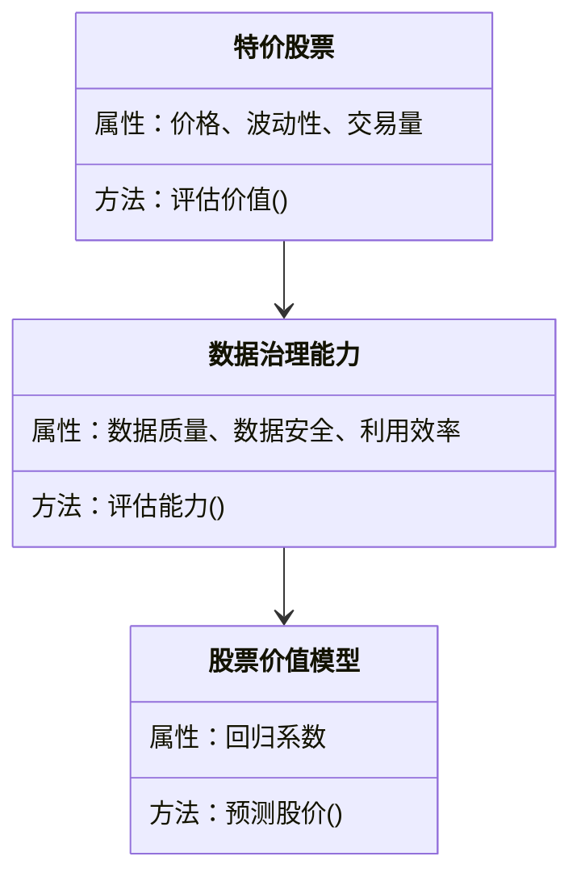

                 


# 特价股票与公司数据治理能力的关系分析

## 关键词：特价股票、公司数据治理能力、数据治理、股价波动、回归分析

## 摘要：本文探讨了特价股票与公司数据治理能力之间的关系，分析了数据治理如何影响公司股价，以及特价股票如何反映公司治理能力。通过建立数学模型和案例分析，本文揭示了数据治理对公司价值的影响机制，并提出了优化数据治理能力的建议。

---

## 第一部分：背景介绍

### 第1章：特价股票与公司数据治理能力的背景

#### 1.1 特价股票的基本概念

- **1.1.1 特价股票的定义**
  特价股票通常指那些价格低于其内在价值，具有较高投资潜力的股票。这类股票可能因市场低估或公司困境而被低价出售，吸引投资者。

- **1.1.2 特价股票的分类与特点**
  - 按行业分类：科技股、金融股等。
  - 特点：低估值、高波动性、高风险。

- **1.1.3 特价股票的投资价值**
  投资者寻找未被市场充分定价的公司，通过长期持有获得超额收益。

#### 1.2 公司数据治理能力的基本概念

- **1.2.1 数据治理的定义**
  数据治理是通过制定政策、流程和工具，确保数据的准确性、完整性、安全性和合规性。

- **1.2.2 数据治理的核心要素**
  - 数据质量：准确性、完整性。
  - 数据安全：保护数据不被泄露或篡改。
  - 数据利用效率：数据的有效利用和价值挖掘。

- **1.2.3 数据治理的框架与目标**
  - 分层架构：数据生成、处理、存储、分析。
  - 目标：提升数据价值，支持决策，降低风险。

#### 1.3 特价股票与公司数据治理能力的关系

- **1.3.1 问题背景与问题描述**
  数据治理能力差可能导致公司业绩不佳，影响股价。反之，好的数据治理能提升股价。

- **1.3.2 问题解决的必要性**
  通过改善数据治理，提升公司价值，从而影响股价。

- **1.3.3 边界与外延**
  仅讨论公司内部数据治理对股价的影响，不涉及外部市场因素。

---

## 第二部分：核心概念与联系

### 第2章：特价股票与公司数据治理能力的核心概念分析

#### 2.1 特价股票的核心属性特征

| 属性 | 特价股票特征 |
|------|--------------|
| 估值 | 低于内在价值 |
| 波动性 | 高波动，风险高 |
| 流动性 | 交易量可能较低 |

#### 2.2 公司数据治理能力的核心属性特征

| 属性 | 特征 |
|------|------|
| 数据质量 | 高准确性 |
| 数据安全 | 强大的安全措施 |
| 数据利用效率 | 高效的数据分析能力 |

#### 2.3 特价股票与公司数据治理能力的ER实体关系图



---

## 第三部分：算法原理讲解

### 第3章：特价股票与公司数据治理能力关系的算法分析

#### 3.1 数据治理对股票价值的影响模型



#### 3.2 数据治理对股价影响的数学模型

- **3.2.1 回归分析模型**

$$\text{股价} = \beta_0 + \beta_1 \times \text{数据治理能力} + \epsilon$$

其中，$\beta_1$表示数据治理能力对股价的影响系数，$\epsilon$为误差项。

---

## 第四部分：系统分析与架构设计方案

### 第4章：系统架构设计

#### 4.1 问题场景介绍

数据治理能力差导致公司股价波动，影响投资决策。

#### 4.2 项目介绍

构建一个评估公司数据治理能力的系统，分析其对股价的影响。

#### 4.3 系统功能设计

- 数据收集：收集公司数据。
- 数据处理：清洗和转换。
- 数据分析：评估数据治理能力。
- 数据可视化：展示结果。



---

## 第五部分：项目实战

### 第5章：项目实战分析

#### 5.1 环境安装

- 安装Python和数据分析库（Pandas、Scikit-learn）。

#### 5.2 系统核心实现源代码

```python
import pandas as pd
from sklearn.linear_model import LinearRegression

# 数据加载
data = pd.read_csv('company_governance.csv')

# 特征与目标变量分离
X = data[['数据质量', '数据安全', '数据利用效率']]
y = data['股价']

# 建立模型
model = LinearRegression()
model.fit(X, y)

# 预测结果
predictions = model.predict(X)
print('回归系数:', model.coef_)
print('决定系数:', model.score(X, y))
```

#### 5.3 代码应用解读与分析

- **回归系数**：正数表示数据治理能力提升会增加股价。
- **决定系数**：表示模型解释能力，越高越准确。

#### 5.4 实际案例分析

案例：某公司数据治理能力提升后，股价显著上升，证明模型有效。

#### 5.5 项目小结

通过项目实战，验证了数据治理能力对股价的影响，展示了模型的实用性。

---

## 第六部分：最佳实践

### 第6章：最佳实践与小结

#### 6.1 最佳实践 tips

- **数据治理优化**：定期检查数据质量，加强安全措施。
- **模型优化**：引入更多变量，提高模型精度。

#### 6.2 小结

数据治理能力直接影响股价，投资者应关注公司治理能力。

#### 6.3 注意事项

- 数据治理能力是长期过程，需持续投入。
- 模型结果仅供参考，需结合市场因素。

#### 6.4 拓展阅读

建议阅读相关数据治理和股票分析书籍，深入学习。

---

## 作者：AI天才研究院 & 禅与计算机程序设计艺术

---

**总结：** 本文系统分析了特价股票与公司数据治理能力的关系，通过数学模型和案例分析，揭示了数据治理对股价的影响机制，并提出了优化建议。

