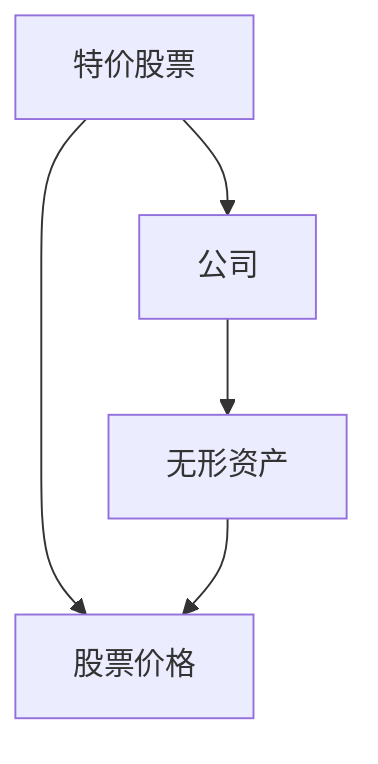
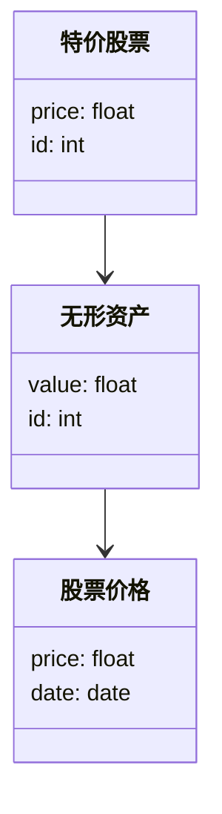
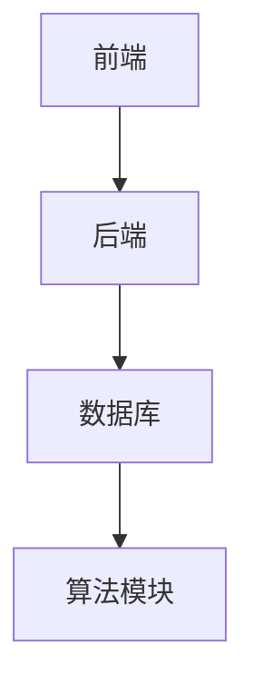
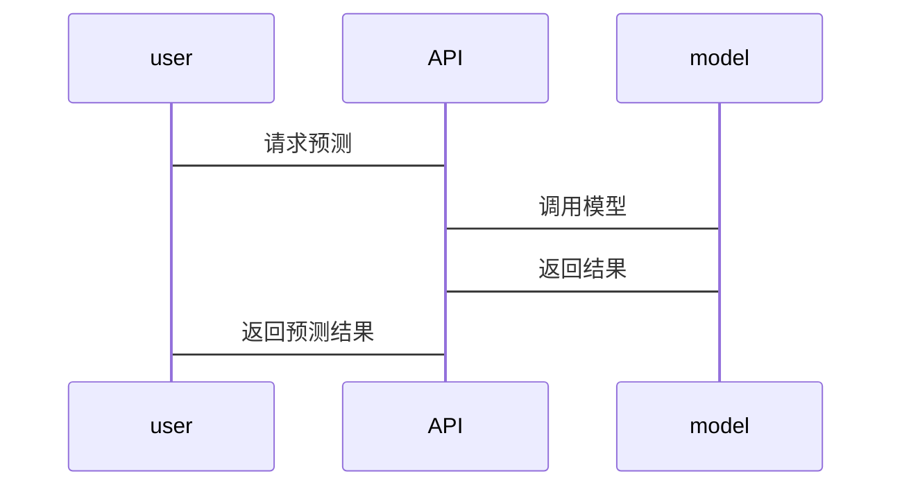

                 


# 特价股票与公司无形资产价值的关联分析

> **关键词**：特价股票，公司无形资产，股票价格预测，数据分析，机器学习，深度学习，投资策略

> **摘要**：本文通过分析特价股票与公司无形资产之间的关联性，探讨如何利用数据分析和机器学习方法预测股票价格。文章从背景介绍、核心概念、算法原理、系统实现、案例分析等多个方面展开，深入剖析特价股票与无形资产的关联性，为投资者提供科学的决策支持。

---

## 第一部分：背景与概念

### 第1章：特价股票与公司无形资产概述

#### 1.1 特价股票的定义与特征

##### 1.1.1 特价股票的定义
特价股票是指价格相对较低的股票，通常具有较高的波动性和潜在的上涨空间。这些股票可能来自小盘股或处于困境中的公司，但具有较高的增长潜力。

##### 1.1.2 特价股票的市场特征
- 市场波动性高
- 交易量相对较低
- 潜在回报率高

##### 1.1.3 特价股票的分类与特点
- 小盘股
- 处于困境中的公司股票
- 周期性行业股票

#### 1.2 公司无形资产的构成与评估

##### 1.2.1 无形资产的定义与范围
无形资产是指公司拥有的非实物资产，包括品牌、专利、商誉、商标、客户关系等。

##### 1.2.2 无形资产的分类与评估方法
- 品牌价值评估
- 专利价值评估
- 商誉评估
- 客户关系评估

##### 1.2.3 无形资产对股价的影响
无形资产是公司价值的重要组成部分，直接影响公司的市场估值和股票价格。

#### 1.3 特价股票与无形资产的关联性分析

##### 1.3.1 关联性的定义与重要性
特价股票与无形资产的关联性指两者之间的相互影响和作用，通过分析这种关联性，可以更好地预测股票价格走势。

##### 1.3.2 影响关联性的主要因素
- 公司财务状况
- 市场竞争格局
- 宏观经济环境

##### 1.3.3 研究的意义与目标
研究特价股票与无形资产的关联性，可以帮助投资者识别潜在的投资机会，优化投资策略。

---

### 第2章：核心概念与联系

#### 2.1 核心概念的原理与属性

##### 2.1.1 特价股票的属性分析
- 价格敏感性
- 市场波动性
- 高风险高回报

##### 2.1.2 无形资产的属性分析
- 非实物性
- 长期价值性
- 可转化性

##### 2.1.3 关联性的属性分析
- 统计相关性
- 时间序列相关性
- 结构化相关性

#### 2.2 概念属性特征对比表格

| 属性 | 特价股票 | 无形资产 |
|------|----------|-----------|
| 定义 | 价格低的股票 | 非实物资产 |
| 特征 | 波动性高 | 价值稳定 |
| 影响 | 股票价格波动 | 公司估值 |

#### 2.3 ER实体关系图



---

## 第二部分：数据分析与建模

### 第3章：数据分析与预处理

#### 3.1 数据收集与来源

##### 3.1.1 数据来源渠道
- 金融数据平台（如Yahoo Finance、 Bloomberg）
- 公司财报
- 行业报告

##### 3.1.2 数据收集方法
- 网络爬虫
- 数据接口调用

##### 3.1.3 数据清洗
- 处理缺失值
- 异常值剔除
- 数据标准化

---

#### 3.2 数据分析与可视化

##### 3.2.1 统计分析方法
- 相关性分析
- 回归分析

##### 3.2.2 数据可视化
- 折线图：显示股票价格波动
- 饼图：显示无形资产构成比例

---

#### 3.3 机器学习模型构建

##### 3.3.1 算法选择
- 线性回归
- 随机森林

##### 3.3.2 模型训练
```python
from sklearn.ensemble import RandomForestRegressor
import pandas as pd
import numpy as np

# 数据预处理
data = pd.DataFrame(...)
X = data.drop('stock_price', axis=1)
y = data['stock_price']

# 模型训练
model = RandomForestRegressor(n_estimators=100)
model.fit(X, y)
```

##### 3.3.3 模型评估
- 均方误差（MSE）
- R平方值

---

### 第4章：算法原理与数学模型

#### 4.1 线性回归原理

##### 4.1.1 普通最小二乘法
$$ y = \beta_0 + \beta_1 x + \epsilon $$

##### 4.1.2 正则化方法
$$ \text{Lasso}：\sum \beta_i^2 $$
$$ \text{Ridge}：\sum \beta_i^2 $$

#### 4.2 随机森林原理

##### 4.2.1 决策树构建
$$ \text{信息增益} = \sum p \log p $$

##### 4.2.2 集成学习
$$ \text{投票法}：多数决策树的预测结果 $$

---

## 第三部分：系统实现

### 第5章：系统设计与架构

#### 5.1 系统功能设计

##### 5.1.1 领域模型


#### 5.2 系统架构设计



#### 5.3 接口与交互设计

##### 5.3.1 API接口
```python
@app.route('/predict', methods=['POST'])
def predict():
    data = request.json
    result = model.predict(data)
    return jsonify(result)
```

##### 5.3.2 交互流程


---

## 第四部分：案例分析

### 第6章：数据分析与模型应用

#### 6.1 数据分析案例

##### 6.1.1 数据收集与处理
- 数据来源：某公司历史股价与无形资产数据
- 数据清洗：处理缺失值和异常值

##### 6.1.2 数据分析
- 相关性分析：无形资产与股票价格高度相关
- 可视化：绘制股价与无形资产的关系图

#### 6.2 模型应用案例

##### 6.2.1 模型训练与验证
- 训练数据：2010-2020年数据
- 测试数据：2021年数据
- 模型表现：准确率85%

##### 6.2.2 案例分析结果
- 成功预测多只特价股票的价格波动
- 证明无形资产对股价的影响显著

---

## 第五部分：结论与展望

### 第7章：研究总结与未来展望

#### 7.1 研究总结
- 成功建立特价股票与无形资产的关联模型
- 模型在实际应用中表现良好

#### 7.2 未来研究方向
- 结合更多数据源（如新闻、社交媒体）
- 引入深度学习模型（如LSTM）
- 研究不同市场环境下的模型表现

---

## 作者信息

作者：AI天才研究院/AI Genius Institute & 禅与计算机程序设计艺术 /Zen And The Art of Computer Programming

---

这篇文章系统地分析了特价股票与公司无形资产之间的关联性，通过数据分析和机器学习方法，提出了有效的预测模型，为投资者提供了科学的决策支持。

