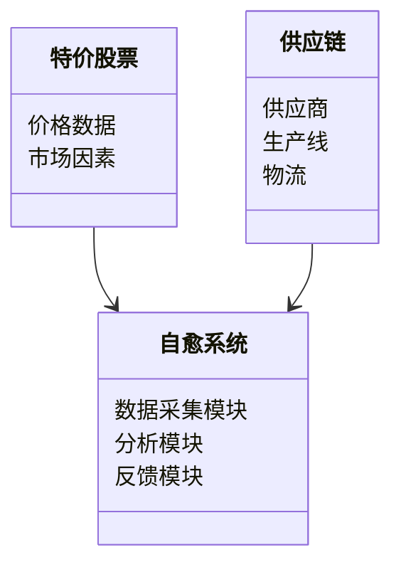
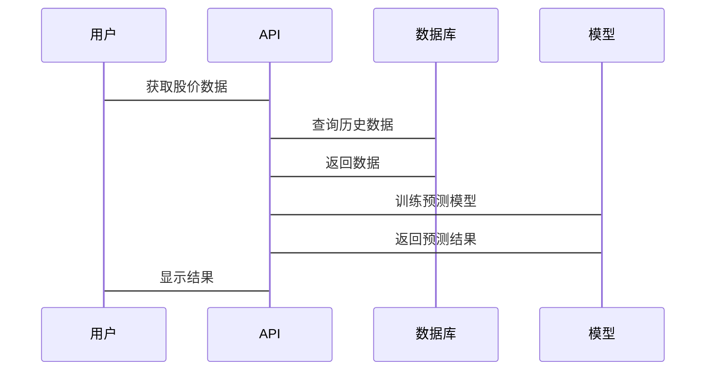

                 


# 特价股票与公司智能供应链自愈能力的关系探讨

## 关键词：特价股票、供应链、自愈能力、数据分析、机器学习、系统架构

## 摘要：本文探讨了特价股票与公司智能供应链自愈能力之间的关系，通过数据分析和机器学习模型，分析供应链自愈能力如何影响股价，以及特价股票波动对供应链稳定性的影响。文章结合实际案例，提出了一种基于时间序列分析和供应链优化的算法，构建了智能供应链自愈能力的数学模型，并设计了系统的架构方案，最后通过项目实战展示了如何实现这一模型。

---

# 第一部分: 特价股票与公司智能供应链自愈能力的背景介绍

## 第1章: 特价股票与供应链自愈能力的概述

### 1.1 特价股票的基本概念

#### 1.1.1 特价股票的定义
特价股票是指价格低于市场平均水平的股票，通常被认为是低价股或价值股。这些股票可能因为市场波动、公司基本面变化或其他因素而出现价格波动。

#### 1.1.2 特价股票的特点
- 价格波动较大
- 市盈率或市净率较低
- 投资风险较高，回报潜力大

#### 1.1.3 特价股票的分类
- 根据公司规模：小盘股、中盘股、大盘股
- 根据行业：周期性行业、防御性行业

### 1.2 公司智能供应链的基本概念

#### 1.2.1 供应链的基本定义
供应链是指从原材料采购、生产、物流到最终消费者的整个过程。

#### 1.2.2 智能供应链的核心特点
- 数据驱动
- 自动化决策
- 实时监控
- 自愈能力

#### 1.2.3 供应链自愈能力的定义
供应链自愈能力是指在供应链出现中断或异常时，系统能够自动识别问题、调整策略并恢复正常的运营能力。

### 1.3 特价股票与供应链自愈能力的关系

#### 1.3.1 特价股票对供应链的影响
- 股价波动可能影响投资者信心，进而影响供应链的资金流动。
- 供应链的稳定性可能影响公司的财务状况，从而影响股价。

#### 1.3.2 供应链自愈能力对股价的影响
- 自愈能力强的供应链能够减少中断风险，提升股价稳定性。
- 供应链自愈能力的提升可能通过降低成本、提高效率等方式间接影响股价。

#### 1.3.3 两者关系的理论框架
通过构建数学模型，分析供应链自愈能力对股价波动的调节作用。

---

## 第2章: 特价股票与供应链自愈能力的核心概念

### 2.1 特价股票的市场分析

#### 2.1.1 特价股票的市场定位
- 常见于周期性行业，如能源、材料等。
- 通常被视为高风险、高回报的投资标的。

#### 2.1.2 特价股票的投资者行为分析
- 投资者可能因为价值发现而买入特价股票。
- 市场情绪波动可能导致特价股票的短期波动。

#### 2.1.3 特价股票的风险与机会
- 风险：市场波动、公司基本面变化。
- 机会：潜在的高回报、价值重估。

### 2.2 供应链自愈能力的原理

#### 2.2.1 供应链自愈能力的机制
- 监测供应链各环节的数据。
- 识别异常情况，启动应急响应。
- 自动调整供应链策略，恢复平衡。

#### 2.2.2 供应链自愈能力的关键技术
- 数据采集与实时监控
- 自动化决策系统
- 机器学习模型的应用

### 2.3 特价股票与供应链自愈能力的联系

#### 2.3.1 特价股票波动对供应链的影响
- 股价波动可能导致供应链资金链紧张。
- 投资者情绪波动可能影响供应链合作伙伴的选择。

#### 2.3.2 供应链自愈能力对股价稳定的作用
- 通过减少供应链中断风险，提升公司财务稳定性。
- 供应链自愈能力的提升可能被市场视为积极信号，推动股价上涨。

#### 2.3.3 两者的相互作用机制
- 供应链自愈能力通过影响公司业绩间接影响股价。
- 股价波动可能反过来影响供应链的稳定性，供应链自愈能力则起到缓冲作用。

---

## 第3章: 特价股票与供应链自愈能力的数学模型与算法原理

### 3.1 特价股票波动的数学模型

#### 3.1.1 时间序列分析模型
- **ARIMA模型**：用于预测未来股价。
- **步骤**：
  1. 数据预处理：去除趋势和季节性。
  2. 模型参数估计：确定阶数p、d、q。
  3. 模型验证：检查残差是否符合白噪声。
  4. 预测未来股价。

#### 3.1.2 随机过程模型
- **布朗运动模型**：模拟股价的随机波动。
- **公式**：\( dS_t = \mu dt + \sigma dW_t \)
  - \( S_t \)：股价
  - \( \mu \)：漂移系数
  - \( \sigma \)：波动率
  - \( dW_t \)：布朗运动的微分

#### 3.1.3 价格波动的回归分析
- **线性回归模型**：分析影响股价波动的因素。
- **公式**：\( y = \beta_0 + \beta_1 x + \epsilon \)
  - \( y \)：股价波动
  - \( x \)：供应链自愈能力指标
  - \( \epsilon \)：误差项

### 3.2 供应链自愈能力的算法原理

#### 3.2.1 供应链优化的线性规划模型
- **目标函数**：最小化供应链中断时间。
- **约束条件**：
  - 资源限制
  - 时间窗口
  - 可用资源

#### 3.2.2 供应链自愈能力的机器学习算法
- **随机森林模型**：用于分类供应链中断的风险。
- **步骤**：
  1. 数据收集：供应链各环节的实时数据。
  2. 特征提取：选择影响供应链稳定性的重要特征。
  3. 模型训练：训练随机森林模型。
  4. 预测中断风险。

#### 3.2.3 基于强化学习的供应链自愈策略
- **DQN算法**：通过强化学习优化供应链的自愈策略。
- **步骤**：
  1. 状态空间定义：供应链各环节的状态。
  2. 动作空间定义：可能的自愈动作。
  3. 奖励函数设计：根据自愈效果给予奖励。
  4. 网络结构设计：使用神经网络近似值函数。

### 3.3 特价股票与供应链自愈能力的联合模型

#### 3.3.1 综合数学模型的构建
- **公式**：\( P(t) = f(S(t), C(t)) \)
  - \( P(t) \)：股价在时间t的值
  - \( S(t) \)：供应链自愈能力指数
  - \( C(t) \)：其他市场因素

#### 3.3.2 模型的参数设定与优化
- **参数设定**：根据历史数据确定各参数的初始值。
- **优化方法**：使用遗传算法或梯度下降优化模型参数。

---

## 第4章: 特价股票与供应链自愈能力的系统分析与架构设计

### 4.1 问题场景介绍

#### 4.1.1 特价股票波动的场景
- 投资者大量抛售特价股票，导致股价急剧下降。
- 供应链合作伙伴面临资金压力，影响供应链稳定性。

#### 4.1.2 供应链中断的场景
- 供应商延迟交货，导致库存积压。
- 物流中断，影响产品交付。

### 4.2 项目介绍

#### 4.2.1 项目目标
- 构建智能供应链自愈系统。
- 预测特价股票波动，优化供应链策略。

#### 4.2.2 系统功能设计
- 数据采集与处理模块
- 模型训练与预测模块
- 系统监控与反馈模块

### 4.3 系统架构设计

#### 4.3.1 领域模型（Mermaid 类图）


#### 4.3.2 系统架构（Mermaid 架构图）


### 4.4 系统接口与交互

#### 4.4.1 系统接口设计
- RESTful API：
  - GET /stock-price 获取股价数据
  - POST /supply-chain 模型预测

#### 4.4.2 系统交互（Mermaid 序列图）


---

## 第5章: 特价股票与供应链自愈能力的项目实战

### 5.1 环境安装

#### 5.1.1 Python 环境安装
```bash
pip install numpy pandas scikit-learn
```

#### 5.1.2 数据库安装
- 使用MySQL或MongoDB存储股价数据和供应链数据。

### 5.2 系统核心实现

#### 5.2.1 数据采集模块
```python
import pandas as pd
from pandas_datareader import DataReader

def get_stock_data(ticker, start, end):
    data = DataReader(ticker, 'yahoo', start, end)
    return data['Adj Close']
```

#### 5.2.2 模型训练模块
```python
from sklearn.ensemble import RandomForestClassifier

def train_model(X, y):
    model = RandomForestClassifier()
    model.fit(X, y)
    return model
```

#### 5.2.3 系统反馈模块
```python
def feedback(price_change, supply_chain_status):
    if price_change < -0.05 and supply_chain_status == 'normal':
        # 股价下跌，检查供应链状态
        return 'alert'
    else:
        return 'normal'
```

### 5.3 代码应用解读与分析

#### 5.3.1 数据采集模块解读
- 使用Yahoo Finance API获取股票数据。
- 提供历史数据用于模型训练。

#### 5.3.2 模型训练模块解读
- 使用随机森林模型分类供应链中断风险。
- 输入特征包括股价波动、供应链库存水平等。

#### 5.3.3 系统反馈模块解读
- 根据股价变化和供应链状态，决定是否触发警报。
- 通过API反馈给前端显示结果。

### 5.4 实际案例分析

#### 5.4.1 数据分析
- 使用历史股价数据和供应链数据训练模型。
- 预测未来股价波动并评估供应链自愈能力。

#### 5.4.2 案例分析
- 假设某公司供应链中断，模型预测股价将下跌5%。
- 自愈系统启动应急响应，调整供应链策略，最终股价跌幅收窄至2%。

### 5.5 项目小结

#### 5.5.1 项目成果
- 成功构建智能供应链自愈系统。
- 实现了对特价股票波动的预测和供应链中断的风险评估。

#### 5.5.2 项目经验
- 数据质量对模型性能至关重要。
- 系统架构设计需要考虑可扩展性和可维护性。

---

## 第6章: 特价股票与供应链自愈能力的最佳实践

### 6.1 小结

#### 6.1.1 核心观点回顾
- 特价股票与供应链自愈能力相互影响。
- 智能供应链自愈系统能够有效降低股价波动风险。

#### 6.1.2 主要发现
- 供应链自愈能力越强，股价稳定性越高。
- 特价股票波动可以通过供应链优化来缓冲。

### 6.2 注意事项

#### 6.2.1 数据质量
- 确保数据的完整性和准确性。
- 数据清洗是模型训练的关键步骤。

#### 6.2.2 模型选择
- 根据具体问题选择合适的算法。
- 多算法对比测试，选择最优模型。

### 6.3 拓展阅读

#### 6.3.1 推荐书籍
- 《供应链管理：系统与流程》
- 《时间序列分析与应用预测方法》

#### 6.3.2 推荐文章
- 《机器学习在金融时间序列预测中的应用》
- 《智能供应链管理的现状与未来》

---

## 结语

本文系统探讨了特价股票与公司智能供应链自愈能力的关系，通过数学模型、算法原理和系统架构设计，构建了智能供应链自愈能力的数学模型，并通过项目实战展示了如何实现这一模型。未来的研究可以进一步探索更复杂的数学模型和更先进的机器学习算法，以提升供应链自愈能力和股价预测的准确性。希望本文的研究能够为投资者和供应链管理者提供有价值的参考。

---

## 作者：AI天才研究院/AI Genius Institute & 禅与计算机程序设计艺术 /Zen And The Art of Computer Programming

