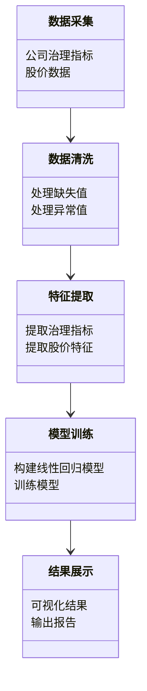
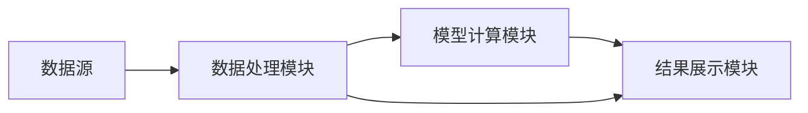

                 


# 特价股票与公司治理结构改善的关系

## 关键词：特价股票、公司治理、股价预测、公司价值、治理结构优化

## 摘要：本文探讨了特价股票与公司治理结构之间的关系，分析了如何通过改善公司治理结构来优化股价表现。文章从背景介绍、核心概念、算法原理、系统架构设计、项目实战到最佳实践，全面解析了特价股票与公司治理的关系，提出了改善治理结构的具体方法和建议。

---

## 第一部分：背景介绍

### 1.1 核心概念术语说明

- **特价股票**：指价格低于市场平均值的股票，通常反映公司财务状况不佳或市场对公司的负面看法。
- **公司治理结构**：指公司董事会、管理层、股东等之间的权力分配和制衡机制，影响公司运营和决策效率。

### 1.2 问题背景

- **市场波动**：特价股票往往在市场波动中出现，反映了投资者对公司前景的担忧。
- **治理缺陷**：公司治理结构不合理可能导致管理混乱、决策失误，进而影响股价。

### 1.3 问题描述

- 特价股票的出现可能与公司治理结构不佳有关，如股东结构混乱、董事会失职等。
- 改善治理结构可以提升公司透明度和决策效率，从而优化股价表现。

### 1.4 问题解决

- 通过优化治理结构，提升公司管理效率和透明度，进而改善股价表现。
- 利用数学模型评估治理结构对股价的影响，制定针对性的改善策略。

### 1.5 边界与外延

- 本文仅探讨公司治理结构对股价的影响，不涉及宏观经济因素。
- 研究范围包括董事会结构、股权分布等关键治理要素。

### 1.6 概念结构与核心要素

- **董事会结构**：影响决策质量和效率。
- **股权分布**：影响控股股东行为和公司战略。
- **透明度**：影响投资者信心和股价稳定性。

---

## 第二部分：核心概念与联系

### 2.1 公司治理结构的核心要素

- **董事会**：负责制定战略和监督管理层。
- **管理层**：执行董事会决策，管理日常运营。
- **股东**：拥有公司所有权，参与重大决策。

### 2.2 特价股票的表现特征

- 低股价反映了市场对公司前景的悲观预期。
- 高波动性，买卖价差大，交易量可能较低。

### 2.3 公司治理结构对股价的影响

- **董事会结构**：高效的董事会能提升公司业绩，进而提升股价。
- **股权集中度**：控股股东行为可能影响股价稳定性。
- **透明度**：高透明度增强投资者信心，可能提升股价。

### 2.4 特价股票与公司治理的关系

- 特价股票可能源于公司治理问题，如管理不善、信息披露不足。
- 改善治理结构可以逐步恢复市场信心，推动股价回升。

### 2.5 图表展示

#### 公司治理结构要素与股价影响对比

| 治理要素         | 对股价的影响 |
|------------------|--------------|
| 董事会效率       | 正向影响     |
| 股权集中度       | 可能负面或正面 |
| 透明度           | 正向影响     |

#### 公司治理结构实体关系图

```mermaid
er
actor 股东 {
  name
  股权比例
}
actor 董事会 {
  成员
  职权
}
actor 管理层 {
  职责
  报告义务
}
```

---

## 第三部分：算法原理

### 3.1 算法概述

- 使用线性回归模型评估公司治理结构对股价的影响。
- 模型公式：\( y = \beta_0 + \beta_1x_1 + \beta_2x_2 + \dots + \beta_nx_n + \epsilon \)
  - \( y \)：股价
  - \( x_i \)：治理指标（如董事会效率、股权分散度）
  - \( \beta \)：回归系数
  - \( \epsilon \)：误差项

### 3.2 数据处理

- 数据来源：公司治理指标、股价数据。
- 数据清洗：处理缺失值、异常值。

### 3.3 模型构建


### 3.4 模型实现

- 使用Python进行数据处理和建模。

```python
import pandas as pd
import numpy as np
from sklearn.linear_model import LinearRegression

# 数据加载
data = pd.read_csv('governance_data.csv')

# 特征与目标变量
X = data[['board_efficiency', 'share_concentration']]
y = data['stock_price']

# 模型训练
model = LinearRegression()
model.fit(X, y)

# 预测
predictions = model.predict(X)
```

### 3.5 模型评估

- 评估指标：R²值、均方误差（MSE）。

```python
from sklearn.metrics import r2_score, mean_squared_error

r2 = r2_score(y, predictions)
mse = mean_squared_error(y, predictions)

print(f'R² = {r2}, MSE = {mse}')
```

---

## 第四部分：系统架构设计

### 4.1 领域模型类图



### 4.2 系统架构图



### 4.3 接口设计

- **输入接口**：接收治理指标和股价数据。
- **输出接口**：提供预测结果和评估报告。

---

## 第五部分：项目实战

### 5.1 环境安装

- 安装Python和必要的库：`pip install numpy pandas scikit-learn`

### 5.2 核心代码实现

```python
import pandas as pd
import numpy as np
from sklearn.linear_model import LinearRegression
from sklearn.metrics import r2_score, mean_squared_error

# 加载数据
data = pd.read_csv('governance_data.csv')

# 数据预处理
data = data.dropna()  # 删除缺失值
data = data[(data['stock_price'] > 0)]  # 过滤掉股价为0的行

# 特征与目标变量
X = data[['board_efficiency', 'share_concentration']]
y = data['stock_price']

# 模型训练
model = LinearRegression()
model.fit(X, y)

# 预测
predictions = model.predict(X)

# 评估
r2 = r2_score(y, predictions)
mse = mean_squared_error(y, predictions)

print(f'R² = {r2:.2f}, MSE = {mse:.2f}')
```

### 5.3 案例分析

- 选取一家治理结构不佳的公司，分析其股价表现。
- 应用模型，预测治理结构改善后的股价变化。

---

## 第六部分：最佳实践

### 6.1 经验总结

- 数据质量至关重要，需确保数据准确性和完整性。
- 模型选择应基于实际问题和数据特征。
- 治理结构改善需综合考虑各要素，如董事会结构、股权分布等。

### 6.2 小结

- 改善公司治理结构是提升股价的关键因素之一。
- 数学模型可有效量化治理结构对股价的影响，为决策提供依据。

### 6.3 注意事项

- 模型结果仅供参考，需结合实际情况进行调整。
- 治理结构改善需长期坚持，不能急于求成。

### 6.4 拓展阅读

- 推荐阅读相关公司治理和股价预测的文献，深入了解治理结构的其他影响因素。

---

## 作者

作者：AI天才研究院/AI Genius Institute & 禅与计算机程序设计艺术 /Zen And The Art of Computer Programming

---

这篇文章通过系统分析和实战案例，详细探讨了特价股票与公司治理结构之间的关系，提出了改善治理结构的具体方法和建议，为投资者和企业管理者提供了有价值的参考。

