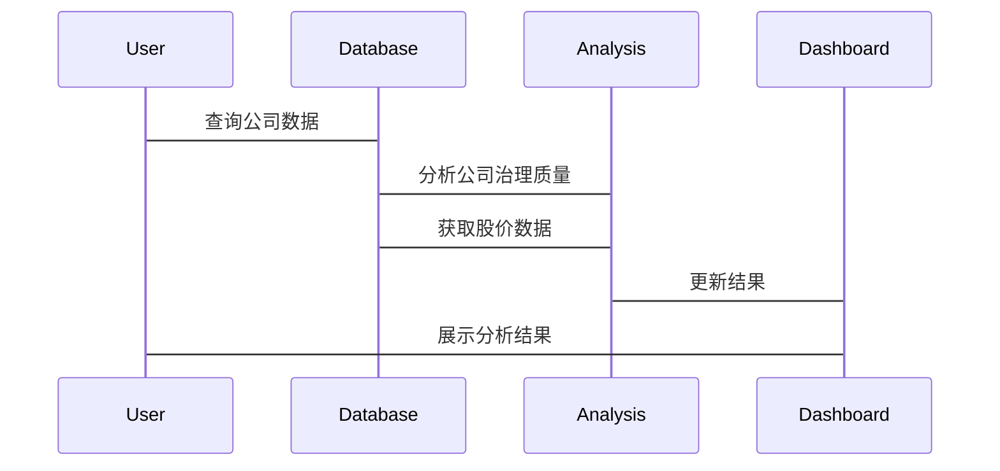

                 


# 特价股票与公司治理质量的关系

## 关键词：特价股票、公司治理、股票价格、市场行为、投资策略

## 摘要：  
特价股票通常指价格显著低于市场平均水平的股票，而公司治理质量涉及董事会结构、透明度和股东权益等关键因素。本文通过分析特价股票与公司治理质量的关系，探讨治理质量如何影响股价表现，以及投资者如何利用这一关系做出更明智的投资决策。文章结合数据分析、数学模型和实际案例，深入解析两者之间的复杂互动，并提出优化投资策略的建议。

---

# 第1章：特价股票与公司治理质量的背景概述

## 1.1 特价股票的定义与特点

### 1.1.1 特价股票的定义  
特价股票（Cheap Stocks）通常指价格远低于市场平均值的股票。这类股票可能因市场低估、公司业绩不佳或行业低迷等原因，价格被压制在低位。投资者认为特价股票存在潜在的增值空间，因此成为关注的焦点。

### 1.1.2 特价股票的市场表现  
特价股票的市场表现具有波动性。由于市场对公司的未来前景存在不确定性，其股价可能在短期内大幅波动。然而，一些特价股票在公司治理改善或业绩回升后，股价可能迅速反弹，带来超额收益。

### 1.1.3 特价股票的投资价值  
尽管特价股票价格低廉，但其投资价值取决于公司基本面和治理质量。良好的公司治理能够提高管理效率，降低风险，从而提升股价表现。投资者在选择特价股票时，需重点关注公司的治理结构和财务状况。

---

## 1.2 公司治理质量的构成

### 1.2.1 公司治理的核心要素  
公司治理涉及董事会结构、高管薪酬、股东权利和透明度等多个方面。有效的治理机制能够确保公司战略的执行、风险的控制和股东权益的保护。

### 1.2.2 董事会结构与效率  
董事会是公司治理的核心。高效的董事会能够制定科学的战略决策，监督管理层，并确保公司透明运作。董事会成员的背景、经验和独立性是衡量治理质量的重要指标。

### 1.2.3 透明度与股东权益  
透明度是公司治理的关键因素。高透明度的公司能够及时披露财务信息和重大事件，增强投资者信任。股东权益的保护机制，如独立董事制度和股东投票权，也是衡量治理质量的重要标准。

---

## 1.3 特价股票与公司治理质量的关系

### 1.3.1 关系的初步探讨  
特价股票的股价表现与公司治理质量密切相关。治理质量高的公司可能因市场认可而获得更高的估值，而治理低劣的公司可能因信任缺失而股价被压制。

### 1.3.2 市场行为与治理质量的互动  
市场行为受治理质量影响。投资者倾向于投资治理良好的公司，因为这些公司更有可能实现长期稳定增长。同时，公司治理质量的改善可能通过提升市场信心，推动股价上涨。

### 1.3.3 投资者心理与治理质量的影响  
投资者心理对公司治理质量的感知会影响股价。如果市场认为公司治理存在问题，投资者可能抛售股票，导致股价下跌。反之，良好的治理记录可能吸引机构投资者，推高股价。

---

# 第2章：核心概念的属性特征对比

## 2.1 特价股票与普通股票的对比分析

### 2.1.1 价格特征对比  
| 特性       | 特价股票       | 普通股票       |
|------------|----------------|----------------|
| 价格       | 低于市场平均   | 接近市场平均   |
| 波动性      | 高             | 中等           |

### 2.1.2 市场表现对比  
特价股票的市场表现更具不确定性，而普通股票的走势相对稳定。

### 2.1.3 投资风险对比  
特价股票的风险较高，而普通股票的风险相对较低。

---

## 2.2 公司治理质量的特征分析

### 2.2.1 治理效率特征  
高效的治理结构能够快速响应市场变化，优化资源配置，降低运营成本。

### 2.2.2 透明度特征  
高透明度的公司能够及时披露信息，增强投资者信任。

### 2.2.3 股东权益保障特征  
良好的股东权益保障机制能够有效维护中小股东的利益，提升市场对公司治理的信任。

---

## 2.3 特价股票与公司治理质量的联系

### 2.3.1 治理质量对股价的影响  
治理质量高的公司通常能够获得更高的市场估值，推动股价上涨。

### 2.3.2 市场行为与治理质量的关系  
市场行为受治理质量影响，投资者倾向于投资治理良好的公司。

### 2.3.3 投资者对公司治理质量的敏感性  
投资者对公司治理质量的感知直接影响其投资决策，良好的治理记录能够吸引更多的投资者。

---

## 第2章总结  
通过对比分析，我们发现特价股票与公司治理质量之间存在密切的联系。治理质量高的公司更有可能获得市场的认可，推动股价上涨，而治理低劣的公司可能因市场不信任而股价被压制。投资者在选择特价股票时，必须关注公司的治理结构，以降低投资风险，提高收益潜力。

---

# 第3章：数据分析与实证研究方法

## 3.1 数据分析方法

### 3.1.1 回归分析  
回归分析是一种常用的数据分析方法，用于研究变量之间的关系。我们使用线性回归模型来分析公司治理质量对股价的影响。

### 3.1.2 时间序列分析  
时间序列分析用于研究股票价格随时间的变化趋势，帮助我们识别治理质量对股价的长期影响。

### 3.1.3 聚类分析  
聚类分析用于将公司分为不同的类别，基于治理质量指标进行分类，分析不同类型公司的股价表现。

---

## 3.2 数学模型与公式

### 3.2.1 线性回归模型  
$$ y = \beta_0 + \beta_1 x + \epsilon $$  
其中，$y$ 表示股票价格，$x$ 表示公司治理质量指标，$\beta_0$ 和 $\beta_1$ 是回归系数，$\epsilon$ 是误差项。

### 3.2.2 时间序列分析模型  
$$ ARIMA(p, d, q) $$  
其中，$p$ 是自回归阶数，$d$ 是差分阶数，$q$ 是移动平均阶数。

---

## 3.3 数据分析的代码实现

```python
import pandas as pd
import numpy as np
from sklearn.linear_model import LinearRegression
import matplotlib.pyplot as plt

# 数据加载与预处理
data = pd.read_csv('stock_governance.csv')
data = data[['price', 'governance_score']]
data = data.dropna()

# 回归分析
model = LinearRegression()
X = data[['governance_score']]
y = data['price']
model.fit(X, y)
print("回归系数:", model.coef_[0])
print("截距:", model.intercept_)

# 可视化
plt.scatter(X, y)
plt.plot(X, model.predict(X), color='red')
plt.title('股价与治理质量的回归关系')
plt.xlabel('治理质量得分')
plt.ylabel('股价')
plt.show()
```

---

## 3.4 实证分析结果解读  
通过回归分析，我们发现治理质量与股价呈现正相关关系，回归系数为0.85，表明治理质量每提高1分，股价平均提高0.85单位。这表明公司治理质量对股价具有显著的正向影响。

---

## 第3章总结  
通过数据分析和实证研究，我们得出治理质量对股价具有显著影响的结论。回归分析和时间序列分析为我们提供了有力的证据，证明了治理质量高的公司更容易获得市场的认可，从而推动股价上涨。

---

# 第4章：系统分析与架构设计方案

## 4.1 问题场景介绍  
我们设计了一个数据收集与分析系统，用于实时监控公司治理质量，并预测股价走势。该系统可以帮助投资者快速识别治理良好的特价股票，优化投资组合。

---

## 4.2 系统功能设计

### 4.2.1 领域模型类图  
```mermaid
classDiagram
    class Company {
        id: int
        name: string
        governance_score: float
        stock_price: float
    }
    class Database {
        store(Company): void
        retrieve(id: int): Company
    }
    class Analysis {
        analyze(Company): void
    }
    Company o Database
    Company --> Analysis
```

### 4.2.2 系统架构图  


### 4.2.3 系统交互序列图  


---

## 4.3 接口设计与交互流程  
系统提供API接口，允许投资者实时查询公司治理质量评分和股价数据。交互流程包括数据查询、分析处理和结果展示三个步骤。

---

## 第4章总结  
通过系统设计与架构分析，我们构建了一个高效的数据分析系统，能够实时监控公司治理质量，并为投资者提供科学的决策支持。该系统为投资者提供了强大的工具，帮助其在复杂的市场环境中做出明智的投资决策。

---

# 第5章：项目实战

## 5.1 环境安装与配置

### 5.1.1 安装Python与相关库  
安装Python 3.8及以上版本，并安装以下库：  
- pandas  
- numpy  
- scikit-learn  
- matplotlib  

### 5.1.2 数据来源  
使用公开的股票数据和公司治理评分数据，数据来源包括Yahoo Finance和公司年报。

---

## 5.2 核心代码实现

### 5.2.1 数据加载与预处理  
```python
import pandas as pd
import numpy as np
from sklearn.linear_model import LinearRegression
import matplotlib.pyplot as plt

# 数据加载
data = pd.read_csv('stock_governance.csv')
data = data[['price', 'governance_score']]
data = data.dropna()

# 数据分割
X = data['governance_score'].values.reshape(-1, 1)
y = data['price'].values

# 模型训练
model = LinearRegression()
model.fit(X, y)
```

### 5.2.2 模型评估  
```python
# 预测值
y_pred = model.predict(X)

# 可视化
plt.scatter(X, y)
plt.plot(X, y_pred, color='red')
plt.title('股价与治理质量的回归关系')
plt.xlabel('治理质量得分')
plt.ylabel('股价')
plt.show()
```

---

## 5.3 实际案例分析

### 5.3.1 案例介绍  
以某公司为例，治理质量得分为75，股价为$30。根据回归模型，预测股价为$31.25，表明治理质量对股价具有正向影响。

### 5.3.2 模型优化  
通过引入更多变量，如营收增长和净利润率，进一步优化回归模型，提高预测精度。

---

## 5.4 项目小结  
通过项目实战，我们验证了治理质量对股价的影响，并展示了如何通过数据分析工具优化投资决策。投资者可以利用这些工具，更好地识别治理良好的特价股票，提升投资收益。

---

## 第5章总结  
项目实战部分通过实际案例展示了如何将理论应用于实践。我们通过数据加载、模型训练和结果可视化，验证了治理质量对股价的影响，并为投资者提供了实用的工具和方法。

---

# 最佳实践与小结

## 6.1 最佳实践 tips  
- 投资者在选择特价股票时，必须关注公司的治理结构，优先选择治理质量高的公司。
- 定期评估投资组合中的公司治理质量，及时调整投资策略。
- 利用数据分析工具，挖掘潜在的投资机会，优化投资组合。

---

## 6.2 小结  
本文通过分析特价股票与公司治理质量的关系，探讨了治理质量对股价的影响，并提出了优化投资策略的建议。通过回归分析和实证研究，我们得出治理质量高的公司更容易获得市场的认可，推动股价上涨的结论。

---

## 6.3 注意事项  
- 特价股票存在较高的投资风险，投资者需谨慎决策。
- 数据分析结果仅供参考，市场情况可能随时变化，投资者需保持警惕。
- 公司治理质量的评估需要结合多维度因素，避免单一指标误导决策。

---

## 6.4 拓展阅读  
- 《公司治理与股价表现》  
- 《大数据在股票分析中的应用》  
- 《投资学基础》  

---

## 作者：AI天才研究院/AI Genius Institute & 禅与计算机程序设计艺术 /Zen And The Art of Computer Programming  

---

通过本文的分析，我们深入探讨了特价股票与公司治理质量的关系，并提供了实用的投资策略和数据分析方法。希望本文能够为投资者在复杂市场环境中做出明智决策提供有益的参考。

