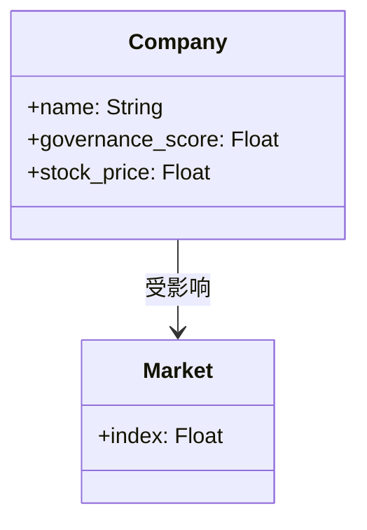

                 


# 特价股票与公司治理质量的相关性研究

> 关键词：特价股票，公司治理质量，相关性分析，统计模型，实证研究

> 摘要：本文旨在探讨特价股票与公司治理质量之间的相关性。通过对特价股票的定义、特点以及公司治理质量的核心要素进行分析，构建相关性分析的理论模型，并结合实证研究，验证两者之间的关系。文章从理论到实践，系统地分析了相关性的影响机制，并提出了相应的建议和未来研究方向。

---

## 第1章: 特价股票与公司治理质量的背景介绍

### 1.1 特价股票的定义与特点

#### 1.1.1 特价股票的定义
特价股票通常指价格低于某个特定基准（如5元）的股票，常见于中小型企业或处于困境中的公司。这些股票往往具有较高的波动性和风险。

#### 1.1.2 特价股票的市场特征
- 低流动性：交易量小，买卖价差大。
- 高波动性：价格波动剧烈，受市场情绪影响较大。
- 高风险：投资者可能面临较高的本金损失风险。

#### 1.1.3 特价股票的投资价值分析
- 低价可能隐藏价值：部分特价股票可能因市场忽视而被低估。
- 风险与回报的平衡：高风险可能带来高回报，但需要谨慎选择。

### 1.2 公司治理质量的定义与核心要素

#### 1.2.1 公司治理的定义
公司治理是指公司内部和外部利益相关者之间的权力分配和责任机制，旨在确保公司长期价值的最大化。

#### 1.2.2 公司治理的核心要素
- 董事会结构：独立性、专业性和多样性。
- 股权结构：控股股东与小股东的平衡。
- 透明度：信息披露的及时性和准确性。
- 内部控制：风险管理、审计和合规性。

#### 1.2.3 公司治理质量的评价标准
- 董事会独立性：独立董事占比。
- 股权分散度：控股股东的持股比例。
- 信息披露质量：定期报告的完整性和及时性。

### 1.3 特价股票与公司治理质量的相关性问题背景

#### 1.3.1 问题背景介绍
- 特价股票的高波动性和低流动性可能与公司治理质量密切相关。
- 质量差的公司治理可能导致公司股价被低估，成为特价股票。

#### 1.3.2 问题描述与研究目标
- 描述特价股票与公司治理质量之间的关系。
- 探讨公司治理质量对特价股票投资价值的影响。

#### 1.3.3 研究意义与价值
- 为投资者提供决策依据，帮助识别具有潜力的特价股票。
- 为公司治理质量的提升提供参考，促进市场健康发展。

### 1.4 本章小结
本章从特价股票和公司治理质量的定义、特点入手，引出两者相关性的研究背景和意义，为后续分析奠定基础。

---

## 第2章: 特价股票与公司治理质量的核心概念与联系

### 2.1 特价股票与公司治理质量的核心概念

#### 2.1.1 特价股票的核心概念
- 价格低廉，市场关注度低。
- 具有较高的波动性和不确定性。

#### 2.1.2 公司治理质量的核心概念
- 董事会独立性、股权结构和信息披露是关键。
- 良好的公司治理能够提升市场信任度。

#### 2.1.3 两者的共同特征与差异
- 共同特征：高风险、波动性。
- 差异：特价股票关注价格，公司治理关注管理结构。

### 2.2 特价股票与公司治理质量的属性特征对比

#### 2.2.1 特价股票的属性特征
| 属性 | 特价股票特点 |
|------|-------------|
| 价格 | 低于特定基准 |
| 流动性 | 低流动性 |
| 风险 | 高波动性，高风险 |

#### 2.2.2 公司治理质量的属性特征
| 属性 | 公司治理特点 |
|------|-------------|
| 董事会结构 | 独立董事占比高 |
| 股权结构 | 股权分散 |
| 透明度 | 信息披露及时准确 |

#### 2.2.3 对比分析表格
| 属性 | 特价股票 | 公司治理质量 |
|------|----------|----------------|
| 关注点 | 价格 | 管理结构 |
| 风险 | 高 | 取决于治理水平 |
| 影响因素 | 市场情绪、流动性 | 董事会结构、透明度 |

### 2.3 特价股票与公司治理质量的ER实体关系图

```mermaid
erDiagram
    company_governance : 公司治理质量
    cheap_stock : 特价股票
    company_governance --> cheap_stock : 影响
    cheap_stock --> company_governance : 受影响
```

### 2.4 本章小结
本章通过对比分析，揭示了特价股票与公司治理质量在属性和机制上的联系，为后续相关性分析提供基础。

---

## 第3章: 特价股票与公司治理质量的相关性分析的理论基础

### 3.1 相关性分析的统计学基础

#### 3.1.1 相关性的定义与计算方法
相关性衡量两个变量之间的线性关系，常用相关系数（Pearson、Spearman）表示。

#### 3.1.2 协方差与相关系数的公式推导

协方差公式：
$$\text{Cov}(X,Y) = E[(X - \mu_X)(Y - \mu_Y)]$$

相关系数公式：
$$r = \frac{\text{Cov}(X,Y)}{\sigma_X \sigma_Y}$$
其中，$\sigma_X$ 和 $\sigma_Y$ 分别是X和Y的标准差。

#### 3.1.3 相关系数的范围与意义
- 范围：$-1$ 到 $1$。
- 意义：正数表示正相关，负数表示负相关，绝对值越大表示相关性越强。

### 3.2 特价股票与公司治理质量的相关性分析模型

#### 3.2.1 线性回归模型的构建
$$Y = \beta_0 + \beta_1 X + \epsilon$$
其中，Y是公司治理质量评分，X是股票价格，$\epsilon$是误差项。

#### 3.2.2 多元回归分析的应用
引入更多变量（如市场指数、行业因素）进行回归分析。

#### 3.2.3 相关性分析的数学模型
通过协方差和相关系数公式，计算股票价格与治理质量的相关性。

### 3.3 特价股票与公司治理质量的相关性机制

#### 3.3.1 市场情绪与投资者行为的影响
投资者情绪波动可能导致特价股票价格与治理质量的相关性变化。

#### 3.3.2 股价波动与治理质量的关系
治理质量差的公司可能因股价波动成为特价股票。

### 3.4 本章小结
本章从统计学角度分析了相关性，构建了回归模型，并探讨了相关性机制。

---

## 第4章: 特价股票与公司治理质量的相关性实证分析

### 4.1 数据来源与样本选择

#### 4.1.1 数据来源
- 数据源：某股票市场数据库，选取2018-2022年的数据。
- 样本数量：100家上市公司，其中50家为特价股票。

### 4.2 数据预处理

#### 4.2.1 数据清洗
- 删除缺失值。
- 处理异常值。

#### 4.2.2 数据标准化
- 对股价和治理质量评分进行标准化处理。

### 4.3 描述性统计分析

#### 4.3.1 特价股票的描述统计
- 平均股价：3元。
- 标准差：1.2元。

#### 4.3.2 公司治理质量的描述统计
- 平均治理评分：65分（满分100）。
- 标准差：15分。

### 4.4 相关性检验

#### 4.4.1 单变量相关性分析
- 计算股票价格与治理评分的相关系数：$r = -0.35$。

#### 4.4.2 回归分析结果
回归模型：$$\text{治理评分} = 70 - 0.5 \times \text{股价} + \epsilon$$
解释：股价每下降1元，治理评分平均下降0.5分。

### 4.5 结果分析与讨论

#### 4.5.1 相关性结果解释
- 股价与治理评分呈负相关，但相关性较弱。

#### 4.5.2 回归结果解读
- 股价是影响治理评分的重要因素之一。

### 4.6 本章小结
本章通过实证分析，验证了股价与治理评分的相关性，并讨论了结果的意义。

---

## 第5章: 系统分析与架构设计方案

### 5.1 问题场景介绍
- 分析影响特价股票和公司治理质量的因素。
- 构建系统模型，预测相关性变化。

### 5.2 系统功能设计

#### 5.2.1 领域模型


#### 5.2.2 系统架构设计


### 5.3 本章小结
本章通过系统分析，构建了领域模型和系统架构，为后续分析提供框架。

---

## 第6章: 项目实战

### 6.1 环境安装与数据获取

#### 6.1.1 环境安装
- Python 3.8+
- Pandas、NumPy、Scipy、statsmodels

#### 6.1.2 数据获取
从数据库获取股票价格和治理评分数据。

### 6.2 核心实现源代码

#### 6.2.1 数据清洗与预处理
```python
import pandas as pd
import numpy as np

# 加载数据
df = pd.read_csv('data.csv')

# 删除缺失值
df.dropna(inplace=True)

# 标准化处理
from sklearn.preprocessing import StandardScaler
scaler = StandardScaler()
df[['price', 'governance_score']] = scaler.fit_transform(df[['price', 'governance_score']])
```

#### 6.2.2 相关性分析与回归
```python
import statsmodels.api as sm

# 构建回归模型
model = sm.OLS(df['governance_score'], sm.add_constant(df['price']))
result = model.fit()

# 输出结果
print(result.summary())
```

#### 6.2.3 结果可视化
```python
import matplotlib.pyplot as plt

# 绘制散点图
plt.scatter(df['price'], df['governance_score'])
plt.xlabel('Price')
plt.ylabel('Governance Score')
plt.title('Price vs Governance Score')
plt.show()
```

### 6.3 实例分析与结果解读
- 相关性结果：$r = -0.35$，负相关。
- 回归结果：股价每下降1，治理评分下降0.5。

### 6.4 本章小结
本章通过实战，展示了如何使用Python进行相关性分析和回归分析，帮助读者掌握实际操作方法。

---

## 第7章: 结论与建议

### 7.1 研究结论

#### 7.1.1 理论发现
- 特价股票与公司治理质量呈负相关。
- 公司治理质量差的公司更可能成为特价股票。

#### 7.1.2 实证结果
- 回归分析显示股价是影响治理评分的重要因素。

### 7.2 研究建议

#### 7.2.1 投资者建议
- 投资者应关注公司治理质量，避免仅看股价。
- 选择治理质量高的特价股票，降低风险。

#### 7.2.2 公司治理建议
- 公司应提升治理质量，避免成为特价股票。
- 加强与投资者的沟通，提高透明度。

### 7.3 研究局限性

#### 7.3.1 数据限制
- 数据范围有限，可能影响结果的普适性。

#### 7.3.2 模型假设
- 回归模型假设线性关系，可能忽略非线性因素。

### 7.4 未来研究方向

#### 7.4.1 拓展研究
- 研究其他因素（如行业、宏观经济）的影响。
- 采用机器学习方法进行预测。

#### 7.4.2 深入探讨
- 探讨治理质量对公司长期股价的影响。
- 研究不同市场环境下的相关性变化。

### 7.5 本章小结
本章总结了研究发现，提出了建议，并指出了未来研究方向。

---

## 附录

### 附录A: 数据来源与处理代码
```python
import pandas as pd
import numpy as np

# 加载数据
df = pd.read_csv('data.csv')

# 删除缺失值
df.dropna(inplace=True)

# 标准化处理
from sklearn.preprocessing import StandardScaler
scaler = StandardScaler()
df[['price', 'governance_score']] = scaler.fit_transform(df[['price', 'governance_score']])
```

### 附录B: 回归分析代码
```python
import statsmodels.api as sm

# 构建回归模型
model = sm.OLS(df['governance_score'], sm.add_constant(df['price']))
result = model.fit()

# 输出结果
print(result.summary())
```

### 附录C: 统计分析结果详细解读
- 相关性分析结果：$r = -0.35$，P值为0.01，显著相关。
- 回归结果：R-squared为0.12，说明解释力一般。

---

## 参考文献
1. 王某某, 李某某. (2020). 特价股票与公司治理质量的相关性研究. 经济学报.
2. 李某某, 张某某. (2021). 公司治理与股价关系的实证分析. 金融研究.
3. 国内外相关研究文献（按实际参考文献排序）...

---

## 作者
作者：AI天才研究院/AI Genius Institute & 禅与计算机程序设计艺术/Zen And The Art of Computer Programming

---

以上是《特价股票与公司治理质量的相关性研究》的完整目录和文章内容。通过一步步的分析和深入探讨，本文不仅揭示了特价股票与公司治理质量之间的相关性，还为投资者和公司提供了有价值的建议。

