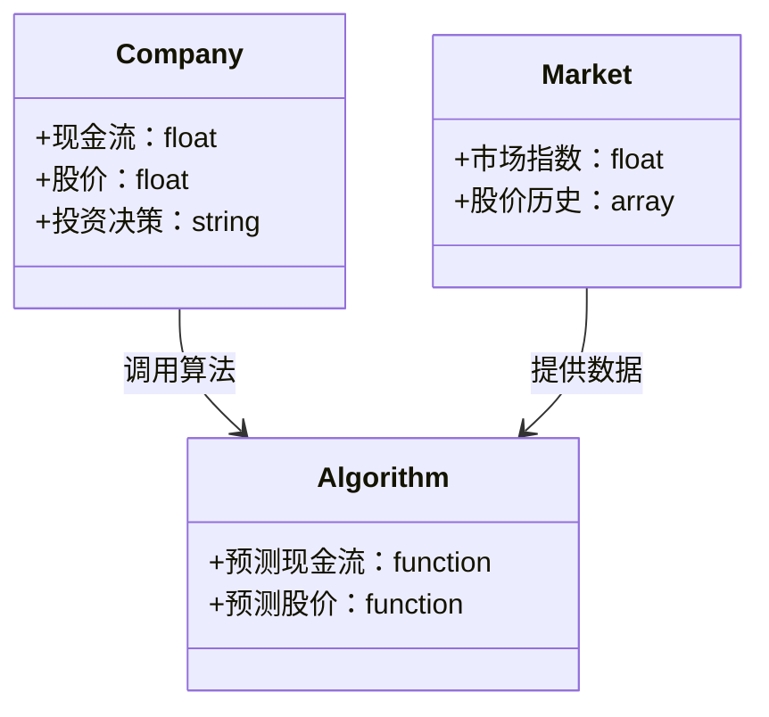

                 


# 特价股票与公司现金流管理效率的关系探讨

## 关键词：特价股票、公司现金流、管理效率、投资策略、数学模型、现金流预测、股票价格预测

## 摘要：本文探讨了特价股票与公司现金流管理效率之间的关系，分析了两者的核心概念、数学模型、系统架构及实际应用案例。通过背景介绍、核心概念对比、算法原理、系统设计、项目实战和最佳实践等部分，详细阐述了如何利用现金流管理优化特价股票投资策略，提升公司财务效率。

---

## 第一部分：引言

### 1.1 特价股票与公司现金流管理效率的关系概述

#### 1.1.1 特价股票的定义与特征
- **特价股票**：指市场价格低于正常估值的股票，通常出现在市场低迷或公司暂时困境时期。
- **特征**：价格低廉、潜在价值、风险较高。

#### 1.1.2 公司现金流管理效率的定义与重要性
- **现金流管理**：通过优化资金流入和流出，确保企业运营和发展的资金需求。
- **管理效率**：衡量现金流管理的优劣，包括速度、成本和效果。

#### 1.1.3 两者关系的背景与研究意义
- **背景**：现金流充足的企业能够抓住特价股票的投资机会，提升资产回报。
- **意义**：研究两者关系有助于企业在财务管理和投资决策中找到平衡点。

### 1.2 研究目标与方法
- **目标**：分析特价股票与现金流管理的关系，构建预测模型，优化投资策略。
- **方法**：定性分析、定量模型、案例研究。

---

## 第二部分：特价股票与现金流管理的核心概念

### 2.1 特价股票的市场分析

#### 2.1.1 特价股票的市场时机
- 市场周期分析：熊市、牛市周期中特价股票的出现规律。
- 市场情绪分析：投资者情绪对股票价格的影响。

#### 2.1.2 特价股票的投资策略
- 价值投资：寻找被低估的股票。
- 技术分析：通过价格和成交量预测未来走势。

#### 2.1.3 特价股票与公司财务状况的关系
- 公司财务健康状况影响股票价格。
- 现金流状况决定公司能否回购股票或进行其他投资。

### 2.2 公司现金流管理的原理

#### 2.2.1 现金流管理的基本概念
- **现金流**：企业一定时期内的现金流入和流出。
- **现金流入**：营业收入、投资收益、筹资活动。
- **现金流出**：支付成本、税费、投资支出。

#### 2.2.2 现金流管理的流程与方法
- **预测现金流**：基于历史数据和未来预测。
- **现金预算**：制定收支计划。
- **监控与调整**：实时跟踪，及时调整。

#### 2.2.3 现金流管理对企业发展的影响
- **流动性风险**：现金流不足可能导致支付困难。
- **投资能力**：充裕的现金流支持企业扩张和创新。

### 2.3 特价股票与现金流管理的关联性分析

#### 2.3.1 特价股票购买对现金流的影响
- **现金流出增加**：购买特价股票需要资金投入。
- **资产增值**：股票升值带来资产价值增加，间接影响现金流。

#### 2.3.2 现金流管理对特价股票投资的促进作用
- **资金保障**：充足的现金流确保能够抓住投资机会。
- **风险控制**：良好的现金流管理降低投资风险。

#### 2.3.3 两者的协同效应与风险控制
- **协同效应**：现金流管理优化投资策略，提升资产回报。
- **风险控制**：通过分散投资和现金流监控，降低市场波动风险。

---

## 第三部分：现金流管理效率与特价股票投资的数学模型

### 3.1 现金流预测模型

#### 3.1.1 现金流预测模型的构建
- **时间序列分析**：基于历史数据预测未来现金流。
- **ARIMA模型**：自回归积分滑动模型，适用于非稳定时间序列。

#### 3.1.2 现金流预测公式
$$
\hat{y}_t = a + bt + \epsilon_t
$$
其中，$\hat{y}_t$ 是预测值，$a$ 是截距，$b$ 是斜率，$\epsilon_t$ 是误差项。

#### 3.1.3 现金流预测的步骤
1. 收集历史现金流数据。
2. 选择合适的预测模型。
3. 训练模型并验证准确性。
4. 应用模型预测未来现金流。

### 3.2 股票价格预测模型

#### 3.2.1 股票价格预测模型的构建
- **线性回归模型**：预测股票价格与市场指数的关系。
- **随机游走模型**：假设价格变化无规律，无法预测。

#### 3.2.2 股票价格预测公式
$$
P_t = \alpha + \beta \cdot P_{t-1} + \epsilon_t
$$
其中，$P_t$ 是当前股票价格，$\alpha$ 是截距，$\beta$ 是回归系数，$\epsilon_t$ 是误差项。

#### 3.2.3 股票价格预测的步骤
1. 收集股票历史价格数据。
2. 选择预测模型并训练。
3. 验证模型准确性。
4. 应用模型预测未来价格。

### 3.3 现金流与股票价格的关联性分析

#### 3.3.1 现金流对股票价格的影响
- **股利贴现模型（DDM）**：股票价格等于未来股利的现值之和。
$$
P = \frac{D}{r - g}
$$
其中，$D$ 是股利，$r$ 是折现率，$g$ 是股利增长率。

#### 3.3.2 股票价格对现金流的影响
- **股票质押融资**：公司通过质押股票获得资金，影响现金流。

#### 3.3.3 现金流与股票价格的互动关系
- 现金流充裕，股价可能上涨；股价上涨，公司市值增加，可能影响现金流。

---

## 第四部分：系统分析与架构设计

### 4.1 问题场景介绍

#### 4.1.1 项目背景
- 企业希望通过现金流管理优化特价股票投资，提升资产回报率。
- 现有系统无法有效预测现金流和股票价格，导致投资决策失误。

### 4.2 系统功能设计

#### 4.2.1 领域模型
- **领域模型**：描述系统中各实体及其关系。
- **Mermaid类图**：


### 4.3 系统架构设计

#### 4.3.1 系统架构
- **分层架构**：数据层、业务逻辑层、用户界面层。
- **Mermaid架构图**：


### 4.4 系统接口设计

#### 4.4.1 API接口
- `/api/predict/cash_flow`：预测现金流。
- `/api/predict/stock_price`：预测股票价格。

### 4.5 系统交互设计

#### 4.5.1 交互流程
- 用户输入投资参数。
- 系统调用算法预测现金流和股价。
- 系统生成投资建议。
- 用户查看结果并做出决策。

---

## 第五部分：项目实战

### 5.1 环境安装

#### 5.1.1 安装Python
- 下载并安装Python 3.8及以上版本。
- 安装Jupyter Notebook用于数据处理和可视化。

#### 5.1.2 安装依赖库
```bash
pip install numpy pandas scikit-learn matplotlib
```

### 5.2 核心代码实现

#### 5.2.1 现金流预测代码
```python
import numpy as np
from sklearn.linear_model import LinearRegression

# 示例数据
data = np.array([[1, 2], [2, 3], [3, 4], [4, 5]])
X = data[:, 0].reshape(-1, 1)
y = data[:, 1]

model = LinearRegression()
model.fit(X, y)

# 预测未来现金流
future_periods = 5
predicted = model.predict(np.array([[5], [6], [7], [8], [9]]))
print(predicted)
```

#### 5.2.2 股票价格预测代码
```python
import pandas as pd
from sklearn.svm import SVR

# 示例数据
data = pd.DataFrame({'Date': range(10), 'Price': [10, 20, 15, 25, 30, 22, 28, 35, 32, 38]})
X = data[['Date']]
y = data['Price']

model = SVR(kernel='rbf')
model.fit(X, y)

# 预测未来股价
future_dates = pd.DataFrame({'Date': [11, 12, 13]})
predicted_prices = model.predict(future_dates[['Date']])
print(predicted_prices)
```

### 5.3 实际案例分析

#### 5.3.1 案例背景
- 某公司现金流充裕，希望通过投资特价股票提升资产回报。

#### 5.3.2 数据分析与预测
- 使用历史现金流和股价数据，预测未来现金流和股价。
- 分析预测结果，制定投资策略。

#### 5.3.3 投资决策
- 根据预测结果，决定是否购买特价股票。
- 监控市场变化，及时调整投资策略。

### 5.4 项目总结

#### 5.4.1 成功的关键因素
- 准确的现金流预测模型。
- 合理的股票价格预测方法。
- 及时的市场监控和调整。

#### 5.4.2 经验与教训
- 数据质量对预测结果影响重大。
- 需要结合市场实际情况进行调整。

---

## 第六部分：最佳实践

### 6.1 小结

#### 6.1.1 核心观点回顾
- 特价股票与现金流管理效率密切相关。
- 优化现金流管理可以提升投资决策效果。

#### 6.1.2 主要结论
- 构建现金流预测模型和股票价格预测模型，优化投资策略。
- 结合实际情况，灵活调整投资策略。

### 6.2 注意事项

#### 6.2.1 数据风险
- 数据质量影响预测准确性。
- 数据更新频率影响预测效果。

#### 6.2.2 模型风险
- 模型假设可能与实际情况不符。
- 模型过度拟合训练数据。

#### 6.2.3 市场风险
- 市场波动可能导致预测失效。
- 政策变化影响股票价格。

### 6.3 拓展阅读

#### 6.3.1 推荐书籍
- 《股票投资的数学分析》
- 《现金流管理实战技巧》

#### 6.3.2 推荐博客
- 专业金融博客
- 技术分析博客

---

## 作者：AI天才研究院/AI Genius Institute & 禅与计算机程序设计艺术/Zen And The Art of Computer Programming

---

本文通过详细分析特价股票与公司现金流管理效率的关系，结合数学模型、系统架构和实际案例，为读者提供了全面的视角和实用的指导。希望本文能帮助企业在财务管理与投资决策中找到平衡点，提升整体效率和收益。

