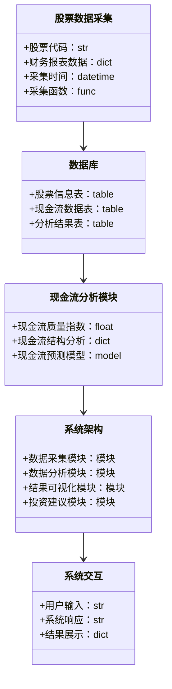
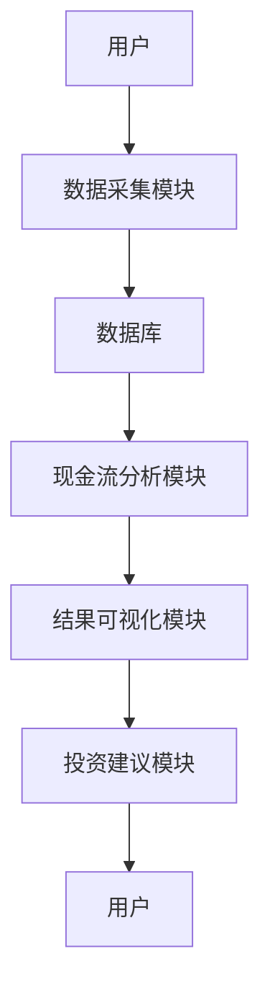
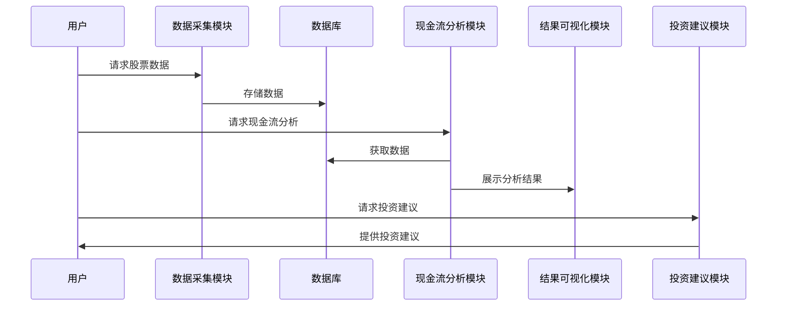

                 


# 特价股票与公司现金流质量的关系

> 关键词：特价股票、公司现金流、现金流质量、财务分析、投资策略

> 摘要：本文深入探讨了特价股票与公司现金流质量之间的关系。通过分析现金流质量的核心要素、评估方法以及在投资策略中的应用，本文揭示了现金流质量如何影响特价股票的估值和投资决策。文章结合实际案例和数学模型，提供了全面的分析框架，帮助投资者更好地理解现金流质量在特价股票分析中的重要性。

---

## 第一部分：特价股票与现金流质量的背景介绍

### 第1章：特价股票的基本概念

#### 1.1 特价股票的定义与特点

**1.1.1 特价股票的定义**

特价股票是指市场价格显著低于其内在价值的股票。通常，这类股票可能因为市场波动、行业周期性或公司短期困境而被低估。投资者认为这些股票具有长期增值潜力，因此在低价时买入，期望在市场恢复时获得收益。

**1.1.2 特价股票的特点**

- **低估值**：市盈率、市净率等估值指标低于行业平均水平。
- **周期性**：通常出现在市场低迷或行业衰退期。
- **风险较高**：由于价格较低，可能存在较高的市场风险或公司基本面风险。
- **潜在回报**：如果公司基本面改善，股价可能迅速回升。

**1.1.3 特价股票的分类**

- **价值型股票**：基本面良好，但市场价格被低估。
- **成长型股票**：未来增长潜力大，但当前市场价格被低估。
- **周期性股票**：受行业周期影响，价格波动较大。

#### 1.2 公司现金流质量的核心要素

**1.2.1 现金流的定义与分类**

现金流是公司在一定时期内通过经营活动、投资活动和筹资活动所产生的现金流入和流出。现金流分为三类：

1. **经营活动现金流**：公司日常经营活动中产生的现金流。
2. **投资活动现金流**：公司投资于长期资产或剥离资产所产生的现金流。
3. **筹资活动现金流**：公司通过发行股票、债券或借款等方式筹集资金所产生的现金流。

**1.2.2 现金流质量的核心要素**

- **现金流稳定性**：现金流来源的稳定性和可持续性。
- **现金流规模**：公司产生的现金流是否能够支持其日常运营和未来发展。
- **现金流结构**：经营活动、投资活动和筹资活动现金流的构成比例。
- **现金流风险**：现金流波动对 company financial health 的影响程度。

**1.2.3 现金流质量与公司财务健康的关系**

现金流质量是公司财务健康的重要指标。健康的现金流表明公司能够通过自身经营产生足够的现金流，支持其日常运营和未来发展。反之，现金流质量差的公司可能面临财务危机，难以偿还债务或进行投资。

#### 1.3 特价股票与现金流质量的关系

**1.3.1 特价股票与现金流质量的关联性**

特价股票的市场价格被低估，但其现金流质量可能较高或较低。投资者需要通过分析公司的现金流质量来判断其内在价值。

**1.3.2 现金流质量对特价股票的影响**

现金流质量高的公司，即使市场价格被低估，其内在价值仍然较高，投资风险较低。相反，现金流质量差的公司，即使价格便宜，也可能存在较大的财务风险。

**1.3.3 特价股票市场中的现金流分析**

在特价股票市场中，现金流分析是评估公司内在价值的重要工具。通过分析公司的现金流质量，投资者可以更好地判断股票的真正价值，避免因市场价格低估而误判公司基本面。

---

## 第二部分：现金流质量的评估与分析

### 第2章：现金流质量的评估方法

#### 2.1 现金流质量的定性分析

**2.1.1 现金流来源的分析**

- 经营活动现金流：公司主营业务收入是否稳定，是否能够持续产生正现金流。
- 投资活动现金流：公司投资于哪些项目，是否能够带来正回报。
- 筹资活动现金流：公司是否依赖外部融资，是否存在过度负债的风险。

**2.1.2 现金流结构的合理性**

- 经营活动现金流占比较高：表明公司依赖主营业务产生现金流。
- 投资活动现金流占比较高：表明公司正在积极进行资本支出。
- 筹资活动现金流占比较高：表明公司依赖外部融资，可能面临较高的财务风险。

**2.1.3 现金流风险的评估**

- 现金流波动性：现金流是否稳定，是否存在较大波动。
- 现金流周期性：现金流是否受行业周期影响，波动是否在可接受范围内。
- 现金流依赖性：公司是否过度依赖某一种类型的现金流。

#### 2.2 现金流质量的定量分析

**2.2.1 现金流比率分析**

常用的现金流比率包括：

1. **现金流利息保障倍数（CFO/Interest Expense）**：衡量公司通过经营活动现金流支付利息的能力。
2. **现金流债务保障倍数（CFO/Total Debt）**：衡量公司通过经营活动现金流偿还债务的能力。
3. **现金流净收益比（CFO/Net Income）**：衡量公司净利润与现金流之间的关系。

**2.2.2 现金流质量指数的计算**

现金流质量指数（CQI）可以通过以下公式计算：

$$
CQI = \frac{\text{经营活动现金流}}{\text{净利润}} \times 100
$$

指数越高，表明公司现金流质量越好。

**2.2.3 现金流质量与公司业绩的关系**

现金流质量高的公司，通常具有较强的盈利能力和市场竞争力。通过分析现金流质量，可以更好地判断公司的业绩可持续性。

#### 2.3 现金流质量的综合评估模型

**2.3.1 综合评估模型的构建**

综合评估模型可以将定性和定量分析相结合，通过加权评分的方式，对公司的现金流质量进行综合评估。

**2.3.2 模型的验证与优化**

通过历史数据验证模型的有效性，并根据实际情况进行参数调整，以提高模型的准确性。

**2.3.3 模型在实际中的应用**

以某公司为例，通过综合评估模型分析其现金流质量，判断其是否为特价股票的潜在投资标的。

---

## 第三部分：特价股票的现金流分析与投资策略

### 第3章：特价股票的现金流分析

#### 3.1 特价股票现金流的特点

**3.1.1 特价股票现金流的波动性**

- 市场价格波动较大，现金流可能受到市场情绪的影响。
- 公司基本面可能不稳定，现金流波动性较高。

**3.1.2 特价股票现金流的周期性**

- 受行业周期影响，现金流可能在特定周期内波动较大。
- 投资者需要关注行业周期对现金流的影响。

**3.1.3 特价股票现金流的行业差异**

- 不同行业现金流质量差异较大，投资者需要结合行业特点进行分析。

#### 3.2 特价股票现金流的预测方法

**3.2.1 现有数据的收集与整理**

- 收集公司过去几年的财务报表，提取经营活动、投资活动和筹资活动的现金流数据。
- 分析行业趋势，判断现金流的未来变化趋势。

**3.2.2 现金流预测模型的建立**

- 使用时间序列分析（如ARIMA模型）或回归分析预测未来的现金流。
- 结合公司基本面和行业趋势，调整模型参数。

**3.2.3 模型的验证与优化**

- 使用历史数据验证模型的准确性。
- 根据实际情况优化模型，提高预测精度。

#### 3.3 特价股票现金流风险的管理

**3.3.1 现金流风险的识别**

- 识别公司现金流的主要风险来源，如市场需求变化、行业周期波动等。
- 通过财务报表分析，判断公司现金流的潜在风险。

**3.3.2 现金流风险的量化**

- 使用VaR（Value at Risk）等风险度量方法，量化现金流波动的风险。
- 结合历史数据和市场预期，估算未来现金流波动的可能性。

**3.3.3 现金流风险管理策略**

- 多样化投资：通过投资不同行业的特价股票，分散现金流风险。
- 设置止损点：在现金流质量恶化时，及时卖出股票，避免更大损失。
- 保持流动性：确保有足够的流动资金应对市场波动。

### 第4章：基于现金流质量的特价股票投资策略

#### 4.1 投资策略的制定原则

**4.1.1 现金流质量优先原则**

- 优先选择现金流质量高、市场价格被低估的股票。
- 通过现金流质量分析，筛选出具有长期增值潜力的特价股票。

**4.1.2 风险控制原则**

- 设定合理的止损点，避免因现金流质量恶化导致的重大损失。
- 通过分散投资，降低单一股票对整体投资组合的影响。

**4.1.3 长期投资与短期投资的结合**

- 长期投资：关注现金流质量稳定、公司基本面良好的特价股票。
- 短期投资：利用市场波动，进行短期套利。

#### 4.2 投资策略的具体实施

**4.2.1 现金流质量筛选标准**

- 现金流质量指数（CQI）大于100。
- 经营活动现金流连续三年为正。
- 现金流利息保障倍数大于2倍。

**4.2.2 投资组合的构建**

- 根据现金流质量筛选出若干只特价股票，构建投资组合。
- 定期调整投资组合，确保符合现金流质量标准。

**4.2.3 投资效果的评估**

- 定期评估投资组合的收益与风险。
- 根据市场变化和公司基本面，优化投资组合。

---

## 第四部分：系统分析与架构设计方案

### 第5章：现金流质量分析的系统架构

#### 5.1 问题场景介绍

- 投资者需要快速分析大量股票的现金流质量，筛选出具有投资价值的特价股票。
- 现有工具和方法难以满足高效、精准的需求。

#### 5.2 项目介绍

- 开发一个基于现金流质量分析的股票筛选系统。
- 系统功能包括数据采集、分析计算、结果可视化和投资建议。

#### 5.3 系统功能设计（领域模型）



#### 5.4 系统架构设计



#### 5.5 系统接口设计

- 数据采集接口：接收外部数据源（如API接口）的股票数据。
- 数据分析接口：调用现金流分析模块，返回现金流质量评估结果。
- 结果展示接口：将分析结果以可视化形式展示给用户。
- 投资建议接口：根据分析结果，提供投资建议。

#### 5.6 系统交互设计



---

## 第五部分：项目实战

### 第6章：现金流质量分析的实战应用

#### 6.1 环境安装与配置

- 安装Python环境：确保安装了Python 3.8及以上版本。
- 安装必要的库：`pandas`, `numpy`, `scipy`, `matplotlib`, `seaborn`, `sklearn`。

#### 6.2 数据采集与预处理

```python
import pandas as pd
import requests
from bs4 import BeautifulSoup

def get_financial_data(ticker):
    url = f'https://finance.yahoo.com/quote/{ticker}'
    response = requests.get(url)
    soup = BeautifulSoup(response.text, 'html.parser')
    data = {}
    # 提取现金流数据
    cf_ops = soup.find('div', {'data-test': 'cf-annual'}).get_text().split('\n')[1:-1]
    data['cash_flow_operations'] = float(cf_ops[0].split()[-1].replace(',', '')) if cf_ops else 0
    cf_investing = soup.find('div', {'data-test': 'cf-investing'}).get_text().split('\n')[1:-1]
    data['cash_flow_investing'] = float(cf_investing[0].split()[-1].replace(',', '')) if cf_investing else 0
    cf_financing = soup.find('div', {'data-test': 'cf-financing'}).get_text().split('\n')[1:-1]
    data['cash_flow_financing'] = float(cf_financing[0].split()[-1].replace(',', '')) if cf_financing else 0
    return data

# 示例：获取某公司的现金流数据
ticker = 'AAPL'
cf_data = get_financial_data(ticker)
print(cf_data)
```

#### 6.3 现金流质量分析的核心实现

```python
import pandas as pd
from sklearn.linear_model import LinearRegression

def calculate_cqi(revenue, net_income):
    cqi = (revenue / net_income) * 100
    return cqi

def predict_cash_flow(data, n_periods=3):
    model = LinearRegression()
    model.fit(pd.DataFrame(data['dates']), data['cash_flows'])
    predicted_flows = model.predict(pd.DataFrame([data['dates'][-1] + 1]))
    return predicted_flows[0]

# 示例：计算现金流质量指数
revenue = 100000000
net_income = 30000000
cqi = calculate_cqi(revenue, net_income)
print(f"现金流质量指数：{cqi}%")

# 示例：预测未来3期现金流
data = {'dates': [1, 2, 3, 4, 5], 'cash_flows': [10, 15, 20, 25, 30]}
predicted_flow = predict_cash_flow(data)
print(f"预测未来现金流：{predicted_flow}")
```

#### 6.4 实际案例分析与结果解读

以某公司为例，分析其现金流质量，判断其是否为特价股票的潜在投资标的。

- **案例分析**：假设某公司的经营活动现金流连续三年为正，且现金流质量指数为120%。
- **结果解读**：现金流质量较高，公司财务健康，具有较高的投资价值。

#### 6.5 项目小结

通过实战项目，我们掌握了如何利用现金流质量分析评估特价股票的投资价值。通过Python代码实现数据采集、分析和预测，能够更高效地进行投资决策。

---

## 第六部分：总结与展望

### 第7章：总结与展望

#### 7.1 最佳实践 tips

- **数据来源**：确保数据的准确性和及时性，优先选择权威的财务数据源。
- **模型优化**：根据市场变化和公司特点，不断优化现金流质量分析模型。
- **风险管理**：在投资过程中，注重风险控制，避免因现金流质量恶化导致的重大损失。

#### 7.2 小结

现金流质量是评估特价股票内在价值的重要指标。通过深入分析现金流质量，投资者可以更好地判断股票的真正价值，避免因市场价格低估而误判公司基本面。

#### 7.3 注意事项

- **市场风险**：市场波动可能影响现金流质量分析的结果。
- **公司特异性**：不同公司的现金流质量受多种因素影响，需要结合具体情况进行分析。
- **模型局限性**：现金流质量分析模型可能存在局限性，需要结合其他分析方法进行综合判断。

#### 7.4 拓展阅读

- **书籍推荐**：《投资学》（作者：某权威专家）
- **在线课程**：推荐学习现金流分析和投资策略相关的在线课程。
- **行业报告**：关注行业分析报告，了解行业趋势对现金流质量的影响。

---

## 作者：AI天才研究院/AI Genius Institute & 禅与计算机程序设计艺术 /Zen And The Art of Computer Programming

---

# END

