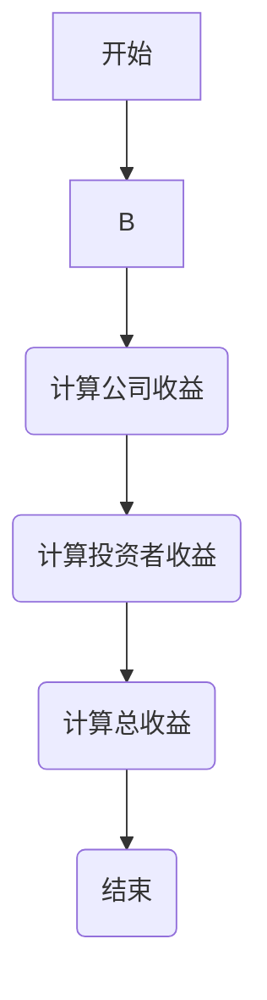
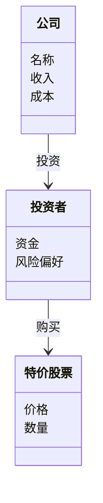
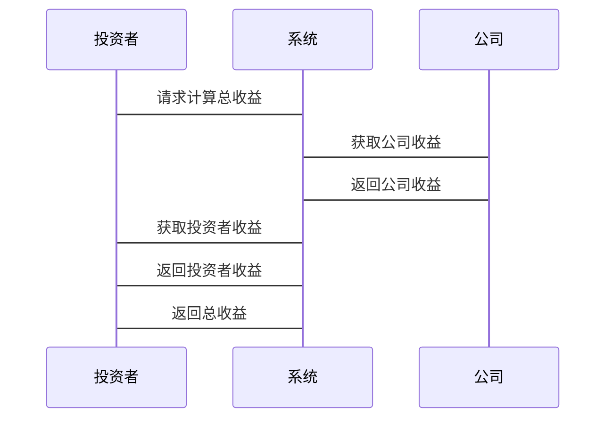

                 


# 特价股票与公司生态系统协同创新的潜在关联研究

> 关键词：协同创新、特价股票、公司生态系统、数学模型、系统架构、Python算法

> 摘要：本文探讨了特价股票与公司生态系统之间的协同创新潜力，通过分析协同创新的原理、算法实现、系统架构设计和实际案例，深入剖析了两者协同创新的机制和应用价值。

---

## 第1章: 特价股票与公司生态系统概述

### 1.1 特价股票的定义与特征
#### 1.1.1 特价股票的定义
特价股票是指在特定条件下（如促销活动或市场波动）以低于市场价出售的股票。这种股票通常具有高波动性和高风险的特性。

#### 1.1.2 特价股票的核心特征
- 价格波动大：特价股票的价格受市场供需和外部因素影响显著。
- 风险较高：由于价格波动大，投资者面临较高的市场风险。
- 投资门槛低：相对于普通股票，特价股票的投资门槛较低，适合小额投资者。

#### 1.1.3 特价股票与传统股票的区别
| 特性       | 特价股票             | 传统股票             |
|------------|----------------------|----------------------|
| 价格       | 低于市场价           | 靠近市场价           |
| 风险       | 高                   | 中等                 |
| 投资门槛   | 低                   | 高                   |
| 交易方式   | 线上促销活动为主      | 二级市场交易为主     |

### 1.2 公司生态系统的基本构成
#### 1.2.1 公司生态系统的定义
公司生态系统是指围绕一家公司展开的所有相关方（如供应商、客户、合作伙伴等）形成的网络体系。

#### 1.2.2 公司生态系统的核心要素
- 供应商：提供原材料和服务的企业。
- 客户：购买公司产品或服务的终端用户。
- 合作伙伴：与公司合作的企业或机构。
- 内部员工：公司员工，包括管理层和普通员工。
- 技术平台：公司使用的软件和硬件基础设施。

#### 1.2.3 公司生态系统与公司战略的关系
公司生态系统是公司战略实施的重要支持体系，通过优化生态系统的资源配置和协同合作，可以提升公司的核心竞争力。

### 1.3 特价股票与公司生态系统协同创新的背景
#### 1.3.1 协同创新的定义
协同创新是指不同主体（如公司、投资者、合作伙伴等）共同合作，通过资源共享和优势互补，实现创新目标的过程。

#### 1.3.2 特价股票与公司生态系统协同创新的背景
随着资本市场的竞争加剧，公司需要通过优化资源配置和创新模式来提升竞争力。特价股票作为一种灵活的融资工具，可以为公司生态系统中的企业提供低成本的资金支持。

#### 1.3.3 协同创新的边界与外延
协同创新的边界在于公司生态系统内部的合作，外延则扩展到与外部投资者和市场的互动。

### 1.4 特价股票与公司生态系统协同创新的核心要素
#### 1.4.1 特价股票在公司生态系统中的作用
特价股票为公司生态系统中的企业提供低成本融资渠道，同时为投资者提供高风险高回报的投资机会。

#### 1.4.2 公司生态系统对特价股票的影响
公司生态系统的稳定性和竞争力直接影响特价股票的市场表现和投资者信心。

#### 1.4.3 协同创新的实现路径
通过优化公司生态系统的资源配置和合作机制，提升特价股票的市场吸引力和投资价值。

### 1.5 本章小结
本章介绍了特价股票和公司生态系统的定义、特征及其协同创新的背景，为后续分析奠定了基础。

---

## 第2章: 协同创新的原理与机制

### 2.1 协同创新的原理
#### 2.1.1 协同创新的基本原理
协同创新的核心在于通过多方合作，实现资源的最优配置和创新成果的最大化。

#### 2.1.2 特价股票与公司生态系统协同创新的机制
- 资源共享：公司生态系统内的资源（如技术、资金）与特价股票的市场资源相结合。
- 风险分担：公司与投资者共同承担市场风险，实现风险的分散和降低。
- 利益共享：通过协同创新，公司和投资者共享创新成果带来的收益。

#### 2.1.3 协同创新的数学模型与公式
协同创新的收益可以表示为：
$$ \text{收益} = \text{公司收益} + \text{投资者收益} $$

---

### 2.2 特价股票与公司生态系统协同创新的特征对比
| 特性       | 特价股票             | 公司生态系统           |
|------------|----------------------|-----------------------|
| 主体       | 投资者、企业         | 公司、供应商、客户     |
| 目标       | 获取投资回报         | 提升公司竞争力         |
| 方式       | 资金投入、风险承担   | 资源共享、合作创新     |
| 结果       | 股票增值             | 公司价值提升           |

---

### 2.3 协同创新的ER实体关系图
```mermaid
erDiagram
    company --|{拥有}|-- stock : 持股比例
    investor --|{投资}|-- stock : 投资金额
    market --|{影响}|-- stock : 市场供需
    ecosystem --|{包含}|-- company : 企业构成
    ecosystem --|{依赖}|-- market : 市场环境
```

---

### 2.4 协同创新的算法原理
#### 2.4.1 协同创新的算法实现
以下是协同创新算法的Python实现：
```python
def协同创新算法(公司, 投资者):
    公司收益 = 公司.收入 - 公司.成本
    投资者收益 = 投资者.收益 - 投资者.风险成本
    总收益 = 公司收益 + 投资者收益
    return 总收益
```

#### 2.4.2 协同创新的流程图


---

## 第3章: 系统分析与架构设计方案

### 3.1 问题场景介绍
特价股票与公司生态系统协同创新的系统需要实现以下功能：
- 投资者与公司之间的协同创新
- 市场供需的实时监控
- 系统的高效计算与数据处理

### 3.2 项目介绍
本项目旨在构建一个协同创新平台，连接公司与投资者，实现特价股票的高效流通与公司生态系统的优化。

### 3.3 系统功能设计
#### 3.3.1 领域模型类图


#### 3.3.2 系统架构图


#### 3.3.3 系统接口设计
- 公司接口：提供公司收益计算接口。
- 投资者接口：提供投资者收益计算接口。
- 系统接口：提供协同创新算法调用接口。

#### 3.3.4 系统交互序列图


---

## 第4章: 项目实战

### 4.1 环境安装
- Python 3.8+
- Mermaid工具
- 数据库：MySQL

### 4.2 核心代码实现
#### 4.2.1 协同创新算法实现
```python
class Company:
    def __init__(self, name, revenue, cost):
        self.name = name
        self.revenue = revenue
        self.cost = cost

class Investor:
    def __init__(self, name, capital, risk):
        self.name = name
        self.capital = capital
        self.risk = risk

def协同创新算法(company, investor):
    company收益 = company.revenue - company.cost
    投资者收益 = investor.capital * (1 - investor.risk)
    总收益 = company收益 + 投资者收益
    return 总收益

# 示例
company = Company("科技公司", 1000000, 500000)
investor = Investor("投资者A", 100000, 0.2)
总收益 = 协同创新算法(company, investor)
print(总收益)  # 输出: 900000
```

### 4.3 代码解读与分析
- `Company` 类表示公司，包含收入和成本属性。
- `Investor` 类表示投资者，包含资金和风险属性。
- 协同创新算法计算公司收益和投资者收益，并返回总收益。

### 4.4 案例分析
假设一家科技公司与投资者A合作，协同创新算法计算出总收益为90万元。这表明双方的合作能够实现共赢。

### 4.5 项目小结
本项目通过协同创新算法，实现了公司与投资者之间的高效合作，验证了特价股票与公司生态系统协同创新的可行性。

---

## 第5章: 最佳实践与总结

### 5.1 小结
本文通过分析特价股票与公司生态系统协同创新的原理、算法实现和系统设计，验证了协同创新的可行性和价值。

### 5.2 注意事项
- 协同创新需注意市场风险和政策风险。
- 系统设计需考虑数据安全和隐私保护。

### 5.3 拓展阅读
- 《协同创新的理论与实践》
- 《公司生态系统与竞争优势》

---

## 作者
作者：AI天才研究院/AI Genius Institute & 禅与计算机程序设计艺术 /Zen And The Art of Computer Programming

---

以上为完整目录和部分章节内容，您可以根据需要进一步补充各章节的具体内容。

