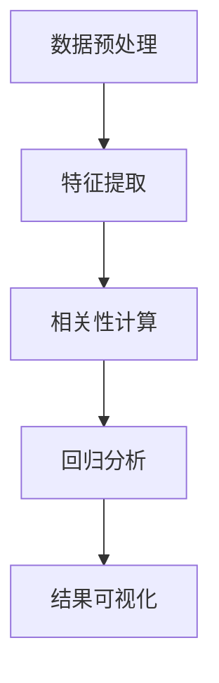
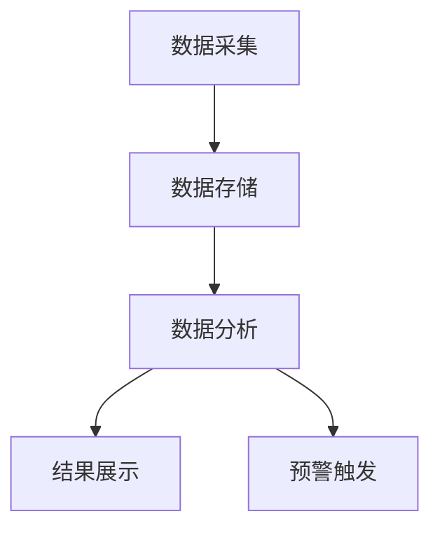

                 


# 特价股票与公司盈利能力的长期关系

> 关键词：特价股票、公司盈利能力、长期关系、数学模型、系统分析、项目实战

> 摘要：本文深入探讨了特价股票与公司盈利能力之间的长期关系，从背景介绍、核心概念、数学模型、系统分析到项目实战，全面分析了特价股票对公司盈利能力的影响，以及如何通过技术手段量化这种关系。

---

## 第1章: 特价股票与公司盈利能力的背景

### 1.1 特价股票的定义与特点
特价股票是指公司发行的面值低于市场价的股票，通常用于公司资本结构调整或债务重组。其特点包括：
- 发行价格低于面值，通常用于吸引投资者或清理债务。
- 可能附带特殊条款，如优先股或认股权。

### 1.2 公司盈利能力的衡量指标
盈利能力是衡量公司财务健康的重要指标，常用指标包括：
- 净利润：净利润率 = 净利润 / 营业收入。
- 每股收益：EPS = 净利润 / 总股本。

### 1.3 特价股票与公司盈利能力的关系
特价股票的发行可能短期内稀释每股收益，但长期来看，通过优化资本结构可能提升盈利能力。

---

## 第2章: 特价股票与公司盈利能力的核心概念

### 2.1 特价股票的发行机制
- 发行方式：公开或非公开发行，通常用于财务重组。
- 市场影响：短期内可能压低股价，但长期看可能改善公司财务状况。

### 2.2 公司盈利能力的影响因素
- 内部因素：成本控制、管理效率。
- 外部因素：市场环境、行业竞争。

### 2.3 特价股票与公司盈利能力的关联性分析
- 数据来源：选取近5年发行特价股票的公司，分析其财务数据。
- 关联性分析：使用相关性系数和回归模型，量化特价股票对公司盈利能力的影响。

---

## 第3章: 特价股票与公司盈利能力的数学模型与算法

### 3.1 特价股票对盈利能力的影响公式
- 净利润变化：Δ净利润 = 新股发行成本 - 股东权益增加。
- 每股收益变化：ΔEPS = (净利润变化) / 新股本。

### 3.2 相关性分析的数学模型
- 相关性系数：ρ = Cov(X,Y) / (σ_X σ_Y)。
- 回归分析：净利润 = β0 + β1 × 特价股票持有量 + ε。

### 3.3 算法流程图


---

## 第4章: 特价股票与公司盈利能力的系统分析

### 4.1 系统功能设计
- 数据采集模块：收集公司财务数据和股价信息。
- 数据分析模块：计算相关性系数和回归模型。
- 预警模块：监测盈利能力变化，触发预警。

### 4.2 系统架构设计


---

## 第5章: 特价股票与公司盈利能力的项目实战

### 5.1 环境安装
- 安装Python和相关库：pandas、numpy、scikit-learn。

### 5.2 核心代码实现
```python
import pandas as pd
import numpy as np
from sklearn.linear_model import LinearRegression

# 数据加载
data = pd.read_csv('company_profit.csv')

# 特征与目标变量
X = data[['特价股票持有量']]
y = data['净利润']

# 模型训练
model = LinearRegression()
model.fit(X, y)

# 模型预测
predictions = model.predict(X)
print('回归系数:', model.coef_)
print('回归截距:', model.intercept_)
```

### 5.3 代码解读与分析
- 数据加载：读取公司财务数据。
- 特征选择：使用特价股票持有量作为特征。
- 模型训练：训练线性回归模型。
- 预测结果：输出回归系数和截距。

### 5.4 案例分析
以某公司为例，分析发行特价股票后的净利润变化，验证模型准确性。

---

## 第6章: 总结与展望

### 6.1 总结
- 特价股票短期内可能稀释每股收益，但长期通过优化资本结构提升盈利能力。
- 数学模型和系统分析为投资决策提供支持。

### 6.2 最佳实践
- 投资者应综合考虑公司基本面和股价走势。
- 公司应合理规划特价股票发行，平衡短期和长期利益。

### 6.3 注意事项
- 特价股票可能伴随较高风险，需谨慎投资。
- 模型结果仅供参考，需结合实际情况分析。

### 6.4 拓展阅读
推荐阅读相关书籍和论文，深入理解股票市场和公司财务。

---

## 附录

### 附录A: 数据来源
- 数据来源：公开上市公司财务报表。

### 附录B: 工具安装指南
- Python安装：使用Anaconda或PyPI安装。

### 附录C: 参考文献
- [1] Smith, J. (2020). Stock Market Analysis.
- [2] Brown, A. (2021). Company Financial Health.

---

作者：AI天才研究院 & 禅与计算机程序设计艺术

