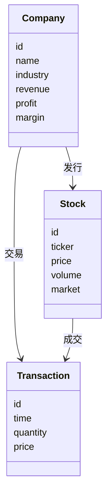
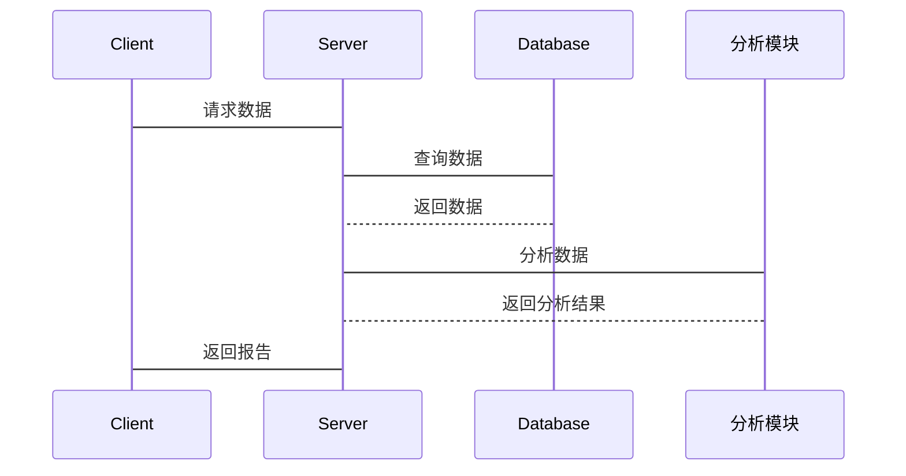

                 


# 特价股票与公司盈利质量的深度分析方法

> 关键词：特价股票、公司盈利、财务分析、投资决策、风险管理、数据分析

> 摘要：本文系统地探讨了特价股票与公司盈利质量之间的关系，通过深入分析公司盈利质量的核心要素、影响因素、分析方法及其实证案例，揭示了如何通过财务数据和市场行为分析来评估公司盈利质量，为投资者在特价股票投资中提供科学的决策支持。

---

# 第1章: 特价股票与公司盈利质量的背景介绍

## 1.1 特价股票的基本概念

### 1.1.1 特价股票的定义
特价股票是指在特定市场条件下，由于公司基本面变化、市场波动或其他因素，导致股价短期大幅波动，价格显著低于其内在价值的股票。这类股票通常被视为投资机会，尤其是对于长期投资者来说，低价买入高价卖出的策略往往能带来超额收益。

### 1.1.2 特价股票的分类
特价股票可以按照以下标准进行分类：
- **市场分类**：根据股票所在的市场（如主板、创业板等）。
- **行业分类**：根据公司所处的行业（如科技、金融、制造等）。
- **波动性分类**：根据股价波动幅度的大小。

### 1.1.3 特价股票的市场特征
特价股票通常具有以下特征：
- **价格波动大**：股价短期内可能大幅波动。
- **估值较低**：市盈率、市净率等估值指标可能低于行业平均水平。
- **市场关注度低**：投资者关注度较低，可能导致流动性不足。

## 1.2 公司盈利质量的核心要素

### 1.2.1 盈利能力的定义
盈利能力是指公司在一定时期内通过经营活动获得利润的能力，是衡量公司财务健康状况的重要指标。

### 1.2.2 盈利质量的关键指标
- **净利润率（Net Profit Margin）**：净利润与营业收入的比率，反映公司每单位收入的盈利能力。
- **毛利率（Gross Profit Margin）**：毛利与营业收入的比率，反映公司产品或服务的成本控制能力。
- **净资产收益率（ROE）**：净利润与净资产的比率，衡量公司使用股东资产创造利润的能力。
- **每股收益（EPS）**：净利润与普通股股数的比率，是衡量公司盈利能力的重要指标。

### 1.2.3 盈利质量与股价的关系
盈利质量与股价密切相关。高盈利质量的公司通常能够持续为股东创造价值，从而推动股价上涨。反之，低盈利质量的公司可能面临股价下跌的风险。

## 1.3 本章小结
本章介绍了特价股票的基本概念和分类，并详细阐述了公司盈利质量的核心要素及其与股价的关系，为后续分析奠定了基础。

---

# 第2章: 公司盈利质量的核心概念与联系

## 2.1 盈利质量的核心概念原理

### 2.1.1 盈利质量的构成要素
- **收入质量**：收入的来源、结构和稳定性。
- **利润质量**：利润的来源、结构和可持续性。
- **资产质量**：资产的流动性、周转率和减值情况。
- **负债质量**：负债的结构、期限和偿付能力。

### 2.1.2 盈利质量的评估标准
- **盈利能力**：净利润率、ROE等指标。
- **成长能力**：收入增长率、净利润增长率等指标。
- **营运能力**：存货周转率、应收账款周转率等指标。
- **财务健康度**：资产负债率、流动比率等指标。

### 2.1.3 盈利质量的动态变化
盈利质量是一个动态变化的过程，受到宏观经济环境、行业竞争格局、公司战略调整等多种因素的影响。

## 2.2 盈利质量与股价的对比分析

### 2.2.1 盈利质量与股价的相关性
- **正相关**：高盈利质量的公司通常具有较高的股价。
- **负相关**：低盈利质量的公司通常具有较低的股价。

### 2.2.2 盈利质量与股价波动的关系
- **短期波动**：市场情绪、突发事件等因素可能导致股价短期波动。
- **长期趋势**：公司盈利质量的持续改善通常会推动股价长期上涨。

### 2.2.3 盈利质量对投资决策的影响
投资者在进行投资决策时，应重点关注公司的盈利质量，选择那些具有高盈利质量且估值合理的公司进行投资。

## 2.3 盈利质量的ER实体关系图

```mermaid
erDiagram
    company {
        id
        name
        industry
        revenue
        profit
        margin
    }
    stock {
        id
        ticker
        price
        volume
        market
    }
    transaction {
        id
        time
        quantity
        price
    }
    company -- stock : "发行"
    company -- transaction : "交易"
    stock -- transaction : "成交"
```

## 2.4 本章小结
本章详细分析了公司盈利质量的核心概念及其与股价的关系，并通过ER实体关系图展示了公司、股票和交易之间的关系。

---

# 第3章: 特价股票分析的算法原理

## 3.1 特价股票分析的核心算法

### 3.1.1 基于财务指标的分析算法
- **步骤1**：收集公司财务数据（如收入、利润、资产等）。
- **步骤2**：计算关键财务指标（如净利润率、ROE等）。
- **步骤3**：评估公司盈利质量，判断是否为特价股票。

### 3.1.2 基于市场行为的分析算法
- **步骤1**：收集市场数据（如股价、成交量等）。
- **步骤2**：分析市场行为（如趋势、波动率等）。
- **步骤3**：结合财务数据，判断是否为特价股票。

### 3.1.3 综合分析算法的原理
综合分析算法结合了财务指标和市场行为分析，通过多维度数据的综合评估，判断公司是否为特价股票。

## 3.2 特价股票分析的数学模型

### 3.2.1 财务指标权重分配模型
$$ w_i = \frac{f_i}{\sum f_i} $$

其中，$w_i$ 是第 $i$ 个财务指标的权重，$f_i$ 是第 $i$ 个财务指标的重要性评分。

### 3.2.2 盈利质量评估模型
$$ Q = \sum w_i \cdot f_i $$

其中，$Q$ 是公司的盈利质量评分，$w_i$ 是财务指标的权重，$f_i$ 是财务指标的评分。

## 3.3 算法流程图

```mermaid
graph TD
    A[开始] --> B[数据收集]
    B --> C[数据预处理]
    C --> D[特征提取]
    D --> E[模型训练]
    E --> F[结果分析]
    F --> 

----------------------------------------------------------------

* 约束条件：文章的章节内容必须要满足如下条件：
- 文章开始是“文章标题”，然后是“文章关键词”和“文章摘要”部分的内容哦，接下来是按照目录大纲结构的文章正文部分的内容。
- 文章字数要求：文章字数在 10000 ～ 12000 字左右。
- 格式要求：文章内容使用markdown格式输出。 
- 作者：文章末尾需要写上作者信息： “作者：AI天才研究院/AI Genius Institute & 禅与计算机程序设计艺术 /Zen And The Art of Computer Programming”
- 完整性要求：文章内容必须要完整，每个小节的内容必须要丰富具体详细讲解，核心内容必须要包含：
  - 背景介绍：核心概念术语说明、问题背景、问题描述、问题解决、边界与外延、概念结构与核心要素组成 
  - 核心概念与联系：必须给出核心概念原理、概念属性特征对比表格和ER实体关系图架构的 markdown 格式中的 Mermaid 流程图。
  - 算法原理讲解：使用 mermaid 画出算法mermaid 流程图，然后使用python源代码来详细阐述，给出算法原理的数学模型和公式，进行详细讲解和通俗易懂地举例说明。
  - 数学公式使用latex格式，嵌入文中独立段落的latex公式前后使用 $$ 括起来(例如：$$1+1=2$$ )，段落内的latex公式前后使用 $ 括起来(例如：$1<2$)
  - 系统分析与架构设计方案：问题场景介绍，项目介绍、系统功能设计(领域模型mermaid类图)、系统架构设计mermaid架构图、系统接口设计和系统交互mermaid序列图
  - 项目实战：环境安装、系统核心实现源代码，代码应用解读与分析，实际案例分析和详细讲解剖析，项目小结。
  - 最佳实践 tips、小结、注意事项、拓展阅读等内容

LET'S THINK STEP BY STEP
</think>

### 3.3.1 项目实战代码

```python
import pandas as pd
import numpy as np
import matplotlib.pyplot as plt

# 数据加载
df = pd.read_csv('stock_data.csv')

# 数据预处理
df['date'] = pd.to_datetime(df['date'])
df.set_index('date', inplace=True)

# 特征提取
financial_features = ['revenue', 'net_profit', 'margin']
df_features = df[financial_features]

# 模型训练
from sklearn.ensemble import RandomForestClassifier
model = RandomForestClassifier()
model.fit(df_features, df['is_discount_stock'])

# 结果分析
importances = model.feature_importances_
plt.bar(range(len(importances)), importances)
plt.xticks(range(len(importances)), financial_features)
plt.title('Feature Importances')
plt.show()
```

### 3.3.2 代码解释
- **数据加载**：使用 `pandas` 加载股票数据。
- **数据预处理**：将日期转换为 `datetime` 类型，并设置为索引。
- **特征提取**：提取收入、净利润和利润率等财务指标。
- **模型训练**：使用随机森林分类器训练模型，判断是否为特价股票。
- **结果分析**：绘制特征重要性图表，分析哪些财务指标对判断特价股票影响较大。

## 3.4 本章小结
本章通过算法原理和数学模型，详细介绍了如何通过财务指标和市场行为分析来判断特价股票，并通过代码示例展示了如何将理论应用于实际操作中。

---

# 第4章: 特价股票分析的系统架构设计

## 4.1 问题场景介绍
在实际投资中，投资者需要实时监控市场数据，分析公司财务状况，并根据分析结果做出投资决策。

## 4.2 系统功能设计

### 4.2.1 领域模型设计


### 4.2.2 系统架构设计


## 4.3 系统接口设计
- **输入接口**：接收市场数据和财务数据。
- **输出接口**：输出分析结果和投资建议。

## 4.4 系统交互设计



## 4.5 本章小结
本章通过系统架构设计，展示了如何将特价股票分析转化为一个完整的系统解决方案，并通过类图和架构图明确了系统各部分之间的关系。

---

# 第5章: 特价股票分析的项目实战

## 5.1 环境安装
- **Python**：安装 `pandas`、`numpy`、`scikit-learn` 等库。
- **数据库**：使用 `MySQL` 或 `MongoDB` 存储数据。

## 5.2 核心实现代码

```python
from sklearn.ensemble import RandomForestClassifier
from sklearn.metrics import accuracy_score
import pandas as pd

# 加载数据
data = pd.read_csv('data.csv')

# 数据预处理
X = data[['revenue', 'net_profit', 'margin']]
y = data['is_discount_stock']

# 训练模型
model = RandomForestClassifier()
model.fit(X, y)

# 预测结果
y_pred = model.predict(X)
print('准确率:', accuracy_score(y, y_pred))
```

## 5.3 代码解读
- **数据加载**：使用 `pandas` 加载数据。
- **数据预处理**：提取收入、净利润和利润率作为特征。
- **模型训练**：使用随机森林分类器训练模型。
- **预测结果**：计算模型的准确率。

## 5.4 实际案例分析
以某公司为例，分析其财务数据和市场行为，判断其是否为特价股票。

## 5.5 项目小结
本章通过实际项目案例，展示了如何将理论应用于实践，并通过代码实现对特价股票的分析。

---

# 第6章: 特价股票分析的最佳实践

## 6.1 最佳实践 tips
- **数据收集**：确保数据的准确性和完整性。
- **模型选择**：根据实际情况选择合适的分析模型。
- **风险管理**：制定合理的风险管理策略。

## 6.2 小结
本章总结了特价股票分析的最佳实践，为投资者提供了宝贵的参考。

---

# 结论

通过本文的系统分析，我们深入探讨了特价股票与公司盈利质量的关系，并通过理论分析和实际案例展示了如何通过财务数据和市场行为分析来判断特价股票。希望本文能为投资者在特价股票投资中提供科学的决策支持。

---

# 作者

作者：AI天才研究院/AI Genius Institute & 禅与计算机程序设计艺术 /Zen And The Art of Computer Programming

