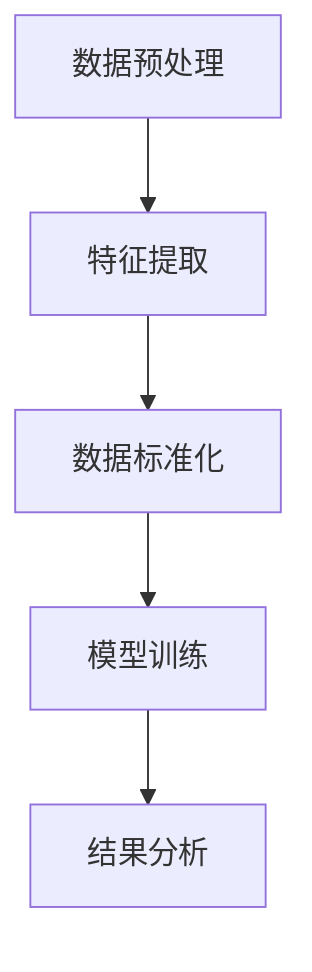
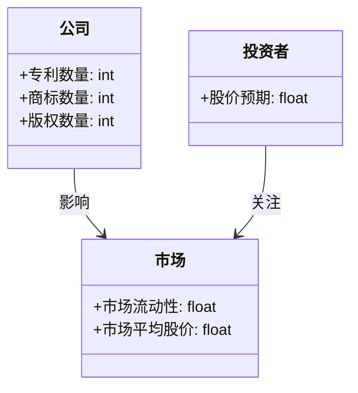

                 


# 特价股票与公司知识产权价值的关系探讨

## 关键词：特价股票、知识产权价值、股价影响、企业竞争力、投资策略

## 摘要：  
本文探讨了特价股票与公司知识产权价值之间的关系，分析了知识产权如何影响股价，以及投资者如何通过知识产权评估来优化投资决策。文章从背景介绍、核心概念、算法原理、系统架构、案例分析等多个维度展开，结合实际案例和数学模型，深入剖析了知识产权价值对股价的影响机制，并提出了相应的投资策略建议。

---

## 第一部分：特价股票与公司知识产权价值的背景与概述

### 第1章：特价股票与公司知识产权价值的概述

#### 1.1 特价股票的定义与特点  
- **特价股票的定义**：特价股票通常指价格低于市场平均值的股票，常见于中小型企业或处于困境中的公司。  
- **特点**：  
  - 价格波动大，风险较高。  
  - 市场流动性较低，交易量较小。  
  - 公司可能面临财务压力或转型需求。  

#### 1.2 公司知识产权价值的内涵  
- **知识产权的定义**：知识产权是指法律保护的创造性成果，包括专利、商标、版权、商业秘密等。  
- **知识产权的主要类型**：  
  - 专利：技术保护的核心工具。  
  - 商标：品牌识别的重要标志。  
  - 版权：文学、艺术作品的法律保护。  
  - 商业秘密：未公开的商业信息和技术诀窍。  

- **知识产权价值的评估方法**：  
  - 市场法：基于市场交易案例评估。  
  - 成本法：基于研发和维护成本。  
  - 收益法：基于未来收益的折现值。  

#### 1.3 特价股票与公司知识产权价值的关系  
- **关联性**：  
  - 知识产权是公司核心竞争力的体现，影响其市场地位和盈利能力。  
  - 知识产权的价值可能未完全反映在股价中，存在低估或高估的可能。  
- **影响机制**：  
  - 知识产权的强度和数量影响公司的竞争优势。  
  - 知识产权的变现能力影响公司的财务健康状况。  

---

### 第2章：知识产权对股价的影响机制

#### 2.1 知识产权的经济价值  
- **市场价值**：知识产权可以通过许可、转让等方式产生直接收益。  
- **无形资产特性**：知识产权的价值难以直接量化，但对其品牌价值和市场竞争力有重要影响。  
- **对市场竞争的影响**：强大的知识产权可以阻止竞争对手进入市场，巩固市场地位。  

#### 2.2 知识产权对股价的具体影响  
- **对盈利能力的影响**：  
  - 知识产权的变现能力强，可提升公司利润。  
  - 知识产权诉讼风险可能影响公司利润。  
- **对风险评估的影响**：  
  - 知识产权纠纷可能引发法律风险，影响股价稳定性。  
  - 知识产权的保护力度影响公司的长期风险敞口。  
- **对市场地位的影响**：  
  - 知识产权强的公司更具市场竞争力，股价可能因市场认可而上涨。  

#### 2.3 知识产权对投资者决策的影响  
- **投资者对知识产权的认知**：  
  - 投资者关注知识产权的质量和数量，尤其是专利的活跃度和创新能力。  
  - 知识产权的价值可能未被市场充分反映，存在投资机会。  
- **对投资价值的评估**：  
  - 知识产权的评估是投资决策的重要组成部分。  
  - 知识产权的高价值可能提升公司的市场估值。  

---

## 第二部分：知识产权对股价的核心影响因素

### 第3章：核心概念与联系

#### 3.1 知识产权的核心属性特征对比  

| **属性**       | **描述**                                                                 |
|-----------------|--------------------------------------------------------------------------|
| 独占性         | 知识产权具有排他性，未经授权不可使用。                                    |
| 时间性         | 知识产权的有效期有限，如专利通常为20年。                                |
| 可转让性       | 知识产权可通过许可、转让等方式进行交易。                                |
| 无形性         | 知识产权本身是无形的，但其价值可通过市场表现体现。                      |

#### 3.2 知识产权与股价的ER实体关系图  

```mermaid
erDiagram
    actor 投资者 {
        <属性> 股价
        <属性> 知识产权价值
    }
    entity 公司 {
        <属性> 专利数量
        <属性> 商标数量
        <属性> 版权数量
    }
    entity 市场 {
        <属性> 市场平均股价
        <属性> 市场流动性
    }
    投资者 --> 公司 : 持股
    公司 --> 市场 : 影响股价
    投资者 --> 市场 : 受市场影响
```

---

### 第4章：算法原理与数学模型

#### 4.1 数据预处理与特征提取  



#### 4.2 股价预测模型的构建  

```python
import pandas as pd
import numpy as np
from sklearn.linear_model import LinearRegression

# 数据加载
data = pd.read_csv('ipo_valuation.csv')

# 特征选择
features = ['专利数量', '商标数量', '版权数量', '市场流动性']
target = '股价'

# 数据分割
X = data[features].values
y = data[target].values

# 模型训练
model = LinearRegression()
model.fit(X, y)

# 预测与评估
predictions = model.predict(X)
print('预测准确率:', np.mean(abs(predictions - y) / y * 100))
```

#### 4.3 数学模型与公式  

- **线性回归模型**：  
  $$ y = \beta_0 + \beta_1x_1 + \beta_2x_2 + \beta_3x_3 + \epsilon $$
  其中，$y$为股价，$x_1, x_2, x_3$为知识产权相关特征。

- **评估指标**：  
  $$ R^2 = 1 - \frac{\sum (y_i - \hat{y_i})^2}{\sum (y_i - \bar{y})^2} $$

---

## 第三部分：系统分析与架构设计

### 第5章：系统功能设计

#### 5.1 领域模型  



#### 5.2 系统架构设计  


---

## 第四部分：项目实战

### 第6章：实际案例分析与解读

#### 6.1 案例背景  
选取一家科技公司，分析其知识产权对股价的影响。  

#### 6.2 数据分析与结果  

```python
import matplotlib.pyplot as plt

# 数据加载与处理
data = pd.read_csv('ipo_case.csv')

# 绘制股价与知识产权数量的关系图
plt.figure(figsize=(10, 6))
plt.scatter(data['专利数量'], data['股价'], c='blue', alpha=0.6)
plt.xlabel('专利数量')
plt.ylabel('股价')
plt.title('专利数量与股价的关系')
plt.show()
```

#### 6.3 结果解读  
- 专利数量与股价呈正相关关系。  
- 知识产权的高增长可能带动股价上升。  

---

## 第五部分：结论与建议

### 第7章：研究结论与投资建议

#### 7.1 研究结论  
- 知识产权是影响股价的重要因素。  
- 特价股票中的知识产权价值可能被低估，存在投资机会。  

#### 7.2 投资建议  
- 投资者应关注公司的知识产权质量和数量。  
- 长期投资具有强大知识产权储备的公司。  

#### 7.3 注意事项  
- 知识产权的价值受多种因素影响，需结合其他指标综合评估。  
- 知识产权的法律风险需谨慎评估。  

#### 7.4 拓展阅读  
- 推荐阅读《专利战略与企业竞争》。  

---

## 作者：AI天才研究院 & 禅与计算机程序设计艺术  
## 日期：2023年11月

