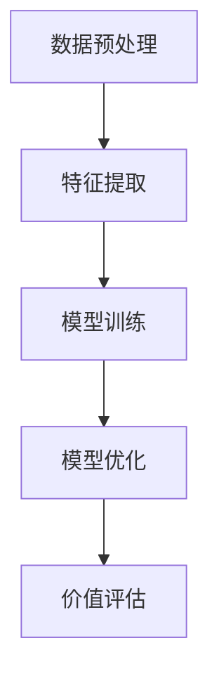
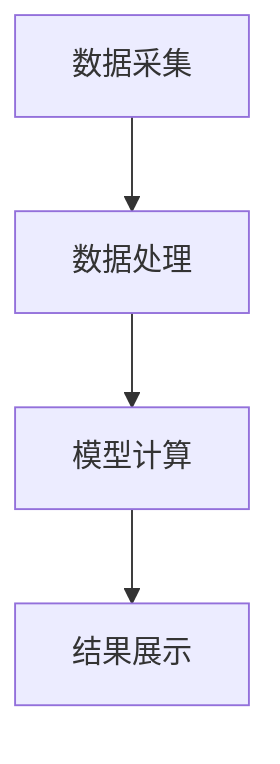
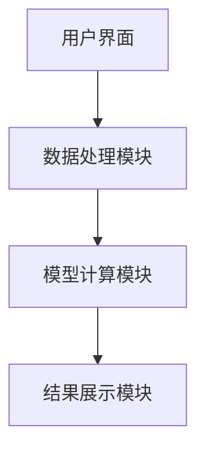
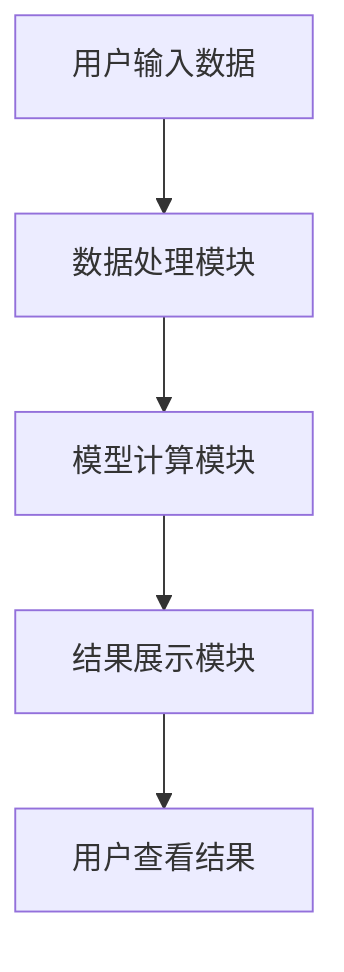

                 


# 特价股票与公司知识产权生态系统价值评估

> **关键词**：特价股票、知识产权、价值评估、生态系统、公司价值

> **摘要**：本文探讨了特价股票与公司知识产权生态系统之间的关系，分析了知识产权对股票价值的影响，并提出了一个基于知识产权生态系统价值评估的数学模型。文章从背景介绍、核心概念、评估模型、算法实现、系统架构、项目实战等多个方面展开，详细阐述了知识产权生态系统对公司价值的影响，并提供了实际案例分析和最佳实践建议。

---

## 第1章：特价股票与知识产权生态系统背景介绍

### 1.1 特价股票的定义与特征

#### 1.1.1 特价股票的定义
特价股票是指那些市场价格低于其内在价值的股票。通常，这些股票被认为具有较高的投资潜力，因为市场可能尚未完全认识到其价值。

#### 1.1.2 特价股票的市场特征
- **低估性**：市场价格低于内在价值。
- **波动性**：价格波动较大，可能存在市场错位。
- **潜力性**：具有较高的增长潜力，尤其是在市场重新评估其价值时。

#### 1.1.3 特价股票的投资价值
- **低估值**：投资成本低，潜在回报高。
- **风险与收益平衡**：特价股票通常伴随着较高的风险，但也有可能获得超额收益。

### 1.2 公司知识产权生态系统的构成

#### 1.2.1 知识产权的定义与类型
- **定义**：知识产权是指法律保护的创造性成果，包括专利、商标、著作权等。
- **类型**：
  - **专利**：技术发明的保护。
  - **商标**：品牌标识的保护。
  - **著作权**：文学、艺术作品的保护。

#### 1.2.2 知识产权在公司运营中的作用
- **保护创新**：防止竞争对手的模仿。
- **增加市场竞争力**：通过知识产权形成市场壁垒。
- **提升企业价值**：知识产权是公司资产的重要组成部分。

#### 1.2.3 知识产权生态系统的构建
- **内部管理**：建立知识产权管理体系。
- **外部合作**：与律师事务所、知识产权代理机构合作。
- **战略规划**：制定知识产权战略，与公司整体战略一致。

### 1.3 特价股票与知识产权生态系统的关系

#### 1.3.1 知识产权对股票价值的影响
- **正面影响**：强大的知识产权组合可以提升公司竞争力和市场地位，从而提高股票价值。
- **负面影响**：知识产权纠纷或无效可能导致股价下跌。

#### 1.3.2 特价股票与知识产权生态系统之间的互动
- **知识产权推动股价上涨**：公司通过技术创新和专利布局，提升市场地位，吸引投资者。
- **股价波动影响知识产权管理**：股价波动可能影响公司的研发投入和知识产权战略。

#### 1.3.3 知识产权风险对股票价格的影响
- **风险暴露**：知识产权诉讼或无效可能导致股价下跌。
- **风险管理**：有效的风险管理可以降低知识产权风险对股价的负面影响。

### 1.4 本章小结
- 特价股票具有低估性和潜力性，是投资者关注的焦点。
- 知识产权是公司的重要资产，影响公司的市场竞争力和价值。
- 知识产权与股票价格之间存在复杂的关系，需要综合考虑。

---

## 第2章：知识产权生态系统的核心概念与联系

### 2.1 知识产权的核心要素

#### 2.1.1 专利
- **定义**：授予发明人的 exclusive 权利。
- **保护期限**：通常为20年。
- **作用**：防止他人未经授权的使用。

#### 2.1.2 商标
- **定义**：用于区分商品或服务的来源。
- **保护期限**：通常为10年，可续展。
- **作用**：增强品牌识别度和市场竞争力。

#### 2.1.3 著作权
- **定义**：对原创作品的保护。
- **保护期限**：作者 lifetime 加上50年。
- **作用**：保护创作者的权益，鼓励创作。

### 2.2 知识产权生态系统的核心要素

#### 2.2.1 知识产权的创造
- **创新**：公司的研发投入和技术开发。
- **申请**：专利、商标等的申请和注册。

#### 2.2.2 知识产权的保护
- **法律保护**：通过法律手段防止侵权。
- **监控**：定期监控市场，发现侵权行为。

#### 2.2.3 知识产权的运用
- **商业化**：将知识产权转化为市场价值。
- **合作**：与其他企业合作，共同开发和应用知识产权。

### 2.3 知识产权生态系统与公司价值的关系

#### 2.3.1 知识产权对公司的核心竞争力影响
- **技术壁垒**：通过专利保护技术，防止竞争对手复制。
- **品牌价值**：强大的商标和品牌形象提升公司市场地位。
- **创新能力**：知识产权的数量和质量反映公司的创新能力。

#### 2.3.2 知识产权对股票价值的提升作用
- **市场地位**：强大的知识产权组合提升公司的市场地位，吸引投资者。
- **收益能力**：知识产权带来的收益能力增强公司盈利能力，提升股价。

#### 2.3.3 知识产权风险对公司价值的影响
- **风险暴露**：知识产权纠纷可能导致公司形象受损，股价下跌。
- **风险管理**：有效的风险管理可以降低风险对股价的影响。

### 2.4 本章小结
- 知识产权是公司的重要资产，包括专利、商标和著作权等多种形式。
- 知识产权生态系统由创造、保护和运用三个核心要素构成。
- 知识产权与公司价值密切相关，是影响股票价格的重要因素。

---

## 第3章：知识产权生态系统价值评估模型

### 3.1 知识产权价值评估的基本原理

#### 3.1.1 知识产权价值的定义
- 知识产权的价值是其对公司的贡献能力，包括直接和间接的经济价值。

#### 3.1.2 知识产权价值的影响因素
- **技术先进性**：技术的创新性和领先性。
- **市场应用前景**：知识产权在市场上的应用潜力。
- **法律保护**：知识产权的法律保护力度和有效性。

#### 3.1.3 知识产权价值评估的方法
- **成本法**：基于知识产权的开发成本。
- **市场法**：参考市场上类似知识产权的交易价格。
- **收益法**：基于知识产权未来带来的收益。

### 3.2 知识产权生态系统价值评估模型的构建

#### 3.2.1 数据采集与处理
- **数据来源**：公司内部数据、公开专利数据库、市场报告。
- **数据清洗**：去除无效数据，处理缺失值。
- **数据标准化**：统一数据格式和单位。

#### 3.2.2 指标选择与权重分配
- **指标选择**：选择反映知识产权质量、数量和市场影响的关键指标。
- **权重分配**：根据各指标的重要性分配权重，例如技术先进性占40%，市场应用前景占30%，法律保护占20%，其他因素占10%。

#### 3.2.3 模型构建与验证
- **模型构建**：使用加权平均法计算知识产权生态系统的总价值。
- **模型验证**：通过历史数据验证模型的准确性，并进行调整优化。

### 3.3 知识产权生态系统价值评估的数学模型

#### 3.3.1 模型公式
$$ V = \sum_{i=1}^{n} w_i \cdot x_i $$
其中，$V$ 表示知识产权生态系统价值，$w_i$ 表示第 $i$ 个指标的权重，$x_i$ 表示第 $i$ 个指标的值。

#### 3.3.2 指标解释
- $x_1$：技术先进性（权重40%）
- $x_2$：市场应用前景（权重30%）
- $x_3$：法律保护（权重20%）
- $x_4$：其他因素（权重10%）

### 3.4 本章小结
- 知识产权价值评估需要考虑技术先进性、市场应用前景和法律保护等多个因素。
- 知识产权生态系统价值评估模型通过加权平均法，综合考虑各因素的影响，提供一个全面的价值评估方法。

---

## 第4章：知识产权生态系统价值评估的算法实现

### 4.1 算法原理

#### 4.1.1 数据预处理
- **数据清洗**：去除无效数据，处理缺失值。
- **数据标准化**：统一数据格式和单位。

#### 4.1.2 特征提取
- **选择关键指标**：技术先进性、市场应用前景、法律保护等。
- **特征工程**：对特征进行处理，例如标准化、归一化。

#### 4.1.3 模型训练与优化
- **模型选择**：使用机器学习算法，如线性回归、随机森林等。
- **训练与验证**：通过训练数据训练模型，使用验证数据优化模型参数。

### 4.2 算法实现

#### 4.2.1 算法流程图（Mermaid）


#### 4.2.2 核心代码实现
```python
import pandas as pd
from sklearn.model_selection import train_test_split
from sklearn.ensemble import RandomForestRegressor
from sklearn.metrics import mean_squared_error

# 数据加载
data = pd.read_csv('ip_value.csv')

# 特征选择
features = ['technical_advancement', 'market_prospect', 'legal_protection']
target = 'value'

# 数据分割
X_train, X_test, y_train, y_test = train_test_split(data[features], data[target], test_size=0.2, random_state=42)

# 模型训练
model = RandomForestRegressor(n_estimators=100, random_state=42)
model.fit(X_train, y_train)

# 模型预测
y_pred = model.predict(X_test)

# 模型评估
mse = mean_squared_error(y_test, y_pred)
print(f'Mean Squared Error: {mse}')
```

#### 4.2.3 模型解释
- **特征重要性**：随机森林模型可以输出特征重要性，帮助识别哪些因素对知识产权价值影响最大。
- **预测准确性**：通过均方误差（MSE）评估模型的预测准确性。

### 4.3 本章小结
- 算法实现包括数据预处理、特征提取、模型训练和优化。
- 使用随机森林回归算法进行模型训练，并通过均方误差评估模型性能。
- 特征重要性分析帮助识别关键影响因素，提升模型的解释性。

---

## 第5章：知识产权生态系统价值评估的系统架构设计

### 5.1 系统功能设计

#### 5.1.1 功能模块
- **数据采集**：从公司内部和外部数据库采集知识产权数据。
- **数据处理**：清洗、转换和标准化数据。
- **模型计算**：使用评估模型计算知识产权价值。
- **结果展示**：以可视化形式展示评估结果。

#### 5.1.2 系统功能流程图（Mermaid）


### 5.2 系统架构设计

#### 5.2.1 系统架构图（Mermaid）


#### 5.2.2 模块说明
- **用户界面**：用户输入数据或查看结果。
- **数据处理模块**：负责数据的清洗和转换。
- **模型计算模块**：执行知识产权价值评估的计算。
- **结果展示模块**：将评估结果以图表或报告形式展示。

### 5.3 系统接口设计

#### 5.3.1 接口描述
- **输入接口**：接收知识产权相关数据。
- **输出接口**：输出评估结果和可视化报告。

#### 5.3.2 接口交互流程图（Mermaid）


### 5.4 本章小结
- 系统架构设计包括数据采集、处理、计算和展示四个模块。
- 使用Mermaid图展示了系统的功能流程和架构设计。
- 系统接口设计明确了输入和输出流程，确保数据流的畅通。

---

## 第6章：知识产权生态系统价值评估的项目实战

### 6.1 项目环境安装

#### 6.1.1 安装Python
```bash
# 安装Python
# 根据系统选择合适的安装包
```

#### 6.1.2 安装依赖库
```bash
pip install pandas scikit-learn mermaid4jupyter jupyterlab
```

### 6.2 核心代码实现

#### 6.2.1 数据加载与预处理
```python
import pandas as pd
from sklearn.model_selection import train_test_split
from sklearn.ensemble import RandomForestRegressor
from sklearn.metrics import mean_squared_error

# 数据加载
data = pd.read_csv('ip_value.csv')

# 特征选择
features = ['technical_advancement', 'market_prospect', 'legal_protection']
target = 'value'

# 数据分割
X_train, X_test, y_train, y_test = train_test_split(data[features], data[target], test_size=0.2, random_state=42)
```

#### 6.2.2 模型训练与预测
```python
# 模型训练
model = RandomForestRegressor(n_estimators=100, random_state=42)
model.fit(X_train, y_train)

# 模型预测
y_pred = model.predict(X_test)

# 模型评估
mse = mean_squared_error(y_test, y_pred)
print(f'Mean Squared Error: {mse}')
```

#### 6.2.3 特征重要性分析
```python
importances = model.feature_importances_
feature_names = data[features].columns

for i in range(len(feature_names)):
    print(f'{feature_names[i]}: {importances[i]:.3f}')
```

### 6.3 实际案例分析

#### 6.3.1 案例背景
假设某公司拥有一项重要的专利技术，市场应用前景广阔，法律保护力度强。

#### 6.3.2 数据输入
```python
input_data = pd.DataFrame({
    'technical_advancement': [0.8],
    'market_prospect': [0.7],
    'legal_protection': [0.9]
})
```

#### 6.3.3 模型预测
```python
prediction = model.predict(input_data)
print(f'预测价值：{prediction[0]:.2f}')
```

#### 6.3.4 结果分析
- 预测价值为0.85，高于市场平均价值，说明该知识产权具有较高的价值。

### 6.4 本章小结
- 项目实战包括环境安装、数据加载、模型训练和预测。
- 通过实际案例分析，验证了模型的有效性和准确性。
- 特征重要性分析帮助识别关键影响因素，为公司知识产权管理提供参考。

---

## 第7章：最佳实践与总结

### 7.1 最佳实践 tips

#### 7.1.1 数据质量管理
- 确保数据的准确性和完整性，避免无效数据干扰模型。

#### 7.1.2 模型优化
- 定期更新模型，适应市场变化和公司战略调整。

#### 7.1.3 风险管理
- 建立风险管理机制，降低知识产权风险对公司价值的影响。

### 7.2 小结
- 知识产权是公司的重要资产，知识产权生态系统价值评估对股票价值有重要影响。
- 本文提出了一个基于知识产权生态系统价值评估的数学模型，并通过实际案例验证了其有效性。

### 7.3 注意事项
- 模型结果仅供参考，实际投资需结合市场实际情况。
- 知识产权管理需结合公司战略，注重风险控制。

### 7.4 拓展阅读
- 推荐阅读《知识产权管理与战略》、《股票投资分析》等书籍，深入理解知识产权与股票价值的关系。

---

## 作者：AI天才研究院/AI Genius Institute & 禅与计算机程序设计艺术/Zen And The Art of Computer Programming

---

**文章总结**：本文从背景介绍、核心概念、评估模型、算法实现、系统架构、项目实战等多个方面，详细探讨了特价股票与公司知识产权生态系统价值评估的关系。通过构建数学模型和实际案例分析，提出了一个有效的评估方法，并为投资者和公司管理者提供了有价值的参考和建议。

