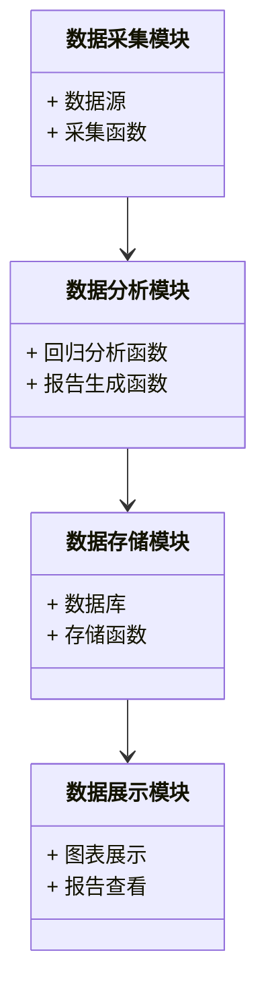

                 


# 特价股票与公司研发投入效率的关系分析

> 关键词：特价股票，研发投入效率，回归分析，股票投资，公司绩效

> 摘要：本文分析了特价股票与公司研发投入效率之间的关系，探讨了如何通过回归分析等方法量化两者的关系，并提供实际案例和投资建议。

---

## 第一部分: 特价股票与公司研发投入效率的背景介绍

### 第1章: 特价股票的基本概念

#### 1.1 特价股票的定义
- 特价股票是指市场价格低于其内在价值的股票，通常被视为被市场低估的投资机会。
- 特价股票通常出现在市场低迷或公司短期遇到困难时，但具备长期投资价值。

#### 1.2 特价股票的分类与特征
- **分类**：根据低估的原因，分为价值型股票、成长型股票等。
- **特征**：低市盈率、低市净率、股息率高、估值低于行业平均水平。

#### 1.3 特价股票的市场表现与投资价值
- 市场表现：特价股票在市场反弹时通常表现优于大盘。
- 投资价值：长期来看，特价股票具有较高的回报潜力，但需注意公司的基本面。

### 第2章: 公司研发投入效率的基本概念

#### 2.1 研发投入的定义与分类
- 研发投入是指公司在研发活动上的资金和资源投入。
- 分类：按阶段分为基础研究、应用研究和开发阶段。

#### 2.2 研发投入效率的衡量指标
- 指标：研发费用率、研发投入产出比、专利数量等。
- 研发费用率 = 研发费用 / 营业收入
- 研发投入产出比 = 营业收入增长 / 研发投入

#### 2.3 研发投入效率与公司绩效的关系
- 高效率的研发投入通常与公司业绩增长相关。
- 持续的研发投入能增强公司的核心竞争力。

### 第3章: 特价股票与公司研发投入效率的关系背景

#### 3.1 问题背景与研究意义
- 市场中存在大量特价股票，但其背后的公司研发投入效率差异较大。
- 研究两者关系有助于投资者识别真正具备投资价值的公司。

#### 3.2 研究目标与范围
- 目标：量化特价股票与公司研发投入效率的关系。
- 范围：选取特定行业或时间段内的公司进行分析。

---

## 第二部分: 特价股票与公司研发投入效率的核心概念与联系

### 第4章: 特价股票与公司研发投入效率的核心概念分析

#### 4.1 特价股票的核心概念分析
- 特价股票的形成机制：市场低估、行业周期性、公司短期困境。
- 特价股票的市场特征：低估值、高分红、流动性较低。

#### 4.2 公司研发投入效率的核心概念分析
- 研发投入效率的提升：技术创新、成本控制、团队优化。
- 研发投入与公司绩效的关系：高效率的研发投入促进业绩增长。

#### 4.3 两者的关联性分析
- 特价股票通常出现在研发投入效率较低的公司，但并非绝对。
- 高研发投入效率的公司可能因为市场低估而成为特价股票。

### 第5章: 特价股票与公司研发投入效率的关系分析

#### 5.1 两者的相互影响机制
- 特价股票的出现可能反映公司研发投入效率低下，但不代表长期低效。
- 高效率的研发投入可能使公司股价回归合理价值，从而减少特价股票的存在。

#### 5.2 两者的协同效应与潜在风险
- 协同效应：高效率的研发投入增强公司竞争力，推动股价上升，减少特价股票。
- 潜在风险：过度研发投入可能导致短期亏损，增加成为特价股票的风险。

---

## 第三部分: 特价股票与公司研发投入效率的算法原理

### 第6章: 回归分析法在两者关系中的应用

#### 6.1 回归分析法的基本原理
- 回归分析用于量化变量之间的关系，确定研发投入效率对股价的影响。

#### 6.2 回归模型的构建
- 确定自变量（研发投入效率指标）和因变量（股价或股票收益）。
- 模型：Y = β0 + β1X + ε，其中Y为股价，X为研发投入效率指标。

#### 6.3 回归分析的实现步骤
1. 数据收集：获取公司研发投入效率和股价数据。
2. 数据预处理：处理缺失值、异常值。
3. 模型训练：使用最小二乘法估计系数。
4. 模型验证：检查拟合优度和残差分析。

#### 6.4 回归分析的Python实现
```python
import statsmodels.api as sm

# 假设data为包含研发投入效率（X）和股价（Y）的数据
X = data['研发费用率']
Y = data['股价']

# 添加截距项
X = sm.add_constant(X)

# 构建回归模型
model = sm.OLS(Y, X)
results = model.fit()

# 输出结果
print(results.summary())
```

#### 6.5 回归分析的数学模型与公式
$$ Y = \beta_0 + \beta_1 X + \epsilon $$

---

## 第四部分: 特价股票与公司研发投入效率的系统分析与架构设计

### 第7章: 问题场景介绍

#### 7.1 问题描述
- 分析特价股票背后的公司研发投入效率，识别潜在投资机会。

#### 7.2 项目介绍
- 通过回归分析模型，量化研发投入效率对股价的影响。

### 第8章: 系统功能设计

#### 8.1 功能模块
- 数据采集模块：收集公司研发投入和股价数据。
- 数据分析模块：进行回归分析，生成报告。
- 数据存储模块：存储分析结果。
- 数据展示模块：以可视化方式展示结果。

#### 8.2 功能模块的Mermaid类图


#### 8.3 系统架构设计
```mermaid
archi
    title 系统架构图
    数据采集模块 --> 数据分析模块
    数据分析模块 --> 数据存储模块
    数据存储模块 --> 数据展示模块
```

---

## 第五部分: 特价股票与公司研发投入效率的项目实战

### 第9章: 环境安装与数据准备

#### 9.1 环境安装
- 安装Python和必要的库（pandas、statsmodels）。
- 数据获取：使用Yahoo Finance获取股票数据，使用公司财报获取研发投入数据。

#### 9.2 数据准备
- 数据清洗：处理缺失值、异常值。
- 数据转换：标准化处理。

### 第10章: 核心代码实现

#### 10.1 数据处理
```python
import pandas as pd

# 获取股票数据和研发投入数据
stock_data = pd.read_csv('stock_data.csv')
r_d_data = pd.read_csv('r_d.csv')

# 数据清洗
stock_data.dropna(inplace=True)
r_d_data.dropna(inplace=True)

# 合并数据
merged_data = pd.merge(stock_data, r_d_data, on='公司')
```

#### 10.2 回归分析实现
```python
import statsmodels.formula.api as smf

# 构建模型
model = smf.ols('股价 ~ 研发投入效率', data=merged_data)
results = model.fit()

# 输出结果
print(results.summary())
```

### 第11章: 案例分析与结果解读

#### 11.1 实际案例分析
- 选择一家公司进行分析，展示其研发投入效率和股价的关系。
- 分析模型输出结果，解释系数的意义。

#### 11.2 案例结果解读
- 如果回归系数为正，说明研发投入效率提高，股价上升。
- 结果显著性检验：p值小于0.05说明结果可靠。

### 第12章: 项目总结

#### 12.1 项目小结
- 成功构建回归模型，量化了研发投入效率对股价的影响。
- 特价股票的分析需要结合公司基本面和研发投入效率。

---

## 第六部分: 特价股票与公司研发投入效率的最佳实践

### 第13章: 投资建议与注意事项

#### 13.1 投资建议
- 选择研发投入效率高且股价被低估的公司。
- 结合行业趋势和宏观经济因素进行投资决策。

#### 13.2 注意事项
- 回归分析结果需结合其他因素进行综合判断。
- 注意数据质量和模型的适用性。

### 第14章: 总结与展望

#### 14.1 总结
- 特价股票与公司研发投入效率密切相关。
- 回归分析是量化两者关系的有效工具。

#### 14.2 未来研究方向
- 结合更多因素构建多变量回归模型。
- 研究不同行业中的特殊表现。

---

## 作者：AI天才研究院 & 禅与计算机程序设计艺术

---

**本文通过详细分析特价股票与公司研发投入效率的关系，结合回归分析等方法，为投资者提供了科学的分析工具和投资建议。**

