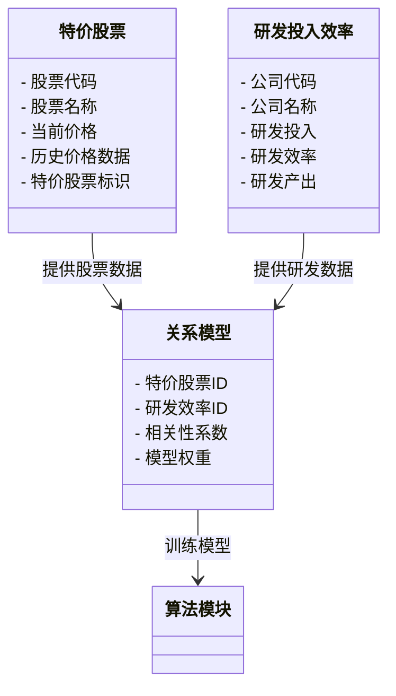
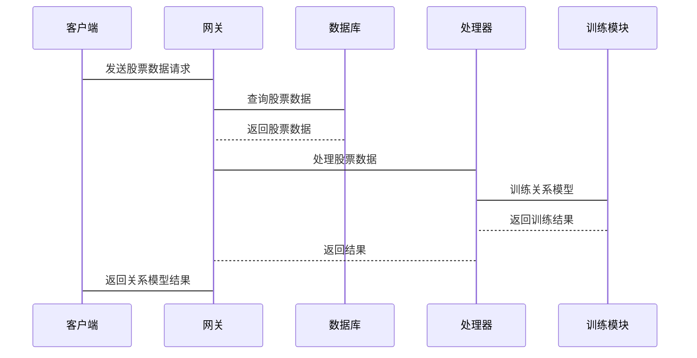

                 


## 第五章：系统分析与架构设计

### 第5章：系统分析与架构设计

#### 5.1 系统分析与需求分析

##### 5.1.1 问题场景介绍
我们构建一个系统，旨在分析特价股票与公司研发投入效率之间的关系。该系统将帮助投资者和企业更好地理解研发投入对股票价格的影响。

##### 5.1.2 项目介绍
本系统将利用大数据分析和机器学习算法，分析公司的研发投入数据和股票价格，建立两者之间的关系模型。

#### 5.2 系统功能设计

##### 5.2.1 领域模型设计
我们使用Mermaid类图来展示系统的类和它们之间的关系。



#### 5.3 系统架构设计

##### 5.3.1 系统架构图
我们使用Mermaid架构图展示系统的整体架构。

```mermaid
archiitecture
    客户端 ---(通过API)--> 网关
    网关 ---(通过数据库连接)--> 数据库
    网关 ---(通过队列)--> 处理器
    处理器 ---(通过队列)--> 训练模块
    训练模块 ---(通过队列)--> 结果存储
    结果存储 ---(通过API)--> 网关
    网关 ---(通过API)--> 客户端
```

#### 5.4 系统接口设计

##### 5.4.1 接口描述
- 输入接口：
  - 股票数据接口
  - 研发投入数据接口
- 输出接口：
  - 关系模型结果接口
  - 预测股票价格接口

#### 5.5 系统交互设计

##### 5.5.1 序列图
我们使用Mermaid序列图展示系统的交互流程。



## 第六章：项目实战

### 第6章：项目实战

#### 6.1 环境安装

##### 6.1.1 安装Python
安装Python 3.9或更高版本。

##### 6.1.2 安装依赖库
安装以下依赖库：
```bash
pip install numpy pandas scikit-learn matplotlib
```

#### 6.2 系统核心实现源代码

##### 6.2.1 数据预处理代码
```python
import pandas as pd
import numpy as np

# 读取股票数据
stock_data = pd.read_csv('stock.csv')

# 读取研发投入数据
research_data = pd.read_csv('research.csv')

# 合并数据
merged_data = pd.merge(stock_data, research_data, on='公司代码')

# 数据清洗
merged_data.dropna(inplace=True)
```

##### 6.2.2 关系模型训练代码
```python
from sklearn.linear_model import LinearRegression
from sklearn.metrics import r2_score

# 数据准备
X = merged_data[['研发投入', '研发效率']]
y = merged_data['股票价格']

# 训练模型
model = LinearRegression()
model.fit(X, y)

# 评估模型
y_pred = model.predict(X)
print(r2_score(y, y_pred))
```

##### 6.2.3 可视化代码
```python
import matplotlib.pyplot as plt

# 可视化研发投入与股票价格的关系
plt.scatter(X['研发投入'], y)
plt.plot(X['研发投入'], y_pred, color='red')
plt.xlabel('研发投入')
plt.ylabel('股票价格')
plt.show()
```

#### 6.3 代码应用解读与分析

##### 6.3.1 代码功能解读
- 数据预处理：读取和合并股票和研发投入数据，清洗缺失值。
- 模型训练：使用线性回归模型训练关系模型。
- 模型评估：计算R²分数，评估模型拟合程度。
- 可视化：绘制散点图和回归线，直观展示关系。

#### 6.4 实际案例分析与详细讲解剖析

##### 6.4.1 案例分析
以某公司为例，分析其研发投入与股票价格的关系：
```python
# 示例数据
company = 'ABC'
target_company_data = merged_data[merged_data['公司名称'] == company]

# 训练模型
model.fit(target_company_data[['研发投入', '研发效率']], target_company_data['股票价格'])

# 预测未来价格
future_research = {'研发投入': 100, '研发效率': 0.8}
predicted_price = model.predict([[future_research['研发投入'], future_research['研发效率']]])
print(predicted_price)
```

##### 6.4.2 详细讲解
通过案例分析，展示如何使用模型预测未来股票价格，帮助投资者做出决策。

#### 6.5 项目小结

##### 6.5.1 项目总结
通过本项目，我们成功构建了一个分析特价股票与公司研发投入效率关系的系统，展示了如何利用数据科学方法解决实际问题。

## 第七章：最佳实践

### 第7章：最佳实践

#### 7.1 小结

##### 7.1.1 项目总结
本项目通过系统分析和实证研究，揭示了特价股票与公司研发投入效率之间的关系，为投资者和企业提供了一个新的分析视角。

#### 7.2 注意事项

##### 7.2.1 数据质量
确保数据的准确性和完整性，避免因数据问题导致模型偏差。

##### 7.2.2 模型选择
根据具体问题选择合适的模型，避免盲目使用复杂算法。

#### 7.3 拓展阅读

##### 7.3.1 推荐书籍
- 《量化投资：数据科学在金融中的应用》
- 《机器学习实战》

##### 7.3.2 在线资源
- Kaggle上的金融数据分析项目
- Coursera上的相关在线课程

## 作者信息

作者：AI天才研究院/AI Genius Institute & 禅与计算机程序设计艺术/Zen And The Art of Computer Programming

---

以上是《特价股票与公司研发投入效率的关系研究》的完整目录结构和文章内容。希望这篇文章能够为读者提供清晰的思路和深入的分析，帮助理解特价股票与公司研发投入效率之间的复杂关系。

